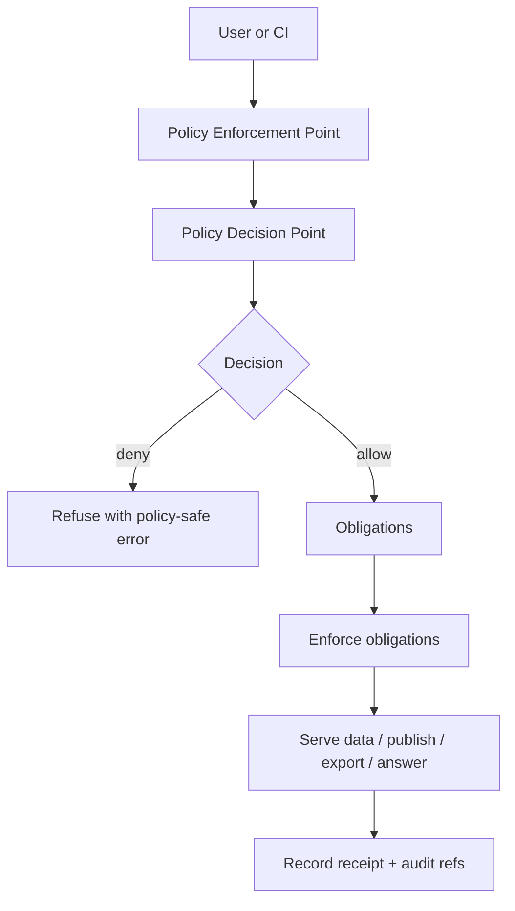

<!-- [KFM_META_BLOCK_V2]
doc_id: kfm://doc/2a4b1c0e-8b1d-4a77-b3f0-3f4d0d51c6b1
title: KFM Policy Obligations
type: standard
version: v1
status: draft
owners: Governance Council, Data Stewards, Policy Engineering
created: 2026-03-02
updated: 2026-03-02
policy_label: public
related:
  - docs/governance/policy/README.md  # TODO: add if/when it exists
  - docs/governance/policy/POLICY_LABELS.md  # TODO: add if/when it exists
  - docs/governance/promotion/PROMOTION_CONTRACT.md  # TODO: add if/when it exists
tags: [kfm, governance, policy, obligations, opa, rego]
notes:
  - This document defines the meaning, structure, and enforcement expectations of "obligations" returned by policy decisions.
  - Treat as normative for KFM runtime + CI policy semantics.
[/KFM_META_BLOCK_V2] -->

# OBLIGATIONS
Policy obligations are **mandatory actions** required to safely serve, export, publish, or cite KFM artifacts — especially when policy allows access *only if* transforms, notices, or restrictions are applied.


**One-line purpose:** Turn governance intent into enforceable, testable behavior via typed obligations that are evaluated by policy and enforced by the trust membrane.

---

## Quick navigation
- [Purpose and scope](#purpose-and-scope)
- [Definitions](#definitions)
- [Where obligations appear](#where-obligations-appear)
- [Obligations contract](#obligations-contract)
- [Enforcement matrix](#enforcement-matrix)
- [Lifecycle placement](#lifecycle-placement)
- [Sensitive location obligations](#sensitive-location-obligations)
- [Licensing and rights obligations](#licensing-and-rights-obligations)
- [Focus Mode and Story obligations](#focus-mode-and-story-obligations)
- [Change control and governance](#change-control-and-governance)
- [Testing and CI requirements](#testing-and-ci-requirements)
- [Appendices](#appendices)

---

## Purpose and scope
This document defines:

1. **What obligations are** (typed policy outputs that require action),
2. **Where obligations must be enforced** (CI + runtime PEPs),
3. **How obligations must be recorded** (receipts, provenance, and evidence bundles),
4. **How obligations interact with policy labels** (classification vs. required actions).

### Out of scope
- Detailed role-based access control (RBAC/ABAC) model definitions (covered elsewhere).
- Specific dataset-by-dataset redaction recipes (these belong in dataset specs/playbooks).

([↑ Back to top](#obligations))

---

## Definitions
### Normative keywords
- **MUST / MUST NOT**: required for compliance.
- **SHOULD / SHOULD NOT**: recommended unless there is a documented exception.
- **MAY**: optional.

### Core terms
- **Policy label**: a coarse classification of a resource (e.g., `public`, `restricted`, `public_generalized`).
- **Policy decision**: allow/deny plus associated metadata, including obligations.
- **Obligation**: a typed directive returned by policy that requires a concrete enforcement action.
- **PEP (Policy Enforcement Point)**: where policy decisions are enforced (CI checks, runtime API gateway, evidence resolver, tile server, export endpoints).
- **PDP (Policy Decision Point)**: where policy is evaluated (OPA/Rego or equivalent).
- **EvidenceRef / EvidenceBundle**: KFM’s citation mechanism; references MUST resolve through the evidence resolver into bundles suitable for inspection and reproduction.

([↑ Back to top](#obligations))

---

## Where obligations appear
Obligations are expected to appear (at minimum) in:

1. **Runtime authorization decisions** (API, tiles, exports, Story publish, Focus Mode retrieval),
2. **Evidence resolution results** (EvidenceBundle policy section),
3. **Promotion gates** (sensitivity classification + redaction/generalization plan),
4. **Run receipts / audit records** (record policy decision id + obligations required/applied).

### Policy decisions are not just allow/deny
Policy MUST be able to say:

- “Allow, but only with generalized geometry + UI notice”
- “Allow metadata-only, but block downloads”
- “Allow for stewards; deny for public users”
- “Allow export only if attribution is included”

([↑ Back to top](#obligations))

---

## Obligations contract
### Required properties
Every obligation MUST be:
- **Typed** (machine-actionable; e.g., `generalize_geometry`, `redact_fields`, `show_notice`)
- **Deterministic** (same input + policy version ⇒ same required obligations)
- **Idempotent** (applying twice is equivalent to applying once)
- **Auditable** (recorded in receipts/provenance when it affects outputs)

### Canonical shape (recommended)
This is the recommended minimal contract for an obligation object:

```json
{
  "type": "show_notice",
  "message": "Geometry generalized due to policy.",
  "params": {
    "severity": "info",
    "display_scope": "layer"
  }
}
```

> NOTE: Some templates use `policy.obligations` and others use `policy.obligations_applied`.
> **Recommended rule:**  
> - `policy.obligations` = obligations required by decision  
> - `policy.obligations_applied` = obligations actually applied/enforced (runtime-recorded)  
> If only one field is supported, prefer `policy.obligations` and log applied actions in the receipt.

### Obligation categories
| Category | What it does | Examples |
|---|---|---|
| Redaction / generalization | Removes, masks, or coarsens sensitive content | `redact_fields`, `generalize_geometry`, `quantize_time` |
| Notice / UX transparency | Makes trust and constraints visible to users | `show_notice`, `show_policy_badge` |
| Export / distribution | Limits downloads or forces safe export behavior | `block_export`, `embed_attribution`, `watermark_export` |
| Logging / audit | Forces structured governance evidence | `emit_audit_receipt`, `redact_audit_fields` |
| Retrieval constraints | Restricts query scope or retrieval sources | `limit_to_public_evidence`, `deny_list_sources` |

([↑ Back to top](#obligations))

---

## Enforcement matrix
KFM policy semantics MUST match in CI and runtime. The same fixtures should be used to prove this.



### Enforcement points
| Enforcement point | MUST do | MUST NOT do |
|---|---|---|
| CI (PR gates) | Block merges when policy fixtures fail; validate obligation schema | “Assume runtime will handle it” |
| Runtime API (PEP) | Evaluate policy before serving; enforce obligations; policy-safe errors | Leak restricted dataset existence via error details |
| Evidence resolver | Resolve EvidenceRefs; apply redaction obligations before returning bundles | Return “raw text” without evidence linking |
| Pipeline promotion | Require policy label + redaction/generalization plan; verify transforms | Promote from quarantine with unresolved sensitivity |
| UI clients | Display policy badges and obligation notices; never decide policy | Bypass governed APIs or implement authorization logic |

([↑ Back to top](#obligations))

---

## Lifecycle placement
Obligations can be required at multiple points in the truth path:

- **WORK/QUARANTINE**: apply redactions/generalizations as transforms
- **PROCESSED/CATALOG**: record transforms in provenance (PROV) and catalogs (DCAT/STAC)
- **PUBLISHED**: enforce query/export constraints and show UI notices

### Promotion Contract dependency
Promotion to runtime surfaces MUST be blocked unless sensitivity classification exists and any required obligations (e.g., geometry generalization / field removal) are defined and verifiably applied.

([↑ Back to top](#obligations))

---

## Sensitive location obligations
KFM posture includes default-deny for sensitive/restricted datasets, and the ability to publish *separate* generalized derivatives when public representation is allowed.

### Mandatory rules
- Public outputs MUST NOT embed precise coordinates unless policy explicitly allows.
- If a public representation is allowed, it SHOULD be a **separate** `public_generalized` dataset version.
- Redaction/generalization MUST be treated as a first-class transform recorded in provenance.

### Example obligations for sensitive location protection
- `generalize_geometry` (snap to grid / centroid / bounding region)
- `redact_fields` (remove site identifiers, owner names, exact addresses)
- `show_notice` (“Location generalized due to sensitivity policy.”)
- `block_export` (disable raw downloads; allow view-only tiles if permitted)

([↑ Back to top](#obligations))

---

## Licensing and rights obligations
Licensing is a policy input, not paperwork.

### Mandatory rules
- Promotion MUST require license/rights metadata for each distribution.
- Export functions MUST include attribution and license text automatically.
- Story publishing MUST be blocked if rights are unclear for included media.
- “Metadata-only reference” mode SHOULD be supported when mirroring isn’t allowed.

### Example obligations for rights enforcement
- `embed_attribution` (append attribution block in UI/export payloads)
- `require_license_ack` (gate export on explicit acknowledgement)
- `block_mirroring` (catalog-only; do not copy artifacts into storage)

([↑ Back to top](#obligations))

---

## Focus Mode and Story obligations
Focus Mode and Story publishing are governed runs.

### Focus Mode: cite-or-abstain hard gate
Focus Mode MUST:
1. run policy pre-check,
2. retrieve admissible evidence,
3. build evidence bundles via the evidence resolver (apply redaction obligations),
4. verify citations as a **hard gate**,
5. produce an audit receipt.

If citations cannot be verified and policy-allowed, Focus Mode MUST abstain or reduce scope.

### Story publishing: citations must resolve
Story Nodes MUST NOT be publishable unless all citations resolve through the evidence resolver and are policy-allowed for the publishing context.

([↑ Back to top](#obligations))

---

## Change control and governance
### Baseline roles (minimum)
- **Public user**: reads public layers/stories; Focus Mode limited to public evidence.
- **Contributor**: proposes datasets/stories; drafts content; cannot publish.
- **Reviewer/Steward**: approves promotions and story publishing; owns policy labels and redaction rules.
- **Operator**: runs pipelines and manages deployments; cannot override policy gates.
- **Governance council/community stewards**: authority over culturally sensitive materials and restricted collections.

### Policy change PR requirements
A policy PR MUST include:
- updated/added fixtures that demonstrate allow/deny + obligations,
- tests that run in CI and block merges,
- updated documentation when obligation semantics change,
- a migration note if obligation schema is modified.

([↑ Back to top](#obligations))

---

## Testing and CI requirements
### Mandatory checks
- Policy tests MUST run in CI and block merges.
- CI and runtime MUST share policy semantics (or at minimum share fixtures and expected outcomes).
- Evidence resolver routes MUST fail closed when unresolvable/unauthorized.
- Promotion gates MUST validate that policy label assignment and obligation plans exist.

### Threat-model prompts (review checklist)
Use these questions when reviewing any new feature:
- Does the frontend ever fetch directly from object storage or databases? **Expected: NO**
- Can a public user infer restricted dataset existence via error behavior? **Expected: NO**
- Are downloads/exports checked against policy labels and rights? **Expected: YES**
- Are audit logs redacted and access-controlled? **Expected: YES**
- Can Focus Mode be prompt-injected by retrieved documents? **Expected: mitigations in place**

([↑ Back to top](#obligations))

---

## Appendices

<details>
<summary><strong>Appendix A — Example OPA/Rego policy with obligations (illustrative)</strong></summary>

```rego
package kfm.authz

default allow = false

# allow rule examples
allow {
  input.user.role == "steward"
}

allow {
  input.user.role == "public"
  input.action == "read"
  input.resource.policy_label == "public"
}

# Obligations: if dataset is public_generalized, record obligation for UI notice
obligations[o] {
  input.resource.policy_label == "public_generalized"
  o := {"type": "show_notice", "message": "Geometry generalized due to policy."}
}
```
</details>

<details>
<summary><strong>Appendix B — OpenAPI fragment expectations (illustrative)</strong></summary>

```yaml
components:
  schemas:
    EvidenceBundle:
      type: object
      required: [bundle_id, digest, policy, cards]
      properties:
        policy:
          type: object
          required: [decision, policy_label, obligations]
          properties:
            decision: { type: string, enum: [allow, deny] }
            policy_label: { type: string }
            obligations:
              type: array
              items: { type: object }
```
</details>

<details>
<summary><strong>Appendix C — policy_label controlled vocabulary starter list</strong></summary>

```text
public
public_generalized
restricted
restricted_sensitive_location
internal
embargoed
quarantine
```
</details>

<details>
<summary><strong>Appendix D — Implementation notes (non-normative)</strong></summary>

- Keep obligations **small and composable**; avoid “giant do-everything obligations.”
- Prefer “derive a public_generalized dataset version” over “runtime-on-the-fly generalization” when possible.
- Ensure obligation outcomes are visible in:
  - evidence drawer,
  - export metadata,
  - run receipts,
  - provenance bundles.
</details>
