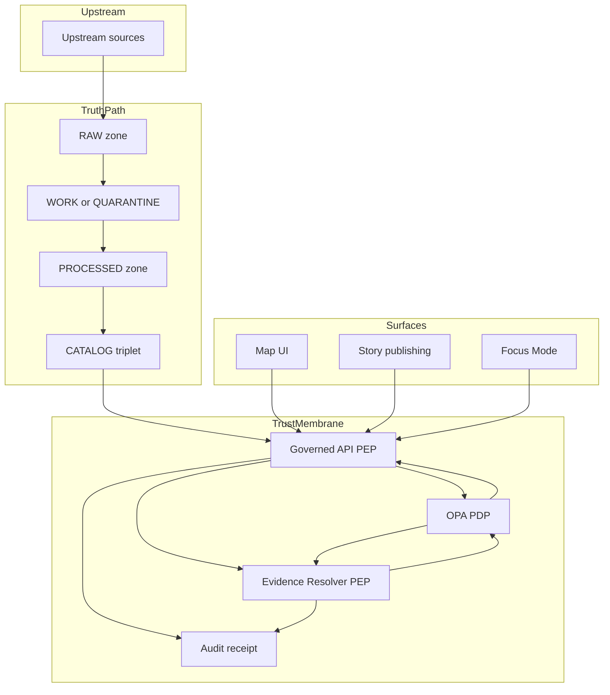

<!-- [KFM_META_BLOCK_V2]
doc_id: kfm://doc/3a8d9b55-66ff-4c25-9c3a-3a0d77a5c6c4
title: KFM Policy Model
type: standard
version: v1
status: draft
owners: KFM Governance
created: 2026-03-02
updated: 2026-03-02
policy_label: public
related:
  - docs/governance/README.md
  - docs/governance/promotion/PROMOTION_CONTRACT.md
  - docs/governance/evidence/EVIDENCE_MODEL.md
tags: [kfm, governance, policy, opa, rego, trust-membrane]
notes:
  - Defines the policy decision model (labels + decisions + obligations) used by CI gates, APIs, Evidence Resolver, Story publishing, and Focus Mode.
  - Paths and code fragments are illustrative unless verified in the live repo.
[/KFM_META_BLOCK_V2] -->

# KFM Policy Model
**One-line purpose:** Define how Kansas Frontier Matrix (KFM) expresses, evaluates, and enforces policy decisions (allow/deny + obligations) across CI and runtime surfaces.


> **WARNING**
> This document is intentionally *fail-closed*: when in doubt, deny access, quarantine promotion, or publish a generalized derivative rather than leaking sensitive/rights-restricted information.

---

## Quick navigation
- [Directory context](#directory-context)
- [Policy model at a glance](#policy-model-at-a-glance)
- [Core objects](#core-objects)
  - [PolicyLabel](#policylabel)
  - [PolicyDecision](#policydecision)
  - [Obligation](#obligation)
  - [PolicyContext](#policycontext)
- [Where policy is enforced](#where-policy-is-enforced)
- [Default rules](#default-rules)
- [Policy label assignment and propagation](#policy-label-assignment-and-propagation)
- [Error handling and non-leakage](#error-handling-and-non-leakage)
- [Testing and governance workflow](#testing-and-governance-workflow)
- [Implementation starter pack](#implementation-starter-pack)
- [Appendix](#appendix)
  - [A. Controlled vocabulary starter list](#a-controlled-vocabulary-starter-list)
  - [B. Example Rego policy + tests](#b-example-rego-policy--tests)
  - [C. Example DTO fragments](#c-example-dto-fragments)

---

## Directory context
**Where it fits:** `docs/governance/policy/` defines the policy semantics for KFM’s *trust membrane*—the boundary where policy + provenance must be enforced before data/evidence is served.

**Acceptable inputs (what belongs here):**
- Controlled vocab definitions (e.g., `policy_label` values)
- Policy decision / obligation model and examples
- Policy enforcement guidance for CI + runtime (PEP/PDP model)
- “Default deny” rules and non-leakage rules (403/404 behavior)

**Exclusions (what must not go here):**
- UI implementation details (UI displays policy; UI does not decide policy)
- Dataset-specific classification writeups (those live in dataset specs / registry)
- Secrets, tokens, credentials, or environment-specific deployment configuration

[Back to top](#kfm-policy-model)

---

## Policy model at a glance



**Key point:** KFM requires the *same policy semantics* in CI and runtime. CI “green” is meaningless if runtime evaluates policy differently.

[Back to top](#kfm-policy-model)

---

## Core objects

### PolicyLabel
A **PolicyLabel** is a controlled classification value applied to *dataset versions* (and, by propagation, their catalog records, assets, and evidence bundles).

**Why it exists:**
- It is a required input to promotion gates (sensitivity + redaction plan).
- It is a required filter for discovery endpoints and evidence resolution.
- It controls whether KFM can publish **exact** vs **generalized** representations.

**Controlled vocabulary:** See [Appendix A](#a-controlled-vocabulary-starter-list) for the starter list.

**Normative rules**
- A `policy_label` **MUST** be assigned before a dataset version can be promoted into governed runtime surfaces.
- `policy_label` **MUST** be present in catalog records (DCAT + STAC) for promoted dataset versions.
- If `policy_label` is `restricted_sensitive_location`, KFM **MUST** default to deny for public access and **SHOULD** publish a `public_generalized` derivative only if an explicit generalization plan exists.

---

### PolicyDecision
A **PolicyDecision** is the output of policy evaluation.

**Decision envelope**
- `decision`: `allow` or `deny`
- `policy_label`: the evaluated label (typically the resource’s label)
- `decision_id`: stable identifier for audit linking
- `obligations[]`: zero or more obligations that must be satisfied before returning data/evidence

**Example (illustrative)**
```json
{
  "decision": "allow",
  "policy_label": "public_generalized",
  "decision_id": "kfm://policy_decision/xyz",
  "obligations": [
    {"type": "show_notice", "message": "Geometry generalized due to policy."}
  ]
}
```

**Normative rules**
- A `deny` decision **MUST** result in no restricted artifacts, fields, or metadata being returned.
- An `allow` decision **MUST** still be accompanied by obligations when required (e.g., “show notice”, “include attribution”, “suppress fields”).
- Every policy decision used to serve data, evidence, Story publishing, or Focus Mode **MUST** be recorded in an audit receipt.

---

### Obligation
An **Obligation** is an enforceable requirement attached to an `allow` decision.

Obligations are *how governance intent becomes runtime behavior* (examples: generalize geometry, remove fields, show notices, block downloads, require attribution, etc.).

**Normative rules**
- Obligations **MUST** be enforceable by code (CI or runtime); “human-only obligations” are not acceptable for automated publishing paths.
- Obligations that transform data (e.g., generalization/redaction) **MUST** be recorded as first-class transforms in provenance (PROV) and should produce a distinct dataset version when the output is materially different.
- Obligations **MUST** be surfaced in Evidence UX (evidence drawer/cards) so users understand constraints.

> **NOTE**
> KFM treats redaction/generalization as a *first-class transform* and expects it to be represented in provenance—not as an undocumented “display hack”.

---

### PolicyContext
A **PolicyContext** is the structured input to the Policy Decision Point (PDP). The minimal context model is:

- `user`: role (and optionally attributes)
- `action`: read, export, publish, etc.
- `resource`: identifier(s) + policy label + rights hints
- `environment`: runtime signals relevant for policy (e.g., “ci” vs “runtime”, request origin)

**Minimal input shape (illustrative)**
```json
{
  "user": { "role": "public" },
  "action": "read",
  "resource": {
    "policy_label": "public",
    "dataset_version_id": "2026-02.abcd1234"
  }
}
```

> **DECISION NEEDED (kept out of this doc on purpose):**
> Which identity provider (OIDC) and whether/when to introduce ABAC beyond role-based controls.

[Back to top](#kfm-policy-model)

---

## Where policy is enforced

KFM uses a **PDP/PEP** pattern:

- **Policy Decision Point (PDP):** OPA running in-process or as a sidecar.
- **Policy Enforcement Points (PEP):**
  - **CI:** schema validation + policy tests block merges/promotion.
  - **Runtime API:** policy checks before serving data or catalogs.
  - **Evidence Resolver:** policy checks before resolving EvidenceRefs to EvidenceBundles.
  - **UI:** shows policy labels and obligations; UI does not decide policy.

### Enforcement inventory
| Surface | What is being protected | Minimum policy requirement |
|---|---|---|
| CI promotion gate | Promotion to PUBLISHED | Block unless `policy_label` + redaction plan exist for dataset version |
| Dataset discovery (`/datasets`) | Visibility of datasets/versions | Filter by policy decision; include version IDs only when allowed |
| STAC browsing (`/stac/...`) | Asset visibility + access | Filter by policy label; do not expose restricted asset hrefs |
| Evidence resolver (`/evidence/resolve`) | Citations and provenance | Resolve only if policy-allowed; include obligations in bundle |
| Story publishing | Narrative claims + media reuse | Block publish if any citation cannot resolve or rights unclear |
| Focus Mode | AI-assisted synthesis | Cite-or-abstain with hard citation verification; deny if evidence not allowed |

[Back to top](#kfm-policy-model)

---

## Default rules

### Sensitivity defaults
- **Default deny** for sensitive-location and restricted datasets.
- If any public representation is allowed, produce a separate **`public_generalized`** dataset version.
- Do **not** embed precise coordinates in Story Nodes or Focus Mode outputs unless policy explicitly allows.
- Treat redaction/generalization as a first-class transform recorded in provenance.

### Licensing and rights defaults
- “Online availability does not equal permission to reuse.”
- Promotion requires **license/rights metadata** and a snapshot of upstream terms.
- “Metadata-only reference” is allowed: catalog the item without mirroring it if rights do not allow.
- Export functions should automatically include attribution and license text.
- Story publishing is blocked if rights are unclear for included media.

[Back to top](#kfm-policy-model)

---

## Policy label assignment and propagation

### When labels are assigned
Policy labels are assigned during source onboarding / dataset spec creation and become enforceable through promotion gates.

### How labels propagate
Once assigned, the `policy_label` should appear in:

- Dataset registry/spec for the dataset version
- DCAT dataset metadata (`kfm:policy_label`)
- STAC collections/items (`kfm:dataset_version_id` + policy label)
- EvidenceBundles returned by the evidence resolver
- Run receipts / audit records for any governed run that served data/evidence

---

## Error handling and non-leakage

### Non-leakage requirement
KFM must not leak restricted metadata in error responses (403/404). This includes:
- dataset existence hints
- restricted titles/descriptions
- asset hrefs/digests
- “near miss” suggestions in search

### Recommended error contract
Errors should return a generic message plus an `audit_ref` that authorized operators/stewards can use to inspect the denial reason.

Example fields:
- `error_code`
- `message`
- `audit_ref`

> **TIP**
> Standardize error responses early. In a governed system, error surfaces are a common exfiltration vector.

---

## Testing and governance workflow

### Policy-as-code requirements
- Policies must be small and composable (one file per concern).
- Policy tests (golden pass/fail fixtures) must run in CI and block merges.
- The policy pack must be versioned; receipts/manifests should reference the policy version used for evaluation.

### Roles and responsibilities (baseline)
- **Public user:** reads public layers/stories; Focus Mode limited to public evidence.
- **Contributor:** proposes datasets/stories; drafts content; cannot publish.
- **Reviewer/Steward:** approves promotions and story publishing; owns policy labels and redaction rules.
- **Operator:** runs pipelines and manages deployments; cannot override policy gates.
- **Governance council / community stewards:** authority over culturally sensitive materials; sets rules for restricted collections and public representations.

### Review queues
Maintain at minimum:
- **Promotion Queue:** steward review of dataset promotions + policy labels
- **Story Review Queue:** steward/editor review of Story Nodes and rights compliance

[Back to top](#kfm-policy-model)

---

## Implementation starter pack

### Files and artifacts that should exist (starter)
> These paths are illustrative; verify actual repo layout.

- `policy/opa/` — Rego policy pack
- `policy/opa/*_test.rego` — unit tests
- `policy/fixtures/` — allow/deny fixtures with obligations
- `tools/` — conftest invocation helpers, schema validators, link checkers
- `contracts/openapi/` — API schemas including EvidenceBundle + ErrorResponse

### “Definition of Done” checklist
- [ ] CI blocks promotion if `policy_label` is missing
- [ ] CI runs OPA tests and fails on regressions
- [ ] Evidence resolver enforces policy and never returns restricted artifacts to unauthorized callers
- [ ] Story publishing gate blocks if any citation cannot resolve (or is not policy-allowed)
- [ ] Focus Mode abstains when citations cannot be verified or are not allowed
- [ ] Error responses do not leak restricted metadata; include `audit_ref`
- [ ] Audit receipts record policy decisions and obligations for all governed runs

---

# Appendix

## A. Controlled vocabulary starter list

### `policy_label` (starter)
- `public`
- `public_generalized`
- `restricted`
- `restricted_sensitive_location`
- `internal`
- `embargoed`
- `quarantine`

> **NOTE**
> `quarantine` is a lifecycle/promotion state as well as a label; treat it as “never publish” unless explicitly reclassified.

---

## B. Example Rego policy + tests

> **Purpose:** Show the minimal *default-deny* posture and how to unit test allow/deny behavior.

```rego
package kfm.authz

default allow = false

# Input shape:
# input.user.role
# input.resource.policy_label
# input.action

allow {
  input.user.role == "steward"
}

allow {
  input.user.role == "public"
  input.action == "read"
  input.resource.policy_label == "public"
}

# Obligations: if dataset is public_generalized, record obligation for UI notice
obligations[o] {
  input.resource.policy_label == "public_generalized"
  o := {"type": "show_notice", "message": "Geometry generalized due to policy."}
}
```

```rego
package kfm.authz_test

import data.kfm.authz

test_public_can_read_public {
  authz.allow with input as {
    "user": {"role": "public"},
    "action": "read",
    "resource": {"policy_label": "public"}
  }
}

test_public_cannot_read_restricted {
  not authz.allow with input as {
    "user": {"role": "public"},
    "action": "read",
    "resource": {"policy_label": "restricted"}
  }
}
```

---

## C. Example DTO fragments

### EvidenceBundle (fragment)
```yaml
EvidenceBundle:
  type: object
  required: [bundle_id, digest, policy, cards]
  properties:
    bundle_id: { type: string }
    digest: { type: string }
    policy:
      type: object
      required: [decision, policy_label, obligations]
      properties:
        decision: { type: string, enum: [allow, deny] }
        policy_label: { type: string }
        obligations:
          type: array
          items: { type: object }
    cards:
      type: array
      items:
        type: object
        properties:
          title: { type: string }
          description: { type: string }
          dataset_version_id: { type: string }
          license: { type: string }
          artifacts:
            type: array
            items:
              type: object
              properties:
                href: { type: string }
                digest: { type: string }
```

### ErrorResponse (fragment)
```yaml
ErrorResponse:
  type: object
  required: [error_code, message, audit_ref]
  properties:
    error_code: { type: string }
    message: { type: string }
    audit_ref: { type: string }
```

[Back to top](#kfm-policy-model)
