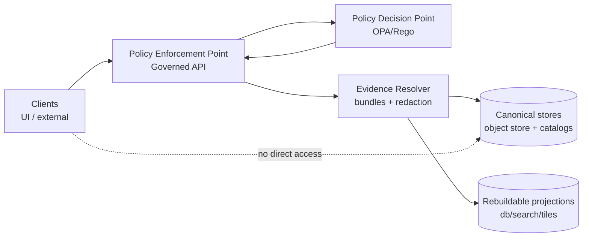

<!-- [KFM_META_BLOCK_V2]
doc_id: kfm://doc/6b7d7b9c-8c9b-4d7f-bc1f-2b9f9a2c9f4b
title: Governance Policy
type: standard
version: v1
status: draft
owners: KFM Governance Stewards
created: 2026-03-02
updated: 2026-03-02
policy_label: public
related:
  - ../../../policy/
  - ../README.md
  - ../../architecture/README.md
  - ../../security/README.md
  - ../../data/README.md
tags: [kfm, governance, policy, opa, rego, trust-membrane]
notes:
  - This folder documents policy intent + workflows; policy-as-code lives in /policy.
  - Replace TODOs with repo-confirmed paths once verified.
[/KFM_META_BLOCK_V2] -->

# KFM Governance Policy
**Purpose:** Define how policy is authored, reviewed, tested, and enforced across the KFM trust membrane.


> **NOTE**
> This directory is **documentation** for governance + policy operations.  
> The enforceable policy bundle (OPA/Rego) is expected to live in `policy/` at the repo root.  
> Update links below once confirmed in the live repo.

---

## Quick navigation
- [What belongs here](#what-belongs-here)
- [Policy boundary: the trust membrane](#policy-boundary-the-trust-membrane)
- [Policy model: PDP, PEP, decisions, obligations](#policy-model-pdp-pep-decisions-obligations)
- [Policy labels](#policy-labels)
- [Redaction and generalization](#redaction-and-generalization)
- [Licensing and rights](#licensing-and-rights)
- [Change management](#change-management)
- [Testing and CI gates](#testing-and-ci-gates)
- [Templates](#templates)

---

## What belongs here

### In scope
- **Human-readable governance policy docs** explaining:
  - policy intent, semantics, and invariants
  - who can change policy and how changes are reviewed
  - how policy interacts with promotion, publishing, evidence, and UI surfaces
  - required artifacts (fixtures, rubrics, review workflows)
- **Operational checklists** (policy review, incident policy, release notes expectations)
- **Controlled vocabulary documentation** (policy labels, sensitivity classes, obligations catalog)

### Out of scope
- **Policy-as-code** (`.rego`, bundles, conftest policies, fixtures): keep those in `../../../policy/` (repo root) unless the repo structure differs.
- **Dataset-specific rules** that belong with dataset specs/registry (keep near the dataset or in `data/`).
- **Secrets and credentials** (never store here).

---

## Where this fits in the repo

```text
repo-root/
├─ docs/
│  └─ governance/
│     └─ policy/
│        └─ README.md  (you are here)
├─ policy/             (OPA/Rego policy bundle + fixtures + tests)  # TODO: verify
├─ apps/               (API/UI/worker services)                     # TODO: verify
└─ data/               (registries, catalogs, zones)                # TODO: verify
```

---

## Policy boundary: the trust membrane

KFM policy is only enforceable if it sits at the **boundary between clients and storage** (the “trust membrane”):

- UI and external clients **must not** access storage/DB directly.
- All access is mediated by a governed API and/or evidence resolver that performs policy checks.
- Policy must be enforced consistently in CI and at runtime (same fixtures/outcomes).

### Architecture sketch



> **RULE:** UI may display policy state (badges, notices), but must not be the place where allow/deny decisions are computed.

---

## Policy model: PDP, PEP, decisions, obligations

### Core concepts
| Concept | Meaning | Why it exists |
|---|---|---|
| **PDP** (Policy Decision Point) | Policy evaluation engine (OPA/Rego). | Centralize decisions; keep them reviewable and testable. |
| **PEP** (Policy Enforcement Point) | Code that calls policy and enforces outcome. | Make policy real: deny data, redact, or attach obligations. |
| **Decision** | Allow/Deny (+ rationale/metadata). | Fail-closed access control. |
| **Obligation** | Required side-effects/constraints (e.g., “show notice”, “generalize geometry”). | Governance beyond allow/deny. |

### Expected decision envelope (contract)
All PEPs should standardize on a shared decision response shape:

- `allow: boolean`
- `deny_reason: string[]` (safe for the caller; avoid leaking restricted metadata)
- `obligations: []` (typed, deterministic, auditable)
- `policy_version: string` (or bundle digest)
- `inputs_hash: string` (optional; for receipts/auditability)

> **TODO:** Link the exact JSON schema for decisions once present (e.g., `contracts/policy/decision.schema.json`).

---

## Policy labels

Policy labels classify **what can be served** (and how) from KFM runtime surfaces.

### Minimum expectations
- Every promoted dataset version must have a policy label.
- Policy labels must be a **controlled vocabulary** (no ad-hoc strings).
- Labels must be propagated into catalog surfaces (DCAT/STAC/PROV) and respected by API, evidence resolver, and publishing workflows.

### Proposed starter label set (replace with your authoritative vocabulary)
| Label | Intended meaning | Default behavior |
|---|---|---|
| `public` | Publicly releasable, no special constraints. | Allow read to public role. |
| `public_generalized` | Public view exists, but transformed to reduce sensitivity. | Allow read + obligation to show notice / use generalized artifacts. |
| `restricted` | Requires privileged role and/or approval workflow. | Default deny for public. |
| `sensitive_location` | Could enable targeting/harms if exposed precisely. | Default deny; if any public view, require generalized version. |

> **NOTE:** The authoritative list must live in the policy bundle + documentation and be referenced by catalogs and UI.

---

## Redaction and generalization

KFM treats redaction/generalization as **first-class, provenance-tracked transforms**:
- Prefer producing a separate generalized dataset version over “best-effort” runtime masking.
- Avoid leaking precise coordinates or sensitive metadata in any public-facing narrative or responses.
- Ensure denied responses do not reveal restricted metadata via error details.

### Common obligation patterns
- `show_notice` (UI must display a policy notice)
- `use_generalized_asset` (resolver selects generalized artifacts)
- `redact_fields` (remove specific metadata fields)
- `round_geometry` (quantize coordinates)
- `log_access` (audit requirement)

> **TODO:** Document each obligation type and which PEP is responsible for enforcing it.

---

## Licensing and rights

Policy must incorporate licensing/rights as **enforceable inputs**, not “documentation-only” metadata.

Minimum expectations:
- Promotion requires a license/rights position for every distribution.
- If rights do not allow mirroring or public redistribution, support a **metadata-only reference** mode.
- Exports/downloads must include required attribution and license text.
- Story publishing must block if embedded media rights are unclear.

---

## Change management

### Policy changes are governed changes
Policy modifications can change:
- what data is accessible,
- how content is generalized/redacted,
- what the UI may display,
- what the system is allowed to answer.

Treat policy PRs as “production changes”:

1. **Propose** the change (intent + rationale).
2. **Update** policy-as-code (Rego) and any controlled vocab docs.
3. **Add/Update fixtures** (allow/deny + obligations) proving behavior.
4. **Run tests** locally and in CI.
5. **Review** (Steward + Security/Legal/Governance Council as needed).
6. **Merge** only if CI gates pass.
7. **Communicate** changes (release note + any migration steps).

### Required PR contents (Definition of Done)
- [ ] Clear description of intent + impact surface(s)
- [ ] Updated policy bundle (or docs-only change explicitly labeled)
- [ ] New/updated fixtures covering both “allow” and “deny”
- [ ] No leakage in deny paths (errors safe)
- [ ] Notes on backward compatibility and rollout/rollback

---

## Testing and CI gates

### CI must fail closed
Policy test failures should block merges. At minimum:
- schema validation for policy inputs/outputs
- fixture-driven tests ensuring expected allow/deny + obligations
- regression checks preventing “policy drift” between CI and runtime

### Local dev (placeholder)
```bash
# TODO: replace with repo-confirmed commands
make policy-test
make policy-lint
make contracts-validate
```

---

## Templates

<details>
<summary><strong>Policy Change Template</strong> (copy/paste into PR description)</summary>

- **What changed?**
- **Why?**
- **Which enforcement points are affected?** (CI / API / Evidence resolver / UI)
- **New/updated fixtures:** (list)
- **Backward compatibility:** (breaking? none?)
- **Risk + rollback plan:**
- **Notes for release:**

</details>

<details>
<summary><strong>Sensitivity Review Checklist</strong></summary>

- [ ] Does this reveal precise locations of vulnerable sites?
- [ ] Could this enable targeting or harm if combined with other public data?
- [ ] Is there a generalized representation that meets public needs?
- [ ] Do stories / Focus outputs contain restricted coordinates or identifiers?
- [ ] Are deny responses safe (no metadata leakage)?

</details>

---

## Backlog: docs to add in this folder (recommended)
- `policy-labels.md` — authoritative label list + semantics + examples
- `obligations.md` — obligation catalog and enforcement responsibilities
- `sensitivity.md` — rubric + generalization guidelines
- `licensing.md` — rights classification rubric + enforcement rules
- `workflows.md` — Promotion Queue + Story Review Queue definitions
- `audit.md` — audit ledger retention + access policy

---

## Related (authoritative) implementation surfaces
- Policy-as-code bundle: `../../../policy/` (**expected**)  
- Governed API (PEP): `../../../apps/api/` (**expected**)  
- Evidence resolver: `../../../packages/evidence/` (**expected**)  
- Catalog triplet validators: `../../../packages/catalog/` (**expected**)  

> **TODO:** Replace “expected” paths with confirmed links once the repo tree is validated.
