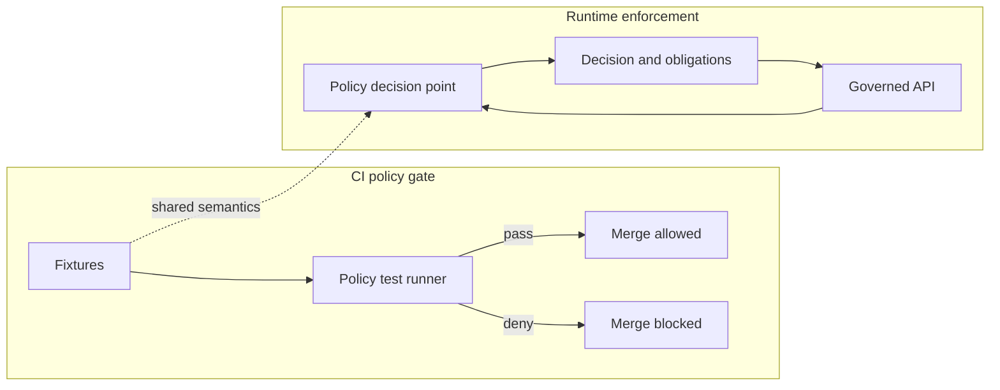

<!-- [KFM_META_BLOCK_V2]
doc_id: kfm://doc/b992aa2d-7a79-4f4d-9b2f-0f2b8a9f0f1c
title: Policy Fixtures
type: standard
version: v1
status: draft
owners: KFM Governance
created: 2026-03-02
updated: 2026-03-02
policy_label: public
related:
  - kfm://doc/policy-as-code
  - kfm://doc/promotion-contract
tags: [kfm, governance, policy, fixtures]
notes:
  - This README defines the fixture contract and contribution rules for policy decision test cases.
  - Keep fixtures synthetic; never commit restricted identifiers or precise sensitive coordinates.
[/KFM_META_BLOCK_V2] -->

# Policy Fixtures
Golden policy decision cases (**allow/deny + obligations**) used to keep **CI gates** and **runtime enforcement** aligned.


<!-- TODO: replace/augment badges with repo CI status + CODEOWNERS path once confirmed -->

**Owners:** KFM Governance (Policy Steward + Policy Engineer)  
**Applies to:** Promotion gates, governed API (PEP), evidence resolver, story publishing, Focus Mode

---

## Quick navigation
- [Purpose](#purpose)
- [Where this folder fits](#where-this-folder-fits)
- [What belongs here](#what-belongs-here)
- [What must not go here](#what-must-not-go-here)
- [Recommended directory layout](#recommended-directory-layout)
- [Fixture contract](#fixture-contract)
- [Adding or changing fixtures](#adding-or-changing-fixtures)
- [Quality gates](#quality-gates)
- [FAQ](#faq)

---

## Purpose

KFM policy is **policy-as-code**. A “policy decision” must be reproducible and testable via fixtures:

- **Decision:** allow or deny
- **Obligations:** required transforms or handling (e.g., redact fields, generalize geometry, attach attribution, suppress metadata)

This folder is the **documentation + contract surface** for those fixtures. The same decision semantics should be enforced:
- in **CI** (merge-blocking checks), and
- at **runtime** (API and evidence resolution).

> NOTE: If you have multiple fixture locations (e.g., one under `policy/` and one under `docs/`), this README is the normative contract. Prefer one source of truth and mirror only by automation.

---

## Where this folder fits

This folder lives under:

- `docs/governance/policy/fixtures/`

It exists to support:
- **Policy change review** (fixtures demonstrate intent)
- **Regression prevention** (fixtures encode known-good outcomes)
- **Trust membrane behavior** (fixtures encode what must never leak)

---

## What belongs here

✅ **Acceptable inputs**
- Synthetic request contexts (JSON/YAML) representing policy queries:
  - subject (actor) attributes: role(s), auth context class, purpose (if applicable)
  - requested action: read/query/export/publish/resolve
  - resource descriptors: dataset version metadata, policy label, requested fields, spatial/temporal window
  - environment: runtime surface (“ci”, “api”, “evidence”, “ui”) when relevant
- Expected decision outputs:
  - allow/deny
  - obligations list (typed, structured)
  - optional explanation code(s) (stable identifiers, not free-form prose)

✅ **Fixture categories we expect to cover**
- Access decisions: public vs internal vs restricted
- Evidence resolution: citation allowed vs blocked; redaction obligations applied
- Story/Focus publishing gates: “all citations must resolve and be policy-allowed”
- Promotion gates: “policy_label + obligations must exist when required”

---

## What must not go here

❌ **Exclusions**
- Real secrets, tokens, credentials, cookies
- Real restricted dataset IDs, file paths, signed URLs, internal hostnames
- Precise coordinates for sensitive or vulnerable locations (use synthetic geometry or coarse boxes)
- Any payload that would violate rights/licensing constraints

> WARNING: Fixtures are often copied into issues, PR comments, and CI logs. Treat fixtures as **public-by-default** even if the repo is private.

---

## Recommended directory layout

This is a **recommended** layout (keep it simple and predictable):

```
docs/governance/policy/fixtures/
  README.md

  cases/
    <case_id>/
      input.json
      expected.json
      notes.md

  schemas/
    policy_fixture_input.schema.json
    policy_fixture_expected.schema.json

  catalogs/
    policy_fixture_index.yaml
```

**Notes**
- `case_id` should be stable and descriptive:
  - `public_read_dataset_allow`
  - `restricted_read_dataset_deny_no_leak`
  - `public_read_sensitive_location_allow_with_generalize`
  - `evidence_resolve_restricted_deny`

---

## Fixture contract

### Input shape (conceptual)

Your policy engine (OPA/Rego or equivalent) should accept an **input** that is stable across CI and runtime.

Minimum recommended fields:

| Field | Type | Description |
|---|---:|---|
| `request.id` | string | Stable ID for tracing |
| `request.surface` | string | `ci` / `api` / `evidence` / `ui` |
| `request.action` | string | `read` / `query` / `export` / `publish` / `resolve_evidence` |
| `subject.roles` | array | e.g., `["public"]`, `["reviewer"]` |
| `resource.kind` | string | `dataset_version`, `story_node`, `evidence_ref` |
| `resource.policy_label` | string | policy label being enforced |
| `resource.license` | object | license / rights metadata if relevant |
| `resource.geometry` | object | geometry or bbox (synthetic / coarse) |
| `resource.time` | object | event/valid/transaction time if relevant |

### Expected output shape (conceptual)

Minimum recommended fields:

| Field | Type | Description |
|---|---:|---|
| `allow` | boolean | permit/deny |
| `deny_reason` | string | stable code, e.g. `DEFAULT_DENY`, `RESTRICTED_RESOURCE` |
| `obligations` | array | required actions (typed objects) |
| `redactions` | object | optional explicit redaction plan (if separate from obligations) |

### Obligations (examples)

Obligations should be machine-actionable. Example obligation types:

- `generalize_geometry` (coarsen point to county bbox)
- `drop_fields` (remove `owner_name`, `exact_address`)
- `require_attribution` (inject license + attribution in exports)
- `suppress_metadata` (do not reveal restricted metadata in errors)
- `watermark_media` (if media distribution policy requires it)

> TIP: Keep obligations **typed** and **small** so they can be enforced consistently in API + evidence + UI.

---

## Example fixture

### `cases/public_read_dataset_allow/input.json`
```json
{
  "request": {
    "id": "public_read_dataset_allow",
    "surface": "api",
    "action": "read"
  },
  "subject": {
    "roles": ["public"]
  },
  "resource": {
    "kind": "dataset_version",
    "dataset_version_id": "dv_synthetic_001",
    "policy_label": "public",
    "license": { "spdx": "CC-BY-4.0" },
    "geometry": { "type": "Polygon", "coordinates": [] }
  }
}
```

### `cases/public_read_dataset_allow/expected.json`
```json
{
  "allow": true,
  "deny_reason": null,
  "obligations": []
}
```

---

## Adding or changing fixtures

1. **Create a new case folder** under `cases/<case_id>/`.
2. Add:
   - `input.json`
   - `expected.json`
   - `notes.md` (what this case protects; what regression it prevents)
3. Ensure the case is:
   - **Synthetic** (no secrets, no restricted IDs)
   - **Minimal** (only fields needed to exercise the rule)
   - **Stable** (deterministic ordering; no timestamps unless explicitly testing time)
4. Add both:
   - a **pass** case (allowed + obligations if any)
   - a **fail** case (denied + correct non-leak behavior)

> TIP: Keep policies small and composable; prefer one fixture concern per case.

---

## Quality gates

### Required (MUST)
- Every policy change MUST include fixture updates that demonstrate:
  - the new intended behavior
  - at least one regression guard (a denied or allowed case that would have broken before)

### Recommended (SHOULD)
- Validate fixtures against JSON Schemas in CI.
- Run policy tests in CI in a **fail-closed** posture (deny-by-default).
- Keep CI and runtime using the **same fixture semantics** (ideally, same inputs and expected outputs).

---

## FAQ

### Why are fixtures “governance artifacts”?
Because KFM policy is part of the trust membrane: a policy decision determines what may be served and what must be redacted/generalized. Fixtures make those decisions reviewable and auditable.

### Where do these fixtures get executed?
That depends on the repo wiring:
- CI commonly runs OPA/Conftest against fixtures.
- Runtime uses the same policy bundle via a PDP (sidecar or in-process).

If you’re unsure, search the repo for `conftest`, `opa`, `rego`, `Policy Decision Point`, or fixture runner scripts.

---

## Appendix: Policy decision flow (conceptual)



<p align="right"><a href="#policy-fixtures">Back to top</a></p>
