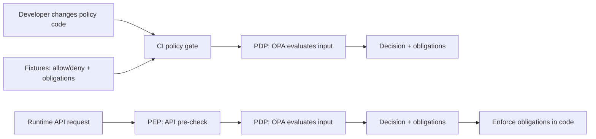

<!-- [KFM_META_BLOCK_V2]
doc_id: kfm://doc/9f03b0e8-9f6a-4a6a-8e8f-0b38c7f4e8e3
title: Allow/Deny Policy Fixtures
type: standard
version: v1
status: draft
owners: kfm-governance, kfm-policy-engineering
created: 2026-03-02
updated: 2026-03-02
policy_label: public
related:
  - docs/governance/policy/README.md  # TODO: confirm path exists
  - policy/opa/                       # TODO: confirm path exists
tags: [kfm, governance, policy, fixtures, opa, conftest]
notes:
  - This README documents *fixtures* only (golden inputs/expected outcomes), not the policy logic itself.
  - Treat fixtures as governed artifacts: minimal, reproducible, and safe to share.
[/KFM_META_BLOCK_V2] -->

# Allow/Deny Policy Fixtures
Golden fixtures for **policy decisions** (allow/deny + obligations) used to keep **CI and runtime policy semantics aligned**.


<!-- TODO: replace with real workflow once known -->


---

## Quick navigation
- [Purpose](#purpose)
- [Where this fits](#where-this-fits)
- [Directory layout](#directory-layout)
- [Fixture contract](#fixture-contract)
- [Running tests](#running-tests)
- [Adding new fixtures](#adding-new-fixtures)
- [Safety rules](#safety-rules)
- [Troubleshooting](#troubleshooting)

---

## Purpose
This folder contains **fixtures-driven tests** that lock in the expected behavior of KFM access policy decisions:

- **Allow / Deny** decisions for requests
- **Obligations** that must be enforced when access is allowed (e.g., redaction/generalization, attribution, output scoping)

These fixtures are intended to make policy changes:
- reviewable,
- regression-testable,
- and safe to deploy.

> **Design intent:** if CI policy gates do not match runtime policy semantics, CI guarantees are meaningless. Fixtures are the bridge.

---

## Where this fits
Policy is enforced at multiple Policy Enforcement Points (PEPs). Fixtures should represent the **same input shape** those PEPs send to the Policy Decision Point (PDP).



---

## Directory layout
This README documents a **recommended** (fixtures-first) layout. If your repo uses a different layout, keep the **intent** the same and update this README.

```
docs/governance/policy/fixtures/allow_deny/                 | # Policy fixture suites (allow/deny) for CI parity + regression (deterministic; no secrets)
├─ README.md                                                | # Fixture contract: directory layout, naming rules, required fields, how CI executes, expected exit semantics
│
├─ allow/                                                   | # Allow cases (expected allow=true) — MUST pass and remain stable
│  └─ <case_name>/                                          | # One fixture case directory (kebab/snake-case; stable once referenced)
│     ├─ input.json                                         | # Policy input document (user/action/resource/context; policy-safe)
│     └─ expected.json                                      | # Expected decision envelope (allow=true + obligations + reason_codes as applicable)
│
├─ deny/                                                    | # Deny cases (expected allow=false) — MUST fail-closed with policy-safe errors
│  └─ <case_name>/                                          | # One fixture case directory (stable; referenced by tests)
│     ├─ input.json                                         | # Policy input document that should be denied (no leakage; no secrets)
│     └─ expected.json                                      | # Expected decision envelope (allow=false + obligations/reason_codes; indistinguishable where required)
│
└─ _shared/                                                 | # OPTIONAL: shared snippets/helpers/schemas (no secrets; reused across cases)
```

**Naming conventions (recommended):**
- `case_name` SHOULD be short and readable: `dataset_public_read`, `restricted_asset_download`, `story_publish_missing_rights`
- Use lowercase and underscores.
- Prefer clarity over cleverness.

---

## Fixture contract
### What a fixture represents
A fixture represents: **“Given this request context, the policy decision MUST be X and obligations MUST be Y.”**

### Proposed (v1) input shape
> ⚠️ If your policy input schema is already defined elsewhere in-repo, treat that as authoritative and adapt examples below.

`input.json` (example, minimal and synthetic):
```json
{
  "subject": {
    "principal_id": "user:example",
    "roles": ["public_user"]
  },
  "action": "read",
  "resource": {
    "kind": "stac:item",
    "dataset_id": "example.dataset",
    "dataset_version_id": "dv:example",
    "policy_label": "public"
  },
  "context": {
    "channel": "api",
    "purpose": "browse",
    "time": "2026-03-02T00:00:00Z"
  }
}
```

### Proposed (v1) expected shape
`expected.json` (example):
```json
{
  "allow": true,
  "deny_reasons": [],
  "obligations": [
    {
      "type": "attribution",
      "mode": "require",
      "fields": ["license", "rights_holder"]
    }
  ]
}
```

### Obligations
Obligations are **non-optional requirements** the enforcement code MUST apply when serving results. Examples:
- `redact_fields` (remove disallowed metadata fields)
- `generalize_geometry` (reduce coordinate precision / geometry detail)
- `restrict_exports` (block downloads but allow metadata browsing)
- `require_attribution` (ensure license/rights text is present)

**Rule of thumb:** if the policy can’t safely allow the unmodified response, it should allow only with an obligation—or deny.

---

## Running tests
> The exact commands depend on where the OPA policy bundle lives in your repo.

### Option A: Conftest (recommended for CI gates)
```bash
# TODO: confirm actual policy directory, e.g. policy/opa
conftest test docs/governance/policy/fixtures/allow_deny -p policy/opa
```

### Option B: OPA native tests (if you maintain *_test.rego)
```bash
# TODO: confirm actual policy directory
opa test policy/opa -v
```

### Expected behavior
- Any fixture mismatch MUST fail the build (fail-closed).
- Deny cases SHOULD have a stable, human-readable `deny_reasons[]` list to support review and debugging.
- CI output SHOULD clearly show:
  - which case failed,
  - what changed (diff),
  - and which obligation/deny_reason triggered.

---

## Adding new fixtures
### When to add a fixture
Add a fixture whenever you introduce or change:
- a new policy rule,
- a new obligation type,
- a new policy label / sensitivity class,
- a new endpoint or “action” that must be governed,
- or a bug fix where you want a regression lock.

### Checklist (Definition of Done)
- [ ] Fixture is **minimal** (only fields required to trigger the rule)
- [ ] Fixture uses **synthetic identifiers** (no production IDs, no secrets)
- [ ] `allow` / `deny` outcome is explicit in `expected.json`
- [ ] Obligations are explicit, typed, and enforceable
- [ ] CI passes locally using one of the commands above
- [ ] Reviewer can read `deny_reasons` / obligations and understand intent

---

## Safety rules
Fixtures are governance artifacts, not “random test data.”

- **MUST NOT** include secrets, tokens, API keys, or internal URLs.
- **MUST NOT** include precise coordinates for sensitive locations.
- **MUST** prefer synthetic examples that still exercise the rule.
- **SHOULD** treat any redaction/generalization requirement as an **obligation**, not a “best effort” behavior.

If in doubt: fail closed (deny) and require governance review.

---

## Troubleshooting
### “CI passes but runtime behaves differently”
Common causes:
- runtime PEP sends a different input shape than fixtures
- policy bundle versions differ between CI and deployed runtime
- enforcement code ignores obligations (policy says allow-with-obligations, runtime serves raw)

Minimum debugging steps:
1. Log (safely) the runtime policy input and compare to fixture `input.json`.
2. Verify the policy bundle version/digest used in CI matches runtime.
3. Add/extend a fixture that reproduces the runtime mismatch.

### “Fixture is too big / too brittle”
- Strip fields not required to trigger the rule.
- Prefer stable identifiers and stable deny reason strings.
- Break one “mega” fixture into multiple focused fixtures.

---

## Appendix: What belongs here (and what does not)
### Acceptable inputs
- minimal `input.json` and `expected.json` pairs for allow/deny decisions
- safe shared helpers in `_shared/` (no secrets)

### Exclusions
- production data extracts
- any PII
- any restricted location details (unless explicitly approved and still generalized)
- large blobs (imagery, GeoJSON dumps, etc.)

---

<p align="right"><a href="#allowdeny-policy-fixtures">Back to top</a></p>
