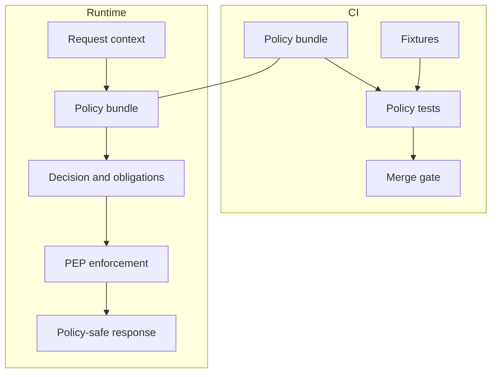

<!-- [KFM_META_BLOCK_V2]
doc_id: kfm://doc/5cfa6c04-8b0f-4f65-9f2e-7f7f9a8a4a58
title: Redaction & Generalization Fixtures
type: standard
version: v1
status: draft
owners: TODO(kfm):stewardship-team
created: 2026-03-02
updated: 2026-03-02
policy_label: public
related:
  - docs/governance/policy/README.md
  - docs/governance/policy/fixtures/README.md
tags: [kfm, governance, policy, fixtures, redaction, generalization]
notes:
  - This README defines how to author fixtures that validate allow/deny + redaction/generalization obligations.
  - Keep fixtures synthetic and non-sensitive.
[/KFM_META_BLOCK_V2] -->

# Redaction & Generalization Fixtures
**Purpose:** Fixture-driven tests for policy outcomes *and* the resulting redaction/generalization obligations, so CI and runtime share the same semantics.


> **WARNING**
> Fixtures in this directory must never contain real sensitive coordinates, real PII, or partner-restricted records. Use synthetic data only.

---

## Quick nav
- [Why this folder exists](#why-this-folder-exists)
- [Where it fits](#where-it-fits)
- [Definitions](#definitions)
- [Directory contract](#directory-contract)
- [Fixture contract](#fixture-contract)
- [Required fixture scenarios](#required-fixture-scenarios)
- [How to add a fixture](#how-to-add-a-fixture)
- [Gates and Definition of Done](#gates-and-definition-of-done)
- [Appendix: example fixture pair](#appendix-example-fixture-pair)

---

## Why this folder exists
KFM policy evaluation is not just **allow/deny**. It also returns **obligations** that must be enforced consistently across:
- CI policy tests (merge gates)
- Runtime governed APIs (PEP)
- Evidence resolution (EvidenceRef → EvidenceBundle)
- UI trust surfaces (policy badges + “redactions applied” notices)

This directory holds fixtures specifically focused on **redaction** and **generalization** behaviors.

[Back to top](#redaction--generalization-fixtures)

---

## Where it fits
This directory is part of the “policy-as-code” posture:



[Back to top](#redaction--generalization-fixtures)

---

## Definitions

### Redaction
Removing or suppressing sensitive fields so they are **not present** in a public response/bundle/export.

Examples:
- Remove attributes like `owner_name`, `exact_location`, `phone_number`
- Remove internal IDs that enable linkage attacks
- Remove or mask audit/operational details that would leak restricted info

### Generalization
Transforming geometry or resolution to make a *public representation* safer, typically via a separate publishable derivative (e.g., `public_generalized`) instead of exposing restricted precision.

Examples (implementation-specific):
- Coarsen points into grid cells
- Replace exact geometry with a coarse bbox
- Aggregate records to a safe geography
- Apply minimum-count thresholds to avoid re-identification

> **NOTE**
> In KFM posture, generalized outputs should be treated as a first-class transform with provenance (recorded in lineage/receipts/PROV), not a hidden UI trick.

[Back to top](#redaction--generalization-fixtures)

---

## Directory contract

### Acceptable inputs (what belongs here)
- Synthetic fixture inputs representing **request context** (user role, action, resource policy label, request mode)
- Expected **policy decision outputs** (allow/deny + obligations + reason codes)
- “Golden” expected outputs for:
  - redacted attribute sets
  - generalized geometry representations
  - UI notice obligations

### Exclusions (what must NOT go here)
- Any real sensitive-location coordinates (even if “already public” elsewhere)
- Any real PII (names, addresses, phone numbers, emails, unique IDs)
- Any partner-restricted data extracts
- Any secrets, tokens, credentials, or internal URLs
- Any fixture that depends on non-deterministic randomness

[Back to top](#redaction--generalization-fixtures)

---

## Fixture contract
Fixtures SHOULD be structured so they can be executed in both:
- **CI** (policy regression)
- **Runtime** (integration tests for the evidence resolver / API)

A minimal fixture pair is:
1) **input**: request context
2) **expected**: policy decision + obligations (+ optional expected redacted/generalized result)

### PolicyDecision template (reference shape)
```json
{
  "decision_id": "kfm://policy_decision/example",
  "policy_label": "restricted",
  "decision": "deny",
  "reason_codes": ["SENSITIVE_SITE", "RIGHTS_UNCLEAR"],
  "obligations": [
    { "type": "generalize_geometry", "min_cell_size_m": 5000 },
    { "type": "remove_attributes", "fields": ["exact_location", "owner_name"] }
  ],
  "evaluated_at": "2026-02-20T12:00:00Z",
  "rule_id": "deny.restricted_dataset.default"
}
```

> **TIP**
> Keep `evaluated_at` stable in fixtures to prevent churn. Treat fixtures as deterministic contracts.

[Back to top](#redaction--generalization-fixtures)

---

## Required fixture scenarios
Your fixture set in this folder MUST cover these “trust membrane” cases:

### 1) Default deny for restricted and sensitive-location classes
- `public` user attempting to read `restricted` → **deny**
- `public` user attempting to read `restricted_sensitive_location` → **deny**
- Ensure no restricted metadata leaks in “not found” / “forbidden” shapes (policy-safe errors)

### 2) Public generalized representations
- `public` user reading `public_generalized` → **allow**
- Expected obligations include at least:
  - a UI-facing notice (example: “Geometry generalized due to policy.”)
  - evidence bundle must declare redactions/generalizations applied

### 3) Sensitive-location leakage defenses
- “No restricted bbox leakage” checks for any public tile/feature response
- “No coordinate fields” checks for exports where policy requires suppression/generalization

### 4) PII / re-identification risk thresholds
- Individual-level records MUST NOT be publicly served
- Aggregation MUST enforce minimum counts (threshold is policy-owned and documented as an obligation)

[Back to top](#redaction--generalization-fixtures)

---

## How to add a fixture

1. **Pick the scenario** (from [Required fixture scenarios](#required-fixture-scenarios)).
2. **Create a synthetic input**:
   - user role (public/contributor/steward/operator)
   - action (read/query/export/story_publish/focus_ask)
   - resource policy label (public/public_generalized/restricted/…)
   - request mode (api_query | tile | evidence_resolve | export)
3. **Define expected PolicyDecision**:
   - decision allow/deny
   - reason_codes (for audit + UX)
   - obligations (redaction/generalization steps)
4. **Add an assertion**:
   - For allow: validate the *redacted/generalized* shape is correct
   - For deny: validate *policy-safe error* shape and **no leaks**
5. **Run policy tests locally** (tooling depends on the repo; common patterns include OPA test runners or Conftest).

[Back to top](#redaction--generalization-fixtures)

---

## Gates and Definition of Done
A change touching policy redaction/generalization is **Done** when:

- [ ] Fixtures cover allow/deny + obligations for the scenario
- [ ] Policy tests run in CI and block merges on regression
- [ ] Evidence resolution / API integration tests confirm obligations are enforced
- [ ] Public responses show “redactions applied” (via obligation-driven UI notices)
- [ ] No sensitive-location leakage tests pass (bbox/coords)
- [ ] No PII appears in fixtures or outputs

[Back to top](#redaction--generalization-fixtures)

---

## Appendix: example fixture pair

### A) Request context (synthetic)
```json
{
  "user": { "role": "public" },
  "action": "read",
  "resource": {
    "policy_label": "public_generalized",
    "dataset_version_id": "2026-02.synthetic"
  },
  "request": { "mode": "api_query" }
}
```

### B) Expected decision + obligations
```json
{
  "decision": "allow",
  "policy_label": "public_generalized",
  "reason_codes": ["PUBLIC_REPRESENTATION_ONLY"],
  "obligations": [
    { "type": "show_notice", "message": "Geometry generalized due to policy." }
  ]
}
```
