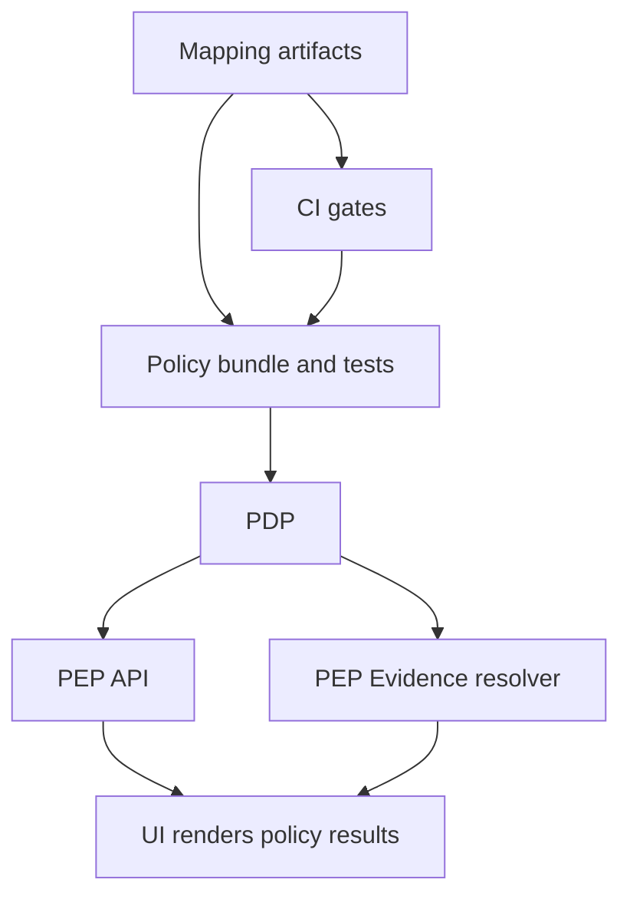

<!-- [KFM_META_BLOCK_V2]
doc_id: kfm://doc/b7d3b0d6-8c56-4c3b-9c8d-2b3f6d5f6b3a
title: Policy Mappings
type: standard
version: v1
status: draft
owners: KFM Governance (Stewards) + Policy Engineering
created: 2026-03-02
updated: 2026-03-02
policy_label: public
related:
  - TODO: link to policy pack docs (e.g., /policy/README.md) if/when present
  - TODO: link to governed API contract docs (e.g., /contracts/openapi/*) if/when present
tags: [kfm, governance, policy, mappings]
notes:
  - Human + machine-readable mapping artifacts that keep policy semantics consistent across CI, runtime API, evidence resolution, and UI.
[/KFM_META_BLOCK_V2] -->

# Policy Mappings
**Purpose:** Standardize how KFM policy inputs (labels, roles, actions) map to enforcement behavior (allow/deny + obligations) and how those decisions appear on contract surfaces (catalogs, APIs, UI).


**Owners:** KFM Governance (Stewards), Policy Engineering  
**Last updated:** 2026-03-02

---

## Quick navigation
- [Why this directory exists](#why-this-directory-exists)
- [Where it fits](#where-it-fits)
- [What belongs here](#what-belongs-here)
- [Controlled vocabulary](#controlled-vocabulary)
- [Mapping artifact registry](#mapping-artifact-registry)
- [How changes ship](#how-changes-ship)
- [Validation and gates](#validation-and-gates)
- [Templates](#templates)
- [Appendix](#appendix)

---

## Why this directory exists

KFM treats policy as **code + tests**, enforced consistently in:
- **CI** (to prevent policy regressions from merging),
- **Runtime APIs** (before serving anything),
- **Evidence resolution** (before returning citations/evidence),
- **UI** (policy is *displayed*, never decided).

This folder exists to keep the system legible and governed by maintaining the “translation layer” between:
- **Policy inputs** (policy labels, roles, actions, resource types), and
- **Policy outcomes** (allow/deny + obligations), and
- **Contract surfaces** (DCAT/STAC/PROV metadata, API responses, UI badges/notices).

> [!WARNING]
> These mappings are **not** the enforcement engine. They must never be used to bypass PDP/PEP evaluation.
> Authoritative enforcement lives in policy-as-code (e.g., OPA/Rego) + fixture tests.

[Back to top](#policy-mappings)

---

## Where it fits



### Key concepts (glossary)
- **PDP (Policy Decision Point):** Evaluates requests and returns allow/deny + obligations.
- **PEP (Policy Enforcement Point):** Places that must call the PDP before doing work (CI, API, evidence resolver).
- **Obligations:** Required actions *when* access is allowed (e.g., show a UI notice, generalize geometry, attach attribution).

[Back to top](#policy-mappings)

---

## What belongs here

This directory is for **mapping artifacts** that are:
- **auditable** (reviewable in PRs),
- **testable** (drive fixtures/tests),
- **shared** (used consistently by CI + runtime).

### ✅ Acceptable inputs
| Type | Examples | Notes |
|---|---|---|
| Policy label definitions | `policy_label_semantics.md` | Human-readable “what this means” + UI-safe wording |
| Role/action matrices | `role_action_matrix.yml` | Maps *roles × actions × resources* to expected outcomes |
| Obligation dictionaries | `obligations_catalog.yml` | Enumerates obligation types and their intended UI behavior |
| Classification mappings | `license_classification_map.yml`, `sensitivity_map.yml` | Maps rubric outcomes → policy labels + required transforms |
| Contract-surface mappings | `api_resource_map.yml`, `catalog_policy_fields.md` | Ensures contracts carry the right policy fields |

### ❌ Exclusions (must NOT go here)
- Secrets, keys, credentials, tokens.
- Precise coordinates or sensitive-location point lists.
- “Shadow policy” logic that differs from the policy bundle.
- One-off policy decisions not backed by tests.

> [!NOTE]
> If a mapping implies a change in enforcement, it must ship together with:
> 1) policy-as-code change, and 2) fixture/test updates, and 3) contract surface updates.

[Back to top](#policy-mappings)

---

## Controlled vocabulary

### `policy_label` starter set (must remain versioned)
Use **only** the controlled vocabulary below unless governance explicitly adds a new value:

- `public`
- `public_generalized`
- `restricted`
- `restricted_sensitive_location`
- `internal`
- `embargoed`
- `quarantine`

### Default posture
- **Default deny** for sensitive/restricted contexts.
- If public representation is allowed for a sensitive source, publish a separate **generalized** version (`public_generalized`), not a leaky version of the restricted dataset.

> [!WARNING]
> Never embed precise coordinates in Story Nodes or Focus Mode outputs unless policy explicitly allows it.

[Back to top](#policy-mappings)

---

## Mapping artifact registry

> [!TIP]
> This is the recommended scaffold. Files may be added incrementally, but the intent is: **human-readable + machine-readable + tests**.

### Expected directory structure (PROPOSED)
```text
docs/governance/policy/mappings/
  README.md                       # you are here
  policy_label_semantics.md        # human definitions + UI-safe copy
  policy_label_semantics.yml       # machine mapping: label -> defaults/obligations
  role_action_matrix.yml           # roles x actions x resources -> expected allow/deny
  obligations_catalog.yml          # obligation types -> contract/UI behavior
  api_resource_map.yml             # endpoint -> resource_type + action + policy hooks
  catalog_policy_fields.md         # how policy_label appears in DCAT/STAC and why
  sensitivity_generalization.yml   # sensitivity class -> required generalization transform
  license_rights_map.yml           # rights class -> allowed distributions + required attribution
  examples/
    minimal_public_example.yml
    restricted_sensitive_location_example.yml
```

### Recommended mapping types

#### 1) Policy label semantics map
Goal: ensure `policy_label` means the **same thing** to:
- policy code,
- CI tests,
- catalogs,
- UI.

#### 2) Endpoint/resource/action map
Goal: ensure each governed endpoint has an unambiguous:
- `resource_type` (dataset, stac_item, story_node, evidence_bundle, etc.)
- `action` (read, list, resolve, publish, export, etc.)
- policy inputs required (role, policy_label, requested fields)

#### 3) Obligations catalog
Goal: “what the PDP can return” is constrained and documented.
- Example obligation (CONFIRMED pattern): `show_notice` for generalized geometry.

#### 4) Sensitivity → generalization map
Goal: define what transforms are required to produce `public_generalized` outputs, and how those transforms must be recorded (e.g., in provenance).

[Back to top](#policy-mappings)

---

## How changes ship

Policy mappings are governed artifacts. Changes must be reviewable and reversible.

### Change workflow (minimum)
1. **Update mapping artifact** (this folder).
2. **Update policy-as-code** (OPA/Rego or equivalent) to reflect the intended behavior.
3. **Update fixtures/tests** (allow/deny + obligations) so CI blocks regressions.
4. **Update contract surfaces** (API schemas / catalogs / UI copy) if the mapping changes user-visible behavior.
5. **Record governance intent** (ADR or decision note) when adding/removing labels or obligation types.

### Definition of Done checklist
- [ ] Mapping file added/updated
- [ ] Policy bundle updated
- [ ] Fixtures include **at least** one allow case and one deny case
- [ ] Obligations are tested (when applicable)
- [ ] CI runs policy tests and blocks merge on failure
- [ ] UI-facing wording is policy-safe (no restricted leakage)

[Back to top](#policy-mappings)

---

## Validation and gates

### Required invariants
- **Same semantics in CI and runtime.** If CI passes but runtime differs, CI guarantees are meaningless.
- **No restricted leakage.** Errors and denials must not leak existence or sensitive metadata.
- **Citations must resolve.** Publishing and governed Q&A must fail closed if evidence cannot be resolved and approved.

### Suggested CI checks (PROPOSED)
- YAML schema validation for mapping files
- Conftest/OPA tests for mapping-driven fixtures
- Link checker for references in `*.md`
- “Controlled vocab” check for `policy_label`

[Back to top](#policy-mappings)

---

## Templates

### Example: obligations catalog (YAML) (PROPOSED)
```yaml
obligations:
  - type: show_notice
    description: "Display a user-facing notice required by policy."
    ui:
      component: "PolicyNotice"
      severity: "info"
    audit:
      record: true

  # Add new types only with governance approval + tests
```

### Example: role/action/resource mapping (YAML) (PROPOSED)
```yaml
matrix:
  - role: public
    action: read
    resource_type: dataset
    policy_label: public
    expected_decision: allow
    expected_obligations: []

  - role: public
    action: read
    resource_type: dataset
    policy_label: restricted
    expected_decision: deny
```

[Back to top](#policy-mappings)

---

## Appendix

<details>
<summary><strong>FAQ</strong></summary>

**Why keep mappings in docs instead of only in Rego?**  
Because KFM needs policy to be understandable to reviewers, contributors, and UI/UX — while still being enforced by code. Mappings reduce drift between “what we think the policy means” and “what the policy actually does”.

**Can mappings introduce new labels?**  
No. New labels must be added through governance with a controlled vocabulary update, policy code changes, fixtures, and contract updates.

**What about dataset-specific exceptions?**  
Document them as data (fixtures + registry metadata), not as hidden logic. Exceptions still need tests and review.

</details>

---
