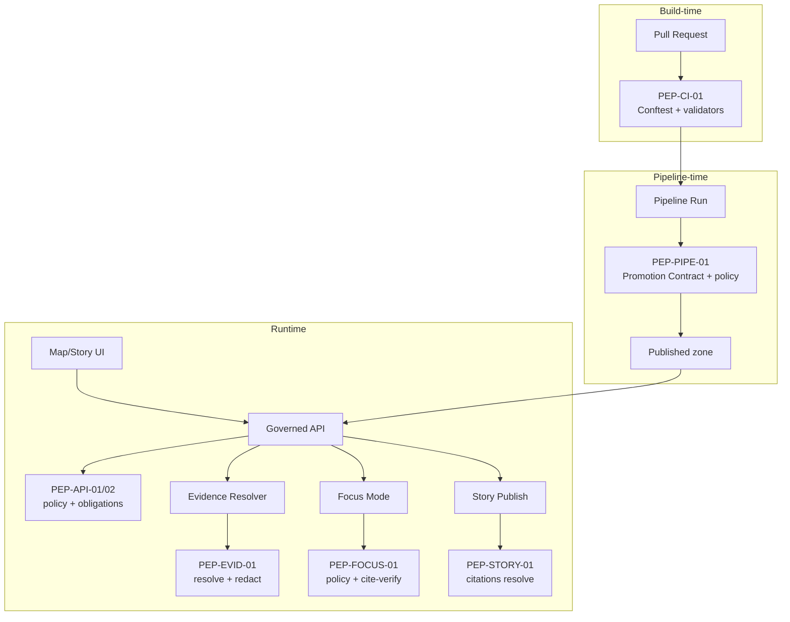

<!-- [KFM_META_BLOCK_V2]
doc_id: kfm://doc/656f8780-2f36-46ea-a85e-7dc9e019daf3
title: Policy Enforcement Points
type: standard
version: v1
status: draft
owners: KFM Governance
created: 2026-03-02
updated: 2026-03-02
policy_label: public
related:
  - TODO: link to policy pack entrypoint (rego)
  - TODO: link to Promotion Contract / Review Gates
  - TODO: link to Evidence Resolver contract
tags: [kfm, governance, policy, pep, pdp, opa, rego]
notes:
  - Defines where policy MUST be enforced and what "fail closed" means at each boundary.
[/KFM_META_BLOCK_V2] -->

# Policy Enforcement Points


**Purpose:** Map **where** governance policy is enforced (the enforcement points) across CI, pipelines, APIs, evidence resolution, and UI—so we can test coverage and prevent trust-membrane bypass.

> **Non-goal:** This doc does *not* specify network hardening details (those belong in infra runbooks and may be restricted).

---

## Navigation

- [Definitions](#definitions)
- [North-star invariants](#north-star-invariants)
- [PEP inventory](#pep-inventory)
- [Standard decision contract](#standard-decision-contract)
- [Coverage matrix](#coverage-matrix)
- [Failure modes and fail-closed behavior](#failure-modes-and-fail-closed-behavior)
- [Testing and CI gates](#testing-and-ci-gates)
- [Change management](#change-management)
- [Appendix: implementation templates](#appendix-implementation-templates)

---

## Definitions

**PDP (Policy Decision Point)**  
A component that evaluates a policy query and returns a structured decision (e.g., allow/deny + obligations). In KFM, this is typically OPA (Open Policy Agent) running in-process or as a sidecar.

**PEP (Policy Enforcement Point)**  
A boundary where the system must **call the PDP and enforce the result**. PEPs are where we prevent “policy bypass,” not where we *declare* policy.

**Obligations**  
Additional required actions returned by policy that the caller must enforce (e.g., redact coordinates, generalize geometry, include license attribution, show a UI notice, prevent export, etc.).

**Policy label**  
A coarse classification used for default filtering and redaction logic. Examples commonly used in KFM docs include `public`, `public_generalized`, and `restricted`.

---

## North-star invariants

These are the “do not compromise” rules this mapping exists to protect:

1. **Trust membrane:** clients and UI must not access storage/databases directly; all access is mediated by governed APIs and policy checks.
2. **Shared semantics:** CI and runtime must evaluate the same policy logic (or at minimum the same fixtures with identical outcomes).
3. **Default deny:** in the absence of an explicit allow decision, the system denies.
4. **No existence leaks:** deny responses must not reveal restricted dataset presence/metadata (including in error messages).
5. **Evidence-first:** anything presented as “truth” in UI/Story/Focus Mode must map back to EvidenceRefs that can be resolved and policy-checked.

---

## PEP inventory

The table below is the **minimum PEP set** that should exist in any build.

> TIP: Treat this as a registry. When adding a new user-facing surface or export path, add a row and add tests.

| PEP ID | Boundary | Typical caller | What it protects | Enforced via | Audit artifact |
|---|---|---|---|---|---|
| **PEP-CI-01** | **Pull request / CI gate** | GitHub Actions / CI runner | Prevents merging non-compliant data/contracts/policy changes | Conftest/OPA, schema validators | CI logs + required checks |
| **PEP-PIPE-01** | **Promotion / publish gate** | Pipeline runner / operator tools | Prevents RAW/WORK artifacts from becoming PUBLISHED without required metadata, QA, and rights | Promotion Contract checks + policy checks | Run receipt + promotion record |
| **PEP-API-01** | **Runtime API: dataset discovery** | API service | Prevents exposure of restricted datasets/versions by default | Policy filter before responding | API access log + decision_id |
| **PEP-API-02** | **Runtime API: query / tiles / exports** | API service | Prevents data slice leaks; enforces role limits + redaction/generalization | Policy check + obligation enforcement | API access log + decision_id + output hash |
| **PEP-EVID-01** | **Evidence resolver** | Evidence service / API route | Prevents “citation laundering”; enforces redaction obligations before data is shown/cited | Resolve→bundle pipeline with policy | EvidenceBundle digest + audit_ref |
| **PEP-STORY-01** | **Story publish** | Story API / UI publish flow | Prevents publishing narratives with non-resolvable or unauthorized citations | “All citations resolve” hard gate | Publish receipt + review state |
| **PEP-FOCUS-01** | **Focus Mode ask** | Focus orchestrator | Prevents hallucinations and restricted leakage in answers | Policy pre-check + hard citation verification | Focus run receipt + output hash |
| **PEP-UI-01** | **UI trust surfaces** | UI runtime | Prevents UI from becoming a policy bypass vector | No direct storage; show badges/notices only | Client telemetry (non-sensitive) |

### Visual map



---

## Standard decision contract

To make policy portable across PEPs, each enforcement call should conform to a standard input/output contract.

### Policy input (minimum)

| Field | Meaning | Notes |
|---|---|---|
| `user.role` | role/actor class | public / contributor / steward / operator, etc. |
| `action` | requested capability | `discover`, `read`, `query`, `export`, `publish_story`, `resolve_evidence`, ... |
| `resource.kind` | resource class | dataset, dataset_version, story, evidence_ref, tile, export_job |
| `resource.policy_label` | classification label | used for default rules and obligations |
| `context` | request context | bbox/time window, view_state, environment, etc. |

### Policy output (minimum)

| Field | Meaning |
|---|---|
| `decision` | `allow` or `deny` (default deny) |
| `decision_id` | stable reference for audit and debugging |
| `obligations[]` | required extra steps (redact/generalize/notice/attribution/deny export/etc.) |
| `reason_codes[]` | machine-friendly reasons (avoid leaking details) |

---

## Coverage matrix

This matrix helps spot bypass routes. Every **data egress** path must traverse a PEP.

Legend: ✅ = enforced; 🚫 = must not exist; ⚠️ = allowed only with strict controls.

| Surface / action | Discover (list) | Query (bbox/time) | Tile | Download / Export | Cite / Evidence | Publish story | Focus Q&A |
|---|---:|---:|---:|---:|---:|---:|---:|
| CI (repo content) | ✅ PEP-CI-01 | ✅ | ✅ | ✅ | ✅ | ✅ | ✅ |
| Pipeline promotion | ⚠️ | ⚠️ | ⚠️ | ⚠️ | ✅ (PROV/receipts) | ⚠️ | ⚠️ |
| Runtime API | ✅ PEP-API-01 | ✅ PEP-API-02 | ✅ PEP-API-02 | ✅ PEP-API-02 | ✅ PEP-EVID-01 | ✅ PEP-STORY-01 | ✅ PEP-FOCUS-01 |
| UI | 🚫 | 🚫 | 🚫 | 🚫 | ✅ (render only) | ✅ (initiate only) | ✅ (initiate only) |
| Storage / DB direct | 🚫 | 🚫 | 🚫 | 🚫 | 🚫 | 🚫 | 🚫 |

---

## Failure modes and fail-closed behavior

### “Fail closed” means

- If the PDP is unreachable, returns an error, or the decision is missing: **deny**.
- If obligations cannot be satisfied (e.g., redaction transform fails): **deny**.
- If an EvidenceRef cannot be resolved to a policy-allowed EvidenceBundle: **deny / abstain** (do not “best-effort cite”).

### Common bypass risks (and required mitigations)

- **Direct DB/storage access** from UI or non-governed services (trust membrane violation).
- **Caching leaks** where public caches store restricted tiles/results.
- **Metadata leaks** through error messages (403 vs 404) or timing.

> WARNING: If you can’t prove a route is covered by a PEP and tests, treat it as **not governed**.

---

## Testing and CI gates

### Required test layers

- **Policy unit tests (fixtures):** allow/deny + obligations for key roles and labels.
- **Conftest gates in CI:** policy + schema checks must block merges.
- **Integration tests:** each API route that returns data must demonstrate `deny`, `allow`, and `allow + obligations`.
- **E2E tests:** UI must fetch through governed API only; evidence drawer must not render restricted fields for a public user.
- **Focus Mode evaluation harness:** regression tests for citation resolvability, refusal correctness, and leakage prevention.

### Minimum “done” checklist for a new PEP

- [ ] Boundary documented with a PEP ID.
- [ ] PDP input/output contract implemented.
- [ ] Fail-closed behavior verified (including PDP outage).
- [ ] Obligations enforced and tested.
- [ ] Audit record produced with `decision_id`.
- [ ] CI includes a required check that covers this path.

---

## Change management

Policy changes are production changes.

- Treat policy packs as **versioned, reviewed artifacts**.
- Any change that expands access or reduces redaction requires a steward review and (ideally) a short ADR.
- Maintain a rolling set of **golden fixtures** and **golden Focus queries** so regressions are visible and block merges.

---

## Appendix: implementation templates

### A. PEP wrapper pseudo-interface

```ts
type PolicyInput = {
  user: { role: string; id?: string };
  action: string;
  resource: { kind: string; id?: string; policy_label?: string };
  context?: Record<string, unknown>;
};

type PolicyDecision = {
  decision: "allow" | "deny";
  decision_id: string;
  obligations: Array<{ type: string; params?: Record<string, unknown> }>;
  reason_codes: string[];
};

async function enforce(input: PolicyInput): Promise<PolicyDecision> {
  // 1) call PDP
  // 2) if error/missing → deny
  // 3) return decision + obligations
}
```

### B. Obligation types (starter list)

| Obligation type | Enforced by | Typical use |
|---|---|---|
| `redact_fields` | Evidence resolver / API | Remove sensitive attributes from responses |
| `generalize_geometry` | API / tile pipeline | Reduce coordinate precision / simplify geometry |
| `show_notice` | UI | Display “why” a layer is generalized or limited |
| `require_attribution` | Export service / UI | Attach license and attribution automatically |
| `deny_export` | API | Prevent downloading even if browsing is allowed |

### C. Quick glossary for reviewers

- **PDP**: decides (OPA/Rego)
- **PEP**: enforces (CI, API, evidence resolver, publish, etc.)
- **Obligations**: required extra steps (redaction/generalization/etc.)
- **Trust membrane**: “no direct storage/DB access by clients”

[Back to top](#policy-enforcement-points)
