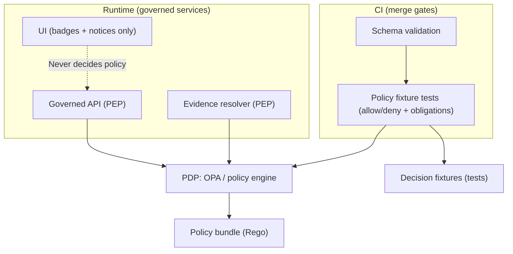

<!-- [KFM_META_BLOCK_V2]
doc_id: kfm://doc/7a862cf4-5dd3-4dba-87fb-48f681d0ac78
title: Policy code locations
type: standard
version: v1
status: draft
owners: KFM Governance Stewards
created: 2026-03-02
updated: 2026-03-02
policy_label: public
related:
  - docs/governance/ROOT_GOVERNANCE.md
  - docs/governance/ETHICS.md
  - docs/governance/SOVEREIGNTY.md
  - docs/governance/safety_checks.md
  - docs/governance/policy/README.md
tags: [kfm, governance, policy, policy-as-code, mapping]
notes:
  - This file is an index of *expected* policy-as-code locations and policy enforcement points (PEPs).
  - Treat any “Expected” paths as **verify-in-repo**; do not assume they exist without checking.
[/KFM_META_BLOCK_V2] -->

# Policy code locations
**One-line purpose:** A single index of where KFM policy-as-code artifacts live (and where they are enforced) so contributors can make safe, reviewable changes.

---

## Quick navigation
- [Why this file exists](#why-this-file-exists)
- [Policy surfaces and trust membrane](#policy-surfaces-and-trust-membrane)
- [Repository map](#repository-map)
- [How to change policy safely](#how-to-change-policy-safely)
- [Minimum verification checklist](#minimum-verification-checklist)
- [Appendix: glossary](#appendix-glossary)

---

## Why this file exists

KFM treats **policy as code**: access decisions, licensing gates, and redaction obligations must be enforceable in both:
- **CI** (to prevent unsafe merges), and
- **Runtime** (to prevent unsafe responses).

This document is **not** a replacement for policy specs, rubrics, or governance decisions. It is only a **map**:
- “Where do I put the policy rule?”
- “Where do I put the fixtures/tests?”
- “Where is the enforcement point (PEP) that must call the policy engine?”

> **WARNING**
> This is an index of **expected** locations. Some paths below are documented targets but may not exist in the live repo.
> Use the [Minimum verification checklist](#minimum-verification-checklist) before relying on any location.

---

## Policy surfaces and trust membrane

### Policy decision and enforcement model

KFM’s recommended policy-as-code pattern separates:
- **PDP (Policy Decision Point):** the policy engine (e.g., OPA) that evaluates rules.
- **PEPs (Policy Enforcement Points):** places that *must* call the PDP before allowing data to move or be served.

### Default-deny posture and redaction obligations

Operational posture (as a rule of thumb):
- default deny for restricted/sensitive-location datasets,
- do not leak restricted metadata in error responses,
- treat redaction/generalization as a first-class, recorded transform.

> **NOTE**
> This file does not define those rules; it points you to where the rules *should* be implemented and tested.

---

## Repository map

### Legend

- **Source documented:** This path/location is explicitly described in KFM design/plan documents.
- **Expected (verify):** Reasonable target location, but confirm it exists in the repo before coding against it.
- **Unknown:** Needs repo verification; do not assume.

### A. Policy bundles (Rego / OPA)

| Location (path) | What lives here | Status | What must NOT live here |
|---|---|---|---|
| `policy/` | Root for policy-as-code bundles (OPA/Rego or equivalent). Subfolders by domain (license, sensitivity, access). | **Expected (verify)** | App/service code; secrets; dataset payloads. |
| `policy/license/*.rego` | License allow/deny rules + policy decisions that “fail closed” for unknown/unclear rights. | **Source documented** | “Soft warnings only” logic for licensing. Licensing must be enforceable. |
| `policy/sensitivity/*.rego` | Sensitivity classification and redaction obligations (generalize geometry, strip fields, etc.). | **Expected (verify)** | Narrative content; one-off story exceptions. |
| `policy/access/*.rego` | Role-based access rules (public vs contributor vs steward etc.), request context extraction rules. | **Expected (verify)** | UI-only logic or client-side enforcement. |
| `policy/README.md` | What policies exist, how to run tests, how to add rules safely. | **Expected (verify)** | Detailed policy rationale (belongs in governance docs/ADRs). |

### B. Policy fixtures, golden tests, and CI gates

| Location (path) | What lives here | Status | Notes |
|---|---|---|---|
| `policy/fixtures/` | Input contexts + expected decisions (allow/deny + obligations). | **Expected (verify)** | Keep fixtures minimal; avoid real secrets/keys. |
| `policy/tests/` or `tests/policy/` | Test runner wiring (opa test, rego unit tests, fixture harness). | **Expected (verify)** | Tests must be deterministic. |
| `.github/workflows/` | CI workflows that *block merges* on policy regressions. | **Expected (verify)** | Policy gates should be “required checks.” |
| `.github/actions/` | Reusable CI actions for secure ingestion and attestations. | **Source documented** | Avoid writing ad-hoc scripts per dataset if an action exists. |

### C. Runtime enforcement points (PEPs)

> **Goal:** every governed service that can reveal data must call the policy engine before serving.

| Enforcement point | Typical code home | Status | “Fail closed” expectation |
|---|---|---|---|
| Governed API PEP | `apps/api/**` or `packages/api/**` | **Unknown (needs repo verification)** | deny if policy engine unavailable; deny if label unknown. |
| Evidence resolver PEP | `apps/api/**` or `packages/evidence/**` | **Unknown (needs repo verification)** | deny if evidence cannot be resolved *or* is not policy-allowed. |
| Pipeline promotion gate | `scripts/`, `tools/`, or `packages/ingest/**` | **Expected (verify)** | block promotion without license + sensitivity + obligations. |
| UI policy display | `apps/ui/**` | **Unknown (needs repo verification)** | UI shows badges/notices but never makes access decisions. |

### D. Adjacent “policy-relevant” locations (inputs & outputs)

These are not policy code, but policy often depends on them:

| Location (path) | Why it matters for policy | Status |
|---|---|---|
| `docs/governance/safety_checks.md` | Checklist/guardrails for sensitive layers and narratives. | **Source documented** |
| `tools/validation/catalog/` | Catalog validators that help enforce “no broken evidence links” and strict triplet contracts. | **Source documented** |
| `prov/templates/run.jsonld` | Run receipt/provenance template; policy decisions and redactions should be recorded. | **Source documented** |
| `docs/ops/watchers/registry.yml` | Operational registry of update watchers; policy may constrain auto-promotion. | **Source documented** |
| `data/_staging/by-digest/sha256/...` | Content-addressed staging to prevent mutation and support auditability. | **Source documented** |

---

## How to change policy safely

### Change types

1) **Rule-only change** (Rego change, same inputs/outputs)  
2) **Contract change** (new policy label, new obligations schema, new context fields)  
3) **Enforcement change** (moving a PEP boundary, adding a new governed endpoint)

### Required “Definition of Done” for policy changes

- [ ] Update the relevant **Rego** rule(s) (or equivalent policy language).
- [ ] Add/modify **fixtures** covering:
  - [ ] allow case(s)
  - [ ] deny case(s)
  - [ ] obligations case(s) (redaction/generalization/attribution requirements)
- [ ] Ensure **CI runs the same semantics** as runtime (same fixtures and outcomes).
- [ ] Update this mapping file if any path/convention changes.
- [ ] Steward/policy engineer review is recorded (per governance workflow).

> **TIP**
> Prefer small, reversible policy PRs. Avoid “policy + refactor + data changes” in one PR.

---

## Minimum verification checklist

Run these checks in the live repo before assuming paths exist:

- [ ] Capture repo commit hash: `git rev-parse HEAD`
- [ ] Capture directory tree: `tree -L 3`
- [ ] Confirm policy bundle location(s): search for `*.rego` and `opa` usage.
- [ ] Confirm CI gates: inspect `.github/workflows` for required checks that run policy tests.
- [ ] Confirm enforcement points:
  - [ ] API calls PDP before serving restricted assets
  - [ ] Evidence resolver calls PDP before returning evidence bundles
  - [ ] UI cannot bypass the governed API (network policy + code review)
- [ ] Record results in an audit-friendly note/PR comment (paths, commands, outputs).

---

## Appendix: glossary

- **OPA:** Open Policy Agent.
- **Rego:** OPA’s policy language.
- **PDP:** Policy Decision Point (evaluates policy).
- **PEP:** Policy Enforcement Point (must call PDP before allowing/serving).
- **Obligations:** Required transforms or constraints attached to an allow decision (e.g., redact fields, generalize geometry, attach attribution).

---

### Back to top
[↑ Back to top](#policy-code-locations)
