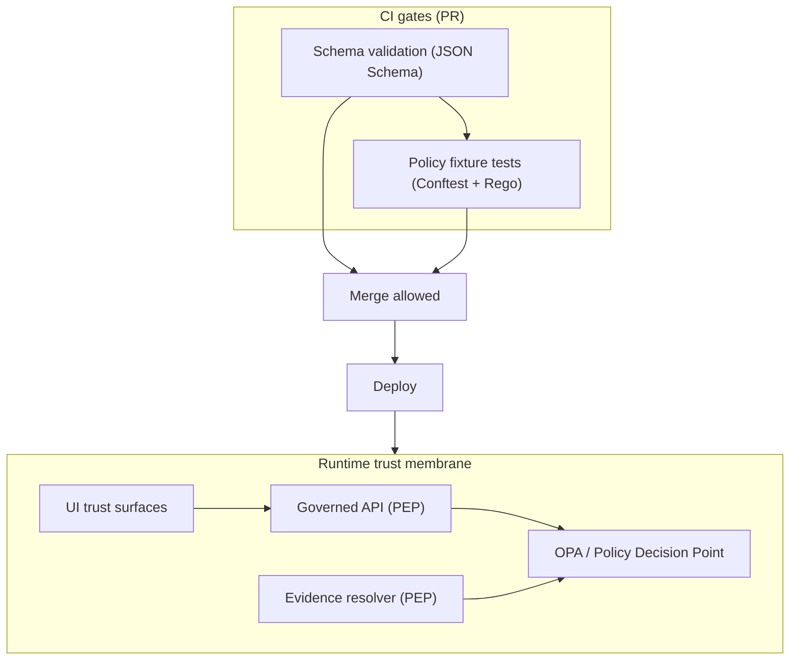

<!-- [KFM_META_BLOCK_V2]
doc_id: kfm://doc/2e0e0c33-5d20-4a4d-9c33-915b5dd1b6e1
title: Policy Schemas
type: standard
version: v1
status: draft
owners: KFM Governance / Stewardship
created: 2026-03-02
updated: 2026-03-02
policy_label: public
related:
  - ../../../../policy
  - ../../../../contracts
  - ../README.md
tags: [kfm, governance, policy, schemas, json-schema]
notes:
  - Canonical schemas for policy-facing artifacts and policy-controlled contracts.
  - “Fail closed” posture: invalid or ambiguous artifacts must block promotion/publishing.
[/KFM_META_BLOCK_V2] -->

# 🛡️ Policy Schemas
_Contract surfaces for governance-by-construction (policy labels, obligations, decision records, and policy-facing payload shapes)._


> **NOTE (KFM posture):** In KFM, “citations” are *EvidenceRefs* that must resolve through an evidence resolver and be policy-allowed—otherwise the system narrows scope or abstains.  
> This directory exists so policy-related payloads are *typed, testable, and enforceable* (in CI and runtime).

---

## Quick navigation
- [Purpose](#purpose)
- [Where this fits](#where-this-fits)
- [Directory contract](#directory-contract)
- [Schema conventions](#schema-conventions)
- [Schema registry](#schema-registry)
- [Validation & CI](#validation--ci)
- [Change control](#change-control)
- [Definition of done](#definition-of-done)
- [FAQ](#faq)

---

## Purpose

This directory defines the **canonical schema contracts** for governance/policy artifacts so that:

1. **CI and runtime share the same semantics** (policy-as-code must behave the same in PR gates and in the deployed system).
2. **Promotion and publishing can fail closed** when policy metadata is missing, malformed, or ambiguous.
3. **Policy labels + obligations** are machine-checkable inputs to redaction/generalization and access enforcement.

### Tagging legend
- **CONFIRMED**: Required by the KFM vNext governance posture and contracts.
- **PROPOSED**: A repo convention that may be adjusted to match actual tooling/layout.

---

## Where this fits

KFM requires the same policy semantics in CI and runtime, enforced via a Policy Decision Point (PDP) and multiple Policy Enforcement Points (PEPs) (CI, runtime API, evidence resolver).  



---

## Directory contract

### ✅ What belongs here
- **JSON Schemas** for policy-facing artifacts (e.g., policy decision records, obligations, policy label fields, inputs to PDP evaluation).
- **Schema profiles** that constrain generic objects into KFM-safe shapes (e.g., “policy section” embedded in receipts/manifests).
- **Examples/fixtures** (at minimum: 1 valid + 1 invalid per schema) suitable for CI validation.
- **Short schema-specific docs** (optional) explaining invariants, edge-cases, and redaction obligations.

### ❌ What must not go here
- OPA/Rego policy code (belongs under `policy/`).
- Secrets, credentials, tokens, API keys (never commit).
- Dataset payload schemas (these belong to dataset/domain schema locations, typically `contracts/` or `data/`-scoped schema dirs).
- “One-off” ad-hoc JSON without a schema + examples.

---

## Schema conventions

### Draft and strictness (**CONFIRMED intent; exact tooling may vary**)
**PROPOSED repo rule:** Use JSON Schema **Draft 2020-12** and default to:
- `"additionalProperties": false`
- explicit `"required": [...]`
- stable `$id` URLs
- versioned filenames and/or a version field in the payload

### Naming (**PROPOSED**)
- `*.schema.json` for schemas
- `v1/`, `v2/` folders for breaking versions
- `examples/*.valid.json` and `examples/*.invalid.json` fixtures

### Policy labels and obligations (**CONFIRMED intent; exact enums depend on governance**)
Schema fields should support:
- `policy_label` (e.g., `public`, `restricted`, `public_generalized`)
- `obligations` (e.g., “generalize geometry”, “remove fields”, “show notice”)
- `decision_id` or similar stable decision reference
- a consistent “embedded policy block” shape used across receipts/manifests/evidence bundles

---

## Schema registry

> **PROPOSED:** Update this table as schemas are added/moved. The goal is to make every policy-facing artifact discoverable and reviewable.

| Schema (concept) | Target file path | Version | Purpose | Typical consumers |
|---|---|---:|---|---|
| Policy block (embedded) | `v1/policy_block.schema.json` | v1 | Normalized `{policy_label, decision_id, obligations}` shape embedded in other artifacts | CI gates, pipelines, API DTOs |
| Obligation | `v1/obligation.schema.json` | v1 | Typed obligations used to drive redaction/generalization + UI notices | Policy engine, pipelines, UI |
| Policy decision record | `v1/policy_decision.schema.json` | v1 | Captures allow/deny outcome + applied obligations for auditability | Evidence resolver, audit ledger |
| PDP input context | `v1/pdp_input.schema.json` | v1 | Enforces shape of `input.user`, `input.action`, `input.resource` | OPA/Rego fixtures, runtime checks |

---

## Validation & CI

### Minimum checks (**CONFIRMED intent**)
- Schemas **compile** (no invalid `$ref`, no invalid keywords).
- Each schema has **valid + invalid** examples.
- CI blocks merge on invalid examples.
- Policy tests (Rego) run with fixtures and block merges.

### Local validation (**PROPOSED command placeholders**)
> Replace these with the repo’s actual scripts once confirmed.

```bash
# (PROPOSED) 1) compile schemas
npm run kfm:schema:check

# (PROPOSED) 2) validate examples
npm run kfm:schema:validate

# (PROPOSED) 3) run policy fixture tests
conftest test policy/ -p policy/rego -d policy/fixtures
```

---

## Change control

### Backward-compatible changes (same major version)
Examples:
- adding optional fields
- loosening string patterns (rare; requires steward review)
- adding new obligation types *without* changing existing meaning

### Breaking changes (new major version)
Examples:
- renaming required fields
- changing enum meaning for `policy_label`
- changing obligation semantics

**PROPOSED process:**
1. Create `v2/` schema(s)
2. Add new examples/fixtures
3. Update policy pack fixtures/tests to accept both as needed
4. Add a migration note (and a kill-switch / deny-by-default rule if ambiguity would leak data)

---

## Definition of done

**A schema PR is “done” only if:**
- [ ] Schema uses agreed draft + strictness defaults
- [ ] `additionalProperties` posture is explicit
- [ ] At least **1 valid** and **1 invalid** example added
- [ ] CI fails on invalid examples (and passes on valid ones)
- [ ] Policy tests updated if they depend on the schema shape
- [ ] No sensitive details introduced (no precise restricted locations; no secrets; no “metadata leaks” via error shaping)
- [ ] Schema registry table updated

---

## FAQ

### Why do we keep schemas in docs?
Because governance needs **human review** as much as machine enforcement. Keeping schemas here makes them easy to discuss in PR review, and keeps the “why” close to the “what.”

### Do schemas replace Rego policy?
No. Schemas constrain *shape*; Rego constrains *meaning* (allow/deny + obligations). Both are required for fail-closed governance.

### What if a schema is missing for a new policy artifact?
Fail closed: do not ship, do not publish, do not promote. Add the schema + fixtures first.

---

<details>
<summary>Appendix: Target directory layout (PROPOSED)</summary>

```text
docs/governance/policy/schemas/                          # Policy schemas (versioned) + examples for validation and docs
├─ README.md                                             # Index, versioning rules, $id conventions, and how CI validates schemas/examples
│
├─ v1/                                                   # Schema version v1 (stable; referenced by fixtures/tools/contracts)
│  ├─ policy_block.schema.json                           # Schema for embedded policy blocks (labels/rights/obligations metadata)
│  ├─ obligation.schema.json                             # Schema for one obligation (type + params + applicability + enforcement notes)
│  ├─ policy_decision.schema.json                        # Schema for decision envelope (allow/deny/obligations/reason codes; policy-safe)
│  └─ pdp_input.schema.json                              # Schema for PDP input context (user/action/resource + request context)
│
└─ examples/                                             # Example instances (policy-safe; used in docs/tests)
   ├─ policy_block.valid.json                            # Valid policy_block example (should pass schema)
   ├─ policy_block.invalid.json                          # Invalid policy_block example (should fail; demonstrates enforcement)
   ├─ obligation.valid.json                              # Valid obligation example (should pass)
   └─ obligation.invalid.json                            # Invalid obligation example (should fail)
```

</details>

---

_Back to top_: [↑](#-policy-schemas)
