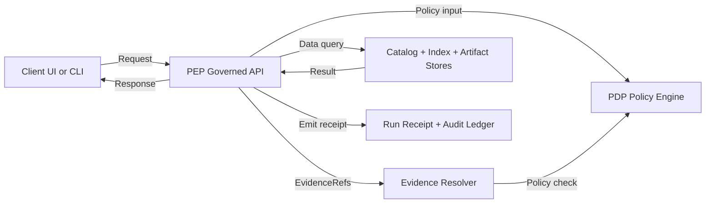

<!-- [KFM_META_BLOCK_V2]
doc_id: kfm://doc/6a1a1b84-efc6-4c4d-9f9c-6c3c4a8a0b2d
title: Policy Test Plan
type: standard
version: v1
status: draft
owners: Governance WG; Security WG; Platform Maintainers (TBD)
created: 2026-03-02
updated: 2026-03-02
policy_label: internal
related:
  - docs/governance/policy/README.md
  - docs/governance/promotion-contract/README.md
  - docs/governance/evidence/README.md
tags: [kfm, governance, policy, testplan, opa, rego, conftest]
notes:
  - Defines the fail-closed test strategy for the trust membrane, policy labels, and obligation enforcement.
  - Treat this as “production”: change-controlled, reviewable, and CI-enforced.
[/KFM_META_BLOCK_V2] -->

# Policy Test Plan
**Purpose:** define how KFM policy-as-code is tested (CI + runtime parity) so the trust membrane and evidence-first UX are enforceable, auditable, and regression-safe.


---

## Quick navigation
- [Why this exists](#why-this-exists)
- [Where this fits](#where-this-fits)
- [What belongs here](#what-belongs-here)
- [Policy testing invariants](#policy-testing-invariants)
- [Test suite layers](#test-suite-layers)
- [Test matrix](#test-matrix)
- [Fixture contract](#fixture-contract)
- [How to add a policy test](#how-to-add-a-policy-test)
- [CI gates](#ci-gates)
- [Troubleshooting](#troubleshooting)
- [References](#references)

---

## Why this exists

KFM governance is only real if it is **enforced by tests** that fail closed. “Policy intent” becomes runtime behavior through:
- Promotion gates (including **Gate F: policy tests + contract tests**).
- The governed API boundary (PEP).
- Evidence resolution gates (policy-allowed citations only).
- Obligations (redaction/generalization/attribution) that must be applied consistently.

> **Non-negotiable:** CI and runtime must share the same policy semantics (or at minimum the same fixtures and expected outcomes). Otherwise CI guarantees are meaningless.  
> See: [Policy testing invariants](#policy-testing-invariants).

---

## Where this fits

This directory documents and hosts the policy test plan for:

- **PDP** (Policy Decision Point): e.g., OPA/Rego or equivalent engine.
- **PEPs** (Policy Enforcement Points): CI checks, runtime API checks, evidence resolver checks.
- **Obligations**: transformations or constraints that must be applied when access is allowed (or partially allowed).

**Repo location:** `docs/governance/policy/testplan/`

---

## What belongs here

### Acceptable inputs
- Policy test plan docs (this README + supporting docs).
- Test fixtures (request contexts, dataset metadata stubs, EvidenceRef stubs, expected decisions).
- Golden decision outputs (allow/deny + obligations).
- “Policy regression” case files for previously-fixed bugs.

### Exclusions
- ❌ Real user tokens, secrets, API keys, or live credentials.
- ❌ Any restricted/sensitive raw datasets (use synthetic fixtures).
- ❌ Production audit logs or receipts containing sensitive identifiers.
- ❌ “Quick hacks” that bypass policy evaluation to make tests pass.

---

## Policy decision flow



**Key idea:** the UI may *display* policy, but it must not *decide* policy. All decisive checks happen at enforcement points.

---

## Policy testing invariants

These are “must hold” invariants that the test suite enforces:

1. **CI/runtime parity**
   - The same policy inputs should yield the same allow/deny/obligation outputs in CI and runtime.
   - If runtime uses a compiled/bundled policy, CI must test that same bundle (or produce it deterministically).

2. **Default-deny posture**
   - Unknown dataset, unknown actor, unknown policy label, missing purpose, missing scope → deny (or return metadata-only if explicitly modeled).

3. **No leakage**
   - Deny responses must not leak restricted metadata, existence, or precise sensitive geometry (including via error differences), unless policy explicitly allows.

4. **Obligations are enforceable behavior**
   - An “allow with obligations” decision is invalid unless the enforcement layer demonstrably applies those obligations (redaction, generalization, attribution injection, export blocking, etc.).

5. **Receipts exist for governed runs**
   - Actions that produce user-facing outputs (Story publish, Focus Mode answer, export) should produce a receipt that can be audited (even if the receipt storage is mocked in tests).

---

## Test suite layers

| Layer | Goal | What it proves | Typical tooling (TBD in repo) |
|---|---|---|---|
| Unit: Policy engine | Validate Rego/rules produce expected decisions | rule logic, default-deny, obligations emitted | `opa test`, `conftest` |
| Unit: Obligation library | Validate redaction/generalization functions | obligation execution correctness | language-specific tests |
| Contract: PEP ↔ PDP | Validate the app calls policy correctly | inputs passed, outputs handled | integration tests |
| Contract: Evidence resolver | Validate evidence resolution is gated | EvidenceRefs resolve only when allowed | integration tests |
| E2E: “User journeys” | Validate real flows are governed | Story/Focus/Download/Map interactions | Playwright/Cypress/etc. |

> NOTE: The exact commands and paths depend on the repo’s actual implementation. This plan defines the *required behavior*; wire the tooling accordingly.

---

## Test matrix

Use this matrix as your “minimum credible coverage” checklist.

| Concern | Example policy question | Expected decision shape | Minimum tests |
|---|---|---|---|
| Dataset discovery | “Can actor X list dataset versions?” | allow/deny; filtered list | policy unit + API contract |
| STAC/DCAT browse | “Can actor X see this collection/item?” | allow/deny; possibly generalized bbox | policy unit + resolver contract |
| Artifact download/export | “Can actor X download asset A?” | allow/deny + attribution obligation | policy unit + export contract |
| Map tiles/search | “Can actor X query tiles in region R at time T?” | allow/deny; generalized geometry | policy unit + API contract |
| Evidence resolution | “Can this EvidenceRef resolve?” | allow/deny; redaction obligations | policy unit + resolver contract |
| Story publish | “Can this story be published with these citations?” | deny if any citation unresolved or disallowed | contract + E2E |
| Focus Mode ask | “Can the system answer with verified citations?” | abstain/reduce scope when citations fail | contract + E2E |
| Promotion gate | “Can dataset version promote to PUBLISHED?” | deny unless gates satisfied | gate tests + policy tests |

---

## Fixture contract

All policy tests should use fixtures that match the runtime “policy input” shape.

### Input (example)
```json
{
  "actor": {
    "subject": "user:alice@example.org",
    "roles": ["reader"],
    "org": "org:ks",
    "purpose": "research"
  },
  "request": {
    "action": "catalog.read",
    "resource": {
      "type": "dataset_version",
      "id": "kfm.dataset_version:example.v1"
    }
  },
  "data": {
    "policy_label": "public",
    "sensitivity": {
      "sensitive_location": false
    }
  },
  "context": {
    "now": "2026-03-02T00:00:00Z",
    "client": "ui"
  }
}
```

### Output (example)
```json
{
  "allow": true,
  "reason": "public dataset_version readable by role reader",
  "obligations": [
    {
      "type": "attribution",
      "license_text_required": true
    }
  ],
  "redactions": []
}
```

**Golden rule:** if `allow: true` and obligations exist, tests must verify that the PEP (or resolver) actually applies them.

---

## How to add a policy test

### 1) Add (or update) a fixture
- Create a minimal request context + dataset metadata stub.
- Prefer synthetic IDs and synthetic geometry.
- If testing “sensitive location,” use a toy polygon (not real coordinates).

### 2) Add policy unit tests
- ✅ 1 “allow” case (happy path)
- ✅ 1 “deny” case (default-deny / missing input)
- ✅ 1 “obligation” case (allow + required redaction/generalization/attribution)

### 3) Add contract coverage
- Ensure the enforcement layer:
  - calls policy with the expected input,
  - handles deny without leaking details,
  - applies obligations deterministically.

### 4) Add E2E (when the feature is user-facing)
- For Story/Focus/Download journeys, add an E2E that proves:
  - policy gates trigger,
  - citations must resolve and be allowed,
  - receipts (or mocked receipts) are produced.

---

## CI gates

This directory is “CI-owned”. Merges that touch policy MUST be blocked unless:

- [ ] Policy compiles / bundles deterministically (if bundling exists)
- [ ] Policy unit tests pass (default-deny + obligations + no-leak cases)
- [ ] Contract tests pass (PEP calls policy; resolver gates evidence)
- [ ] Promotion Contract Gate F checks pass (policy + contract tests)
- [ ] Any new policy labels / obligations are documented + tested
- [ ] Review includes governance/security owners (CODEOWNERS or equivalent)

---

## Troubleshooting

- **Tests pass in CI but fail in runtime**
  - Check policy bundle/version mismatch.
  - Ensure runtime is not using stale policy artifacts.

- **Allow decisions but obligations not applied**
  - Treat as a failing build. Fix enforcement or remove the obligation.

- **Deny behavior leaks existence**
  - Normalize deny responses, including error messages and status codes, per policy guidance.

---

## References

These are the primary governance sources for this plan:
- KFM “Definitive Design & Governance Guide (vNext)” (policy-as-code, promotion gates, catalogs, evidence).
- “Tooling the KFM pipeline” (promotion gates, evidence resolution contract, Focus Mode receipt loop).

> TODO: add stable repo-relative links once the canonical doc locations are confirmed.
