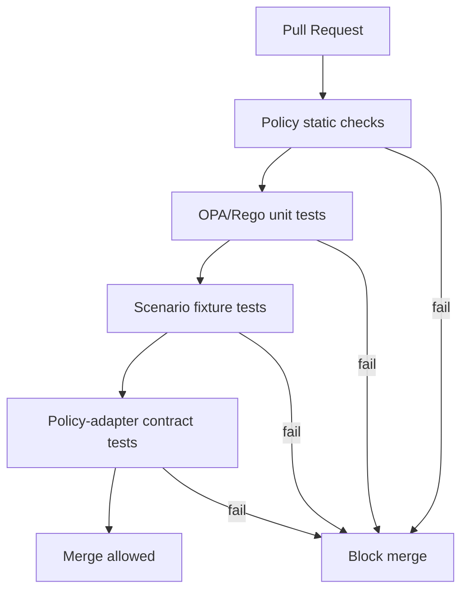

<!-- [KFM_META_BLOCK_V2]
doc_id: kfm://doc/82eef459-7030-4fe3-a095-b1d1b9f6bfa4
title: CI Policy Tests
type: standard
version: v1
status: draft
owners: KFM Governance (TODO: set CODEOWNERS)
created: 2026-03-02
updated: 2026-03-02
policy_label: public
related:
  - docs/governance/policy/README.md
  - docs/governance/policy/testplan/
  - policy/
  - .github/workflows/  # TODO: link to specific workflow(s) once confirmed
tags: [kfm, governance, policy, ci, testplan]
notes:
  - Defines CI gates for policy-as-code (OPA/Rego) and policy-adjacent contract checks.
  - Written to be fail-closed: when in doubt, deny and require explicit fixtures/tests.
[/KFM_META_BLOCK_V2] -->

# CI Policy Tests
Policy-as-code CI gates that keep the **trust membrane** enforceable and regression-resistant.


 <!-- TODO: replace with workflow badge -->


**Primary audience:** policy authors, API maintainers (PEP), evidence resolver maintainers, CI owners.

**Core requirement:** CI must evaluate **the same policy semantics** the runtime evaluates. If CI and runtime diverge, CI guarantees are meaningless.

---

## Navigation
- [Scope](#scope)
- [Non-goals](#non-goals)
- [System invariants](#system-invariants)
- [CI gate overview](#ci-gate-overview)
- [Test suites](#test-suites)
- [Policy decision contract](#policy-decision-contract)
- [Fixtures](#fixtures)
- [Coverage matrix](#coverage-matrix)
- [Adding or changing policy](#adding-or-changing-policy)
- [Local runs](#local-runs)
- [Failure triage](#failure-triage)
- [Definition of done](#definition-of-done)
- [Appendix: recommended directory layout](#appendix-recommended-directory-layout)

---

## Scope
This document specifies the **minimum CI checks** that MUST run (and block merges) for changes that touch:

- OPA/Rego policy bundles (authorization, redaction, obligations).
- Policy fixtures and tests.
- Policy adapters (Policy Enforcement Points) that shape input/output for the Policy Decision Point.
- Contract surfaces that depend on policy outputs (e.g., EvidenceBundle `policy` block, error models).

> NOTE: This is a *test plan* and gate definition. It is intentionally written so it can be implemented with
> different tooling (OPA CLI, Conftest, custom harness), as long as the semantics and fixtures match.

---

## Non-goals
- End-to-end UI testing (belongs in e2e suites).
- Performance benchmarking (belongs in perf/ops suites).
- Data QA for specific datasets (belongs in pipeline promotion gates).
- Penetration testing (belongs in security testing programs).

---

## System invariants
The CI policy test gates exist to preserve the following invariants:

1. **Default deny**: policy must deny unless an explicit allow rule applies.
2. **No bypass**: clients and tools do not access storage directly; access goes through a governed API (PEP).
3. **Obligations are enforced**: allow/deny is not enough; required redactions/notices/export restrictions must be emitted and honored.
4. **Fail closed on uncertainty**: unknown labels/roles/actions -> deny, not allow.
5. **No restricted leakage in errors**: denial responses must not leak restricted metadata.

---

## CI gate overview



---

## Test suites
All suites below are **required status checks** on protected branches.

> IMPORTANT: Workflow names/commands are placeholders until confirmed from `.github/workflows/`.
> Update this file once the repo wiring is verified.

| Gate | What it protects | What MUST be true | Typical tool(s) | Example command (PROPOSED) | Blocks merge |
|---|---|---|---|---|---|
| G1 | Syntax + formatting | Rego parses; formatting is stable | `opa fmt`, linter | `opa fmt -w policy/` | ✅ |
| G2 | Compilation | Bundle compiles; no missing imports | `opa check` | `opa check policy/` | ✅ |
| G3 | Unit tests | Explicit allow/deny and obligation behavior is covered | `opa test` | `opa test policy/ -v` | ✅ |
| G4 | Scenario fixtures | Realistic request contexts produce expected decisions | custom harness / `opa eval` | `opa test policy/fixtures -v` (or harness) | ✅ |
| G5 | Contract tests | PEP→PDP input shape + PDP output shape remain compatible | unit tests in API/evidence code | `pnpm test -F policy-adapter` (example) | ✅ |
| G6 | Regression canaries | Known historical failures remain fixed | snapshot tests | `...` | ✅ |

### Minimum set of scenarios
Each merge that modifies policy MUST keep (and ideally extend) scenarios covering:

- **Roles**: public, contributor, steward/reviewer, operator (and any org-specific roles).
- **policy_label** (starter): public, public_generalized, restricted, restricted_sensitive_location, internal, embargoed, quarantine.
- **Actions**: read, search, download/export, publish, promote, resolve_evidence.
- **Surfaces**: dataset discovery, STAC browse/query, evidence resolve, story publish, Focus Mode ask.

---

## Policy decision contract
This contract defines the **shape** that fixtures and adapters MUST adhere to.

### Input contract (minimum)
Policy evaluation input MUST include:

- `input.user`: authenticated identity and role(s)
- `input.action`: the operation being attempted (string enum)
- `input.resource`: the governed target (dataset/story/evidence/artifact), including:
  - `policy_label`
  - stable identifiers (e.g., dataset_version_id) when available
  - optional sensitivity flags (e.g., sensitive_location)

### Output contract (minimum)
Policy evaluation output MUST include:

- `allow`: boolean (default false)
- `obligations`: array of typed objects (possibly empty), e.g.:
  - `{ "type": "redact_fields", "fields": [...] }`
  - `{ "type": "generalize_geometry", "precision": "coarse" }`
  - `{ "type": "show_notice", "message": "..." }`
  - `{ "type": "require_attribution", "license": "..." }`

> RULE: If `allow == true` but obligations are required by policy, those obligations MUST be present.
> Missing obligations is a policy bug and must fail tests.

---

## Fixtures
Fixtures are the living examples of policy semantics and the fastest way to prevent regressions.

### Fixture rules
- Fixtures MUST be **synthetic** (no real sensitive coordinates, secrets, or PII).
- Fixtures MUST be **minimal**: include only the fields used by policy rules.
- Fixtures MUST be **versioned**: if the input/output contract changes, update fixtures and add a contract test.

### Recommended fixture categories
- `users/` — representative user roles and identity shapes
- `resources/` — datasets, stories, evidence refs, artifacts with policy labels
- `requests/` — composed evaluation inputs for scenario tests

---

## Coverage matrix
This is the minimum coverage we expect before promotion to protected branches.

| Role \\ Label | public | public_generalized | restricted | restricted_sensitive_location | internal | embargoed | quarantine |
|---|---:|---:|---:|---:|---:|---:|---:|
| public | ✅ allow read | ✅ allow read + obligations | ❌ deny | ❌ deny | ❌ deny | ❌ deny | ❌ deny |
| contributor | ✅ allow read | ✅ allow read + obligations | ❌/✅ (policy) | ❌ deny | ✅ allow read | ❌ deny | ❌ deny |
| steward/reviewer | ✅ allow | ✅ allow | ✅ allow | ✅ allow (with obligations) | ✅ allow | ✅ allow | ✅ allow |
| operator | ✅ allow | ✅ allow | ✅ allow | ✅ allow (with obligations) | ✅ allow | ✅ allow | ✅ allow |

> The exact allowances are policy decisions; this table is a **starter**.  
> What’s non-negotiable is: **default deny + explicit tests for every allow**.

---

## Adding or changing policy
### PR checklist (policy changes)
- [ ] Added/updated unit tests (`*_test.rego`) for new allow/deny branches.
- [ ] Added/updated scenario fixtures for at least one realistic request context.
- [ ] Updated contract tests if the policy input/output shape changed.
- [ ] Confirmed no fixture contains sensitive data (coords, tokens, keys).
- [ ] Confirmed denial responses do not leak restricted metadata.

### Review checklist (steward)
- [ ] Are new policy labels/roles/actions introduced? If yes, are they deny-by-default with tests?
- [ ] Do obligations cover geometry, fields, and rights/attribution constraints?
- [ ] Is there a safe public representation path (e.g., `public_generalized`) when needed?

---

## Local runs
> These commands are **examples** until the repo wires them. Prefer a single wrapper (Makefile / script)
> that CI also uses.

### Run everything
```bash
# PROPOSED
opa fmt -w policy/
opa check policy/
opa test policy/ -v
```

### Run only unit tests
```bash
# PROPOSED
opa test policy/ -v
```

### Run a single scenario (example)
```bash
# PROPOSED (shape depends on harness)
opa eval -i policy/fixtures/requests/public_read_public.json -d policy/rego -f pretty "data.kfm.authz.allow"
```

---

## Failure triage
| Failure | Likely cause | Fix |
|---|---|---|
| fmt/lint fails | formatting or lint rule update | run formatter; pin linter versions |
| compile/check fails | missing import, package rename | fix module references; keep package names stable |
| unit tests fail | policy behavior changed | decide if change is intended; update tests *only after* steward review |
| scenario tests fail | fixture drift or contract mismatch | update fixtures and/or adapters; keep CI + runtime consistent |
| contract tests fail | adapter input/output mismatch | update adapter and add explicit mapping tests |

---

## Definition of done
A PR touching policy is considered complete when:

- ✅ All CI gates (G1–G6) pass and are required status checks.
- ✅ Default-deny remains true.
- ✅ Every new allow path is covered by at least one unit test and one scenario fixture.
- ✅ Obligations are asserted in tests (not just present).
- ✅ Any change to contract surfaces includes adapter contract tests.

---

## Appendix: recommended directory layout
This is the minimal **starter** layout for policy packs (adjust to match the repo).

```text
docs/
  governance/
    policy/
      testplan/
        ci_policy_tests.md   # this file

policy/
  rego/                      # policy modules
  fixtures/                  # json fixtures used by tests
  tests/                     # rego test modules (or *_test.rego alongside rego/)
```

_Back to top: [CI Policy Tests](#ci-policy-tests)_
