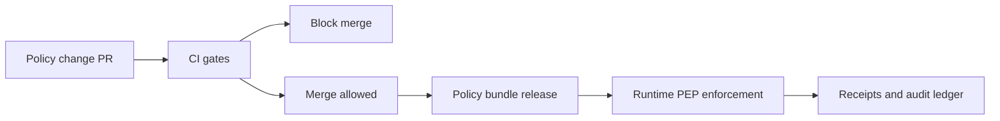

<!-- [KFM_META_BLOCK_V2]
doc_id: kfm://doc/4ec29855-61e6-4f28-b629-a721adc664b9
title: Policy Test Coverage Expectations
type: standard
version: v1
status: draft
owners: TODO: Platform Governance + Policy Stewards
created: 2026-03-02
updated: 2026-03-02
policy_label: restricted
related:
  - docs/governance/policy/README.md
  - docs/governance/policy/testplan/README.md
  - docs/governance/policy/decision_template.md
  - docs/governance/promotion/promotion_contract.md
tags: [kfm, governance, policy, testplan, coverage]
notes:
  - This doc defines minimum, enforceable coverage expectations for KFM policy-as-code (OPA/Rego or equivalent).
  - It is written to be CI-enforceable and fail-closed.
[/KFM_META_BLOCK_V2] -->

# Policy Test Coverage Expectations

Policy-as-code is part of KFM's trust membrane: it MUST be correct, testable, and fail-closed.


---

## Quick navigation

- [Purpose](#purpose)
- [Scope](#scope)
- [Non-goals](#non-goals)
- [Definitions](#definitions)
- [Coverage model](#coverage-model)
- [Minimum coverage requirements](#minimum-coverage-requirements)
- [Required scenario matrix](#required-scenario-matrix)
- [Test categories](#test-categories)
- [Coverage reporting](#coverage-reporting)
- [Exceptions](#exceptions)
- [Change checklist](#change-checklist)

---

## Purpose

This document defines **minimum coverage expectations** for:

1. **Policy bundles** (OPA/Rego or equivalent) that make *allow/deny* decisions, and
2. **Policy obligations** (redaction, generalization, UI notices, logging requirements, etc.) returned alongside those decisions.

The goal is to ensure that:

- CI gates are meaningful because **CI and runtime evaluate the same policy semantics**.
- The system remains **default-deny** and **leak-resistant**, even as policy evolves.
- Policy changes are **reviewable** (small diffs, explicit scenarios, deterministic inputs).

## Scope

These expectations apply to policy-as-code used in any of the following enforcement points:

- **CI / PR gates** (e.g., policy regression suite, schema gating, promotion gating).
- **Runtime API PEP** (policy checks before serving data).
- **Evidence resolution** (policy checks before resolving evidence and rendering bundles).
- **Story publishing** and **Focus Mode** publishing or answering (policy pre-check + citation resolvability gates).

> **Rule:** UI MAY display policy labels and notices, but UI MUST NOT decide policy outcomes.

## Non-goals

This document does **not**:

- Define the entire policy language style guide (see `docs/governance/policy/*`).
- Specify repository layout exactly (paths below are recommendations; enforce via CI once confirmed).
- Replace dataset-specific QA thresholds (those belong to dataset specs / promotion gates).
- Describe incident response or emergency policy rollback procedures (separate runbook).

## Definitions

- **Policy Decision Point (PDP):** The engine evaluating policy (OPA or equivalent).
- **Policy Enforcement Point (PEP):** The system component that *calls* the PDP and enforces the result (CI, API, evidence resolver, etc.).
- **Decision:** Allow/deny plus any structured metadata (e.g., reason codes).
- **Obligation:** A required follow-up action emitted by policy (e.g., generalize geometry, show notice, redact fields).
- **Policy label:** A classification used by policy (e.g., `public`, `public_generalized`, `restricted`, etc.).
- **Fixture:** A stable, versioned test input (JSON/YAML) used for deterministic policy tests.
- **Golden test:** A stable scenario set that MUST keep passing unless intentionally changed (with review + changelog).

## Coverage model

Policy coverage in KFM is **scenario coverage**, not only line coverage.

Line coverage can be gamed. Scenario coverage is harder to cheat and maps to real risk.

KFM uses four orthogonal coverage dimensions:

1. **Decision coverage**: allow and deny outcomes for each relevant `(subject, action, resource)` tuple.
2. **Obligation coverage**: each obligation type must be asserted present when expected and absent otherwise.
3. **Context coverage**: important context inputs (time window, geometry/bbox, environment, request channel, dataset version, etc.) must be exercised at boundaries.
4. **Leakage coverage**: “deny” must not leak restricted metadata (including in errors, logs, receipts, or UI payloads).

### Visual model



## Minimum coverage requirements

The following are **MUST** requirements (merge-blocking once CI is wired).

### 1) Default-deny is mandatory

- Every policy module MUST explicitly default to **deny**.
- Every policy module MUST have at least one test that proves **deny-by-default** holds for missing or malformed input.

### 2) Every allow path must be tested

For each rule (or equivalent construct) that can lead to `allow == true`:

- At least **one positive test** MUST exist.
- At least **one negative test** MUST exist that proves a “near miss” still denies (e.g., wrong role, wrong label, missing claim).

### 3) Policy label coverage is required

For each policy label present in the controlled vocabulary:

- There MUST be at least one scenario that verifies **what it permits** and **what it denies** for the baseline “public” subject.
- If a label implies a special handling mode (e.g., “generalized”), there MUST be at least one obligation test verifying that special handling is surfaced.

### 4) Obligation coverage is required

For every obligation type:

- There MUST be at least one scenario where it is emitted.
- There MUST be at least one scenario where it must **not** be emitted (to prevent “always emit” bugs).

### 5) Cross-PEP semantic parity

CI and runtime MUST not diverge in policy meaning.

Minimum expectation:

- The **same fixtures** MUST be runnable against:
  - CI policy tests (unit tests), and
  - any runtime PDP wiring test (integration).

If runtime uses additional context fields, those fields MUST have defaults and tests for missing values.

### 6) Leakage tests are required

At minimum, the regression suite MUST contain scenarios that validate:

- Denied responses do **not** include restricted metadata in:
  - HTTP error messages,
  - response bodies (including partial results),
  - evidence bundles,
  - receipts / logs (when those are user-visible).

### 7) Promotion gate policy coverage

If policy participates in promotion gates (licensing, sensitivity, redaction/generalization, etc.):

- The policy suite MUST include explicit “promotion contexts” with fixtures.
- The suite MUST contain at least one scenario that verifies promotion is blocked when:
  - license metadata is missing/unknown,
  - policy label is missing,
  - a required redaction/generalization obligation is absent.

## Required scenario matrix

Policy tests MUST be organized as an explicit scenario matrix. This can be a table in docs or a machine-readable manifest.

Minimum required scenario axes:

| Axis | Minimum requirement | Notes |
|---|---:|---|
| **Subject** | public + steward/admin + at least 1 “internal” role | Use your actual roles; don’t invent new ones to make tests pass. |
| **Action** | read + at least 1 write/publish action | Publish is higher risk; treat it as separate. |
| **Resource class** | dataset + evidence bundle + story/focus output | “Output safety” is a resource too. |
| **Policy label** | every label in vocabulary | If a label exists, it must be tested. |
| **Obligations** | every obligation type | Presence + absence assertions required. |
| **Error paths** | 403/404 + audit reference | Must not leak restricted metadata. |
| **Boundary context** | at least 1 boundary per context dimension used | e.g., time window edges, bbox edges, empty filters, nulls. |

### Starter scenario set

> **Tip:** Use stable IDs like `AUTHZ-001` so reviews can diff coverage impact.

| ID | Scenario | Expected |
|---|---|---|
| AUTHZ-001 | Public reads Public dataset | allow=true |
| AUTHZ-002 | Public reads Restricted dataset | allow=false |
| AUTHZ-003 | Steward reads Restricted dataset | allow=true |
| OBL-001 | Public reads Public-generalized dataset | allow=true + obligation: show_notice |
| OBL-002 | Public reads Public dataset | allow=true + obligation: _none_ |
| LEAK-001 | Denied dataset access response | no restricted metadata + stable error_code |
| EVID-001 | Evidence resolver for restricted evidence | deny OR return redacted bundle (per policy) |
| PUBLISH-001 | Publish story without resolvable citations | deny (publish blocked) |
| FOCUS-001 | Focus answer referencing restricted dataset | deny OR require scope reduction (per policy) |

> The above is the minimum “starter.” Coverage expectations grow with new actions, roles, labels, and obligations.

## Test categories

### A) Policy unit tests (MUST)

- Unit tests MUST run via the PDP’s native test runner (e.g., `opa test` for Rego).
- Tests MUST use fixtures that are committed and reviewable.
- Tests MUST be deterministic.

### B) Fixture-driven decision tests (MUST)

- Maintain a set of **decision fixtures** that represent canonical calls from PEPs.
- Each fixture MUST define:
  - input context,
  - expected allow/deny,
  - expected obligations,
  - expected redaction instructions (if any).

### C) Policy gate tests for Promotion Contract (MUST if promotion depends on policy)

- Include fixtures representing promotion-time contexts.
- Ensure “fail-closed” behavior: missing license, missing label, missing obligation => blocked.

### D) Integration tests for PEP wiring (SHOULD)

Policy can be correct, but the system can still be wrong if the PEP builds the wrong input shape.

Integration tests SHOULD verify:

- PEP sends the correct input shape to PDP.
- PEP enforces obligations correctly (e.g., redaction applied, notices displayed, exports annotated).
- PEP maps denied decisions to leak-safe errors.

### E) Golden query / evaluation harness (SHOULD where applicable)

For any “answer generating” feature (Focus Mode, Story publishing helpers, etc.):

- Maintain golden queries that validate:
  - citations resolve,
  - responses are policy-safe,
  - receipts are generated and do not leak sensitive information.

## Coverage reporting

### What to report

Coverage reporting MUST include:

- Policy bundle version (commit hash or digest).
- Scenario manifest version (the scenario set itself is versioned).
- Pass/fail summary by scenario ID.
- Optional: line coverage report, but it MUST NOT replace scenario coverage.

### Where to report

- CI SHOULD publish a machine-readable report artifact (JSON) and a human-readable summary in PR checks.

## Exceptions

Exceptions are allowed only under a fail-closed posture.

- Exceptions MUST be time-bounded and documented.
- Exceptions MUST include:
  - the scenario IDs missing,
  - risk statement (what could leak or break),
  - compensating controls (e.g., feature flag off, runtime deny-all for that action),
  - an owner and an expiry date.

## Change checklist

When modifying policies:

- [ ] Update/add unit tests for every changed allow/deny path.
- [ ] Update the scenario matrix (add IDs for new roles/actions/labels/obligations).
- [ ] Add leakage regression tests if response shapes changed.
- [ ] Confirm CI and runtime semantics remain aligned (same fixtures; same outcomes).
- [ ] Document any exception explicitly (owner + expiry).

---

<details>
<summary>Appendix: Example fixture structure (illustrative)</summary>

```json
{
  "id": "AUTHZ-002",
  "input": {
    "user": {"role": "public"},
    "action": "read",
    "resource": {"type": "dataset", "policy_label": "restricted"}
  },
  "expect": {
    "allow": false,
    "obligations": []
  }
}
```

</details>

---

## Back to top

[↑ Back to top](#policy-test-coverage-expectations)
