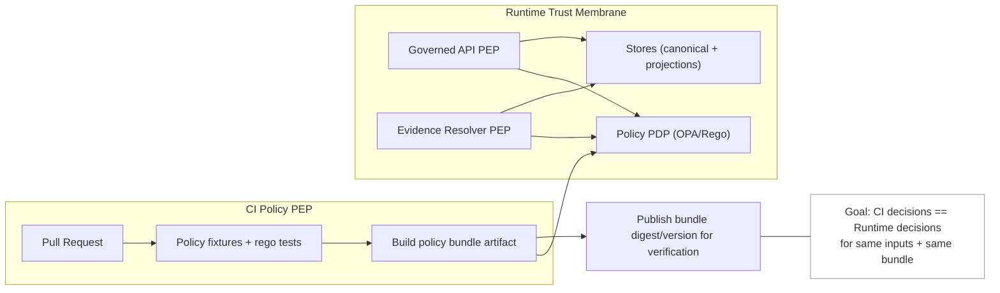

<!-- [KFM_META_BLOCK_V2]
doc_id: kfm://doc/4f0dd1b7-2bda-4f5d-9c1c-7d079f8c3d0a
title: Runtime Policy Parity Test Plan
type: standard
version: v1
status: draft
owners: TODO (Steward + Policy Engineer + Platform Owner)
created: 2026-03-02
updated: 2026-03-02
policy_label: internal
related:
  - TODO: (link) Policy pack / bundle build doc
  - TODO: (link) Governed API contract / OpenAPI
  - TODO: (link) Evidence resolver contract
  - TODO: (link) Audit ledger schema
tags: [kfm, governance, policy, testplan, parity, opa, rego]
notes:
  - This doc is a governed artifact: changes should be reviewed by Steward/Policy owners.
  - This doc is written to be repo-agnostic; replace TODO links with real paths once confirmed.
[/KFM_META_BLOCK_V2] -->

# Runtime Policy Parity Test Plan
Ensure **CI policy guarantees match runtime behavior** (same decisions + same obligations) across the trust membrane.


> **WARNING**
> If CI and runtime do not share the same policy semantics, CI guarantees are meaningless. This test plan exists to prevent “passes CI, leaks in prod” failures.

---

## Navigation
- [Scope](#scope)
- [Definitions](#definitions)
- [Parity invariants](#parity-invariants)
- [System sketch](#system-sketch)
- [Test strategy](#test-strategy)
- [Test matrix](#test-matrix)
- [CI gates](#ci-gates)
- [Runtime observability](#runtime-observability)
- [Runbook](#runbook)
- [Assumptions, risks, tradeoffs](#assumptions-risks-tradeoffs)
- [Minimum verification steps](#minimum-verification-steps)
- [Appendix: Fixture template](#appendix-fixture-template)

---

## Scope

### In scope
Policy parity MUST be demonstrated (by automated tests) for all **Policy Enforcement Points (PEPs)**, including:

- **CI PEP**
  - Policy tests and fixture evaluation that block merges.
- **Runtime API PEP**
  - Authorization decisions for API endpoints (metadata, data access, downloads, exports).
- **Evidence Resolver PEP**
  - Any endpoint or module that resolves citations/evidence into bundles/cards and must enforce redaction obligations.
- **Governed publishing paths**
  - Story publishing and Focus Mode request processing (policy pre-check, evidence admissibility, verification).

### Out of scope (for this file)
- Designing the policy model itself (roles, labels, obligations taxonomy) beyond what is needed for parity tests.
- Choosing identity provider / auth mechanism (OIDC, API keys, etc.). This plan validates *inputs to policy*, not identity design.
- Data pipeline promotion gate definitions (covered by Promotion Contract test plans).

### Where this doc fits
This file belongs under:
- `docs/governance/policy/testplan/` — test plans and parity standards for policy enforcement.

**Acceptable inputs**
- Test case inventories and matrices
- Fixture formats and “golden” expectations
- CI gate definitions and DoD

**Exclusions**
- Do NOT place production Rego/policy code here.
- Do NOT place secrets, real user identifiers, or sensitive dataset identifiers here.

[Back to top](#runtime-policy-parity-test-plan)

---

## Definitions

- **PDP (Policy Decision Point):** The policy engine that evaluates a request context and returns a decision.
- **PEP (Policy Enforcement Point):** The place where a request is *blocked or allowed* based on policy output.
- **Policy parity:** CI evaluation and runtime evaluation produce the same:
  - allow/deny decision
  - reason codes (if used)
  - obligations (required redactions, UI notices, etc.)
  - fail-closed behavior under error conditions
- **Obligations:** Required transformations/constraints returned by policy (e.g., generalize geometry, remove fields, require attribution notice).
- **Policy bundle:** Versioned policy artifact loaded by the PDP (e.g., an OPA/Rego bundle).
- **Fail closed:** If policy cannot be evaluated deterministically and safely → deny.

[Back to top](#runtime-policy-parity-test-plan)

---

## Parity invariants

These invariants are the “must not break” contract of this test plan.

### I1 — Same semantics in CI and runtime
- CI and runtime MUST evaluate policy with the **same semantics**, or at minimum the **same fixtures and outcomes**.
- Policy fixtures MUST cover allow/deny **and obligations**.

### I2 — Default deny
- Policy MUST be deny-by-default unless explicitly allowed.

### I3 — Trust membrane is enforced
- Clients MUST NOT access storage/DB directly.
- All data/evidence reads MUST flow through governed interfaces that evaluate policy.

### I4 — Evidence resolution is policy-protected
- Evidence resolution MUST enforce policy (including obligations and redaction) before returning evidence bundles/cards.
- If evidence is not policy-allowed, the resolver MUST deny or return a safe, non-leaking response.

### I5 — No restricted leakage in error surfaces
- Forbidden/denied requests MUST NOT leak restricted metadata via:
  - HTTP status differences (403 vs 404 probing) unless explicitly designed and tested
  - error messages
  - timing side channels beyond acceptable tolerances (tracked as a risk; see below)

### I6 — Auditability
- Every runtime decision MUST emit an audit event (at least: policy bundle version/digest, decision outcome, request id, and redaction/obligation summary).
- Audit records MUST be safe to retain and MUST NOT leak restricted details.

[Back to top](#runtime-policy-parity-test-plan)

---

## System sketch



> **NOTE**
> This diagram is conceptual. Replace nodes with real service/module names once repo structure is verified.

[Back to top](#runtime-policy-parity-test-plan)

---

## Test strategy

### 1) Policy unit tests (PDP-level)
**Goal:** Validate policy logic and fixtures without requiring the full runtime.

**Required**
- Rego unit tests that assert:
  - deny-by-default
  - allow rules for known safe paths
  - obligation generation for generalized/public representations
  - denial for restricted/sensitive-location

**Artifacts**
- A set of **golden fixtures**:
  - `input.json` (policy input context)
  - `expected.json` (decision + obligations + reason codes)

> **TIP**
> Keep fixtures minimal and deterministic. Avoid “now()” time dependencies; provide explicit timestamps as inputs.

---

### 2) Bundle build reproducibility tests (PDP artifact)
**Goal:** Ensure the runtime PDP is evaluating *the same* bundle that CI validated.

**Required checks**
- Bundle builds deterministically (or at minimum produces a tracked digest).
- CI emits:
  - bundle digest (sha256)
  - policy engine version (OPA version)
  - commit SHA
- Runtime exposes the loaded:
  - bundle digest
  - policy engine version
  - policy “package/query entrypoints” list (optional but useful)

---

### 3) Runtime parity integration tests (PEP-level)
**Goal:** Prove the PEPs enforce the same policy outcomes as CI fixtures.

**Approach (reference)**
1. Start runtime components in a test environment (local compose or ephemeral CI environment):
   - governed API service
   - evidence resolver
   - policy engine (PDP) configured with the test bundle
2. For each fixture:
   - Evaluate “expected” with CI/offline PDP evaluation.
   - Call runtime endpoints that correspond to the fixture’s action/resource.
   - Compare:
     - allow/deny
     - obligations enforced (redaction/generalization)
     - error surface behavior (no restricted leakage)

**Required parity assertions**
- Decision parity: identical allow/deny
- Obligation parity: identical *effect*, even if representation differs
- Fail-closed parity: if PDP errors → runtime denies

---

### 4) Obligation enforcement tests (redaction + generalization)
**Goal:** Ensure obligations are not just returned but actually enforced.

**Examples**
- Geometry generalization applied before returning features/tiles
- Restricted attributes removed from payloads
- UI notices returned as structured obligations (or via headers) when required

**Hard rule**
- If the system cannot satisfy a required obligation, it MUST deny (fail closed).

---

### 5) Error-surface non-leak tests
**Goal:** Prevent “policy oracle” leakage.

**Required**
- Forbidden access must not reveal:
  - dataset existence
  - internal policy labels
  - restricted titles/owners/licensing details
- Denied responses should include:
  - stable error_code
  - safe message
  - audit_ref (so stewards can trace)

---

### 6) Time-aware policy tests
**Goal:** Ensure time inputs do not cause parity drift.

**Required**
- Fixtures cover explicit timestamps:
  - event time / valid time / transaction time (where applicable)
- If policy uses time windows (e.g., embargo expiry), tests must be explicit and deterministic.

---

### 7) Regression + mutation testing (recommended)
**Goal:** Ensure test suite is sensitive to breaking changes.

**Recommended**
- Mutation test (or “canary fixture”) that should flip a decision if a key rule is removed.
- CI must fail if the canary doesn’t detect the mutation.

[Back to top](#runtime-policy-parity-test-plan)

---

## Test matrix

Use this matrix to ensure coverage across the highest-risk combinations.

### Axes
- **Actor role:** public, contributor, steward/reviewer, operator
- **Resource policy label:** public, public_generalized, restricted, restricted_sensitive_location, internal, embargoed, quarantine
- **Action:** read_metadata, read_features, read_tiles, download_artifact, export, resolve_evidence, publish_story, focus_ask

### Minimum coverage table (starter)
| Role \ Label | public | public_generalized | restricted | restricted_sensitive_location | internal | embargoed | quarantine |
|---|---:|---:|---:|---:|---:|---:|---:|
| public | ALLOW read | ALLOW read + NOTICE | DENY | DENY | DENY | DENY | DENY |
| contributor | ALLOW read | ALLOW read + NOTICE | DENY (unless granted) | DENY | DENY (unless granted) | DENY | DENY |
| steward/reviewer | ALLOW | ALLOW | ALLOW (scoped) | ALLOW (scoped + obligations) | ALLOW | ALLOW (with rules) | ALLOW (for review only) |
| operator | ALLOW (ops scope) | ALLOW | ALLOW (ops scope) | ALLOW (ops scope) | ALLOW | ALLOW | ALLOW |

> **NOTE**
> The exact allow/deny matrix is policy-defined. This table is a coverage skeleton, not a final truth table.

### High-risk “must have” scenarios
- Public user requests anything labeled restricted / sensitive location → deny + no leakage.
- Any user resolves evidence that includes restricted assets → deny or return policy-filtered bundle.
- Focus Mode request that cannot verify citations or resolve evidence → abstain/deny safely.
- Story publish with restricted citations → block publish gate.
- Download/export paths enforce license/rights obligations and attribution requirements (if encoded).

[Back to top](#runtime-policy-parity-test-plan)

---

## CI gates

These gates are **required** to claim runtime-policy parity.

### Required status checks (minimum)
- [ ] **Policy unit tests** (rego tests) are required checks on main.
- [ ] **Fixture suite** runs in CI and blocks merge on any decision/obligation drift.
- [ ] **Bundle build** emits digest/version metadata and is attached to the build artifacts.
- [ ] **Runtime parity suite** runs at least nightly, and on any policy change.
- [ ] **Leakage guard** tests denied responses for safe error surfaces.
- [ ] **Fail-closed tests** verify runtime denies when PDP is unavailable or errors.

### Recommended status checks
- [ ] “Policy input schema” validation (reject unknown/missing fields at PEP boundary).
- [ ] Mutation/canary suite to prove tests detect broken policy.
- [ ] Performance budget test (P95 policy eval latency in CI env).

[Back to top](#runtime-policy-parity-test-plan)

---

## Runtime observability

### Metrics (minimum)
- Policy decisions:
  - counts of allow/deny by endpoint + policy_label
  - P50/P95/P99 policy eval latency
  - number of PDP errors/timeouts
- Obligation enforcement:
  - count of redactions applied (by type)
  - count of “deny because obligation could not be enforced”

### Audit record fields (minimum)
- request_id / correlation_id
- actor role (and stable actor id if available)
- action + resource identifiers (dataset_version_id, evidence refs, etc.)
- policy bundle digest/version
- decision (allow/deny)
- obligations summary (types only; no restricted details)
- audit_ref returned to clients in errors

> **WARNING**
> Audit logs/receipts can become a leakage vector. Treat audit payloads as policy-controlled artifacts.

[Back to top](#runtime-policy-parity-test-plan)

---

## Runbook

### Adding a new endpoint under policy
1. Define the **policy input context** shape (actor, action, resource label, request attributes).
2. Add/extend rego policy rules.
3. Add fixtures:
   - allow case(s)
   - deny case(s)
   - obligation enforcement case(s)
4. Ensure:
   - CI policy tests pass
   - runtime parity suite includes the endpoint
   - leakage guard covers deny responses

### Debugging a parity failure
- Confirm the runtime PDP is loading the expected bundle digest.
- Compare:
  - CI fixture input JSON
  - runtime-extracted input JSON
  - OPA version differences (builtins can drift)
- If mismatch is due to input extraction:
  - fix extractor
  - add a regression fixture that locks the input shape

### Handling intentional policy changes
- Update fixtures in the same PR as policy changes.
- Require Steward/Policy owner review.
- Record rationale in PR description (or ADR if significant).

[Back to top](#runtime-policy-parity-test-plan)

---

## Assumptions, risks, tradeoffs

### Assumptions (must be verified)
- OPA/Rego is the policy engine and policies ship as a bundle artifact.
- CI has a policy test suite and can block merges.
- Runtime has at least one PEP (API) and an evidence resolver.

### Risks
- **Toolchain drift:** OPA version mismatch between CI and runtime can cause parity failures.
- **Input drift:** Runtime request context differs subtly from fixture context.
- **Leakage through receipts/logs:** “safe” logs may contain sensitive fields unless governed.

### Tradeoffs
- Strict parity + strict input schema reduces flexibility but increases trust and auditability.
- Adding full runtime parity tests on every PR may be expensive; a hybrid approach can be used:
  - run unit+fixture tests on every PR
  - run runtime parity tests on policy changes + nightly

[Back to top](#runtime-policy-parity-test-plan)

---

## Minimum verification steps

Run these checks to convert “repo-agnostic” placeholders into confirmed paths and commands:

1. Confirm where policy lives (e.g., `policy/`) and what tool runs tests (OPA CLI vs conftest vs custom runner).
2. Confirm how the runtime loads policy (in-process vs sidecar) and whether it exposes a version/digest endpoint.
3. Identify the real runtime PEP surfaces:
   - governed API routes
   - evidence resolution routes
   - story publish / focus mode routes
4. Confirm audit schema and where audit records are stored.
5. Replace TODO links in this document with real repo-relative paths.

[Back to top](#runtime-policy-parity-test-plan)

---

## Appendix: Fixture template

Use this template for each parity case:

```json
{
  "case_id": "POLPAR-001",
  "title": "Public user cannot read restricted dataset metadata",
  "policy_input": {
    "user": { "role": "public" },
    "action": "read_metadata",
    "resource": { "policy_label": "restricted" },
    "request": { "path": "/api/v1/datasets", "method": "GET" },
    "timestamps": { "evaluated_at": "2026-03-02T00:00:00Z" }
  },
  "expected": {
    "decision": "deny",
    "reason_codes": ["RESTRICTED"],
    "obligations": [],
    "error_surface": {
      "http_status": 404,
      "message_class": "not_found_generic",
      "must_not_contain": ["restricted", "policy_label", "dataset_version_id"]
    }
  }
}
```

> **NOTE**
> The concrete shape of `policy_input` must match the real PDP input contract used by the runtime PEP.

[Back to top](#runtime-policy-parity-test-plan)
