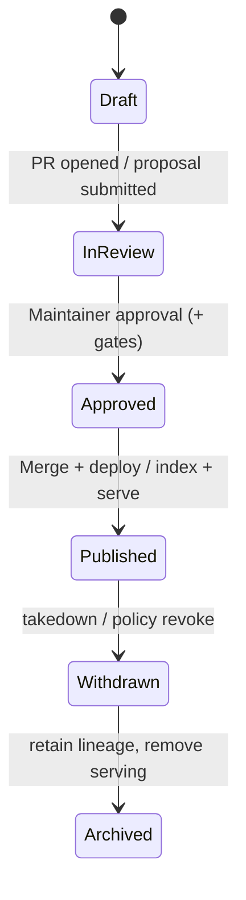

# 🚀 Promotion Governance


> [!IMPORTANT]
> **Promotion** in KFM is not “merging code.”  
> It’s **elevating an artifact** (data, metadata, story, AI behavior, infrastructure) from *draft/staging* → *trusted/published/production* **without breaking the truth-path** 🧭

---

## 🧭 Quick Links

- 🧩 Root Governance: `docs/governance/ROOT_GOVERNANCE.md`
- 🧠 AI Gates & Agent Safety: `docs/governance/langgraph-gates/README.md`
- 🧑‍⚖️ Ethics: `docs/governance/ETHICS.md`
- 🪶 Sovereignty: `docs/governance/SOVEREIGNTY.md`
- 📘 Master Guide (pipeline + invariants): `docs/MASTER_GUIDE_v13.md`

---

## 📌 What “Promotion” Means Here

Promotion is the controlled, auditable act of changing an artifact’s **status**, **visibility**, or **execution context**, such that it becomes:

- ✅ discoverable in catalog/search
- ✅ served via governed API
- ✅ visible in UI / dashboards
- ✅ usable by AI / Focus Mode
- ✅ eligible for downstream builds / public outputs

### Promotion can happen to…

| Track 🧱 | What gets promoted 🧩 | Typical “promotion target” 🎯 |
|---|---|---|
| 📦 Data | raw → processed datasets, derived layers | “publishable” / “catalog-ready” / “public-ready” |
| 🧾 Metadata | STAC/DCAT/PROV boundary artifacts | “indexable” / “harvestable” |
| 🕸️ Graph | entities + relationships | “queryable” (but still governed) |
| 🌐 API | endpoints + contracts + redaction | “stable interface” |
| 🗺️ UI | map layers, dashboards, tiles | “user-facing” |
| 📚 Stories | Story Nodes + Focus bundles | “governed narrative” |
| 🤖 AI | prompts, retrieval rules, model versions | “safe + citeable behavior” |
| 🧰 Infra | deployments, policy bundles | “production environment” |

---

## 🧱 Non‑Negotiable Invariants

These invariants are **promotion blockers**. If violated, the artifact **does not promote** 🚫

1. **Canonical truth-path ordering**  
   Raw ➜ Processed ➜ Catalog/Provenance ➜ Database/Graph ➜ API ➜ UI ➜ Story ➜ Focus Mode  
   (No bypassing steps, even “temporarily.”)

2. **API boundary is sacred**  
   UI and AI do **not** “reach around” the API to query storage/graph directly.

3. **Provenance-first**  
   If provenance can’t prove chain-of-custody, the artifact is not publishable.

4. **Contract-first interfaces**  
   API contracts and schemas are first-class; breaking changes require versioning discipline.

5. **Deterministic pipelines**  
   Data transforms are idempotent/config-driven so results are reproducible.

6. **Fail closed (block by default)**  
   If anything is missing/invalid (metadata, policy, classification), **promotion fails**.

> [!TIP]
> Treat promotion like a **supply chain**: every stage needs verifiable inputs, signatures, and gates 🔐

---

## 👥 Roles & Responsibilities (Promotion Authority)

Promotion authority is **role-scoped** (RBAC + policy-as-code):

- 👀 **Public Viewer**: reads *approved* public artifacts only
- ✍️ **Contributor**: can draft/submit artifacts but cannot publish directly
- 🧑‍🔧 **Maintainer**: reviews, approves, manages content + publication decisions
- 🛡️ **Admin**: runs ingestion pipelines, configures policies, executes high-risk operations

> [!NOTE]
> “Who can promote?” is enforced in **two places**:
> 1) **CI gates** (policy/tests block merges)  
> 2) **Runtime policy** (OPA/policy pack blocks live requests)

---

## 🧬 Promotion Lifecycle

Promotion is best modeled as a state machine (same concept for data, story, AI, and infra).



### Promotion rule of thumb 🧠
**If it can reach a user, it must have:**
- provenance ✅
- policy decision ✅
- classification ✅
- audit trail ✅

---

## 🔐 Gates

### ✅ Automated Gates (must be green)

Common automated gates include:

- 🧾 **Schema + contract validation** (contract-first)
- 🧪 **Unit/integration tests**
- 🔎 **Policy checks** (OPA/Conftest-style)
- 🧰 **Security checks** (secrets scanning, dependency checks)
- 📦 **Metadata completeness** (license, publisher, classification, citations)
- 🧬 **Provenance completeness** (PROV present and linked)
- 🧠 **AI response constraints** (citations required, disallowed content blocked)

### 👀 Human Gates (explicit sign-off)

- 🧑‍🔧 Maintainer approval required for “publish”
- 🧑‍⚖️ Governance escalation for:
  - sovereignty-sensitive artifacts 🪶
  - privacy risk 🔒
  - “public-facing AI behavior” changes 🤖
  - anything requiring takedown/withdrawal 🧯

---

## 🛣️ Promotion Runbooks

### 1) 📦 Data & Metadata Promotion

**Target:** move a dataset from “present” ➜ “cataloged” ➜ “served” ➜ “visible”

#### ✅ Required repo staging (canonical)

- `data/raw/<domain>/...` (source inputs)
- `data/work/<domain>/...` (intermediate)
- `data/processed/<domain>/...` (final outputs)
- Boundary artifacts (publish step):
  - `data/stac/collections/`
  - `data/stac/items/`
  - `data/catalog/dcat/`
  - `data/prov/`

#### ✅ Promotion steps

1. **Add raw sources** under `data/raw/<domain>/`  
2. **Run deterministic ETL** producing:
   - intermediate results in `data/work/<domain>/`
   - final results in `data/processed/<domain>/`
3. **Generate boundary artifacts** (STAC/DCAT/PROV)
4. **Run validation gates** (CI + local preflight)
5. **Load downstream (DB/graph)** only through governed pipeline jobs
6. **Maintainer approves** publication
7. **Publish** (catalog indexed + API served + UI layer available)

#### ✅ Data promotion checklist

- [ ] Source manifest present (publisher, license, classification)
- [ ] Dataset outputs exist in `data/processed/…`
- [ ] STAC created (collection + items)
- [ ] DCAT dataset entry created
- [ ] PROV lineage created + linked to dataset + activities
- [ ] CI gates green
- [ ] Maintainer approval recorded

---

### 2) 🧠 Evidence Artifacts (AI/analysis outputs)

**Policy:** Any analysis output is treated as a first-class dataset:
- stored as processed data
- cataloged like any dataset
- traced in provenance
- served only via governed API

✅ If an AI-generated layer can be seen on a map, it must be promotable **the same way** as a “regular dataset.”

---

### 3) 📚 Story Node Promotion

**Target:** publish narratives that remain machine-ingestible + provenance-linked.

#### ✅ Requirements

- Story node follows template(s) (with front-matter)
- Claims link to datasets / schemas / citations
- “Focus Mode” bundles must reference catalogs and provenance

#### ✅ Promotion steps

1. Draft story node in PR (Contributor)
2. Run doc lint + link checks
3. Maintainer reviews:
   - citations & tone
   - sovereignty flags
   - safety + ethical presentation
4. Merge → published (UI + Focus Mode can now surface it)

#### ✅ Story promotion checklist

- [ ] Front-matter complete and valid
- [ ] Every claim has a dataset/citation target
- [ ] Linked dataset IDs exist in catalog
- [ ] Sensitive content is flagged appropriately
- [ ] Maintainer sign-off

---

### 4) 🤖 AI / Focus Mode Promotion

AI promotion includes changes to:
- prompt templates
- retrieval rules / context assembly
- model version + adapters
- policy rules that govern answers
- citation enforcement behavior

#### ✅ Promotion rules

- AI must **refuse** unsourced or disallowed content.
- AI must **always include citations** if it answers.
- AI changes that affect public behavior require:
  - evaluation set pass ✅
  - policy checks pass ✅
  - maintainer approval ✅
  - possible manual deployment approval ✅

#### ✅ AI promotion checklist

- [ ] Prompt injection defenses remain intact
- [ ] Citation policy still enforces “no citations → no answer”
- [ ] Model version/tag recorded in provenance
- [ ] Evaluation suite passes (quality + safety)
- [ ] Maintainer approval (and admin approval if production)

---

### 5) 🧰 Code & Infrastructure Promotion

Code promotion is still “promotion,” because it changes serving behavior.

#### Standard pipeline 🧪

1. Feature branch → PR
2. CI gates run (tests + policy + security)
3. Maintainer merges only when green ✅
4. Deploy to staging
5. Promote staging → prod (manual approval for high-risk changes)

> [!IMPORTANT]
> Critical changes (AI system, infra, policy bundles) may require **explicit environment promotion** even after merge.

---

## 🧯 Rollback & De‑Promotion

Promotion is reversible, but **never silently**.

### De‑promotion options (choose the least destructive)

1. 🧾 **Withdraw via metadata + policy**
   - mark dataset status as withdrawn
   - policy denies serving it
   - UI should hide it by default
2. 🛑 **Disable serving layer**
   - API can deny/sanitize access
3. ⏪ **Revert commit**
   - last resort (prefer audit-friendly withdrawal)

### Rollback checklist

- [ ] Incident ticket / issue logged
- [ ] Who authorized rollback recorded
- [ ] Policy + metadata updated
- [ ] Audit trail preserved
- [ ] Postmortem written (what gate failed?)

---

## ✅ PR Checklist Template (Copy/Paste)

```markdown
### Promotion Readiness Checklist ✅

**Type:** (data / metadata / story / ai / infra)

- [ ] I did not bypass the canonical pipeline (raw→processed→catalog→db/graph→api→ui→story→focus).
- [ ] Provenance is complete (PROV + linkage).
- [ ] Metadata is complete (license, publisher, classification).
- [ ] CI gates are green (tests + policy checks).
- [ ] If AI-facing: citations are enforced + disallowed content is blocked.
- [ ] If sovereignty-sensitive: reviewed against docs/governance/SOVEREIGNTY.md
- [ ] Maintainer approval requested (tagging appropriate reviewers).
```

---

## 🗂️ Appendix: Canonical Promotion Paths

```text
📁 data/
  📁 raw/<domain>/
  📁 work/<domain>/
  📁 processed/<domain>/
  📁 stac/
    📁 collections/
    📁 items/
  📁 catalog/
    📁 dcat/
  📁 prov/

📁 docs/
  📁 governance/
    📁 promotion/
      📄 README.md   👈 you are here
```

---

## 📎 Notes

- Promotion is **governance**, not bureaucracy.
- The goal is **trustworthy outputs**: every layer is explainable, auditable, and policy-controlled 🧾🔐
