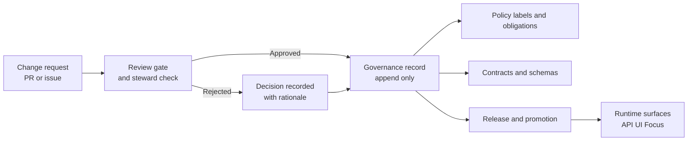

<!-- [KFM_META_BLOCK_V2]
doc_id: kfm://doc/9d0f3c2d-1db2-4c32-93d0-33a3a0e7f25a
title: Governance Records
type: standard
version: v1
status: draft
owners: ["KFM Governance (TBD)"]
created: 2026-03-02
updated: 2026-03-02
policy_label: public
related:
  - docs/governance/ROOT_GOVERNANCE.md
  - docs/governance/REVIEW_GATES.md
  - docs/architecture/adr/
  - docs/standards/
  - data/catalog/
tags: [kfm, governance, records]
notes:
  - Append-only governance record store for review decisions, exceptions, and sign-offs.
[/KFM_META_BLOCK_V2] -->

# Governance Records

**Purpose:** Append-only recordkeeping for governance decisions that affect KFM’s trust membrane, promotion gates, policy labels/obligations, or publication workflows.


**Owners:** KFM Governance (TBD)

---

## Navigation

- [Purpose](#purpose)
- [Where this fits](#where-this-fits)
- [What belongs here](#what-belongs-here)
- [What must not go here](#what-must-not-go-here)
- [Record types](#record-types)
- [File and folder conventions](#file-and-folder-conventions)
- [Authoring template](#authoring-template)
- [Review and publication gates](#review-and-publication-gates)
- [Retention and access](#retention-and-access)
- [FAQ](#faq)

---

## Purpose

KFM is designed so that governance intent becomes **enforceable behavior** via contracts (schemas, policies, promotion gates), and so that every user-facing claim can be traced back to evidence.

This directory provides the *human* side of that traceability:

- why we changed a policy label or obligation
- who approved a sensitive-data redaction plan
- why we accepted a risk or issued an exception
- what review gate was applied to a PR/release

> **NOTE**
> System-generated **run receipts** and other machine audit artifacts live with promoted data and catalogs (see `data/catalog/**/receipts/` in the canonical layout). This folder is for **governance decisions**, not pipeline outputs.

[Back to top](#navigation)

---

## Where this fits

This directory is part of **`docs/governance/`** and should be read alongside:

- `docs/governance/ROOT_GOVERNANCE.md` — overall governance posture, roles, and non-negotiables (if present)
- `docs/governance/REVIEW_GATES.md` — when human review is required (if present)
- `docs/architecture/adr/` — architecture decisions (technical design) vs governance decisions (policy/risk/release)
- `docs/standards/` — profiles and authoring standards

At runtime, KFM enforces policy through governed APIs and an evidence resolver. Governance Records are the **paper trail** that connects:

1. a change request (PR / issue)
2. a decision (this folder)
3. a policy / contract / promotion action (code + CI)
4. a public surface (Map / Story / Focus)



[Back to top](#navigation)

---

## What belongs here

✅ **Acceptable inputs** (examples):

- Policy label changes (e.g., `public` → `restricted`) and the reasoning/authority for the change
- Redaction/generalization plans and approvals
- Review Gate decisions for:
  - licensing/rights uncertainty
  - sensitivity concerns
  - exceptions/waivers (with compensating controls)
- Risk acceptance records (explicitly time-bounded where possible)
- Incident reports and postmortems related to policy bypass, leakage, broken evidence links, etc.
- Governance meeting notes **when they include decisions** (not just discussion)

> **TIP**
> If a decision changes a core invariant (policy, IDs, catalogs, trust membrane), capture it here *and* (when technical) also file an ADR in `docs/architecture/adr/`.

[Back to top](#navigation)

---

## What must not go here

❌ **Exclusions** (do not commit to this directory):

- **Raw data** or dataset artifacts (those belong under the truth path zones in `data/`)
- **Secrets** (API keys, tokens, credentials)
- **Unredacted sensitive content** (PII, precise vulnerable site locations, restricted documents)
- Large binary attachments (use artifact storage; keep only a redacted summary + stable reference)

> **WARNING**
> If a governance record requires restricted details to justify the decision, create:
> 1) a **redacted public record** here, and
> 2) a **restricted appendix** stored in an access-controlled location (referenced by stable ID, not pasted content).

[Back to top](#navigation)

---

## Record types

Use the smallest record type that captures the decision.

| Code | Record type | When to use | Minimum required content |
|---:|---|---|---|
| **RGD** | Review Gate Decision | Any PR/change that triggers human review (licensing, sensitivity, policy changes) | Decision, rationale, approvers, related PR/issues, evidence refs |
| **PDR** | Policy Decision Record | New policy rule, obligation, or interpretation | Decision text, scope, enforcement mechanism, rollback |
| **DCR** | Data Classification Review | Changing `policy_label` or redaction plan for a dataset family | Before/after classification, authority, redaction summary, impact |
| **WAR** | Waiver and Exception Record | Temporary bypass/exception to a gate (rare) | Risk, compensating controls, expiry, owner |
| **RAR** | Risk Acceptance Record | Explicitly accepting a documented risk | Risk statement, mitigation plan, acceptance window |
| **INC** | Incident Report | Governance or security incident affecting trust | Timeline, blast radius, fix, prevention |
| **MIN** | Minutes with Decisions | Meetings that resulted in decisions | Attendees, decisions, action items |

If you can’t classify a record, start with **RGD** and refine later.

[Back to top](#navigation)

---

## File and folder conventions

### Naming

Records are **append-only** and should be named so they sort by date.

Recommended filename format:

- `YYYY-MM-DD__<TYPE>__<slug>__<record_id>.md`

Examples:

- `2026-03-02__RGD__new-dataset-onboarding__KFM-GOV-0007.md`
- `2026-03-05__DCR__soil-survey-redaction-plan__KFM-GOV-0008.md`

### Record IDs

Use a stable, unique ID so the record can be referenced in PRs, releases, and tickets.

Recommended ID shape:

- `KFM-GOV-<4-digit sequence>` (repo-local)

> If you already have an org-wide ID scheme, use that instead—just keep it stable.

### Layout

Keep the structure **simple**. A flat directory is acceptable at small scale.

Proposed scaling layout (optional):

```
docs/governance/records/                                   | # Governance records hub (auditable, sanitized, policy-safe)
├─ README.md                                               | # This file: scope, record taxonomy, naming rules, approvals, and retention posture
├─ INDEX.md                                                | # OPTIONAL: curated human index (high-signal links; may be generated)
├─ _templates/                                             | # Copy/paste templates for consistent governance record authoring
│  └─ TEMPLATE__GOV_RECORD.md                              | # Generic governance record template (context → decision → evidence → verification → signoff)
│
├─ review-gates/                                           | # Review-gate records (promotion/release/major changes) with checklists + signoffs
├─ policy-decisions/                                       | # Policy decision records (why rules/labels exist; changes, rationale, impacts)
├─ classification/                                         | # Classification records (sensitivity/rights assessments + outcomes + required handling)
├─ waivers/                                                | # Waiver records (time-boxed exceptions; mitigations; approvals; expiry)
├─ incidents/                                              | # Incident records (sanitized summaries, timelines, action items, evidence refs)
└─ meetings/                                               | # Meeting notes/minutes (policy-safe; promote durable outcomes into decisions/waivers/incidents)
```

[Back to top](#navigation)

---

## Authoring template

Copy/paste the template below for new records.

```markdown
<!-- [KFM_META_BLOCK_V2]
doc_id: kfm://doc/<uuid>
title: <Short decision title>
type: standard
version: v1
status: draft|review|published
owners: ["<role or team>"]
created: YYYY-MM-DD
updated: YYYY-MM-DD
policy_label: public|restricted|...
related:
  - <PR link or path>
  - <issue link or path>
  - <dataset_version_id or spec path>
tags: [kfm, governance, records, <type>]
notes:
  - supersedes: <record_id> (optional)
[/KFM_META_BLOCK_V2] -->

# <TITLE>

## Context
- What changed? Why now?

## Decision
- What we decided (clear, testable where possible)

## Rationale
- Why this is the best option (include constraints)

## Alternatives considered
- Option A: …
- Option B: …

## Evidence and references
- EvidenceRefs:
  - <evidence_ref_1>
  - <evidence_ref_2>
- Notes: citations must be resolvable and policy-allowed.

## Impact
- Which components are affected (policy, contracts, pipelines, UI, comms)

## Risks and mitigations
- Risk: …
- Mitigation: …

## Rollback plan
- What we do if this was wrong

## Approvals
- Steward:
- Policy reviewer:
- Security/privacy reviewer (if needed):

## Change log
- YYYY-MM-DD: created
```

[Back to top](#navigation)

---

## Review and publication gates

A Governance Record may be marked **published** when:

- [ ] A KFM MetaBlock exists and is complete
- [ ] The record is linked to a PR/issue/release
- [ ] Any referenced evidence is **resolvable** (EvidenceRef → EvidenceBundle) and policy-allowed
- [ ] Decision includes **rationale, alternatives, and a rollback plan**
- [ ] Approvals are recorded (names/roles)
- [ ] Sensitive details are redacted or moved to a restricted appendix

[Back to top](#navigation)

---

## Retention and access

- Records are retained indefinitely unless a retention policy says otherwise.
- Each record must carry a `policy_label`.
- If a record is restricted:
  - store only the **minimum** detail needed to justify the decision
  - prefer a **redacted summary** + stable reference to restricted material

[Back to top](#navigation)

---

## FAQ

### Is this the same as an ADR?

No.

- **ADR**: technical architecture decision (usually `docs/architecture/adr/`).
- **Governance Record**: policy/risk/review decision that authorizes or constrains technical and data actions.

Sometimes you need both.

### Where do run receipts live?

Run receipts are produced by pipelines and stored with catalog artifacts in the truth path (typically under `data/catalog/**/receipts/`). This folder stores *human* governance decisions.

### How do we correct a mistake?

Do **not** rewrite history.

Create a new record that:

- references the mistaken record in `supersedes:`
- states the correction
- documents impact and remediation

[Back to top](#navigation)
