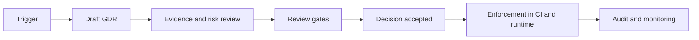

<!-- [KFM_META_BLOCK_V2]
doc_id: kfm://doc/8d81c4f9-0c61-4d9b-a5df-4f8f3c6c67a2
title: Governance Decision Record (GDR) — TEMPLATE
type: standard
version: v1
status: published
owners: TBD
created: 2026-03-02
updated: 2026-03-02
policy_label: public
related:
  - ../../ROOT_GOVERNANCE.md
  - ../../ETHICS.md
  - ../../SOVEREIGNTY.md
  - ../../REVIEW_GATES.md
tags: [kfm, governance, decision-record, template]
notes:
  - Copy this file to create a new Governance Decision Record (GDR).
  - Remove instructional text before publishing a real decision record.
[/KFM_META_BLOCK_V2] -->

# Governance Decision Record (GDR) — TEMPLATE

**Purpose:** A governed, evidence-linked record of a decision that changes KFM policy, review gates, allowed data use, access controls, redaction rules, or other “trust membrane” behavior.

> **How to use:** Copy this template to a new file in `docs/governance/records/decisions/`, rename it, and fill it in.  
> **Naming convention (recommended):** `GDR-YYYYMMDD-<short-slug>.md` (example: `GDR-20260302-sensitive-locations-redaction.md`)

---

## Quick links

- [Record metadata](#record-metadata)
- [Decision summary](#decision-summary)
- [Context](#context)
- [Decision](#decision)
- [Policy statements](#policy-statements)
- [Evidence](#evidence)
- [Impacts](#impacts)
- [Enforcement](#enforcement)
- [Rollout and rollback](#rollout-and-rollback)
- [Decision log](#decision-log)

---

## Record metadata

| Field | Value |
|---|---|
| **GDR ID** | `GDR-YYYYMMDD-<slug>` |
| **Title** | `<short decision title>` |
| **Status** | `draft` \| `review` \| `accepted` \| `rejected` \| `superseded` |
| **Decision type** | `data governance` \| `access control` \| `redaction` \| `ethics` \| `sovereignty` \| `release gate` \| `schema/contract` \| `telemetry/audit` \| `other` |
| **Scope** | `repo-wide` \| `domain:<name>` \| `dataset:<id>` \| `api:<name>` \| `ui:<route>` \| `tooling` |
| **Owner** | `<name/team>` |
| **Decision drivers** | `<1–3 bullets>` |
| **Approvers** | `<governance approvers>` |
| **Consulted** | `<domain stewards / security / legal / community review>` |
| **Date proposed** | `YYYY-MM-DD` |
| **Date accepted** | `YYYY-MM-DD` |
| **Effective date** | `YYYY-MM-DD` |
| **Review cadence** | `none` \| `quarterly` \| `annual` \| `upon trigger` |
| **Supersedes** | `<link to prior GDR(s) or ADR(s)>` |
| **Superseded by** | `<link (leave blank until superseded)>` |
| **Related issue(s)** | `<links>` |
| **Related PR(s)** | `<links>` |
| **Primary artifacts impacted** | `<paths>` |

### Decision flow

---

## Decision summary

**One-sentence decision:**  
`<What is being decided, in one sentence, with an explicit SHALL/MUST when appropriate.>`

**Why now:**  
- `<trigger/event/risk/incident/opportunity>`

**What changes:**  
- `<what will be different after this is applied>`

**What does not change:**  
- `<explicitly list non-changes to prevent accidental scope creep>`

---

## Context

### Problem statement

`<Describe the governance problem. What is ambiguous, unsafe, inconsistent, or missing today?>`

### Constraints and invariants

List the non-negotiables this decision must honor.

- [ ] **Pipeline ordering & dependency contracts remain intact**
- [ ] **API boundary remains the enforcement point for access/redaction**
- [ ] **Provenance-first publishing remains mandatory**
- [ ] **Classification propagates from inputs to outputs (no “downgrades” without review)**
- [ ] **CI gates remain fail-closed**

### Assumptions

- `<assumption 1>`
- `<assumption 2>`

### Risks if we do nothing

- `<risk 1>`
- `<risk 2>`

---

## Decision

### Decision statement

`<Write the decision as precise, testable policy. Prefer normative language: MUST/SHOULD/MAY.>`

### Rationale

- `<why this is the right tradeoff>`
- `<why alternatives are worse>`

### Alternatives considered

| Option | Summary | Pros | Cons | Why not chosen |
|---|---|---|---|---|
| A | `<...>` | `<...>` | `<...>` | `<...>` |
| B | `<...>` | `<...>` | `<...>` | `<...>` |

---

## Policy statements

> Treat this section as the “contract” that implementers and reviewers will enforce.

| # | Policy statement (normative) | Applies to | Enforcement point (CI/runtime) | Evidence required |
|---:|---|---|---|---|
| 1 | **MUST** `<policy requirement>` | `<scope>` | `<test / API middleware / build gate>` | `<artifact(s)>` |
| 2 | **SHOULD** `<policy requirement>` | `<scope>` | `<lint / advisory check>` | `<artifact(s)>` |
| 3 | **MAY** `<policy allowance>` | `<scope>` | `<manual review>` | `<artifact(s)>` |

---

## Evidence

### Primary evidence set

List concrete, checkable artifacts. Prefer repo-local paths and catalog identifiers.

- **Data / Catalog**
  - STAC: `<collection/item ids or paths>`
  - DCAT: `<dataset ids or paths>`
  - PROV: `<prov bundle path>`
- **Pipelines / Runs**
  - Config(s): `<paths>`
  - Run receipt(s) / logs: `<paths>`
  - Checksums / hashes: `<paths>`
- **API / UI / Graph**
  - API contract(s): `<OpenAPI/GraphQL/JSON Schema paths>`
  - Redaction rules: `<paths>`
  - UI route(s): `<paths>`
  - Graph ontology references: `<paths>`
- **External**
  - Source license(s): `<links>`
  - Community consent record(s): `<links>`
  - Legal guidance: `<links>`

### Evidence quality notes

- **Coverage gaps:** `<what is missing>`
- **Uncertainty:** `<known uncertainty + how it is communicated>`
- **Reproducibility:** `<how to reproduce / rerun>`

---

## Impacts

### Impacted layers

Check all that apply and describe the impact briefly.

- [ ] Data ingestion (raw/work/processed)
- [ ] Catalogs (STAC/DCAT/PROV)
- [ ] Graph (ontology, ingest, reference strategy)
- [ ] API (contracts, authz/authn, redaction, rate limits)
- [ ] UI (map/story presentation, safeguards, labeling)
- [ ] Story Nodes (citation rules, allowed claims)
- [ ] Focus Mode (hard gates, opt-in AI, sensitive data protection)
- [ ] Telemetry & audit (logging, alerts, dashboards)
- [ ] CI/CD gates (new checks, thresholds, blockers)
- [ ] Documentation (standards/templates/runbooks)

### Stakeholder impact

| Stakeholder | Impact | Mitigation / comms |
|---|---|---|
| Domain stewards | `<...>` | `<...>` |
| Governance reviewers | `<...>` | `<...>` |
| Engineers | `<...>` | `<...>` |
| Public users | `<...>` | `<...>` |

---

## Enforcement

### Where the policy is enforced

| Policy # | Mechanism | Location | “Fail closed” behavior | Owner |
|---:|---|---|---|---|
| 1 | `<CI validation>` | `tests/<...>` | `<what blocks merge/publish>` | `<team>` |
| 2 | `<API guard>` | `src/server/<...>` | `<what is redacted/blocked>` | `<team>` |
| 3 | `<UI safeguard>` | `web/<...>` | `<what is hidden/generalized>` | `<team>` |

### Tests and gates to add or update

- [ ] Add/update schema validation
- [ ] Add/update provenance completeness checks
- [ ] Add/update security scans / secret scanning
- [ ] Add/update redaction tests (golden fixtures)
- [ ] Add/update “classification propagation” tests
- [ ] Add/update Story Node citation validation (if applicable)

### Monitoring and audit

- **Telemetry signals to emit:** `<what events/metrics>`
- **Audit record requirements:** `<what must be stored to reproduce + justify>`
- **Alerting thresholds:** `<what triggers review>`

---

## Rollout and rollback

### Rollout plan

1. `<step 1>`
2. `<step 2>`
3. `<step 3>`

### Rollback plan

- **Rollback triggers:** `<what would make us revert>`
- **Rollback steps:** `<how to revert safely>`
- **Data migration considerations:** `<if applicable>`

---

## Open questions

- `<question 1>`
- `<question 2>`

---

## Decision log

| Date | Change | Author | Link |
|---|---|---|---|
| YYYY-MM-DD | Draft created | `<name>` | `<PR/commit>` |
| YYYY-MM-DD | Accepted | `<approver>` | `<PR/commit>` |
| YYYY-MM-DD | Superseded | `<name>` | `<link>` |

---

## Appendix A — “Ready for review” checklist

- [ ] Metadata table complete (owner, approvers, scope, dates)
- [ ] Decision statement is testable (MUST/SHOULD/MAY)
- [ ] Evidence list is concrete (paths/IDs, not descriptions only)
- [ ] Assumptions and risks documented
- [ ] Impacts across layers assessed
- [ ] Enforcement mapping exists (policy → CI/runtime)
- [ ] Rollout + rollback plan written
- [ ] No sensitive details leaked in the record itself (redact as needed)

---

## Appendix B — Optional: classification and redaction worksheet

> Use this when the decision touches sensitive locations, personal data, or community-restricted knowledge.

| Artifact | Classification | Sensitivity notes | Proposed redaction/generalization | Approved by | Date |
|---|---|---|---|---|---|
| `<input>` | `<public/restricted/...>` | `<...>` | `<...>` | `<...>` | `YYYY-MM-DD` |
| `<output>` | `<public/restricted/...>` | `<...>` | `<...>` | `<...>` | `YYYY-MM-DD` |
