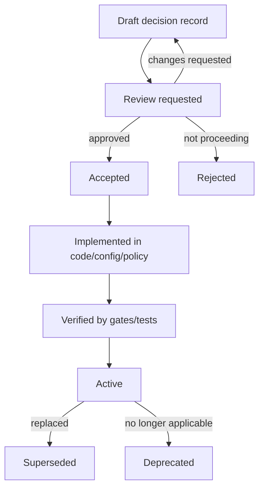

<!-- [KFM_META_BLOCK_V2]
doc_id: kfm://doc/6b5d0a66-8a5f-4c1f-8d32-2b7b991e3c0a
title: Decision Records (Governance)
type: standard
version: v1
status: draft
owners: KFM Stewards (TODO)
created: 2026-03-02
updated: 2026-03-02
policy_label: public
related:
  - ../README.md
  - ../../README.md
tags: [kfm, governance, decisions, adr]
notes:
  - This README defines how we capture, review, and supersede governance/architecture decisions as auditable artifacts.
  - Replace TODO placeholders once repo conventions (naming, CODEOWNERS, CI checks) are confirmed.
[/KFM_META_BLOCK_V2] -->

# Decision Records
Evidence-first, policy-aware “why” documents for KFM governance choices.


> **Intent:** Decisions are **part of the trust membrane**, not “extra documentation.”  
> If we can’t trace *why* we did something (and under what policy assumptions), we can’t defend it, test it, or roll it back safely.

---

## Quick navigation
- [What lives here](#what-lives-here)
- [What does not live here](#what-does-not-live-here)
- [Decision lifecycle](#decision-lifecycle)
- [File naming and structure](#file-naming-and-structure)
- [Decision record template](#decision-record-template)
- [Required fields and gates](#required-fields-and-gates)
- [Roles and review responsibilities](#roles-and-review-responsibilities)
- [How to add a new decision](#how-to-add-a-new-decision)
- [Decision index](#decision-index)
- [Appendix](#appendix)

---

## What lives here
This directory contains **Decision Records** (DRs) for KFM that:
- set or change **governance posture** (policy defaults, roles, review workflows)
- define **policy-as-code semantics** (what must be enforced in CI and runtime)
- define **evidence/citation rules** (EvidenceRef → EvidenceBundle requirements)
- change **promotion gates** or “truth path” requirements
- establish **sensitivity/rights handling** patterns (default-deny, generalization rules)
- define **audit/receipt expectations** (what we must record to reproduce decisions)

**In short:** if a choice can affect public trust, access control, provenance, or reproducibility, it belongs here.

---

## What does not live here
Do **not** put these items in this directory:
- Meeting notes, chat logs, or brainstorming docs (use a separate notes area)
- Roadmaps, backlogs, or work packages (use project planning docs)
- Runbooks / operational procedures (use runbooks)
- Purely code-level refactors with no externally visible behavior change
- Secrets, credentials, or sensitive coordinates/PII (never commit)

> **WARNING:** If content might enable targeting (e.g., precise sensitive site locations), it must be **generalized or omitted** and flagged for steward review.

---

## Decision lifecycle
We use a simple, auditable lifecycle with explicit supersession.



### Status values
Use one of:
- `draft` — being written; not yet authoritative
- `review` — awaiting steward/governance approval
- `accepted` — decision approved; implementation may still be in progress
- `active` — implemented + verified; this is the current rule
- `superseded` — replaced by a newer decision record
- `deprecated` — no longer applicable, but not replaced
- `rejected` — explicitly decided against; kept for history

---

## File naming and structure
**Default naming (PROPOSED):**
- `DEC-0001-short-slug.md`
- `DEC-0002-another-slug.md`

If the repo already uses a different convention (date-based, ADR numbering, etc.), follow the established convention and adjust this README accordingly.

**Directory layout (expected):**
```
docs/governance/records/decisions/
  README.md                      # this file
  DEC-0001-*.md                  # decision records (markdown)
  DEC-0001-*.attachments/        # optional: diagrams, exports, supporting artifacts
  templates/
    decision-record.template.md
  index.yml                      # optional: machine-readable registry (if adopted)
```

---

## Decision record template
A Decision Record MUST be readable by humans **and** enforceable by gates/tests when relevant.

Create new records by copying the template below (or `templates/decision-record.template.md` if present).

<details>
<summary><strong>Decision Record Template (copy/paste)</strong></summary>

```markdown
<!-- [KFM_META_BLOCK_V2]
doc_id: kfm://decision/<uuid>
title: <DEC-XXXX: short title>
type: standard
version: v1
status: draft
owners: <team or names>
created: YYYY-MM-DD
updated: YYYY-MM-DD
policy_label: public|internal|restricted
related:
  - <relative links or kfm:// ids>
tags: [kfm, decision]
notes:
  - <optional>
[/KFM_META_BLOCK_V2] -->

# DEC-XXXX: <Short title>

## Status
- status: draft|review|accepted|active|superseded|deprecated|rejected
- decision_date: YYYY-MM-DD
- reviewers: <names/teams>
- supersedes: <DEC-XXXX or none>
- superseded_by: <DEC-XXXX or none>

## Context
What problem are we solving? What constraints matter (trust membrane, promotion gates, policy, budget, timeline)?

## Decision
State the decision clearly and testably.
- We WILL:
- We WILL NOT:
- Success looks like:

## Rationale
Why this decision? Include tradeoffs and why alternatives were rejected.

## Alternatives considered
List options considered and the reason each was rejected or deferred.

## Impacts
### Governance & policy
- policy labels affected:
- default-deny / allow rules affected:
- new obligations introduced (e.g., “show_notice”, “generalize_geometry”):

### Data lifecycle / promotion gates
- which gates change:
- does this affect RAW/WORK/PROCESSED/CATALOG/PUBLISHED semantics?

### Security & privacy
- sensitive location handling:
- rights/licensing constraints:
- potential leakage paths (API errors, receipts/logs, metadata):

### Operational / delivery
- migration plan:
- rollout steps:
- rollback plan:

## Verification (Minimum)
List the smallest checks that prove the decision is implemented correctly.
- [ ] CI gate / policy tests updated
- [ ] Example fixtures added (valid + invalid)
- [ ] Evidence resolution still fails closed when unresolvable/unauthorized
- [ ] No restricted leakage in errors/receipts

## Evidence / References
Use KFM EvidenceRefs where possible (preferred over raw URLs):
- [CITATION: dcat://...]
- [CITATION: stac://...]
- [CITATION: prov://...]
- [CITATION: doc://...]

## Follow-ups
- [ ] Implementation issue/task link(s)
- [ ] Owner(s)
- [ ] Target milestone
```

</details>

---

## Required fields and gates
A Decision Record is “ready to accept” when it meets the minimum bar below.

### Minimum content (MUST)
- Clear statement of the **decision**
- Explicit **tradeoffs** / alternatives
- **Impacts** section (policy, lifecycle, security, operations)
- **Verification (Minimum)** checklist
- **Supersedes / superseded_by** linkage when applicable
- A **policy_label** appropriate to the content (default to `public` unless it must be restricted)

### Evidence discipline
When a decision is about:
- **policy** → MUST link to policy tests/fixtures or describe them as required follow-up
- **promotion gates / catalogs** → MUST include the contract surfaces affected (DCAT/STAC/PROV expectations)
- **citations / Focus Mode / Story publishing** → MUST state how EvidenceRefs will be validated and what “fail closed” means

> **NOTE:** If evidence is not available yet, the record MUST say so and list the **minimum verification steps** required to convert Unknown → Confirmed.

---

## Roles and review responsibilities
We assume a minimal governance model:
- **Contributor**: drafts decision record + proposes changes
- **Reviewer/Steward**: approves decisions that affect policy labels, publishing, promotion, or trust surfaces
- **Operator**: implements and runs pipelines; cannot override policy gates
- **Governance council / community stewards**: authority for culturally sensitive / restricted collections and public representation rules

### Approval expectations (baseline)
- Policy/sensitivity decisions: **Steward approval REQUIRED**
- Decisions that change promotion gates: **Steward approval REQUIRED**
- Decisions that affect restricted/cultural material handling: **Council/steward review REQUIRED**
- Purely internal process tweaks: **steward review RECOMMENDED**

---

## How to add a new decision
1. **Pick the smallest decision** you can make that is still reversible.
2. Create a new file: `DEC-XXXX-short-slug.md`
3. Fill in the template, especially:
   - Decision statement
   - Alternatives + tradeoffs
   - Verification checklist
4. Add/update the [Decision index](#decision-index).
5. Open a PR:
   - label it `governance` (and `security` / `policy` / `data-lifecycle` if applicable)
6. If accepted, ensure the PR also includes:
   - implementation changes (policy/config/code), or
   - an explicit follow-up task with owner + milestone

### Copy/paste helper
```bash
# from repo root (adjust as needed)
mkdir -p docs/governance/records/decisions/templates
cp docs/governance/records/decisions/templates/decision-record.template.md \
   docs/governance/records/decisions/DEC-0001-short-slug.md
```

---

## Decision index
> Keep this table updated. If an `index.yml` is adopted later, this table should remain as the human-friendly view.

| ID | Title | Status | Date | Owner | Supersedes | Superseded by |
|---:|---|---|---|---|---|---|
| DEC-0001 | (example) AuthN/AuthZ posture for policy labels | draft | YYYY-MM-DD | TBD | — | — |

---

## Appendix
<details>
<summary><strong>Guidance: keep decisions testable</strong></summary>

- Prefer decisions that can be enforced as **policy tests** and/or **CI gates**.
- Write the decision so that someone can implement it without needing oral context.
- If a decision introduces a new “default,” also include:
  - what the default is,
  - when it is overridden,
  - and how to detect drift.

</details>

<details>
<summary><strong>Guidance: sensitive location & rights</strong></summary>

- Do not embed precise restricted coordinates in public decision records.
- When in doubt, mark `policy_label: internal` and request steward review.
- If public representation is allowed only in generalized form, document the *generalization obligation* and how it will be recorded and tested.

</details>

---

<a id="back-to-top"></a>
**Back to top:** [Decision Records](#decision-records)
