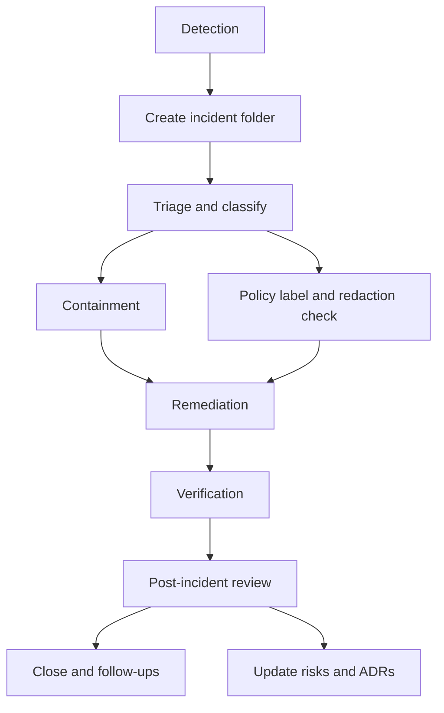

<!-- [KFM_META_BLOCK_V2]
doc_id: kfm://doc/9f3e0e7a-1c7d-4f7b-a5f8-7e9a0a2b1c3d
title: 2026 Incident Records
type: standard
version: v1
status: draft
owners: Governance
created: 2026-03-02
updated: 2026-03-02
policy_label: restricted
related:
  - docs/governance/records/incidents/README.md
  - docs/governance/ROOT_GOVERNANCE.md
tags: [kfm, governance, records, incidents, 2026]
notes:
  - Year-bucket for governed incident records.
  - Do not store secrets; capture redaction obligations and evidence pointers.
[/KFM_META_BLOCK_V2] -->

# 2026 Incident Records

> Governed, evidence-first incident records for calendar year **2026** (**America/Chicago** by default).


**Owners:** Governance (TODO: confirm via `CODEOWNERS`)  
**Scope:** incidents impacting KFM data, policy, availability, integrity, or evidence/citation guarantees

---

## Quick links

- [Purpose](#purpose)
- [Where this directory fits](#where-this-directory-fits)
- [What belongs here](#what-belongs-here)
- [What must not go here](#what-must-not-go-here)
- [Structure and naming](#structure-and-naming)
- [Categories and severity](#categories-and-severity)
- [Incident record template](#incident-record-template)
- [Workflow and gates](#workflow-and-gates)
- [FAQ](#faq)

---

## Purpose

This folder is the **year bucket** for incident records opened in **2026**.

An **incident** in this context is any event that:

- compromised (or plausibly could compromise) **correctness, integrity, availability, or governance** of KFM, **or**
- required **policy decisions**, **redactions**, **re-ingestion/re-promotion**, or **public communication**.

Each incident record is intended to be:

- **Evidence-first:** claims link to evidence (logs, receipts, tickets, datasets, screenshots) rather than memory.
- **Time-aware:** timestamps are explicit (ISO 8601) and timezone is recorded.
- **Governed:** classification, redaction obligations, and review gates are captured in the record.

[Back to top](#2026-incident-records)

---

## Where this directory fits

This directory is part of the governance records trail:

- `docs/` → human-readable docs
- `docs/governance/` → governance posture, policy mechanics, and recordkeeping
- `docs/governance/records/` → append-only artifacts of decisions and events
- `docs/governance/records/incidents/` → incident postmortems + remediation tracking
- `docs/governance/records/incidents/2026/` → incidents opened in 2026

> NOTE
> If an incident is about **data correctness**, fix it via the **truth path** (re-ingest → re-validate → re-promote)
> rather than “hot patching” published surfaces.

[Back to top](#2026-incident-records)

---

## What belongs here

Create **one folder per incident**. Include **only** the minimum necessary material to make the record auditable
and reproducible.

Allowed content:

- postmortems and timelines (Markdown)
- impact assessment and scope notes
- remediation plan and follow-up task list (with owners + due dates)
- evidence pointers (EvidenceRef strings, links to run receipts, checksums/digests)
- redaction summary and policy label decision
- attachments that are safe to store in-repo (small, sanitized, non-secret)

[Back to top](#2026-incident-records)

---

## What must not go here

> WARNING
> Treat this repo as a durable record. Assume it will be read by future maintainers and reviewers.

Do **not** commit:

- secrets (tokens, passwords, API keys, private certs)
- raw PII or sensitive personal data
- precise coordinates for vulnerable/private/culturally restricted sites (use coarse geography + redaction note)
- exploit instructions, working payloads, or detailed attacker tradecraft
- large binary dumps (pcaps, full DB backups, unredacted logs)

If you need to reference restricted material, store it in the appropriate secure system and add a **pointer + access note** instead.

[Back to top](#2026-incident-records)

---

## Structure and naming

### Recommended incident ID format

`INC-YYYY-NNNN[-short-slug]`

- `YYYY`: year opened
- `NNNN`: zero-padded sequence within the year (`0001`, `0002`, …)
- `short-slug`: optional, lowercase, hyphenated

Examples:

- `INC-2026-0001-api-availability`
- `INC-2026-0002-policy-regression`

### Directory layout

```text
docs/governance/records/incidents/2026/
├── README.md
├── INC-2026-0001-<slug>/
│   ├── README.md            # canonical incident record (required)
│   ├── timeline.md          # optional: detailed timeline
│   ├── impact.md            # optional: impact + blast radius
│   ├── remediation.md       # optional: remediation + follow-ups
│   ├── evidence/            # required if evidence is referenced
│   │   └── README.md        # evidence pointers (hashes, receipts, links)
│   └── receipts/            # optional: sanitized run receipts or pointers
│       └── README.md
└── INC-2026-0002-<slug>/
    └── ...
```

> TIP
> Keep each incident’s `README.md` short and scannable; push deep detail into the sidecar docs.

### Minimal index

Maintain a lightweight index table in **this** README (append-only). If the table grows too large, create `INDEX.md` in this folder
and link it from here.

| Incident ID | Opened (CT) | Status | Category | One-line summary |
|---|---:|---|---|---|
| _TBD_ |  |  |  |  |

[Back to top](#2026-incident-records)

---

## Categories and severity

### Category taxonomy (recommended)

| Category | Examples |
|---|---|
| Data pipeline | schema drift, failed ingest, incorrect transform, checksum mismatch |
| Catalog/provenance | broken STAC/DCAT/PROV links, invalid metadata, missing receipts |
| Policy & governance | policy regression, obligation not enforced, leakage risk |
| Availability | API outage, UI outage, index rebuild failure |
| Security | suspected compromise, unauthorized access attempt, secret exposure |
| Quality | incorrect geometry/projection, stale dataset version, invalid time range |

### Severity levels (starter)

| Severity | Typical impact | Typical response |
|---|---|---|
| Sev 0 | confirmed leak or major integrity breach | immediate escalation + containment |
| Sev 1 | platform down or critical user-facing failure | rapid mitigation + comms plan |
| Sev 2 | partial degradation or limited-scope integrity issue | fix plan + near-term follow-ups |
| Sev 3 | low-risk defect, near miss | document + backlog + monitoring |

> NOTE
> Severity is about **impact and urgency**, not blame.

[Back to top](#2026-incident-records)

---

## Incident record template

Create `docs/governance/records/incidents/2026/INC-YYYY-NNNN-<slug>/README.md` with:

```markdown
<!-- [KFM_META_BLOCK_V2]
doc_id: kfm://doc/<uuid>
title: INC-2026-0001: <title>
type: standard
version: v1
status: draft|review|published
owners: <team>
created: 2026-03-02
updated: 2026-03-02
policy_label: restricted|public
related:
  - <tickets, ADRs, PRs, receipts>
tags: [kfm, incident, 2026]
notes:
  - <short notes>
[/KFM_META_BLOCK_V2] -->

# INC-2026-0001: <title>

## Summary
- **What happened:** …
- **Impact:** …
- **Current status:** open|mitigated|closed
- **Primary owner:** …

## Timeline (ISO 8601, with timezone)
| Time | Event | Evidence |
|---|---|---|
| 2026-03-02T09:12:00-06:00 | Detected anomaly in … | <EvidenceRef or link> |

## Scope
- Affected systems: …
- Affected datasets / versions: …
- Policy labels involved: …

## Root cause
…

## Detection and response
…

## Remediation
- Immediate mitigations:
  - [ ] …
- Long-term fixes:
  - [ ] …

## Policy, redaction, and disclosure
- Chosen `policy_label`: …
- Redactions performed: …
- Public-facing summary (if any): …

## Lessons learned
…

## Follow-ups
- [ ] Action item (owner, due date)
```

[Back to top](#2026-incident-records)

---

## Workflow and gates

### Incident lifecycle



### Definition of Done

Before closing an incident record, ensure:

- [ ] Unique incident ID + folder created under `2026/`
- [ ] Summary includes **impact** and **scope**
- [ ] Timeline contains explicit timestamps and timezone
- [ ] Root cause documented (or explicitly “unknown” with next steps)
- [ ] Evidence pointers included for key claims (logs, receipts, PRs)
- [ ] Policy label set and redactions recorded
- [ ] Remediation tasks captured with owners + due dates
- [ ] Post-incident review notes captured (what to change in code/policy/process)

### When incidents touch data promotion

If the incident requires correcting published data:

1. **Do not patch PUBLISHED outputs in place.**
2. Re-run the pipeline following the truth path (`RAW → WORK/QUAR → PROCESSED → CATALOG → PUBLISHED`).
3. Ensure new dataset versions are linked to provenance + receipts and pass validators before exposure.

[Back to top](#2026-incident-records)

---

## FAQ

### Are these records public?

Default is **restricted** unless a governance decision explicitly marks content safe for public release.

If a public disclosure is required, produce a **sanitized public summary** in the incident folder (e.g., `public_summary.md`) and
keep restricted details in the main record.

### What if we don’t have all the evidence yet?

Create the record early with known facts and placeholders. Add evidence pointers as they become available.
Avoid speculative statements; mark unknowns explicitly.

### Can we attach logs or screenshots?

Only if they are sanitized, small, and policy-cleared. Otherwise store externally and include:

- an access-controlled location
- checksum/digest
- a brief access request process

[Back to top](#2026-incident-records)
