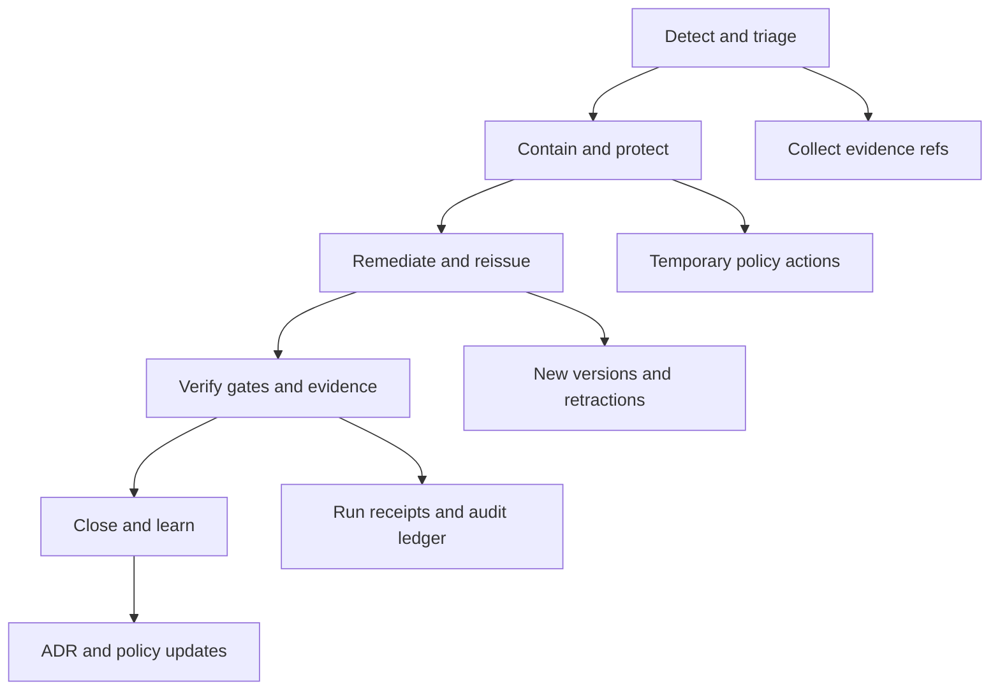

<!-- [KFM_META_BLOCK_V2]
doc_id: kfm://doc/6c2dc5c8-0c37-4d0c-90f7-79cc55bf4a3b
title: Incident Record Template
type: standard
version: v1
status: published
owners: <steward/team>
created: 2026-03-02
updated: 2026-03-02
policy_label: public
related:
  - docs/governance/records/incidents/
tags: [kfm, governance, incidents, records, template]
notes:
  - Template only. Individual incident records may be restricted.
  - Keep evidence references + audit linkage first-class.
[/KFM_META_BLOCK_V2] -->

# KFM Incident Record Template
Evidence-first incident record for KFM governance + operations.

> [!WARNING]
> **Do not commit sensitive details** (restricted coordinates, secrets, personal data, or partner-confidential info)
> into a public repo. Use redaction, generalize locations, and/or split into:
> - **Public summary** (this file, redacted)
> - **Restricted annex** (secured storage / restricted repo)

## Quick navigation
- [1. Metadata](#1-metadata)
- [2. Executive summary](#2-executive-summary)
- [3. Detection and signals](#3-detection-and-signals)
- [4. Scope and impact](#4-scope-and-impact)
- [5. Timeline](#5-timeline)
- [6. Containment](#6-containment)
- [7. Remediation](#7-remediation)
- [8. Communications](#8-communications)
- [9. Post-incident review](#9-post-incident-review)
- [10. Evidence and attachments](#10-evidence-and-attachments)

---

## How to use this template
1. Copy this file to a new incident record:
   - `docs/governance/records/incidents/INCIDENT-YYYY-MM-DD-<short-slug>.md`
2. Fill **all REQUIRED** fields.
3. Link evidence first: run receipts, audit refs, policy decisions, hashes/digests, PRs.
4. If anything is uncertain, **fail closed** and escalate.

---

## Incident lifecycle

---

## 1. Metadata

| Field | Value |
|---|---|
| **Incident ID (REQUIRED)** | `kfm://incident/YYYY-MM-DD.<slug>` |
| **Title (REQUIRED)** | `<short title>` |
| **Status (REQUIRED)** | `draft \| investigating \| contained \| remediating \| monitoring \| closed` |
| **Severity (REQUIRED)** | `SEV-1 \| SEV-2 \| SEV-3 \| SEV-4` |
| **Incident type (REQUIRED)** | _Choose one:_ `restricted_data_leakage \| licensing_violation_risk \| corrupted_catalogs_or_citations \| nondeterministic_pipeline` |
| **Reported by** | `<name or principal>` |
| **Incident commander** | `<name>` |
| **Steward contact** | `<name/handle>` |
| **Operator contact** | `<name/handle>` |
| **Governance council contact** | `<name/handle>` |
| **Created at (REQUIRED)** | `YYYY-MM-DDThh:mm:ssZ` |
| **Last updated at (REQUIRED)** | `YYYY-MM-DDThh:mm:ssZ` |
| **Detected at (REQUIRED)** | `YYYY-MM-DDThh:mm:ssZ` |
| **Contained at** | `YYYY-MM-DDThh:mm:ssZ` |
| **Resolved at** | `YYYY-MM-DDThh:mm:ssZ` |
| **Policy label of this record** | `public \| restricted` |
| **Related tickets/PRs** | `<links>` |

### REQUIRED checkboxes
- [ ] Detection signals captured
- [ ] Escalation contacts captured
- [ ] Containment steps captured
- [ ] Remediation steps captured (**including retraction/new versions when relevant**)
- [ ] Post-incident review captured (**ADR + policy updates**)  
- [ ] Evidence references added (run receipts, audit refs, policy decisions, hashes)

---

## 2. Executive summary

### What happened (REQUIRED)
<2–6 sentences. What broke, where, and why it matters. Avoid speculation.>

### User impact (REQUIRED)
- **Who was affected:** `<public users / internal users / partner users / none>`
- **What they saw:** `<incorrect data / denied access / missing tiles / broken citations / etc.>`
- **Duration:** `<start> → <end>`

### Trust impact (REQUIRED)
- **Trust membrane risk:** `<none/low/med/high>`
- **Evidence integrity risk:** `<none/low/med/high>`
- **Policy enforcement risk:** `<none/low/med/high>`

---

## 3. Detection and signals

### Detection signals (REQUIRED)
List the concrete signals that triggered this incident.

- **Signal 1:** `<alert name / test failure / user report>`
  - **Observed symptom:** `<what>`
  - **Where:** `<service/pipeline/ui>`
  - **First seen:** `<timestamp>`
  - **Links:** `<dashboard/log query link>`

### Observability references (REQUIRED)
> Use these to stitch the story together across logs, traces, and receipts.

- **correlation_id(s):** `<id, id, id>`
- **audit_ref(s):** `<id, id, id>`
- **Affected endpoint(s):** `<e.g., /api/v1/stac/items …>`
- **Affected job/run labels:** `<pipeline name, run label>`

---

## 4. Scope and impact

### Affected governed surfaces (REQUIRED)
Fill what you know; **leave unknowns explicit**.

#### Data artifacts
- **Dataset(s):** `<dataset_id(s)>`
- **Dataset version(s):** `<dataset_version_id(s)>`
- **Artifact URIs:** `<raw/... processed/... catalog/...>`
- **Artifact digests:** `<sha256:...>`

#### Catalog and citations
- **STAC collection/item IDs:** `<...>`
- **DCAT dataset/distribution IDs:** `<...>`
- **PROV/run graph links:** `<...>`
- **Broken EvidenceRef(s):** `<...>` (if applicable)

#### Policy and obligations
- **policy_decision_id(s):** `<kfm://policy_decision/...>`
- **Reason codes:** `<...>`
- **Obligations applied:** `<generalize geometry / remove attributes / disable downloads / etc.>`

> [!NOTE]
> If this incident includes sensitive locations or restricted topics, document how geometry/attributes were
> generalized or withheld, and where the restricted details live (restricted annex).

### Impact assessment
- **Data correctness:** `<ok/incorrect/unknown>`
- **Availability:** `<ok/degraded/outage>`
- **Security/privacy:** `<ok/exposure suspected/exposure confirmed>`
- **Licensing:** `<ok/at risk/violated>`

---

## 5. Timeline

| Time (UTC) | Actor | Event | Evidence refs | Decision / outcome |
|---|---|---|---|---|
| `<ts>` | `<name/principal>` | `<what happened>` | `<run_id / audit_ref / PR>` | `<result>` |
| `<ts>` |  |  |  |  |

> [!TIP]
> Prefer short, high-signal entries. Link to receipts and audit refs rather than pasting raw logs.

---

## 6. Containment

### Immediate containment steps (REQUIRED)
- [ ] Step: `<e.g., disable downloads for dataset X>`
  - Owner: `<name>`
  - Time: `<timestamp>`
  - Verification: `<how you confirmed containment>`
  - Evidence: `<audit_ref/run_id/PR>`

### Temporary policy actions (if any)
- `<deny rules enabled / feature flag set / endpoint blocked / export disabled / etc.>`

### Rollback / retraction actions (if any)
- `<what was rolled back or retracted>`
- `<how consumers are prevented from using the bad version>`

---

## 7. Remediation

### Root cause (REQUIRED)
- **Direct cause:** `<what directly caused the issue>`
- **Contributing factors:** `<missing gate, missing test, unclear policy, human error, etc.>`
- **Why it wasn’t caught:** `<which gate/check should have caught it>`

### Remediation plan (REQUIRED)
- [ ] Fix implementation: `<PR link>`
- [ ] Add/expand tests: `<policy tests / contract tests / link checker / determinism checks>`
- [ ] Rebuild/reprocess: `<pipeline rerun>`
- [ ] Re-publish: `<new dataset_version_id>`
- [ ] Catalog validation: `<STAC/DCAT/PROV validation outcome>`
- [ ] Evidence verification: `<citations resolve / evidence drawer ok>`

### Versioning and re-issue (REQUIRED when data/catalog is affected)
- **Retracted version(s):** `<dataset_version_id(s)>`
- **Replacement version(s):** `<dataset_version_id(s)>`
- **Migration notes:** `<what changed, how to compare, where diffs live>`
- **Promotion chain:** `<link to promotion manifest(s) / run receipts>`

---

## 8. Communications

### Escalations (REQUIRED)
- Steward notified: `<yes/no> @ <timestamp>`
- Operator notified: `<yes/no> @ <timestamp>`
- Governance council notified: `<yes/no> @ <timestamp>`
- Legal/compliance notified (if applicable): `<yes/no> @ <timestamp>`

### User communication (if applicable)
- Channel: `<status page / email / release notes / none>`
- Summary: `<what we told users>`
- Follow-ups: `<what we owe them>`

---

## 9. Post-incident review

### What we learned (REQUIRED)
- `<bullet list>`

### Prevent recurrence (REQUIRED)
- [ ] Add gate/check: `<what>`
- [ ] Add policy fixture tests: `<what>`
- [ ] Update runbook/template: `<what>`
- [ ] Update training/onboarding: `<what>`

### ADR(s) and policy updates (REQUIRED)
- ADR link(s): `<docs/adr/ADR-....md>`
- Policy update PR(s): `<link>`
- New/updated reason codes or obligations: `
`

---

## 10. Evidence and attachments

### Evidence index (REQUIRED)
List the authoritative artifacts that support this incident record.

#### Run receipts
- `run_id:` `<kfm://run/...>` → `<link/path>`
- `run_id:` `<kfm://run/...>` → `<link/path>`

#### Audit ledger references
- `audit_ref:` `<...>` → `<link/path or query>`

#### Policy decisions
- `policy_decision_id:` `<kfm://policy_decision/...>` → `<link/path>`

#### Catalog validation outputs
- `<stac validation report digest/link>`
- `<dcat validation report digest/link>`
- `<prov validation report digest/link>`

#### PRs / commits
- `<PR link(s)>`
- `<commit hash(es)>`

Restricted annex pointer (if needed)

- Location: `<restricted path/system>`
- Owner: `<name>`
- Contents: `<what is inside>`
- Access policy: `<who can read>`

---

## Appendix: Incident type guidance (fill in what applies)

### restricted_data_leakage
- Suspected leakage vector:
- Containment approach:
- Redaction/generalization plan:

### licensing_violation_risk
- Rights status:
- Asset handling mode (full content vs thumbnails vs metadata-only):
- Remediation:

### corrupted_catalogs_or_citations
- Broken surfaces (STAC/DCAT/PROV/EvidenceRefs):
- Link-check outputs:
- Remediation:

### nondeterministic_pipeline
- Determinism failure symptom:
- Inputs/params/environment captured:
- Remediation (pin versions, canonicalize inputs, lock params, add determinism tests):
