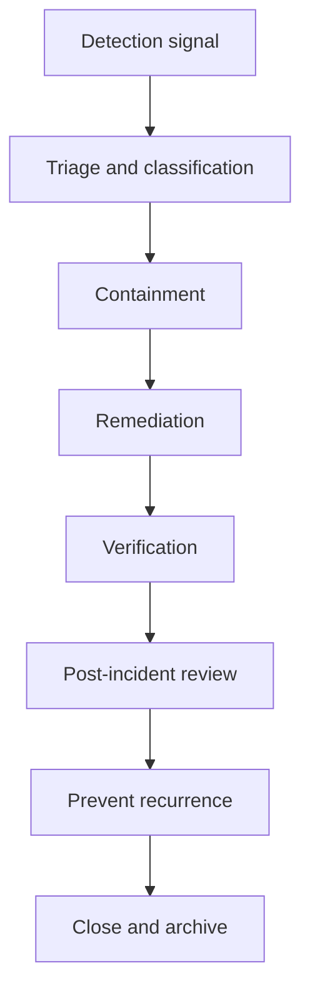

<!-- [KFM_META_BLOCK_V2]
doc_id: kfm://doc/7c4b10d0-9b3b-4c35-9d31-b7b2fb8c40d3
title: Governance Incident Records
type: standard
version: v1
status: draft
owners: [TODO: set CODEOWNERS group]
created: 2026-03-02
updated: 2026-03-02
policy_label: restricted
related:
  - docs/governance/ROOT_GOVERNANCE.md
  - docs/governance/REVIEW_GATES.md
  - docs/governance/records/reviews/README.md
tags: [kfm, governance, records, incidents]
notes:
  - "Canonical home for KFM governance incident records (evidence-first postmortems + corrective actions)."
[/KFM_META_BLOCK_V2] -->

# 🧯 Governance Incident Records
Evidence-first records for **KFM governance incidents** (policy/rights/provenance/determinism).  
These records exist so every incident ends with: **containment + remediation + prevention** (tests/policy/ADR), not “tribal memory.”


---

## Quick navigation
- [Purpose and scope](#purpose-and-scope)
- [What belongs here](#what-belongs-here)
- [What must not go here](#what-must-not-go-here)
- [When to open an incident](#when-to-open-an-incident)
- [Incident lifecycle](#incident-lifecycle)
- [Directory layout and naming](#directory-layout-and-naming)
- [Incident record template](#incident-record-template)
- [Closure checklist](#closure-checklist)
- [Related governance docs](#related-governance-docs)

---

## Purpose and scope
This directory is the **canonical repo home** for incident records that affect KFM’s trust membrane and truth path, including:
- accidental **restricted data leakage**
- **licensing/rights** violations or risk of violation
- **broken citations / corrupted catalogs / evidence resolver failures**
- **non-deterministic pipelines** (same inputs/spec → different outputs)

> NOTE  
> This is **not** the place for domain “incident events” datasets (e.g., traffic incidents).  
> This folder is for **platform/governance incidents** and their remediation.

---

## What belongs here
✅ **Allowed inputs**
- Incident postmortems (sanitized)
- Decision records: what was contained, what was rolled back/released, and why
- Links (or digests/pointers) to evidence artifacts:
  - run receipts
  - policy decision IDs
  - catalog diffs (STAC/DCAT/PROV)
  - validation reports
  - release/retraction manifests
- Follow-up actions and completion status
- References to ADRs and policy/test changes made due to the incident

✅ **Outputs**
- A single “source of truth” incident narrative for future reviewers
- A checklist of preventive controls added (tests, policy, gates, monitors)

---

## What must not go here
🚫 **Never commit**
- secrets, API keys, tokens, kubeconfigs, credentials, private keys
- exploit chains / step-by-step attack instructions / detailed IOCs (store in a secured IR system)
- PII (names, emails, phone numbers) unless explicitly approved + necessary + redacted
- restricted coordinates or identifiers that would enable targeting

> WARNING  
> If you’re unsure whether something is safe to commit, **fail closed**: keep the incident record as **restricted** and store sensitive details in an access-controlled system. Only commit a sanitized summary + pointers/digests.

---

## When to open an incident
Open an incident record when any of the following are true:
- A governance control failed (policy bypass, denied-by-default not enforced)
- A published artifact is suspected to violate license/rights constraints
- A published story, API response, tile, or Focus response contains restricted content
- Citations/evidence resolution breaks (cannot reproduce or trace claims)
- Pipeline determinism breaks (same inputs/spec → different outputs)

---

## Incident lifecycle



### Minimum required outcomes
- **Containment**: stop further harm (deny access, disable publish, block promotion, retract surface)
- **Remediation**: fix root cause and publish corrected versions (or roll back)
- **Prevention**: encode new guards (tests/policy/gates) so it fails closed next time

---

## Directory layout and naming

### Recommended structure
```
docs/governance/records/incidents/
  README.md
  index.yml                       # optional: machine-readable incident index
  INC-YYYY-MM-DD-###/             # one folder per incident (recommended)
    incident.md                   # main record (sanitized)
    timeline.md                   # timestamped actions + decisions
    action_items.md               # owners + due dates + completion evidence
    attachments/                  # pointers/digests only (no secrets)
      evidence_refs.md
```

### Naming conventions
- Folder: `INC-YYYY-MM-DD-###` (example: `INC-2026-03-02-001`)
- Primary record: `incident.md`
- If the incident is tied to a dataset release/retraction, include:
  - `dataset_version_id` (if applicable)
  - release manifest ID/digest (if applicable)

---

## Incident record template

Create `incident.md` using the template below.

```md
---
incident_id: INC-YYYY-MM-DD-###
title: "<short, non-sensational summary>"
status: open | mitigated | closed
severity: S0 | S1 | S2 | S3 | S4   # see notes below (PROPOSED scale)
policy_label: restricted
opened_at: "YYYY-MM-DDTHH:MM:SSZ"
closed_at: "YYYY-MM-DDTHH:MM:SSZ" # optional
owners:
  incident_commander: "@handle-or-team"
  steward: "@handle-or-team"
  operator: "@handle-or-team"
review:
  postmortem_required: true
  adr_required: true
---

# Summary
What happened, in 2–4 sentences. Avoid speculation.

# Impact
- Affected surfaces: API | tiles | catalog | story | Focus | pipeline | graph
- Data/classes potentially exposed or impacted (coarse)
- User impact (who, how many, how long) — if known

# Detection
- Signal(s): alert name, report channel, regression test failure, external notice
- First observed: timestamp
- How we confirmed: evidence pointers (below)

# Classification
- Incident type: restricted leakage | licensing risk | broken citations | nondeterminism | other
- Policy label at time of incident: <public|restricted|...>
- Decision: contain now vs continue service (include rationale)

# Timeline (high-level)
| Time (UTC) | What happened | Who | Evidence/audit ref |
|---|---|---|---|
| ... | ... | ... | ... |

# Containment
Actions taken to stop further harm. Include:
- policy blocks enabled
- endpoints disabled / layers removed
- publication halted / promotion blocked
- temporary obligations applied (generalize/remove fields)

# Remediation
Root cause + fix.
- What changed (code/policy/data)
- What was retracted and what was republished (new versions)
- How we ensured deterministic rebuilds (if relevant)

# Verification
How we proved the fix worked:
- CI gates passing
- catalogs validate and cross-link
- evidence resolves
- policy tests (deny-by-default) updated + passing
- manual spot checks (documented)

# Prevention / Follow-ups
List changes that prevent recurrence:
- new tests
- new policy rules
- new monitors/alerts
- new review gates

# Action items
Link to `action_items.md`.

# Evidence pointers (no secrets)
Provide digests/IDs/links that a steward can resolve:
- run_receipts:
  - kfm://run/<id>
- audit_refs:
  - kfm://audit/<id>
- policy_decisions:
  - kfm://policy_decision/<id>
- catalogs:
  - stac: <collection/item IDs>
  - dcat: <dataset/distribution IDs>
  - prov: <bundle/activity IDs>

# Post-incident review
- ADR(s): links
- Policy updates: links
- What we will do differently next time
```

### Severity scale (PROPOSED)
> TODO: Confirm official KFM severity model (if any) and replace.
- **S0**: confirmed restricted leakage or legal exposure
- **S1**: high likelihood of leakage/rights violation; urgent remediation required
- **S2**: integrity failure (broken citations, corrupted catalogs) impacting trust surface
- **S3**: operational failure with limited scope (pipeline failures, partial outages)
- **S4**: near-miss / caught by gate before publish

---

## Closure checklist

Before setting an incident to `closed`, ensure:

- [ ] **Containment** documented (what stopped the harm)
- [ ] **Remediation** documented (what fixed the cause)
- [ ] **Retraction/new versions** recorded (if anything was published incorrectly)
- [ ] **Verification evidence** attached (CI gates, catalog validation, policy tests, smoke checks)
- [ ] **Post-incident review** complete (ADR + policy/test updates)
- [ ] **Follow-ups** tracked in `action_items.md` with owners and dates
- [ ] **Sanitization** confirmed (no secrets/PII/restricted coords)

---

## Related governance docs
> NOTE: Paths may differ by repo version. Update links to match the actual repo.

- `docs/governance/ROOT_GOVERNANCE.md` (governance overview)
- `docs/governance/REVIEW_GATES.md` (promotion/review gates)
- `docs/governance/safety_checks.md` (sensitivity & redaction checklist)
- `docs/governance/records/reviews/README.md` (review records)
- `docs/governance/records/adr/` (architecture decision records)

---

## Appendix: Optional index file (for automation)

If you maintain an `index.yml`, keep it minimal and machine-readable:

```yaml
# docs/governance/records/incidents/index.yml
version: 1
incidents:
  - incident_id: INC-2026-03-02-001
    title: "Broken citations due to catalog link regression"
    status: closed
    severity: S2
    opened_at: "2026-03-02T14:20:00Z"
    closed_at: "2026-03-02T20:55:00Z"
    affected_surfaces: ["catalog", "story"]
    policy_label: restricted
    links:
      record: "./INC-2026-03-02-001/incident.md"
      adr: "../adr/ADR-YYYY-###.md"
```

---

<details>
<summary>Why this folder exists (operational philosophy)</summary>

- Governance must be a **repeatable workflow**, not an ad hoc decision.
- An incident record is a **governed artifact**: it should be reviewable, auditable, and tied to concrete remediation and prevention.

</details>
