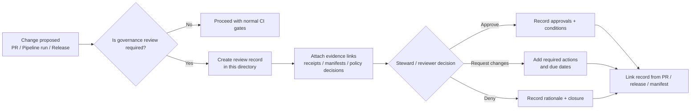

<!-- [KFM_META_BLOCK_V2]
doc_id: kfm://doc/afc3b543-6ed1-4df0-a875-e6ea9ddd2baf
title: Governance Reviews — 2026
type: standard
version: v1
status: draft
owners: TBD
created: 2026-03-02
updated: 2026-03-02
policy_label: public
related:
  - docs/governance/REVIEW_GATES.md  # if present
tags: [kfm, governance, records, reviews, 2026]
notes:
  - Index + operating rules for governance review records created in calendar year 2026.
[/KFM_META_BLOCK_V2] -->

# Governance Reviews — 2026

> Human sign-offs & rationale that **supplement automated gates** (policy, promotion, sovereignty, security) for KFM changes made in 2026.


---

## Quick navigation

- [What this directory is](#what-this-directory-is)
- [When a review is required](#when-a-review-is-required)
- [Directory layout](#directory-layout)
- [How to add a review record](#how-to-add-a-review-record)
- [Review record template](#review-record-template)
- [Rules and exclusions](#rules-and-exclusions)
- [FAQ](#faq)

---

## What this directory is

This folder is the **canonical index for 2026 governance review records**. Each record captures:

- **What changed** (dataset, policy, story, system surface, release)
- **Why it changed** (rationale + risks)
- **What evidence supports it** (links to receipts/manifests/evidence bundles)
- **Who approved it** (roles + timestamps)
- **What follow-ups are required** (tickets, mitigations, audits)

> **Design intent:** KFM relies on automated validation gates, but certain actions require a human governance layer. Review records are that layer.

[Back to top](#governance-reviews--2026)

---

## When a review is required

A review record is required when a change has governance impact or increases risk. Common triggers:

| Trigger | Examples | Why a review |
|---|---|---|
| **Policy label / sensitivity change** | Reclassify dataset/story; add new redaction rule | Prevent accidental exposure; ensure consent/procedure |
| **Promotion approval / release sign-off** | Steward approval for a dataset version being published | Make approvals auditable and reproducible |
| **Exception / waiver** | Temporary bypass of a non-safety gate due to incident | Record rationale and expiry; prevent “forever exceptions” |
| **Story publish approval** | Publishing Story Nodes that will be user-facing | Ensure citations resolve; prevent non-resolvable claims |
| **Security / incident review** | Leakage, bypass attempt, suspicious access | Establish learning + harden controls |

> If your change touches **rights/licensing**, **sensitive locations**, **PII**, **export controls**, or **policy enforcement**, assume a review is required.

[Back to top](#governance-reviews--2026)

---

## Review workflow diagram



[Back to top](#governance-reviews--2026)

---

## Directory layout

> This is the **recommended** structure. If the repo uses a different layout, keep the same *semantics*:
> year bucket → stable IDs → evidence links → approvals.

```text
docs/governance/records/reviews/2026/
├── README.md                          # you are here
├── 2026-01/                           # optional month buckets
│   ├── 2026-01-15__policy-label-change__REV-2026-0001.md
│   └── assets/                        # optional (redacted) attachments
├── 2026-02/
│   └── ...
├── 2026-03/
│   └── ...
└── index.jsonl                        # optional machine-readable index (recommended)
```

### Naming conventions (recommended)

- **Folder:** `YYYY-MM/`
- **File:** `YYYY-MM-DD__<short-slug>__REV-YYYY-NNNN.md`
- **Stable ID:** `REV-2026-0001` (monotonic within year)

[Back to top](#governance-reviews--2026)

---

## How to add a review record

1. **Create the file** in the month folder (create the month folder if missing).
2. Paste the [template](#review-record-template).
3. Fill in:
   - scope (dataset/story/policy/system)
   - decision (approve / deny / approve-with-conditions)
   - evidence links (receipts, manifests, EvidenceBundles)
   - approvals (role + principal + timestamp)
4. If attachments are needed:
   - prefer **links to immutable artifacts** (receipts/manifests) over screenshots
   - store **only redacted** attachments under `assets/`
5. Link the review record from the initiating artifact:
   - PR description
   - release notes / release manifest
   - dataset promotion manifest (when applicable)

[Back to top](#governance-reviews--2026)

---

## Review record template

Copy/paste into a new file:

```md
<!-- [KFM_META_BLOCK_V2]
doc_id: kfm://doc/<uuid>
title: Review — <short title>
type: standard
version: v1
status: review
owners: <steward/team>
created: YYYY-MM-DD
updated: YYYY-MM-DD
policy_label: public|restricted
related:
  - <PR link or path>
  - <dataset_version_id or story id>
tags: [kfm, governance, review, 2026]
notes:
  - REV-2026-XXXX
[/KFM_META_BLOCK_V2] -->

# Review: <short title> (REV-2026-XXXX)

## Summary
- **Decision:** approve | deny | approve-with-conditions
- **Scope:** dataset | story | policy | system | release
- **Effective date:** YYYY-MM-DD
- **Expiry (if exception):** YYYY-MM-DD or none

## Trigger
What event caused this review? (classification change, promotion approval, exception request, incident, etc.)

## Change description
What is changing, concretely? Prefer diffs and identifiers over prose.

## Evidence & provenance
Provide links/IDs, not screenshots:
- Run receipt: `kfm://run/...` or path
- Promotion manifest: `kfm://release/...` or path
- Policy decision: `kfm://policy_decision/...` or path
- Evidence bundles: `kfm://evidence_bundle/...` or path

## Risk assessment
- Primary risks:
- Mitigations:
- Residual risk:

## Policy & obligations
- policy_label:
- obligations applied (e.g., generalize geometry, suppress export):
- “no output less restricted than input” check:

## Approvals
| Role | Principal | Approved at (UTC) | Notes |
|---|---|---|---|
| steward | <id> | YYYY-MM-DDTHH:MM:SSZ |  |

## Conditions / follow-ups
- [ ] Action 1 (owner, due date)
- [ ] Action 2 (owner, due date)

## Audit notes
Anything future reviewers need to reproduce this decision (hashes, inputs, gating context).

```

[Back to top](#governance-reviews--2026)

---

## Rules and exclusions

### Hard rules

- **Default-deny when unsure.** If rights, sensitivity, or citations are unclear, do not approve publication.
- **No unredacted sensitive details** in public review records.
- **Prefer stable IDs** over free-form descriptions: dataset_version_id, run_id, manifest digest, etc.
- **Link to evidence** rather than re-stating it.

### What does *not* belong here

- secrets, credentials, tokens
- unredacted PII
- precise coordinates/locations for restricted sites
- raw datasets or large binary artifacts (use governed storage and reference digests instead)
- “tribal knowledge” decisions without rationale and evidence links

[Back to top](#governance-reviews--2026)

---

## FAQ

### “Isn’t CI enough?”
CI should enforce **automatable** gates. Reviews cover **governance judgments** (consent, ethics, exceptions, risk acceptance) and make those decisions auditable.

### “Where do restricted reviews go?”
If a review must include restricted details, create a **restricted** record (policy_label = restricted) and keep this public index sanitized with links/IDs only.
