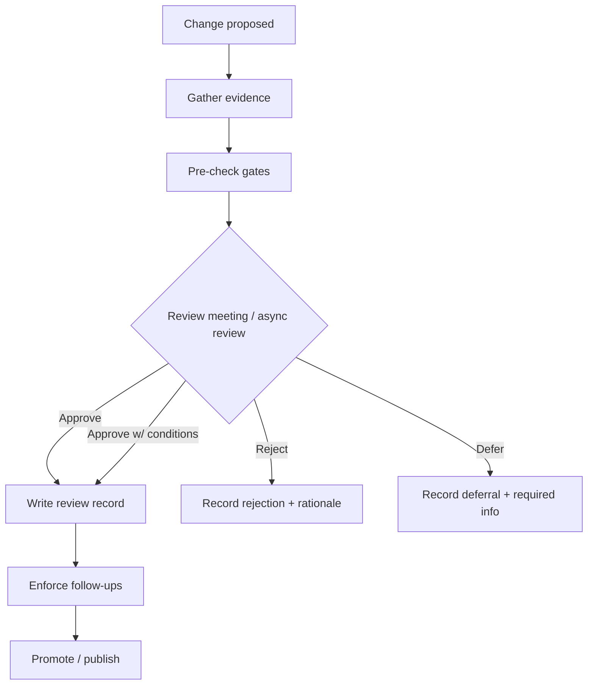

<!-- [KFM_META_BLOCK_V2]
doc_id: kfm://doc/8b0d3b0a-5a7a-4f0f-9a2f-2c9e9e8f2c1a
title: Governance Review Records
type: standard
version: v1
status: draft
owners: governance
created: 2026-03-02
updated: 2026-03-02
policy_label: public
related:
  - kfm://doc/TODO-trust-membrane
  - kfm://doc/TODO-promotion-contract
tags:
  - kfm
  - governance
  - records
  - reviews
notes:
  - Append-only recordkeeping for governance reviews.
  - Templates included; customize with project-specific gates.
[/KFM_META_BLOCK_V2] -->

# Governance Review Records
**Append-only review records for policy, data promotion, story publishing, and architecture changes.**


> **Purpose:** This folder is the canonical, human-readable “paper trail” of governance decisions.
> Every materially impactful decision should have a review record that links to evidence, policies, and follow-up actions.

---

## Quick navigation
- [What belongs here](#what-belongs-here)
- [Where this fits in the repo](#where-this-fits-in-the-repo)
- [Review types](#review-types)
- [Naming, placement, and immutability rules](#naming-placement-and-immutability-rules)
- [Minimum contents for every review](#minimum-contents-for-every-review)
- [Templates](#templates)
- [Checklists](#checklists)
- [Back to top](#governance-review-records)

---

## What belongs here

✅ **Acceptable inputs**
- **Review records** documenting a decision, with:
  - decision outcome (approve / approve-with-conditions / reject / defer),
  - scope,
  - evidence & citations,
  - policy label + redaction obligations,
  - risks + mitigations,
  - required follow-ups (tickets/PRs),
  - sign-offs.
- **Review attachments** that are safe to store in-repo (small, non-sensitive artifacts such as screenshots of CI results, small diff summaries, checklists, etc.).

🚫 **Exclusions**
- **No raw datasets, exports, or sensitive payloads**. Do not embed restricted coordinates, personal data, or culturally sensitive site details.
- **No “working notes”** that aren’t a decision record. Use issues/PRs for discussion; only finalize here.
- **No edits that rewrite history**: corrections must be captured as a *new* review record that references the prior one.

---

## Where this fits in the repo

This directory is part of the governance record system:

- `docs/` → human-readable governance & engineering documentation
- `docs/governance/records/` → append-only records
- `docs/governance/records/reviews/` → **decision records** created at governance checkpoints

### Recommended sub-structure (optional, but encouraged)

```text
docs/governance/records/reviews/
  README.md
  templates/
    review_record.template.md
    dataset_promotion_review.template.md
    story_publish_review.template.md
    policy_change_review.template.md
  YYYY/
    YYYY-MM/
      YYYY-MM-DD__<review_type>__<short_slug>.md
```

> TIP: If you don’t want nested folders, keep files flat and rely on a strict filename convention.

---

## Review types

| Review type | When to use it | Typical outcome artifact |
|---|---|---|
| **Dataset Promotion Review** | Promoting a dataset version across gates into publishable form | Review record + links to promotion manifest + run receipt(s) |
| **Story Publish Review** | Publishing a Story Node (or updating a published Story Node version) | Review record confirming citations resolve + policy obligations enforced |
| **Policy Change Review** | Any change to policy labels, obligations, redaction logic, or enforcement rules | Review record + policy test results + rationale |
| **API / Contract Review** | Changing OpenAPI/Schema contracts, response shapes, or access boundaries | Review record + compatibility notes + contract test evidence |
| **Architecture / Trust Membrane Review** | Any change that could allow bypass of governed APIs or weaken provenance | Review record + threat model deltas + validation evidence |
| **Exception Review** | Granting a time-bound waiver (e.g., temporary gate bypass) | Review record + expiry + compensating controls |

---

## Naming, placement, and immutability rules

### Filename convention (MUST)
Use:

`YYYY-MM-DD__<review_type>__<short_slug>.md`

Examples:
- `2026-03-02__dataset_promotion__noaa_storm_events_v1.md`
- `2026-03-02__story_publish__ks_drought_story_v2.md`

### Immutability (MUST)
- Treat this folder as **append-only**.
- If something must be corrected, create a **new** record:
  - `...__correction__...md`
  - and reference the superseded record under **Related**.

### Policy label discipline (MUST)
- Every review record must declare a `policy_label` in its MetaBlock.
- If the label is not `public`, ensure the file’s path and repo controls (CODEOWNERS / access) match the label.

---

## Minimum contents for every review

Every review record MUST include:

1. **Scope**
   - What is being reviewed; what is explicitly *out of scope*.
2. **Decision**
   - Approve / Approve-with-conditions / Reject / Defer
3. **Evidence**
   - Links to:
     - run receipts, audit ledger entries, CI logs, and/or test artifacts,
     - dataset specs/manifests,
     - policy decisions/obligations,
     - story citations/evidence bundles.
4. **Assumptions**
   - Any assumptions that, if wrong, change the decision.
5. **Risks & mitigations**
   - Concrete mitigations, not “be careful”.
6. **Follow-ups**
   - Tickets/PRs with owners and due dates (if relevant).
7. **Sign-off**
   - Names/roles of reviewers and the decision date.

---

## Review workflow diagram



---

## Templates

<details>
<summary><strong>Review record template (copy/paste)</strong></summary>

```markdown
<!-- [KFM_META_BLOCK_V2]
doc_id: kfm://doc/<uuid>
title: <YYYY-MM-DD> — <Review Type> — <Short title>
type: standard
version: v1
status: review
owners: <team or names>
created: YYYY-MM-DD
updated: YYYY-MM-DD
policy_label: public|restricted|...
related:
  - <PR/issue link>
  - kfm://dataset/<slug>@<version>
  - kfm://story/<id>@<version>
tags:
  - kfm
  - governance
  - review
notes:
  - <optional>
[/KFM_META_BLOCK_V2] -->

# <YYYY-MM-DD> — <Review Type> — <Short title>

## Decision
- **Outcome:** Approve | Approve-with-conditions | Reject | Defer
- **Decision date:** YYYY-MM-DD
- **Decision owners:** <names/roles>

## Scope
- **In scope:**
  - ...
- **Out of scope:**
  - ...

## Evidence
- **Receipts / audit:**
  - ...
- **Policy / obligations:**
  - ...
- **Validation / tests:**
  - ...
- **User-facing impact (if any):**
  - ...

## Assumptions
- ...

## Risks & mitigations
| Risk | Likelihood | Impact | Mitigation | Owner |
|---|---:|---:|---|---|
| ... | ... | ... | ... | ... |

## Conditions (if approve-with-conditions)
- [ ] Condition 1 ...
- [ ] Condition 2 ...

## Follow-ups
- [ ] <ticket/link> — owner — due date
- [ ] <ticket/link> — owner — due date

## Notes / discussion summary
- ...

## Sign-off
- **Reviewed by:** ...
- **Approved by:** ...
```

</details>

<details>
<summary><strong>Story publish review addendum (minimum)</strong></summary>

```markdown
## Story publish checks (addendum)
- [ ] All citations resolve (no broken evidence refs)
- [ ] Citations open the evidence view (license/version visible)
- [ ] Policy labels applied to story + all referenced artifacts
- [ ] Redaction obligations verified (if applicable)
- [ ] “Cite-or-abstain” behavior validated for any embedded Focus responses (if present)
```

</details>

---

## Checklists

### Dataset Promotion Review checklist
Use this when moving a dataset version toward “publishable”.

- [ ] Identity/versioning is deterministic and recorded
- [ ] Licensing/rights metadata is present and acceptable
- [ ] Sensitivity classification + redaction plan is documented
- [ ] Catalog triplet (DCAT + STAC + PROV) validates
- [ ] Run receipts + checksums exist and are linked
- [ ] Policy tests + contract tests pass (fail-closed)

### Policy change review checklist
- [ ] Threat model updated (what new access becomes possible?)
- [ ] Regression tests for obligations/redaction added or updated
- [ ] Default-deny behavior preserved when inputs are missing/unknown
- [ ] Audit trail preserved (who/what/when/why)

### Trust membrane / architecture review checklist
- [ ] No direct DB/storage access from UI/clients (governed API only)
- [ ] Any new endpoints have contract + policy enforcement + tests
- [ ] Provenance remains traceable (evidence links + receipts)

---

## House rules for reviewers (short)

- Be explicit about what is **Confirmed vs Proposed vs Unknown**.
- If a decision depends on an unknown, **fail closed** and document the minimum verification needed.
- Prefer reversible decisions: small increments, clear rollback path.

---

## Back to top
[↑ Back to top](#governance-review-records)
