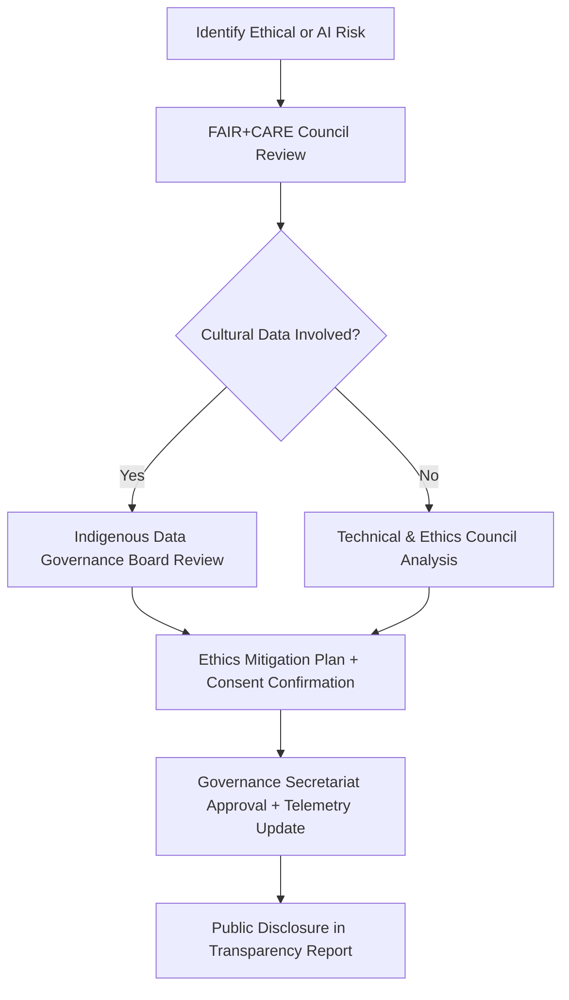
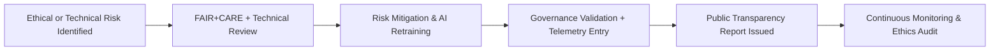

<div align="center">

# 🧠 **Kansas Frontier Matrix — Risk Management & AI Ethics Framework**
`docs/governance/risk-and-ethics.md`

**Purpose:**  
Define the **risk assessment**, **AI ethics**, and **accountability framework** for all processes within the **Kansas Frontier Matrix (KFM)**.  
This framework ensures that data governance, AI systems, and public participation align with **FAIR+CARE**, **ISO 31000**, and **Master Coder Protocol (MCP-DL v6.3)** principles.

[](../README.md)
[](../standards/faircare.md)
[](../../LICENSE)
[](../../releases/v10.0.0/manifest.zip)

</div>

---

## 📘 Overview

The **Risk & Ethics Framework** safeguards KFM’s operations by integrating **responsible AI design**, **cultural governance**, and **systemic risk controls** into all lifecycle stages.  
It addresses ethical, operational, and technical risks while ensuring public accountability and transparency.

This framework covers:
- AI and data ethics principles  
- Risk classification and mitigation processes  
- Cultural, environmental, and societal impact checks  
- Telemetry-based monitoring for AI and governance integrity  

---

## 🗂️ Directory Context

```
docs/governance/
├── README.md
├── council-structure.md
├── community-participation.md
├── transparency-reports.md
├── validation-pipelines.md
└── risk-and-ethics.md            # This file
```

---

## ⚙️ Ethical Foundations

| Framework | Description | Alignment |
|---|---|---|
| **FAIR+CARE** | Data and AI governance anchored in fairness, cultural respect, and ethical reuse. | Global Indigenous Data Alliance |
| **ISO 31000** | Risk management principles ensuring proactive identification, assessment, and control. | Risk Governance |
| **OECD AI Principles** | Transparency, accountability, and explainability in AI systems. | AI Governance |
| **ISO 26000** | Social responsibility and environmental sustainability. | Organizational Ethics |
| **Master Coder Protocol (MCP-DL v6.3)** | Ensures reproducible governance, traceable AI provenance, and FAIR+CARE compliance. | Technical Framework |

---

## 🧩 Risk Classification Matrix

| Risk Type | Description | Example | Mitigation Workflow |
|---|---|---|---|
| **Ethical Risk** | Cultural or consent violations in data or visuals. | Unauthorized heritage imagery. | FAIR+CARE review + IDGB validation. |
| **Technical Risk** | Data integrity, API vulnerability, or system failure. | Schema corruption or security breach. | MCP resilience testing + SBOM validation. |
| **AI Bias Risk** | Model drift or skewed outputs harming equity or inclusivity. | Focus Mode misrepresentation of Indigenous voices. | AI ethics audit + retraining with oversight. |
| **Accessibility Risk** | Interface fails to meet A11y standards. | Screen reader compatibility gaps. | Accessibility Council testing + CI fixes. |
| **Environmental Risk** | Unsustainable computation or energy use. | GPU overuse in AI inference. | ISO 50001 energy benchmarking. |
| **Reputation Risk** | Public loss of trust due to governance opacity. | Missed consent publication. | Transparency dashboard + public report. |

---

## ⚖️ AI Ethics & Accountability Principles

| Principle | Implementation in KFM |
|---|---|
| **Transparency** | All AI models include model cards, provenance metadata, and ethics summaries. |
| **Accountability** | Governance Council retains authority to halt AI operations if ethics breached. |
| **Explainability** | Focus Mode narratives include “Why This?” explainability modules. |
| **Equity** | Bias testing and fairness metrics applied to every dataset and AI pipeline. |
| **Consent** | AI systems trained only on approved, consented datasets. |
| **Human Oversight** | AI outputs reviewed and ratified by human auditors before publication. |

> All AI-generated narratives are **FAIR+CARE-certified** before public display.

---

## 🧠 FAIR+CARE Ethical Risk Control Process



---

## 🧮 Risk Assessment Workflow

| Step | Action | Responsible Body | Output |
|---|---|---|---|
| 1️⃣ | Risk identified through CI telemetry, audits, or public feedback. | FAIR+CARE Secretariat | Issue Report |
| 2️⃣ | Classification according to matrix (ethical, technical, etc.). | Governance Council | Risk Log |
| 3️⃣ | Mitigation assigned and executed. | Responsible Committee | Resolution Plan |
| 4️⃣ | Verified through governance telemetry. | Audit Team | Compliance Artifact |
| 5️⃣ | Public report issued under transparency guidelines. | Governance Secretariat | Quarterly Risk Summary |

---

## 🧾 Example: AI Ethics Validation Report (Excerpt)

```json
{
  "model_id": "focus_transformer_v2",
  "audit_cycle": "2025-Q4",
  "ethical_risks_detected": [
    {
      "type": "AI Bias",
      "severity": "medium",
      "description": "Narrative tone skews toward colonial framing in 2 of 100 cases.",
      "mitigation": "Retraining model on revised corpus with cultural tone calibration."
    }
  ],
  "final_score": {
    "faircare_compliance": 97.3,
    "explainability_index": 94.5
  },
  "approved_by": ["FAIR+CARE Council", "Indigenous Data Governance Board"]
}
```

---

## 🔍 Continuous Ethics Telemetry

All risk assessments are logged into governance telemetry files and version-controlled per release.  
Telemetry captures both **technical performance** and **ethical outcomes**, enabling longitudinal analysis.

| Field | Description | Example |
|---|---|---|
| `risk_id` | Unique risk identifier | `"ETH-2025-004"` |
| `category` | Risk classification (ethical, technical, AI bias, etc.) | `"AI Bias"` |
| `impact_score` | Weighted impact score (0–10) | `6.5` |
| `mitigation_status` | `"pending"`, `"resolved"`, `"under review"` | `"resolved"` |
| `validated_by` | Responsible council(s) | `["FAIR+CARE", "IDGB"]` |

---

## 🌐 Cross-Framework Integration

| Integration Layer | Description | Linked Document |
|---|---|---|
| **AI Model Provenance** | Ensures full traceability of data and algorithmic lineage. | `docs/ai/governance/README.md` |
| **Indigenous Consent Protocol** | Ethical oversight for cultural and tribal datasets. | `docs/data/governance/indigenous-data-protocol.md` |
| **Accessibility Assurance** | Maintains equitable participation across user groups. | `docs/accessibility/README.md` |
| **Sustainability Metrics** | Monitors computational and environmental efficiency. | `docs/reports/telemetry/build_metrics.json` |

---

## 📊 Risk & Ethics Dashboard Metrics

| Metric | Target | Verification Source |
|---|---|---|
| **AI Model Ethics Compliance** | ≥ 95% | `faircare-audit.yml` |
| **Cultural Consent Accuracy** | 100% | IDGB Review |
| **Accessibility Coverage** | 100% | Accessibility Council |
| **Transparency Report Publication Rate** | 100% | Governance Secretariat |
| **Risk Mitigation Completion Rate** | ≥ 98% | CI Telemetry |

---

## 🧩 Governance Assurance Cycle



All critical risk findings must be **documented, mitigated, and disclosed** within 30 days of discovery.

---

## 🕰️ Version History

| Version | Date | Author | Summary |
|---|---|---|---|
| v10.0.0 | 2025-11-10 | FAIR+CARE Governance Secretariat | Created comprehensive Risk & Ethics framework integrating AI accountability, cultural consent, and FAIR+CARE-aligned risk governance. |

---

<div align="center">

**© 2025 Kansas Frontier Matrix — CC-BY 4.0**  
Governed under **Master Coder Protocol v6.3** · Certified by **FAIR+CARE Governance Council** · Diamond⁹ Ω / Crown∞Ω Ultimate Certified  
[⬅ Back to Governance Index](README.md) · [Validation Pipelines →](validation-pipelines.md)

</div>