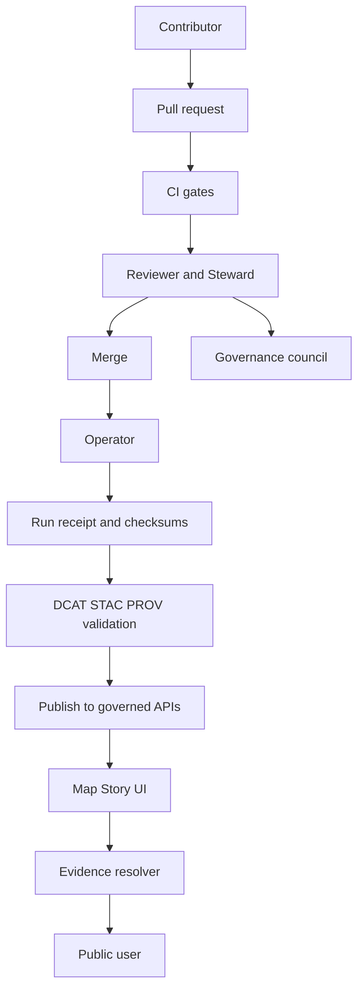

<!-- [KFM_META_BLOCK_V2]
doc_id: kfm://doc/4d3f6b1b-6d55-4f27-9012-4d0d5f317c0c
title: KFM Ownership Model
type: standard
version: v1
status: draft
owners: KFM Governance Council; Data Stewards; Platform Operators
created: 2026-03-02
updated: 2026-03-02
policy_label: restricted
related: []
tags: [kfm, governance, roles, ownership]
notes:
  - Draft ownership and RACI model aligned to the vNext governance guide; bind roles to real teams via CODEOWNERS and registry metadata.
[/KFM_META_BLOCK_V2] -->

# Ownership
**One-line purpose:** define who is accountable for *every* KFM artifact (data, code, policy, catalogs, stories) and how ownership is enforced through review + gates.

> **NOTE**
> This file defines an **ownership model** (accountability + approval). It is intentionally *role-based*.
> Map roles to actual people/teams via `CODEOWNERS`, dataset stewardship metadata, and runtime IAM.

## Quick navigation
- [Where this fits](#where-this-fits)
- [Scope](#scope)
- [Definitions](#definitions)
- [Roles](#roles)
- [Ownership surfaces](#ownership-surfaces)
- [RACI](#raci)
- [How ownership is enforced](#how-ownership-is-enforced)
- [Minimum verification steps](#minimum-verification-steps)
- [Change log](#change-log)

## Ownership flow

[Back to top](#quick-navigation)

---

## Where this fits
- **Path:** `docs/governance/roles/OWNERSHIP.md`
- **Purpose in the repo:** the single source of truth for *who approves what* when changes impact trust, legality, safety, or public representation.

---

## Scope
### What belongs here
- The **canonical roles** used in governance discussions and review rules.
- A **minimum RACI** for:
  - dataset onboarding,
  - dataset promotion,
  - story publishing,
  - policy changes.
- The **ownership surfaces** that must be kept in sync:
  - repo review rules (e.g., CODEOWNERS),
  - data stewardship metadata,
  - policy label / redaction authority,
  - runtime operational ownership.

### What does **not** belong here
- Individual names, phone numbers, or staffing plans (put those in an internal roster).
- Access control implementation details (belongs in policy and infrastructure docs).
- Dataset-specific owners (belongs in the dataset registry/specs).

---

## Definitions
**Owner (accountable):** the role/team that must say “yes” for changes that affect trust, legality, safety, or public representation.

**Steward:** the role that owns **policy labels**, redaction/generalization rules, and approval for promotion/publishing.

**Operator:** the role that runs pipelines and manages deployments **but cannot override policy gates**.

**Governance council / community stewards:** authority to control culturally sensitive materials and rules for restricted collections and public representations.

**Evidence-first:** claims in stories and Focus Mode are backed by resolvable evidence bundles; if not, the system narrows scope or abstains.

---

## Roles
### Baseline governance roles (minimum; evolve over time)
These are the baseline roles the system assumes when defining gates and review workflows.

- **Public user:** reads public layers/stories; Focus Mode is limited to public evidence.
- **Contributor:** proposes datasets/stories; drafts content; cannot publish.
- **Reviewer / Steward:** approves promotions and story publishing; owns policy labels and redaction rules.
- **Operator:** runs pipelines and manages deployments; cannot override policy gates.
- **Governance council / community stewards:** authority to control culturally sensitive materials; sets rules for restricted collections and public representations.

### Capability roles (often the same people; listed separately for clarity)
These roles show up in RACI because they own specialized checks.

- **Data engineer:** builds ingestion + validation pipelines; ensures deterministic outputs and receipts.
- **GIS engineer:** spatial QA (CRS, topology, extents); map-readiness.
- **Policy engineer:** implements and tests policy-as-code; obligation enforcement.
- **Security / compliance:** threat modeling, sensitive classification guidance, security posture reviews.
- **Historian / editor:** narrative review; citation quality; rights checks for media reuse.
- **UI / UX:** evidence-first UX implementation; accessibility; no client-side policy decisions.

---

## Ownership surfaces
Ownership must be represented in **three places**. If they disagree, the system is out of governance compliance.

1) **Repo ownership (code + docs)**
- Enforced via `CODEOWNERS` + branch protections (required reviews).
- Owners are expressed as GitHub teams/users.

2) **Data stewardship ownership (datasets)**
- Enforced via dataset registry/spec metadata (steward + contact + rights holder).
- Stewards are expressed as roles and/or partner orgs.

3) **Runtime authority (policy and operations)**
- Enforced via policy packs (allow/deny + obligations), and the operational runbook.
- Owners are expressed as approval authority for policy labels and redaction.

---

## RACI
> **TIP**
> Keep this RACI minimal. Add complexity only when real conflicts arise.

### Dataset onboarding (new dataset into the truth path)
| Activity | Responsible | Accountable | Consulted | Informed |
|---|---|---|---|---|
| Spec + docs + initial registry entry | Contributor | Steward | Governance council (if culturally sensitive), Legal/Compliance (if rights unclear) | Operator |
| Pipeline / connector implementation | Data engineer | Steward | GIS engineer | Operator, Contributor |
| Spatial QA + map readiness | GIS engineer | Steward | Data engineer | Contributor |

### Dataset promotion (WORK ➜ PROCESSED ➜ CATALOG ➜ PUBLISHED)
| Activity | Responsible | Accountable | Consulted | Informed |
|---|---|---|---|---|
| Execute promotion run + publish artifacts | Operator | Steward | Security (restricted infra), Governance council (sensitive) | Contributor |
| Validate outputs (schemas, checksums, catalogs) | Data engineer | Steward | GIS engineer | Operator, Contributor |
| Approve sensitivity + public representation | Steward | Governance council (or designated owner) | Security/Compliance | Operator, Contributor |

### Story publishing
| Activity | Responsible | Accountable | Consulted | Informed |
|---|---|---|---|---|
| Draft story + citations | Contributor | Steward | Historian/Editor | Public (after publish) |
| Review narrative, rights, and citation quality | Historian/Editor | Steward | Legal (image/media reuse), Governance council (cultural) | Contributor |
| Publish (requires review state + resolvable citations) | Steward | Steward | Operator (runtime impact) | Public |

### Policy changes (policy-as-code)
| Activity | Responsible | Accountable | Consulted | Informed |
|---|---|---|---|---|
| Author policy + fixtures | Steward + Policy engineer | Governance council (or designated owner) | Operators (runtime impact), Contributors (workflow impact) | Users |
| CI + contract semantics | Policy engineer | Steward | Data engineer | Operator |
| Rollout & monitoring | Operator | Steward | Security/Compliance | Users |

---

## How ownership is enforced
### Non-negotiable invariants (owner responsibilities)
Owners MUST ensure the following invariants are upheld:

- **Same policy semantics in CI and runtime.** If CI allows something that runtime blocks (or vice versa), the gate is meaningless.
- **UI never makes policy decisions.** UI only displays policy badges/obligations; enforcement happens in policy-aware services.
- **Evidence resolution is a hard gate** for Story publishing and Focus Mode: citations must resolve and be policy-allowed, otherwise the system narrows scope or abstains.
- **Default-deny** for sensitive and restricted materials unless an explicit policy allows access and defines obligations.
- **Licensing is a policy input.** “Online availability” does **not** equal permission to reuse. Rights metadata must be complete before promotion/publishing.

### CARE-aligned ownership (community authority)
When a dataset/story touches culturally sensitive materials:
- The **governance council / community stewards** are the accountable owners of:
  - what can be represented publicly,
  - what must be restricted,
  - what generalization/redaction is required,
  - which consultation steps are mandatory.

### Ownership enforcement mechanisms (repo-level)
**PROPOSED repo enforcement checklist (bind to real repo paths)**
- [ ] `CODEOWNERS` exists and maps every major domain area (e.g., policy, data, contracts, apps, docs) to an owning team.
- [ ] Branch protections require:
  - [ ] at least 1 approval from the applicable code owner(s),
  - [ ] CI passing (schema checks, policy tests, validators),
  - [ ] no bypass for restricted zones/policy packs.
- [ ] “Promotion” and “Publish” actions are PR-based: receipts + catalogs are reviewed as first-class artifacts.

### Minimal ownership matrix (starter)
This table is intentionally generic; map to real repo paths and teams.

| Artifact / area | Primary owner (Responsible) | Final approval (Accountable) |
|---|---|---|
| Policy pack + fixtures | Policy engineer + Steward | Governance council (or designated policy owner) |
| Dataset registry entry + spec | Contributor + Data engineer | Steward |
| Sensitivity labels + redaction rules | Steward | Governance council / community stewards |
| Pipeline code (connectors, transforms) | Data engineer | Steward |
| Catalog validators + linkcheck | Data engineer | Steward |
| Evidence resolver | Platform/API team | Steward |
| Governed API (PEP) | Platform/API team | Steward |
| UI (Map/Story/Focus) | UI/UX team | Steward (for trust UX requirements) |
| Security controls (network policy, secrets, audit logs) | Security/Compliance + Operator | Security/Compliance |

---

## Minimum verification steps
This document is role-based and safe to adopt immediately, but **repo bindings** must be verified.

**To convert “PROPOSED repo enforcement” into CONFIRMED:**
1. Confirm `CODEOWNERS` exists and covers the major directories (policy, data, contracts, apps, packages, docs).
2. Confirm branch protection rules require CODEOWNER review + CI gates for merges.
3. Confirm the dataset registry/schema contains stewardship + contact + rights fields (or add them, with tests).
4. Confirm the story publishing workflow records review state and blocks publish when citations do not resolve.
5. Confirm the policy pack has fixture tests and runs in CI.
6. Confirm the operator role cannot bypass policy decisions (CI + runtime PEP parity).

---

## Change log
- **2026-03-02:** v1 draft created (role-based ownership + RACI + enforcement checklist).
