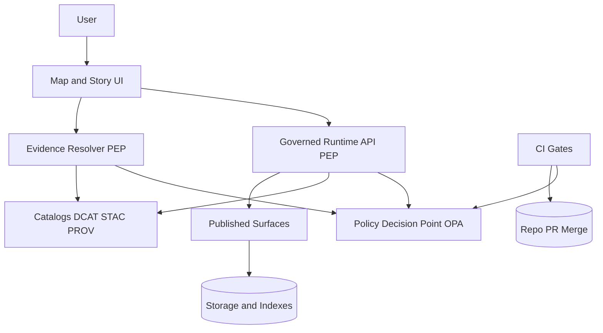

<!-- [KFM_META_BLOCK_V2]
doc_id: kfm://doc/7c5b3a2b-8e3a-4fd3-96e6-bf79d3f1892e
title: RBAC Matrix
type: standard
version: v1
status: draft
owners: TBD (set CODEOWNERS for docs/governance/roles/)
created: 2026-03-02
updated: 2026-03-02
policy_label: internal
related:
  - policy/ (OPA/Rego bundle + fixtures + tests)
  - contracts/ (OpenAPI contract fragments)
  - docs/governance/roles/ (this directory)
tags: [kfm, governance, roles, rbac, policy-as-code, trust-membrane]
notes:
  - This is a governance artifact: treat edits as policy-adjacent and review accordingly.
  - Baseline roles are sourced from the vNext guide and marked PROPOSED until implemented in the policy pack.
[/KFM_META_BLOCK_V2] -->

# RBAC Matrix
Role-based access control matrix for KFM’s **governed runtime surfaces** and **governed workflows**.


**Jump to:** [Principles](#principles) • [Truth labels](#truth-labels) • [Roles](#roles) • [Policy labels](#policy-labels) • [Runtime RBAC matrix](#runtime-rbac-matrix) • [Workflow RBAC matrix](#workflow-rbac-matrix) • [OPA input model](#opa-input-model) • [Tests and gates](#tests-and-gates) • [Open questions](#open-questions)

---

## Principles

### Trust membrane
KFM’s UI/clients must **never** access object storage or databases directly. All access goes through a **Policy Enforcement Point (PEP)** (e.g., Runtime API and Evidence Resolver). The UI can show badges/notices, but it does **not** make policy decisions.

### Policy-as-code
Authorization is implemented as policy-as-code with **default deny**, with the **same semantics in CI and runtime**:
- CI runs policy tests and blocks merges on regressions.
- Runtime API checks policy before serving data.
- Evidence resolver checks policy before resolving evidence and rendering bundles.

### Sensitive locations and default-deny posture
Baseline posture (until overridden by explicit policy):
- Restricted and sensitive-location datasets are **deny by default**.
- If any public representation is allowed, publish a separate **public_generalized** derivative.
- Do not leak restricted metadata via error behavior.
- Do not embed precise coordinates in Stories or Focus Mode unless explicitly allowed.
- Treat redaction/generalization as a first-class transform recorded in provenance.

---

## Truth labels
This doc distinguishes:
- **CONFIRMED**: Direction explicitly stated as a requirement/invariant in KFM governance/architecture docs.
- **PROPOSED**: A suggested baseline from KFM docs that must be implemented/verified in the live policy bundle.
- **UNKNOWN**: Not specified yet; requires a decision and/or repo verification.

---

## Roles

> NOTE: The vNext guide provides a **PROPOSED baseline roles** set. Treat it as the starting point and keep it minimal. Expand only when policy/tests require it.

| Role | Intent | Operational description |
|---|---|---|
| **Public user** (PROPOSED) | Public consumption | Reads public layers/stories; Focus Mode limited to public evidence. |
| **Contributor** (PROPOSED) | Draft + propose | Proposes datasets/stories; drafts content; cannot publish/promote. |
| **Reviewer/Steward** (PROPOSED) | Approve + label | Approves promotions and story publishing; owns policy labels and redaction rules. |
| **Operator** (PROPOSED) | Run + deploy | Runs pipelines and manages deployments; cannot override policy gates. |
| **Governance council / community stewards** (PROPOSED) | Cultural authority | Controls culturally sensitive materials; sets rules for restricted collections and public representations. |

### Role naming and implementation note
Policy code examples in the vNext guide use `input.user.role` values like `"public"` and `"steward"`. In the live system, keep role strings stable and version-controlled.

---

## Policy labels
Policy labels are a **controlled vocabulary** attached to datasets/stories/artifacts and used as a primary policy input.

Starter list:
- `public`
- `public_generalized`
- `internal`
- `restricted`
- `restricted_sensitive_location`
- `embargoed`
- `quarantine`

---

## Resources and actions

### Runtime surfaces (governed)
These are representative surfaces that must be policy-filtered:
- Dataset discovery / catalog browsing
- STAC browsing (collections/items/assets)
- Evidence resolution (EvidenceRef ➜ EvidenceBundle)
- Story read and publish
- Focus Mode ask

### Governance surfaces (gated workflows)
These are governance actions that must be role-gated and audited:
- Dataset onboarding (spec + docs + pipeline)
- Promotion to Published (manifest + approvals)
- Story publishing (review state + resolvable citations)
- Policy changes (Rego + fixtures + tests)

### Legend
- ✅ Allowed (subject to policy checks)
- ⚠️ Allowed with constraints / additional gates
- ❌ Denied
- 🧾 Requires audit record / receipt
- 🧪 Requires passing CI gate/tests
- 👥 Requires multi-party approval

---

## Runtime RBAC matrix

> WARNING: Runtime decisions are **fail-closed**. If policy cannot be evaluated or citations cannot be resolved, the system must reduce scope or abstain.

### A) Read/query access by **policy label**
`R` = read/list metadata, `Q` = query/browse, `D` = download/export artifacts (if licensed/allowed)

| Role | `public` | `public_generalized` | `internal` | `restricted` | `restricted_sensitive_location` | `embargoed` | `quarantine` |
|---|---:|---:|---:|---:|---:|---:|---:|
| Public user | R/Q/D ✅ | R/Q/D ✅ (obligations like “show notice”) | ❌ | ❌ | ❌ | ❌ | ❌ |
| Contributor | R/Q/D ✅ | R/Q/D ✅ | R/Q/D ✅ | ⚠️ (only if explicitly granted by policy) | ⚠️ (rare; explicit grant only) | ❌ | ⚠️ (read QA reports only; no public export) |
| Reviewer/Steward | R/Q/D ✅ | R/Q/D ✅ | R/Q/D ✅ | R/Q/D ✅ | R/Q/D ✅ (with strict obligations) | ⚠️ (per-collection rules) | R/Q ✅ (review + promotion workflow) |
| Operator | R/Q ✅ | R/Q ✅ | R/Q ✅ | ⚠️ (operational need-to-know; prefer service identities) | ⚠️ (operational need-to-know; prefer service identities) | ❌ | R/Q ✅ (pipeline + QA) |
| Governance council | R/Q/D ✅ | R/Q/D ✅ | R/Q/D ✅ | R/Q/D ✅ | R/Q/D ✅ (policy + cultural constraints) | ⚠️ (per-collection rules) | R/Q ✅ |

### B) Endpoint-level capabilities (illustrative)
| Role | Catalog discover | STAC browse/query | Evidence resolve | Read Stories | Publish Stories | Focus ask |
|---|---|---|---|---|---|---|
| Public user | ✅ (policy-filtered) | ✅ (policy-filtered) | ✅ (public only) | ✅ (public only) | ❌ | ✅ (public evidence only) |
| Contributor | ✅ | ✅ | ✅ | ✅ (public + internal drafts) | ❌ | ⚠️ (internal only; must cite/abstain) |
| Reviewer/Steward | ✅ | ✅ | ✅ | ✅ | ✅ 👥🧾 | ✅ 🧾 |
| Operator | ✅ (internal ops) | ✅ (internal ops) | ✅ (for debugging; policy-filtered) | ⚠️ (read for ops) | ❌ | ❌ |
| Governance council | ✅ | ✅ | ✅ | ✅ | ⚠️ (required for culturally sensitive) 👥🧾 | ⚠️ (only if policy allows) 🧾 |

---

## Workflow RBAC matrix

### A) Dataset onboarding + promotion (Promotion Contract)
| Action | Public user | Contributor | Reviewer/Steward | Operator | Governance council |
|---|---:|---:|---:|---:|---:|
| Draft dataset spec + docs | ❌ | ✅ | ✅ | ⚠️ (as needed) | ⚠️ (consulted if sensitive) |
| Run ingestion / transforms / QA pipeline | ❌ | ❌ | ❌ | ✅ 🧾 | ❌ |
| Assign `policy_label` + redaction obligations | ❌ | ❌ | ✅ 🧾 | ❌ | ✅ (for culturally sensitive rules) 🧾 |
| Promote dataset version toward Published | ❌ | ❌ | ⚠️ (approves) 👥🧾 | ✅ (executes) 🧾 | ⚠️ (required approval when culturally sensitive) 👥🧾 |
| Approve promotion manifest | ❌ | ❌ | ✅ 👥🧾 | ❌ | ⚠️ (conditional) 👥🧾 |
| Publish/serve via governed runtime APIs | ✅ (consume only) | ✅ (consume) | ✅ (oversight) | ✅ (operate) | ✅ (oversight) |

### B) Story drafting + publishing
| Action | Public user | Contributor | Reviewer/Steward | Operator | Governance council |
|---|---:|---:|---:|---:|---:|
| Draft Story Node + citations | ❌ | ✅ | ✅ | ❌ | ⚠️ (consulted if culturally sensitive) |
| Review for policy/rights/sensitivity | ❌ | ❌ | ✅ 🧾 | ❌ | ✅ (cultural authority review) 🧾 |
| Publish Story Node | ❌ | ❌ | ✅ 👥🧾 | ❌ | ⚠️ (required for culturally sensitive) 👥🧾 |
| Enforce “all citations resolve” publishing gate | N/A | N/A | ✅ 🧪 | ✅ 🧪 | ✅ 🧪 |

### C) Policy changes (Rego + fixtures + tests)
| Action | Public user | Contributor | Reviewer/Steward | Operator | Governance council |
|---|---:|---:|---:|---:|---:|
| Propose policy change (PR) | ❌ | ❌ | ✅ | ❌ | ✅ |
| Merge policy change | ❌ | ❌ | ✅ (with required review) 🧪 | ❌ | ✅ (designated owner / approval) 🧪 |
| Run policy tests in CI | N/A | N/A | ✅ (must pass) 🧪 | ✅ (maintains CI) 🧪 | ✅ (oversight) |

---

## OPA input model

### Canonical policy inputs (minimum)
- `input.user.role`
- `input.action`
- `input.resource.policy_label`

Example policy shape (illustrative):

```rego
package kfm.authz

default allow = false

allow { input.user.role == "steward" }

allow {
  input.user.role == "public"
  input.action == "read"
  input.resource.policy_label == "public"
}

# obligations example: public_generalized ➜ show notice
```

---

## Tests and gates

### Required CI gates (minimum)
- Policy tests must run in CI and **block merges** on regressions.
- Fixtures should cover at least:
  - `public_user` vs `steward_user`
  - `dataset_public` vs `dataset_restricted`
- Runtime integration tests should verify:
  - Evidence resolution fails closed when unauthorized/unresolvable.
  - Story publishing blocks unless all citations resolve via evidence resolver.
  - “Policy-safe errors”: do not reveal restricted dataset existence.

### Definition of done for RBAC changes
- [ ] Update this RBAC matrix (and justify change).
- [ ] Update policy bundle (Rego) to match.
- [ ] Add/modify policy fixtures + tests.
- [ ] Prove the same decision in CI and runtime (golden tests).
- [ ] Record change as an auditable governance decision (link ADR / decision note).

---

## Open questions

These items are **UNKNOWN** until verified/decided in the live repo:
1. **Authentication**: identity provider, token format, and how roles are derived (groups/claims).
2. **Service identities**: pipeline/service accounts role model (human vs machine separation).
3. **Dataset-scoped exceptions**: how “explicit grant” works (per-dataset ACL? attribute-based policy?).
4. **Audit access policy**: who can read full audit ledger entries vs redacted views.
5. **Embargo semantics**: who can view embargoed metadata and under what conditions.

### Minimum verification steps (convert UNKNOWN ➜ CONFIRMED)
- [ ] Inspect `policy/` bundle: enumerate implemented roles and actions.
- [ ] Inspect `contracts/` (OpenAPI): confirm endpoint set and authz inputs.
- [ ] Extract CI gates from `.github/workflows`: confirm policy tests are blocking.
- [ ] Run an end-to-end scenario: public user reads public data; public user denied restricted; steward approves promotion and publish.

---

## Appendix: RBAC diagram (conceptual)



---

<p align="right"><a href="#rbac-matrix">Back to top</a></p>
