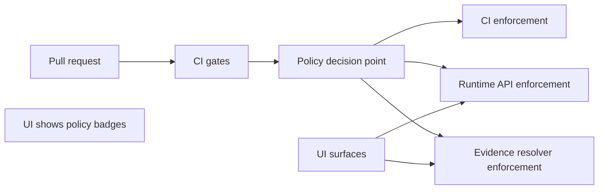

<!-- [KFM_META_BLOCK_V2]
doc_id: kfm://doc/512b97e2-6d4e-4952-bfd1-a51c6fff0cb0
title: KFM Governance Roles
type: standard
version: v1
status: draft
owners: KFM Governance (TBD)
created: 2026-03-02
updated: 2026-03-02
policy_label: public
related:
  - kfm://doc/KFM-GDG-2026@2026-02-20
tags: [kfm, governance, roles, raci, rbac]
notes:
  - Baseline role model starts minimal and is intended to evolve.
  - This directory defines “who can do what” + approval/accountability surfaces.
[/KFM_META_BLOCK_V2] -->

# KFM Governance Roles
Define **who can do what**, **who approves what**, and **how those decisions are recorded** so promotion + publishing is consistent, auditable, and fail-closed.


---

## Quick navigation
- [What this directory is](#what-this-directory-is)
- [Non-negotiable invariants](#non-negotiable-invariants)
- [Role model](#role-model)
- [RACI](#raci)
- [Decision rights](#decision-rights)
- [Artifacts and ownership](#artifacts-and-ownership)
- [Change process](#change-process)
- [Open gaps and minimum verification steps](#open-gaps-and-minimum-verification-steps)
- [Directory layout](#directory-layout)

---

## What this directory is

This folder is the **governance contract** for:
- platform access roles (RBAC-style),
- workflow accountabilities (RACI),
- review/approval capture requirements (promotion + story publishing),
- and the “do not bypass” guardrails that preserve KFM’s trust posture.

### Acceptable inputs
- Role definitions (platform roles + functional hats).
- RACI matrices for core workflows (dataset onboarding, promotion, story publishing, policy changes).
- Decision-rights tables (who is *Accountable* and what artifacts prove approval).
- Non-sensitive onboarding/offboarding checklists (no personal data).
- CODEOWNERS guidance for governance-owned surfaces (policy, catalog profiles, review queues).

### Exclusions
- Secrets, credentials, API keys, private endpoints.
- Person-level membership rosters (keep those in the IdP / HR systems, not git).
- “Emergency bypass” instructions that weaken fail-closed gates.
- Policies themselves (Rego, allow/deny fixtures) — those belong under `policy/` (or equivalent).

---

## Non-negotiable invariants

These constraints are what make the role model meaningful:

- **Truth path lifecycle is enforced**: RAW → WORK/Quarantine → PROCESSED → CATALOG/Lineage → PUBLISHED.  
- **Trust membrane is enforced**: clients and UI do not directly access storage/DB; all access flows through governed APIs and policy enforcement points.  
- **Cite-or-abstain**: publishing and Focus Mode must fail closed if citations/evidence do not resolve or are not policy-allowed.

> NOTE: Role permissions must never “paper over” a broken trust membrane. If the membrane is broken, policy cannot be enforced reliably.

---

## Role model

This is the **baseline** role model. It intentionally starts minimal; expand only when enforcement and auditability remain intact.

### Platform access roles (RBAC-style)

| Role | Primary responsibility | Can do | Cannot do (guardrails) |
|---|---|---|---|
| **Public user** | Consume public surfaces safely | Read public layers/stories; Focus Mode limited to public evidence | View restricted/internal catalogs; export restricted artifacts |
| **Contributor** | Propose datasets/stories and draft content | Submit PRs/specs; draft Story Nodes; propose policy labels | Publish/promote; override gates |
| **Reviewer / Steward** | Approve promotion + publishing; own policy labels + redaction rules | Approve promotions; approve Story publishing; define policy labels + obligations | Run “silent” publishes without artifacts; waive rights/sensitivity checks |
| **Operator** | Run pipelines + manage deployments | Execute pipeline runs; manage infra; respond to incidents | Override policy gates; change policy semantics unreviewed |
| **Governance council / Community stewards** | Decision authority for culturally sensitive materials; rules for restricted collections + public representations | Define restrictions; approve exceptional handling; set cultural constraints | Delegate away culturally restricted decision rights without process |

### Functional hats used by the RACI (not necessarily separate platform roles)
- **Data engineer**, **GIS engineer**, **Historian/Editor**, **Policy engineer**, **Security**, **Legal/Compliance**  
These appear in RACI as *Responsible* or *Consulted* depending on the workflow. They may be mapped onto the platform roles above, depending on org structure.

---

## RACI

Minimum RACI for the workflows that create the most governance risk.

| Workflow | Responsible | Accountable | Consulted | Informed |
|---|---|---|---|---|
| **Dataset onboarding** | Contributor (spec + docs), Data engineer (pipeline), GIS engineer (spatial QA) | Steward | Governance council (if culturally sensitive), Legal/Compliance (if rights unclear) | Operator |
| **Dataset promotion** | Operator (run), Data engineer (validate outputs) | Steward | Governance council (sensitive), Security (restricted infra) | Contributor |
| **Story publishing** | Contributor (draft), Historian/Editor (review) | Steward | Governance council (Indigenous/cultural), Legal (image reuse) | Public |
| **Policy changes** | Steward + Policy engineer | Governance council (or designated owner) | Operators (runtime impact), Contributors (workflow impact) | Users |

---

## Decision rights

### What requires an explicit approval artifact

Approvals are only “real” when captured as artifacts that can be validated in CI and inspected later.

| Decision / action | Approval required by | Proof of approval must be recorded in | Fail-closed trigger |
|---|---|---|---|
| Promote a dataset version to PUBLISHED | **Steward** (Accountable) | Promotion manifest / release record (with role + principal + timestamp) | Missing approvals, missing catalogs, missing policy label/obligations |
| Publish a Story Node | **Steward** (Accountable) | Story metadata (review state + resolvable citations) | Any citation fails to resolve; rights metadata missing; restricted coordinates present |
| Change policy semantics (allow/deny/obligations) | **Governance owner** | Policy PR + fixtures + CI results | Policy tests fail; CI/runtime semantics drift |
| Approve public representation of culturally sensitive material | **Governance council / Community stewards** | Written decision record (governance artifact) + policy rule/fixture update | Unreviewed exposure risk; unclear obligations |

---

## Artifacts and ownership

The following artifacts must exist and have clear owners.

| Artifact type | Purpose | Primary owner | Notes |
|---|---|---|---|
| **Policy bundle + fixtures** | Allow/deny + obligations enforced consistently in CI and runtime | Steward + Policy engineer | UI must not decide policy |
| **Licensing classification rubric** | Prevent “available online” from becoming “permitted to reuse” | Steward + Legal/Compliance | Blocks exports/publishing when unclear |
| **Sensitivity rubric + generalization guidelines** | Define restricted/sensitive-location handling | Steward + Governance council | Default-deny for sensitive materials |
| **Review workflow definition** | Promotion Queue + Story Review Queue semantics | Steward | Must be auditable |
| **Audit ledger retention + access policy** | Ensure audit records are protected and retained | Operator + Steward + Security | Logs/receipts must not leak restricted info |

---

## Enforcement points

Governance works only if enforcement is in the runtime and CI, not just docs.



Guiding rule: **policy semantics must match in CI and runtime** (or CI guarantees are meaningless).

---

## Change process

### How to change roles or decision rights (PR checklist)
- [ ] Update this README and any role matrix file (if present).
- [ ] Update policy fixtures (allow/deny + obligations) for the changed behavior.
- [ ] Update CI checks so the new rules are merge-blocking.
- [ ] Ensure runtime enforcement points still fail closed.
- [ ] Add/adjust CODEOWNERS for governance-owned surfaces (policy, catalogs, review workflows).

### Documentation Definition of Done
- [ ] Role change is described in human terms (what changes for users).
- [ ] Enforcement is encoded (policy/CI/runtime).
- [ ] Audit surfaces show the decision (approvals, reason codes, obligations).
- [ ] No new bypass path is introduced.

---

## Open gaps and minimum verification steps

This directory is how we close the “roles not fully defined” gap in a buildable way.

Minimum verification steps:
- [ ] Confirm the actual identity provider + group names (map them to the platform roles above).
- [ ] Add CODEOWNERS for governance-sensitive surfaces (policy, catalogs, review artifacts).
- [ ] Add a roles matrix file (machine-readable) and validate it in CI.
- [ ] Prove at least one end-to-end vertical slice where promotion + story publishing is gated by these roles.

---

## Directory layout

Required (now):
- `docs/governance/roles/README.md` — this document

Proposed (add as governance becomes enforceable):
- `docs/governance/roles/roles.yaml` — machine-readable role definitions + mappings (TBD)
- `docs/governance/roles/raci.md` — expanded RACI + examples (TBD)
- `docs/governance/roles/decision-rights.md` — approvals + artifact evidence requirements (TBD)
- `docs/governance/roles/onboarding/` — role onboarding checklists (TBD)

```text
docs/governance/roles/                                  # Governance roles (ownership, responsibilities, decision rights)
├─ README.md                                            # Index + role philosophy + how roles map to CODEOWNERS/policy
├─ roles.yaml                                           # TODO: machine-readable role definitions (names, responsibilities, escalation)
├─ raci.md                                              # TODO: RACI matrix (workstreams → responsible/accountable/consulted/informed)
├─ decision-rights.md                                   # TODO: decision rights matrix (who can approve labels/gates/waivers/releases)
└─ onboarding/                                          # TODO: role onboarding materials (checklists, expectations, access requests)
```

---

<details>
<summary>Appendix: Suggested role-to-surface permissions (starter)</summary>

> This appendix is intentionally conservative. Prefer “deny by default” until enforced end-to-end.

| Surface | Public user | Contributor | Steward | Operator | Council |
|---|---:|---:|---:|---:|---:|
| Catalog browse | ✅ public only | ✅ public + draft proposals | ✅ all per policy | ✅ ops-only views as needed | ✅ per restricted programs |
| Dataset onboarding PR | ❌ | ✅ | ✅ review | ✅ infra input | ✅ consult on sensitive |
| Promotion run | ❌ | ❌ | ✅ approve | ✅ execute | ✅ approve exceptions |
| Story draft | ✅ read | ✅ write draft | ✅ approve publish | ❌ | ✅ for sensitive narratives |
| Policy pack changes | ❌ | ❌ | ✅ with policy engineer | ✅ consult | ✅ approve owner |

</details>

---

⬆ **Back to top**: [Quick navigation](#quick-navigation)
