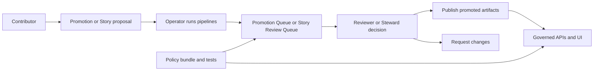

<!-- [KFM_META_BLOCK_V2]
doc_id: kfm://doc/e7d39155-7676-43f0-a23a-9d2a8b74f506
title: REVIEWERS (Stewards)
type: standard
version: v1
status: draft
owners: TBD
created: 2026-03-02
updated: 2026-03-02
policy_label: public
related:
  - docs/governance/roles/
  - docs/governance/promotion/   # TODO: confirm/create path
  - policy/                      # TODO: confirm path
tags: [kfm, governance, roles, reviewers]
notes:
  - This role is sometimes referred to as “Reviewer/Steward” in KFM design docs.
  - This file defines responsibilities, decision surfaces, and review checklists.
[/KFM_META_BLOCK_V2] -->

# REVIEWERS (Stewards)
**Purpose:** Provide *merge-blocking, policy-aware review* for dataset promotions and story publishing so that KFM remains **evidence-first** and **fail-closed**.


<!-- TODO: swap badges to real repo badge URLs once CI + ownership are confirmed -->

---

## Quick navigation
- [Role summary](#role-summary)
- [What review covers](#what-review-covers)
- [Decision surfaces](#decision-surfaces)
- [Review checklists](#review-checklists)
- [RACI snapshot](#raci-snapshot)
- [Escalation and consultation](#escalation-and-consultation)
- [Templates](#templates)

---

## Role summary

### One-line definition
A **Reviewer (Steward)** is the accountable approver for **promotion** and **publishing** decisions, and the owner of **policy labels** and **redaction/generalization rules**.

### Guardrails
> **REVIEWERS do not “ship” data.** They approve or block promotion/publishing based on evidence, policy, and rights.

| You are responsible for | You may approve | You must not do |
|---|---|---|
| Evidence integrity, policy labeling, rights checks, redaction/generalization requirements | Dataset promotion to `PUBLISHED`, Story publishing, Policy label assignment changes (via PR) | Bypass CI gates, “hand waive” licensing, approve stories with uncited claims, expose restricted coordinates |

---

## Where this fits in the repo
This file lives at `docs/governance/roles/REVIEWERS.md` and is part of the **governance layer**. It defines:
- **Who** can approve publication-facing outcomes
- **What** must be checked before approval
- **How** approvals are recorded and audited

> NOTE: This doc is intentionally *operational* (checklists + decision surfaces), not philosophical.

---

## What review covers

### Reviewers are accountable for two publication surfaces
1. **Dataset promotion** (RAW → WORK/QUARANTINE → PROCESSED → CATALOG/LINEAGE → PUBLISHED)
2. **Story publishing** (draft narrative → reviewed narrative → published narrative)

### Reviewers own (or co-own) governance-critical inputs
- **Policy labels** (public/restricted/etc.)
- **Redaction and generalization obligations**
- **Rights and licensing clarity** as a merge-blocking requirement

> WARNING: “Online availability does not equal permission to reuse.” Treat ambiguous rights as a blocking issue.

---

## Decision surfaces



### Reviewer touchpoints
- **Pull requests** touching: `data/registry`, `data/specs`, `policy/`, `contracts/`, `docs/stories`, pipeline configs, and release manifests
- **Promotion queue** items (dataset version candidates)
- **Story review queue** items (narratives and media)

---

## Review checklists

### 1) Dataset promotion review checklist
Use this before approving promotion to **PUBLISHED**.

#### Evidence + provenance (MUST)
- [ ] A run receipt (or equivalent audit record) exists for the promotion attempt
- [ ] Inputs are traceable to upstream sources and immutable acquisition snapshots
- [ ] Outputs include checksums (and signatures if used) for artifacts and bundles
- [ ] Catalog/lineage outputs exist and are cross-linked:
  - [ ] DCAT record
  - [ ] STAC collection/items
  - [ ] PROV activity bundle

#### Policy + sensitivity (MUST)
- [ ] A **policy label** is present and correctly scoped (public vs restricted)
- [ ] If the dataset is sensitive-location or otherwise restricted:
  - [ ] Default-deny behavior is preserved
  - [ ] Any public representation is a **separate generalized derivative** (not a partial leak)
  - [ ] No restricted metadata leaks via error paths (e.g., 403 vs 404 leakage)

#### Licensing + rights (MUST)
- [ ] License is explicit and compatible with intended distribution
- [ ] Rights holder attribution is captured
- [ ] If rights are unclear:
  - [ ] Promotion is blocked, OR
  - [ ] “Metadata-only reference” mode is used (catalog without mirroring/redistribution)

#### Operational readiness (SHOULD)
- [ ] CI gates passed (schemas, policy tests, link checks)
- [ ] Rebuildability is preserved (indexes can be rebuilt from promoted artifacts)
- [ ] Rollback path is documented (how to revert published projections)

---

### 2) Story publishing review checklist
Use this before approving a story to appear in Story UI and/or Focus Mode.

#### Evidence-first narrative (MUST)
- [ ] Every claim that matters has an evidence anchor (dataset + version + artifact)
- [ ] Evidence is admissible under policy for the intended audience (public vs restricted)
- [ ] If evidence is not admissible: the claim is removed, generalized, or the story is restricted

#### Rights + media (MUST)
- [ ] Images/media used have clear reuse rights (or are removed/replaced)
- [ ] Required attribution is present

#### Sensitive-location safety (MUST)
- [ ] No precise coordinates are included unless policy explicitly allows
- [ ] Generalization is applied where needed (coarse geography, bounding areas, etc.)

#### “Trust surface” readiness (SHOULD)
- [ ] The story surfaces policy badges/notices where relevant
- [ ] The story links to evidence bundles / receipt viewer where available

---

## RACI snapshot

This table is a *minimum viable governance model* (expand as the council/process matures).

| Activity | Responsible | Accountable | Consulted | Informed |
|---|---|---|---|---|
| Dataset onboarding (spec + docs + pipeline) | Contributor + engineers | **Reviewer/Steward** | Governance council (if culturally sensitive), Legal (if rights unclear) | Operator |
| Dataset promotion | Operator + data engineer | **Reviewer/Steward** | Governance council (sensitive), Security (restricted infrastructure) | Contributor |
| Story publishing | Contributor (draft) + editor (review) | **Reviewer/Steward** | Governance council (cultural), Legal (media rights) | Public |
| Policy changes | Steward + policy engineer | Council or designated owner | Operators + contributors | Users |

---

## Escalation and consultation

Escalate (block promotion/publishing) and consult the appropriate party when:

- **Rights are unclear** → consult Legal/Compliance; default to metadata-only or block
- **Cultural sensitivity is possible** → consult Governance Council / Community Stewards
- **Security implications** (restricted infra, key management, audit retention) → consult Security + Operator
- **Policy changes are required** to proceed → consult Policy Engineer; require PR + tests

> TIP: Prefer *additive governance* (new policy fixtures, new redaction transforms, new catalogs) over “special-case exceptions.”

---

## Templates

### Review decision comment (copy/paste)
```text
Decision: (approve | request-changes | block)

Scope:
- DatasetVersion / StoryNode: <id or link>
- Policy label: <public|restricted|...>
- Rights/license: <summary>

Checks performed:
- Evidence/provenance: <pass|fail> (receipt: <ref>)
- Catalogs: <pass|fail> (DCAT/STAC/PROV)
- Policy + sensitivity: <pass|fail> (notes)
- Rights: <pass|fail> (notes)

Required follow-ups (if any):
- [ ] <item 1>
- [ ] <item 2>
```

---

## Exclusions
This role doc does **not** define:
- Exact GitHub permissions / CODEOWNERS mappings (see repo settings; add link once confirmed)
- The full promotion contract schema (see contracts/schemas; add link once confirmed)
- The full policy taxonomy (see policy bundle; add link once confirmed)

---

### Back to top
[↑ Back to top](#reviewers-stewards)
