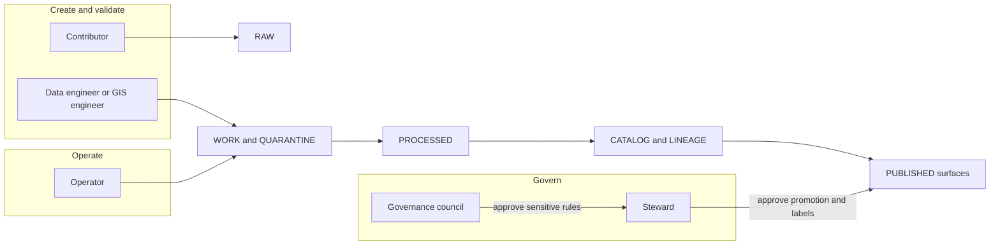

<!-- [KFM_META_BLOCK_V2]
doc_id: kfm://doc/d4e16b2a-9110-4eb0-8baf-2e8a632a181e
title: ROLE_MODEL — Governance roles, responsibilities, and separations of duty
type: standard
version: v1
status: draft
owners: kfm-governance, kfm-platform
created: 2026-03-02
updated: 2026-03-02
policy_label: restricted
related:
  - docs/governance/README.md
  - docs/governance/safety_checks.md
  - docs/governance/policy/POLICY_MODEL.md
  - docs/ops/runbooks/PROMOTION_QUEUE.md
  - docs/ops/runbooks/STORY_REVIEW_QUEUE.md
tags: [kfm, governance, roles, rbac, separation-of-duties]
notes:
  - This file defines the minimum role model used by policy, promotion, and publishing gates.
  - It is intentionally small; add roles only when a gate or policy rule requires them.
[/KFM_META_BLOCK_V2] -->

# ROLE_MODEL — KFM Governance Roles & Responsibilities


**One-line purpose:** Define the *minimum* set of roles, responsibilities, and separations of duty required to keep KFM “governed, evidence-first, cite-or-abstain” in both CI and runtime.

> NOTE  
> This is a **governance + authorization model**, not an HR org chart. People can hold multiple roles; roles are used to drive **policy-as-code**, **promotion gates**, and **publishing workflow**.

---

## Quick navigation

- [Scope](#scope)
- [Non-goals](#non-goals)
- [Definitions](#definitions)
- [Role model invariants](#role-model-invariants)
- [Baseline roles](#baseline-roles)
- [Workflow RACI](#workflow-raci)
- [Separation of duties](#separation-of-duties)
- [Audit and approval artifacts](#audit-and-approval-artifacts)
- [Policy labels and role access](#policy-labels-and-role-access)
- [Repo implementation hooks](#repo-implementation-hooks)
- [Directory contract](#directory-contract)
- [Minimum verification steps](#minimum-verification-steps)
- [Changelog](#changelog)

---

## Scope

This document applies to **all** KFM surfaces and stages where governance matters:

- the truth-path lifecycle (RAW → WORK/QUARANTINE → PROCESSED → CATALOG/LINEAGE → PUBLISHED)
- promotion and publishing workflows (Promotion Queue, Story Review Queue)
- policy evaluation and enforcement (CI gates, runtime APIs, evidence resolution)
- audit and provenance capture (run receipts, approvals)

## Non-goals

KFM is buildable only if governance is operational and minimal. This doc does **not** attempt to:

- mirror a full government org structure, job titles, or reporting lines
- define compensation, HR duties, or hiring criteria
- enumerate every possible “permission” in every subsystem
- replace project-wide security policy, incident response, or legal counsel guidance

---

## Definitions

**Role:** An authorization primitive used by policy decisions, workflow gates, and audit artifacts.

**Function:** A job function (data engineer, GIS analyst, editor, etc.). Functions are mapped to one or more roles.

**Policy label:** A classification attached to a dataset/story/evidence that constrains who can see it and what redactions/obligations apply.

**Gate:** A *fail-closed* check that blocks promotion/publishing unless required artifacts exist and validate.

**Separation of duty:** A rule that prevents one actor (or one role) from unilaterally creating and approving changes that affect public truth surfaces.

---

## Role model invariants

These are the system invariants that the role model MUST support.

1) **Truth path lifecycle is ordered and governed**  
   Catalogs and provenance are produced *as part of promotion*, and runtime services read only promoted artifacts.

2) **Trust membrane is non-negotiable**  
   UI/clients do not access storage directly; everything goes through governed APIs and policy enforcement points.

3) **Focus Mode is cite-or-abstain and audited**  
   Focus Mode is not open-ended chat; it is a governed evidence workflow that selects admissible evidence, builds a bundle, and answers with citations (or abstains), producing an audit record each time.

---

## Baseline roles

This is the **minimum viable governance set**. Add more roles only when a gate cannot be expressed without them.

### Role catalog (baseline)

| Role ID | Role name | Primary purpose | Allowed to do (high-level) | Explicitly NOT allowed to do |
|---|---|---|---|---|
| `public` | Public user | Consume public outputs safely | Read public datasets/stories; use Focus Mode limited to public evidence | Access internal/restricted datasets; bypass policy; see hidden metadata |
| `contributor` | Contributor | Propose and draft changes | Draft dataset specs; propose pipelines; draft Story Nodes; open PRs | Publish datasets/stories; approve their own promotions; alter policy labels without review |
| `steward` | Reviewer / Steward | Maintain public trust surface | Approve promotions and story publishing; assign policy labels; define redaction rules; request legal/community review | Run production infra changes unilaterally; bypass gates; weaken “default-deny” without governance approval |
| `operator` | Operator | Operate pipelines and runtime | Run pipelines/deployments; monitor; respond to failures; rebuild indexes | Override policy decisions; publish restricted content; approve governance changes |
| `council` | Governance council / Community stewards | Authority to control sensitive materials | Set rules for restricted collections; approve exceptions; define community constraints for representation | Day-to-day ops; unilateral code merges without review; acting as a substitute for policy-as-code |

> WARNING  
> “Steward” is a **trust role**. It should be granted sparingly and requires audit visibility.  
> “Operator” is a **power role**. It should be constrained by policy and gates so it cannot publish unsafe material.

---

## Extended functional roles

These are common functions. They SHOULD map onto baseline roles rather than inventing new policy roles.

| Function (job) | Typical baseline role(s) | Notes |
|---|---|---|
| Data engineer | `contributor` (build), sometimes `operator` (run) | Writes pipeline code/config and QA checks; does not approve publication alone. |
| GIS engineer / analyst | `contributor` | Owns spatial QA, projection validation, and cartographic constraints. |
| Catalog curator | `contributor` | Ensures STAC/DCAT/PROV generation and link integrity; often paired with data engineer. |
| Policy engineer | `contributor` (policy code), sometimes `steward` (policy decisions) | Implements policy-as-code; governance remains accountable. |
| Editor / historian | `contributor` (draft), `steward` (approve) | Story quality, sourcing, and harm-minimization checks. |
| Security / compliance | `steward` or consulted party | Consulted for restricted infrastructure, authN/authZ, and audit requirements. |
| Auditor | read-only access (role TBD) | Needs immutable audit access; avoid granting “steward” by default. |

---

## How roles interact with the truth path



---

## Workflow RACI

The RACI below is the **minimum** expected split of responsibilities.

### Dataset onboarding (new source)

- **Responsible:** contributor (spec + docs), data engineer (pipeline), GIS engineer (spatial QA)
- **Accountable:** steward
- **Consulted:** governance council (if culturally sensitive), legal/compliance (if rights unclear)
- **Informed:** operator

### Dataset promotion (new version)

- **Responsible:** operator (run), data engineer (validate outputs)
- **Accountable:** steward
- **Consulted:** governance council (sensitive), security (restricted infrastructure)
- **Informed:** contributor

### Story publishing

- **Responsible:** contributor (draft), editor/historian (review)
- **Accountable:** steward
- **Consulted:** governance council (Indigenous/cultural), legal (image reuse)
- **Informed:** public

### Policy changes

- **Responsible:** steward + policy engineer
- **Accountable:** governance council or designated owner
- **Consulted:** operators (runtime impact), contributors (workflow impact)
- **Informed:** users

---

## Separation of duties

These are **hard rules** (MUST) to preserve the trust membrane and prevent single-actor publication.

1) **No single role can “create + approve + publish”** for promoted datasets or public stories.
   - A contributor can draft; a steward approves; an operator executes the run.
2) **Operators MUST NOT override policy gates.**
   - If a gate blocks promotion, the resolution is to change artifacts/policy/tests through review.
3) **Stewards MUST NOT weaken default-deny alone.**
   - Any change that expands access to restricted/sensitive data requires governance-council review.
4) **UI never makes policy decisions.**
   - UI displays policy badges and obligations; enforcement happens in CI and the runtime API/evidence resolver.

---

## Audit and approval artifacts

KFM governance is only real if it is recorded and reproducible. The following artifacts MUST exist for promoted/public-facing results.

### Run receipt

Every pipeline run MUST emit a run receipt including:

- a unique `run_id`
- the acting principal and role
- inputs/outputs with digests
- environment identifiers (container digest, git commit, parameter digest)
- validation outcome
- a policy decision reference
- timestamp

### Promotion manifest approvals

When promotion is allowed, the manifest MUST capture approvals when required (for example, `steward`).

Example (shape only; see contracts for canonical schema):

```json
{
  "approvals": [
    {"role": "steward", "principal": "<id>", "approved_at": "<timestamp>"}
  ]
}
```

> TIP  
> Treat approvals as *data*, not a comment in a PR. They should be machine-checked and stored alongside promotion artifacts so audits are reproducible.

---

## Policy labels and role access

This file does not define the full label taxonomy, but it defines the minimum expectation:

- Access is determined by **policy label + role + context**, and evaluated by a policy decision point (PDP).
- Unknown/uncleared rights MUST fail closed (metadata-only references may still be allowed).

### Baseline labels (PROPOSED)

| Policy label | Default access | Notes |
|---|---|---|
| `public` | `public`, `contributor`, `steward`, `operator`, `council` | Public surfaces; still audited. |
| `internal` | `contributor`, `steward`, `operator`, `council` | Visible to authenticated internal users. |
| `restricted` | `steward`, `operator` (ops-only), `council` | Default deny; never leak metadata in errors. |
| `sensitive_location` | `council` + explicit allow | Requires redaction/generalization transform recorded in provenance. |

> NOTE  
> Labels should be treated as **contracts**: once a dataset is labeled, the API/UI/Focus Mode behaviors must align.

---

## Repo implementation hooks

This section is guidance for mapping roles into code review and runtime identity.

### Recommended mapping (PROPOSED)

- GitHub teams map to baseline roles (e.g., `kfm-stewards`, `kfm-operators`).
- `CODEOWNERS` requires steward review for:
  - policy bundles
  - promotion gate logic
  - governance docs
- CI blocks merges if:
  - policy tests fail
  - promotion-contract fixtures fail
  - catalogs are invalid / cross-links broken

### Policy-as-code enforcement points (CONFIRMED posture)

- **PDP:** policy engine (OPA/Rego or equivalent)
- **PEPs:**
  - CI (schema validation + policy tests)
  - Runtime API (policy checks before serving data)
  - Evidence resolver (policy checks before resolving evidence bundles)
  - UI (displays badges; does not decide)

---

## Directory contract

**Where this fits:** `docs/governance/roles/` documents the role model used by promotion, publishing, policy, and auditing.

**Acceptable inputs (belongs here):**

- role definitions and role IDs used by policy decisions
- RACI matrices for governed workflows
- separation-of-duty rules
- mapping notes for review workflows and audit artifacts

**Exclusions (must NOT go here):**

- personal lists of names/emails/phone numbers
- secrets, tokens, credentials, or access instructions
- detailed tactical security procedures (put in security runbooks)
- dataset-specific access exceptions (put in the dataset registry / policy decisions)

---

## Minimum verification steps

To promote this doc from **draft** to **review/published**, verify the following in-repo:

1) The role IDs (`public`, `contributor`, `steward`, `operator`, `council`) match policy inputs and auth claims.
2) Promotion manifests and run receipts capture role + principal consistently.
3) CI enforces:
   - catalog validation
   - policy fixtures (allow/deny + obligations)
   - promotion contract gates
4) Runtime API and evidence resolver call the same PDP (or share fixtures producing identical outcomes).
5) Story publishing workflow has an explicit steward approval step.

---

## Changelog

- **v1 (2026-03-02):** Initial baseline role model (draft).
