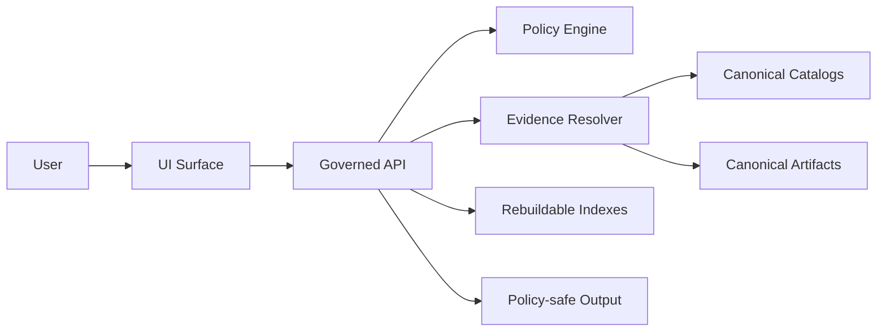

<!-- [KFM_META_BLOCK_V2]
doc_id: kfm://doc/1f0c7f35-9f78-4d0f-9c3f-3a8462a46a2a
title: AI Feature Risk Review (Template)
type: standard
version: v1
status: draft
owners: TBD
created: 2026-03-02
updated: 2026-03-02
policy_label: public
related:
  - kfm://doc/KFM_GDG_vNext_2026-02-20   # TODO: replace with real doc_id
  - kfm://doc/KFM_Tooling_Pipeline_vNext  # TODO: replace with real doc_id
  - docs/governance/README.md            # TODO: confirm path
  - docs/governance/policy_labels.md     # TODO: confirm path
  - docs/governance/abstention_ux.md     # TODO: confirm path
  - docs/governance/threat_modeling.md   # TODO: confirm path
  - docs/governance/incident_response.md # TODO: confirm path
  - docs/governance/templates/RISK_REGISTER.md # TODO: confirm path
  - docs/governance/templates/RELEASE_APPROVAL.md # TODO: confirm path
tags: [kfm, governance, ai, risk, template]
notes:
  - Use this template for any new or changed AI-assisted behavior that can affect users or policy posture.
  - Keep outputs evidence-backed (EvidenceRefs -> EvidenceBundles) and fail closed when unsupported.
[/KFM_META_BLOCK_V2] -->

# AI Feature Risk Review

Evidence-first, policy-aware risk review for AI-assisted features (Focus Mode, Story publishing helpers, ranking/retrieval, summarization, classification, automation).

---

## Quick navigation

- [1) Where this fits](#1-where-this-fits)
- [2) When to use](#2-when-to-use)
- [3) Review record](#3-review-record)
- [4) Feature overview](#4-feature-overview)
- [5) Data, evidence, and policy surface](#5-data-evidence-and-policy-surface)
- [6) Threat model and misuse cases](#6-threat-model-and-misuse-cases)
- [7) Risk assessment matrix](#7-risk-assessment-matrix)
- [8) Required controls and gates](#8-required-controls-and-gates)
- [9) Evaluation and monitoring plan](#9-evaluation-and-monitoring-plan)
- [10) Decision](#10-decision)
- [11) Approvals](#11-approvals)
- [Appendix: Definitions](#appendix-definitions)

---

## 1) Where this fits

**Path:** `docs/governance/templates/AI_FEATURE_RISK_REVIEW.md`

**Purpose in repo:** A governed, repeatable checklist + record for AI feature risk decisions.

### Acceptable inputs

- Proposed feature description and scope (what changes, where it shows up)
- Links to implementation artifacts (PRs, ADRs, OpenAPI diffs, policy diffs)
- Evidence plan (what EvidenceRefs are used; how they resolve; policy labels & obligations)
- Test and evaluation results (unit/integration/e2e + evaluation harness where applicable)
- Monitoring/rollback plan

### Exclusions

- **Do not** paste secrets, credentials, API keys, or private URLs.
- **Do not** paste restricted dataset identifiers, restricted evidence, or sensitive coordinates.
- **Do not** use this as a replacement for security review, privacy review, or legal review.

---

## 2) When to use

Complete this review **before** merging or releasing any change that:

- Generates user-facing text (summaries, explanations, answers, auto-labeled fields)
- Ranks, recommends, or filters content (search relevance, “top results”, “suggested layers”)
- Executes or proposes actions (auto-promote, auto-publish, auto-redact suggestions)
- Touches policy, evidence resolution, redaction, or audit logging
- Introduces new model/tooling (new model version, new retrieval index, new prompt or policy adapter)

> **Rule of thumb:** if the feature can change what a user sees, what they can access, or what they might believe, it needs a risk review.

---

## 3) Review record

| Field | Value |
|---|---|
| Feature name | |
| Feature ID | `AI-YYYY-NNN` (or ticket) |
| Owner | |
| Reviewers | |
| Date | |
| Target release | |
| Repo paths touched | |
| Interfaces touched | ☐ API ☐ UI ☐ Pipeline ☐ Policy ☐ Evidence resolver ☐ Indexer |
| User groups affected | ☐ Public ☐ Authenticated ☐ Steward/Admin |
| Rollout plan | ☐ Behind feature flag ☐ Canary ☐ Gradual ☐ Big bang |
| Rollback plan | |

### Change summary

- **What is new / changed?**
  - 
- **Why are we doing this? (user problem / governance goal)**
  - 
- **User-visible surfaces** (routes, panels, exports, logs)
  - 

---

## 4) Feature overview

### 4.1 What the feature does

Describe behavior as *inputs → processing → outputs*.

- **Inputs**
  - 
- **Processing**
  - 
- **Outputs**
  - 

### 4.2 What the feature is *not* allowed to do

Check all that apply:

- ☐ Reveal restricted dataset existence (“ghost metadata”) via error differences or UI hints
- ☐ Emit an answer without verifiable evidence references (or without an explicit abstention)
- ☐ Bypass the governed API/policy boundary (no direct DB/object-store access from clients)
- ☐ Leak precise sensitive locations (archaeology, endangered species, protected sites)
- ☐ Use unlicensed content beyond the terms recorded in the registry/catalog

---

## 5) Data, evidence, and policy surface

### 5.1 Data sources / evidence inputs

List every upstream/dataset/doc source the feature uses.

| Source | EvidenceRef shape | Typical outputs | Policy label(s) | Obligations (redaction/generalization) |
|---|---|---|---|---|
|  |  |  |  |  |

### 5.2 Evidence resolution contract

Describe how the feature ensures:

- evidence references are **resolvable**
- evidence is **policy-allowed** for the current user
- required **obligations** are applied before display

Fill in:

- **Evidence resolver entrypoint(s):**
  - 
- **What gets stored in run receipts:**
  - 
- **How we prevent "raw index text" answers without evidence linking:**
  - 

### 5.3 Policy posture

- **Default behavior when uncertain:** ☐ deny ☐ abstain ☐ reduce scope
- **How the UI explains abstention (policy-safe):**
  - 

---

## 6) Threat model and misuse cases

### 6.1 Attacker / misuse goals

Check all that apply and add any others:

- ☐ Prompt injection via documents or user input to override instructions
- ☐ Data exfiltration (“show restricted dataset list”, “print internal prompts”, “dump evidence store”)
- ☐ Membership inference / existence leakage (confirming a restricted source exists)
- ☐ Sensitive location targeting (precise coordinates of protected locations)
- ☐ Policy bypass (alternate endpoints, query parameters, error side channels)
- ☐ Abuse at scale (DoS / cost blow-up via repeated long queries)

### 6.2 Controls (current + proposed)

- **Tooling allowlist / restricted tool calls:**
  - 
- **Policy pre-check:**
  - 
- **Redaction/generalization enforcement:**
  - 
- **Side-channel hardening (403/404 alignment, timing, message text):**
  - 

---

## 7) Risk assessment matrix

### 7.1 Risk level rubric (fill-in)

| Level | Meaning | Typical release posture |
|---|---|---|
| Low | Cosmetic or internal-only; no policy change; limited user impact | Merge with standard CI + lightweight review |
| Medium | User-visible; can influence interpretation; minimal sensitivity exposure | Require evidence gates + targeted evaluation |
| High | Touches policy, evidence, or sensitive domains; potential harm if wrong | Require full gate checklist + staged rollout |
| Critical | Potential for restricted leakage, safety impact, legal/licensing exposure | Default **reject** until mitigations + stewardship sign-off |

> If you disagree with the rubric, write it down in the **Decision** section and link an ADR.

### 7.2 Risk register (feature-specific)

| Risk | Likelihood | Impact | Category | Mitigation | Residual risk | Owner |
|---|---:|---:|---|---|---|---|
| Hallucinated claim presented as fact |  |  | Reliability |  |  |  |
| Non-resolvable citations |  |  | Integrity |  |  |  |
| Restricted info leakage |  |  | Privacy/Safety |  |  |  |
| Licensing/attribution failure |  |  | Legal |  |  |  |
| Bias / disproportionate harm |  |  | Ethics |  |  |  |
| Prompt injection success |  |  | Security |  |  |  |
| Performance / cost blow-up |  |  | Ops |  |  |  |

---

## 8) Required controls and gates

### 8.1 Architecture invariants (must hold)

- ☐ Clients cannot access databases/object storage directly (go through governed API)
- ☐ Domain logic uses repository interfaces (no infrastructure bypass)
- ☐ Every user-facing claim is traceable to evidence that can be inspected

### 8.2 Evidence + citation gates

- ☐ Every citation is an **EvidenceRef** that resolves to an **EvidenceBundle**
- ☐ Citation verification is a **hard gate** (if verification fails → revise answer or abstain)
- ☐ Story publishing (if applicable) requires resolvable citations + review state

### 8.3 Policy + redaction gates

- ☐ Policy decisions return allow/deny + obligations + reason codes
- ☐ Obligations are applied (generalization/redaction) before user-visible output
- ☐ Avoid “ghost metadata” (do not reveal restricted existence unless policy allows)

### 8.4 Audit / receipt gates

- ☐ Governed operations emit an audit record (who/what/when/why)
- ☐ Inputs/outputs are captured by digest
- ☐ Audit logs are treated as sensitive (redacted + retained per policy)

### 8.5 Operational gates

- ☐ Feature flag present (or justified why not)
- ☐ Rate limits / resource bounds defined
- ☐ Safe failure mode documented (deny/abstain/reduce scope)
- ☐ Rollback plan tested (at least once in staging)

### 8.6 Documentation gates

- ☐ User-facing explanation exists (what changed, how to interpret)
- ☐ Steward runbook exists (how to investigate using audit_ref)
- ☐ Links to relevant ADRs, policies, and evaluation results included below

#### Linked artifacts

| Artifact | Link |
|---|---|
| ADR(s) | |
| PR(s) | |
| OpenAPI diff | |
| Policy diff/tests | |
| Evaluation report | |
| Threat model notes | |
| Incident runbook updates | |

---

## 9) Evaluation and monitoring plan

### 9.1 Pre-release evaluation

- **What we will test** (check all that apply):
  - ☐ Citation coverage (% of factual claims supported)
  - ☐ Citation resolvability (100% for allowed users)
  - ☐ Refusal correctness (restricted questions get policy-safe refusals)
  - ☐ Sensitivity leakage tests (no restricted coords/metadata)
  - ☐ Regression tests (golden queries)
  - ☐ Load/performance tests (latency + cost budgets)

- **Evaluation harness location / command:**
  - 

- **Golden queries used (or new ones added):**
  - 

### 9.2 Runtime monitoring

- **Signals**
  - error rate, abstention rate, citation failure rate
  - policy deny reasons (aggregated)
  - latency/cost distribution

- **Alerts**
  - 

- **Dashboards / log queries**
  - 

### 9.3 Incident response readiness

- **Kill switch / disable path:**
  - 
- **Triage steps using audit_ref:**
  - 

---

## 10) Decision

### Decision status

- ☐ Approved
- ☐ Approved with conditions (list below)
- ☐ Rework required
- ☐ Rejected

### Conditions / required follow-ups (if any)

- [ ] 
- [ ] 

### Assumptions, risks, and tradeoffs (required)

- **Assumptions:**
  - 
- **Risks:**
  - 
- **Tradeoffs:**
  - 
- **Minimum verification steps (convert Unknown → Confirmed):**
  - [ ] 
  - [ ] 

---

## 11) Approvals

| Role | Name | Decision | Date |
|---|---|---|---|
| Feature owner |  |  |  |
| Security reviewer |  |  |  |
| Privacy/governance reviewer |  |  |  |
| Data steward (if sensitive datasets) |  |  |  |
| Release manager |  |  |  |

---

## Appendix: Definitions

- **EvidenceRef:** A structured reference that can be resolved to an EvidenceBundle.
- **EvidenceBundle:** The inspectable evidence package (metadata, artifacts/digests, provenance, policy decision, obligations).
- **policy_label:** Sensitivity classification input used by policy evaluation.
- **obligations:** Required transformations (redaction/generalization) applied when allowed.
- **audit_ref / run receipt:** The trace ID and recorded inputs/outputs/decisions for governed operations.

---

Appendix: Minimal system sketch (edit to match your feature)

