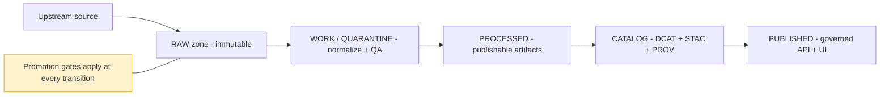

<!-- [KFM_META_BLOCK_V2]
doc_id: kfm://doc/7b0a4d6f-62c3-47f7-a566-4cb5b6b3c4f2
title: Dataset Intake Checklist
type: standard
version: v1
status: draft
owners: [TBD]
created: 2026-03-02
updated: 2026-03-02
policy_label: public
related:
  - docs/governance/README.md
  - docs/governance/templates/
tags: [kfm, governance, dataset, intake, checklist]
notes:
  - Template: copy this file into an intake PR and fill all fields.
  - Fail-closed: unknowns route to QUARANTINE until resolved.
[/KFM_META_BLOCK_V2] -->

# Dataset Intake Checklist
**Purpose:** a fail-closed checklist to onboard a dataset into KFM’s governed truth path (Upstream → RAW → WORK/QUARANTINE → PROCESSED → CATALOG → PUBLISHED).

> **TODO (repo wiring):** Replace these generic badges with repo/CI-driven badges once names/paths are confirmed (e.g., build, policy-tests, catalog-validation).

---

## Navigation
- [How to use](#how-to-use)
- [Intake summary](#intake-summary)
- [Truth path map](#truth-path-map)
- [Promotion gates checklist](#promotion-gates-checklist)
- [Artifacts by zone](#artifacts-by-zone)
- [Definition of Done](#definition-of-done)
- [Appendix](#appendix)

---

## How to use
1. **Copy this checklist** into a dataset intake PR (or link to it and fill sections in the PR description).
2. Treat any **unknown / unclear / disputed** field as **BLOCKER → QUARANTINE** until resolved.
3. Keep artifacts and decisions **evidence-linked**: every claim should point to a resolvable dataset version, artifact, catalog record, or policy decision.

**Principle:** KFM promotion is *not* “best effort.” It is a **contract**. If you can’t prove it, don’t publish it.

---

## Intake summary
Fill this section first so reviewers can quickly understand what is being onboarded.

| Field | Value |
|---|---|
| Dataset display name | |
| Proposed `dataset_id` | |
| Proposed `dataset_version_id` | |
| Intake ticket / PR | |
| Steward / owner | |
| Primary upstream publisher | |
| Upstream URL(s) / API(s) | |
| Dataset category | ☐ vector ☐ raster ☐ tabular ☐ text ☐ sensor feed ☐ other |
| Cadence | ☐ one-time ☐ annual ☐ monthly ☐ weekly ☐ daily ☐ streaming ☐ irregular |
| Expected size | |
| Spatial extent | |
| Temporal coverage | |
| Proposed `policy_label` | ☐ public ☐ public_generalized ☐ internal ☐ restricted ☐ embargoed ☐ quarantine |
| Summary (1–3 sentences) | |

---

## Truth path map

---

## Promotion gates checklist
> **Rule:** Promotion MUST be blocked unless required artifacts exist and validate.

### Gate A — Identity and versioning
- [ ] `dataset_id` is defined and stable (no display-name IDs).
- [ ] `dataset_version_id` is defined (derived from canonical inputs + deterministic hashing).
- [ ] A canonical dataset **spec** exists (machine-readable).
- [ ] `spec_hash` (or equivalent) is computed deterministically and verified in CI.
- [ ] Artifact digests/checksums are computed for **every** RAW/PROCESSED/CATALOG artifact.
- [ ] Naming conventions and identifier families documented (human + machine).

**Notes / decisions:**
- Deterministic hashing scheme / canonicalization:
- Versioning rule (new upstream fetch vs new transform vs new redaction):

---

### Gate B — Licensing and rights metadata
- [ ] License is identified (SPDX where possible) and compatible with intended distribution.
- [ ] Rights holder is identified.
- [ ] **Upstream terms snapshot** is captured as an immutable RAW artifact (e.g., HTML/PDF or API terms response).
- [ ] Attribution requirements are captured (text to show in UI + exports).
- [ ] Redistribution and derivative works permissions are clear.
- [ ] If rights are unclear: **QUARANTINE** or **metadata-only reference mode** (no mirroring of restricted media).

**Notes / decisions:**
- License:
- Rights holder:
- Terms snapshot artifact ref:
- Redistribution allowed?:
- Required attribution text:

---

### Gate C — Sensitivity classification and redaction plan
- [ ] `policy_label` assigned (use controlled vocabulary).
- [ ] Sensitive-location risk assessed (avoid precise coordinates when policy prohibits).
- [ ] PII or sensitive attributes assessed (field-level review).
- [ ] Redaction/generalization plan defined **as a first-class transform** (recorded in lineage).
- [ ] If public representation is allowed only with generalized geometry/attributes: create a **separate** `public_generalized` dataset version.
- [ ] Default posture is **deny** when sensitivity is unclear.

**Notes / decisions:**
- Policy label rationale:
- Redaction obligations (geometry/fields):
- Generalization method (if any):
- “Public generalized” derivative planned?:

---

### Gate D — Catalog triplet validation
> KFM “catalogs” are contract surfaces, not optional metadata.

- [ ] **DCAT** record exists and validates (dataset-level metadata, license, publisher, distributions).
- [ ] **STAC** catalog exists and validates (collections/items/assets with spatial+temporal extents).
- [ ] **PROV** bundle exists and validates (entities, activities, agents; lineage for all key outputs).
- [ ] Cross-links are present so identifiers resolve across DCAT ↔ STAC ↔ PROV.
- [ ] Evidence references used by Story/Focus Mode resolve **without guessing**.

**Notes / decisions:**
- DCAT artifact ref:
- STAC collection/item refs:
- PROV activity/entity refs:
- Link-check validation report ref:

---

### Gate E — QA checks and thresholds
- [ ] Dataset-specific QA checks are documented in the spec (what is measured and thresholds).
- [ ] Schema validation passes (types, required fields, nullability).
- [ ] Geometry validation passes (validity, CRS, bounds).
- [ ] Completeness checks defined and met (coverage, missingness).
- [ ] Timeliness/latency acceptable for cadence.
- [ ] If any threshold fails: **QUARANTINE** with a recorded reason and remediation plan.

**QA plan (fill):**
- Checks to run:
- Thresholds:
- QA report artifact ref:

---

### Gate F — Policy tests and contract tests
- [ ] Policy-as-code tests exist for this dataset (allow/deny + obligations).
- [ ] Tests run in CI and block merges (no “policy drift” allowed).
- [ ] API contract/schema checks relevant to this dataset pass (if applicable).
- [ ] Evidence resolver is able to enforce policy on evidence resolution for this dataset.

**Notes / decisions:**
- Policy test files/fixtures refs:
- Expected obligations:
- Contract test refs:

---

### Gate G — Run receipt and audit record
- [ ] A run receipt exists capturing:
  - [ ] inputs (upstream refs + versions)
  - [ ] tool versions
  - [ ] parameters
  - [ ] output artifact digests
  - [ ] policy decision (label + obligations)
- [ ] Receipt is append-only and linked from catalog lineage.
- [ ] Promotion event is recorded (release manifest / promotion manifest).

**Notes / decisions:**
- Run receipt ref:
- Audit ledger ref:
- Promotion manifest ref:

---

## Artifacts by zone
> This table is a review aid. Replace “example path” with the repo’s actual conventions.

| Zone | Required artifacts (minimum) | Example path (TBD) |
|---|---|---|
| RAW | acquisition manifest, raw artifacts, checksums, terms snapshot | `data/raw/<dataset_id>/<yyyy-mm-dd>/` |
| WORK/QUARANTINE | normalized outputs, QA reports, candidate redactions, intermediate logs | `data/work/<dataset_id>/<run_id>/` |
| PROCESSED | publishable artifacts, checksums/digests, derived metadata (bbox/time/counts) | `data/processed/<dataset_id>/<dataset_version_id>/` |
| CATALOG | DCAT, STAC, PROV, link map, evidence refs | `data/catalog/<dataset_id>/<dataset_version_id>/` |
| PUBLISHED | API/tiles/index projections + access policy enforcement | `apps/api/...` / `tiles/...` |

---

## Definition of Done
A dataset intake PR is ready to merge only when:

- [ ] Registry entry updated (owner, license, `policy_label`, cadence, contact).
- [ ] RAW acquisition artifacts are immutable with manifest + checksums.
- [ ] PROCESSED artifacts exist with digests and predictable paths.
- [ ] DCAT + STAC + PROV validate and are cross-linked; link checks succeed.
- [ ] Policy decisions recorded; default-deny tests pass; generalized derivatives created if needed.
- [ ] Evidence resolver resolves representative EvidenceRefs into EvidenceBundles.
- [ ] UI smoke tests (if applicable): evidence drawer resolves selections; restricted layers denied/generalized.
- [ ] Audit: run receipt emitted; audit ledger append; access controls verified.

---

## Appendix

<strong>Suggested QA checks (starter list)</strong>

**Tabular**
- primary key uniqueness (or documented non-uniqueness)
- required fields non-null threshold
- value domain checks (enums, ranges)
- duplicate row rate threshold
- temporal gaps (if time series)

**Vector**
- geometry validity (self-intersection, ring orientation, etc.)
- CRS correctness + reprojection documented
- bbox sanity (in expected region)
- topology checks (optional: overlaps/holes)
- attribute completeness

**Raster**
- no-data percentage threshold
- pixel size / CRS alignment
- band metadata completeness
- histogram sanity checks (outliers, NaNs)
- cloud mask logic (if optical imagery)

<strong>Example intake notes (copy/paste)</strong>

- **What changed vs prior version?**  
- **Why is this a new dataset version?**  
- **Known limitations / caveats:**  
- **User-facing caveat text for UI:**  
- **Open questions (blockers):**  

---

### Changelog
- v1 (2026-03-02): Initial template.
