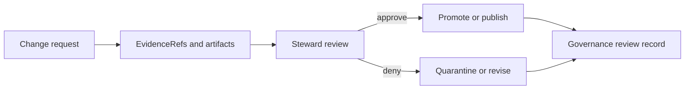
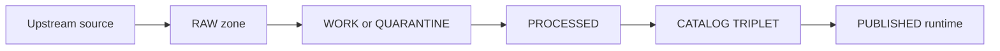

<!-- [KFM_META_BLOCK_V2]
doc_id: kfm://doc/<uuid>
title: Governance Review Record
type: standard
version: v1
status: template
owners: Governance Stewards
created: YYYY-MM-DD
updated: YYYY-MM-DD
policy_label: internal
related:
  - docs/governance/README.md
  - docs/governance/policies/
  - docs/governance/queues/
tags: [kfm, governance, template, audit]
notes:
  - This template is used to capture a governed decision (dataset promotion, story publish, policy change).
  - Fill all REQUIRED fields; if information is unknown, mark it explicitly as UNKNOWN and list the minimum verification steps.
[/KFM_META_BLOCK_V2] -->

# Governance Review Record

**Purpose:** A single, auditable record of a governance decision: *what was reviewed, what evidence was used, what policy/obligations apply, and who approved or denied the action.*

---

## Navigation

- [How to use this template](#how-to-use-this-template)
- [1. Review header](#1-review-header)
- [2. Subject under review](#2-subject-under-review)
- [3. Evidence and artifacts](#3-evidence-and-artifacts)
- [4. Policy and sensitivity](#4-policy-and-sensitivity)
- [5. Decision](#5-decision)
- [6. Gate checklists](#6-gate-checklists)
- [7. Risks and mitigations](#7-risks-and-mitigations)
- [8. Follow-ups and action items](#8-follow-ups-and-action-items)
- [9. Approvals and signatures](#9-approvals-and-signatures)
- [Appendix A — Reference flows](#appendix-a--reference-flows)
- [Appendix B — Glossary](#appendix-b--glossary)

---

## How to use this template

1. **Copy this file** into the appropriate review/records location (per repo convention).
2. Fill all **REQUIRED** fields.
3. Use the **Truth discipline** blocks:
   - **CONFIRMED:** backed by resolvable evidence and/or validation outputs
   - **PROPOSED:** an option being recommended (include rationale + tradeoffs)
   - **UNKNOWN:** missing info; include the *minimum verification steps* to resolve it
4. If this review covers restricted/sensitive material, **do not paste restricted content** into this record. Link to governed evidence bundles or internal artifacts only.

> [!WARNING]
> This record is a governance artifact. Treat edits as *append-only in intent*: supersede with a new record when decisions change, rather than rewriting history.

---

## 1. Review header

| Field | Value |
|---|---|
| **REQUIRED: Review ID** | `kfm://gov_review/<yyyy-mm-dd>.<slug>` |
| **REQUIRED: Review type** | ☐ Dataset promotion ☐ Story publish ☐ Policy change ☐ Incident / rollback ☐ Other: ____ |
| **REQUIRED: Status** | ☐ Draft ☐ In review ☐ Approved ☐ Denied ☐ Needs more info ☐ Superseded |
| **REQUIRED: Requested action** | ☐ Promote to PUBLISHED ☐ Publish Story Node ☐ Change policy label/obligations ☐ Other: ____ |
| **Requested by** | name / handle / role |
| **REQUIRED: Primary steward/reviewer** | name / handle |
| **Additional reviewers** | (role → name) |
| **Date opened** | YYYY-MM-DD |
| **Date closed** | YYYY-MM-DD |
| **Associated PR(s)** | link(s) |
| **Associated ticket(s)** | link(s) |
| **Supersedes** | (Review ID) |
| **Superseded by** | (Review ID) |

### Scope statement (1–3 sentences)

> What is being decided *exactly* in this review? What is out of scope?

---

## 2. Subject under review

### 2.1 Entity identifiers

| Entity kind | Identifier | Notes |
|---|---|---|
| Dataset | `kfm://dataset/<dataset_slug>` |  |
| Dataset version | `kfm://dataset/@<dataset_version_id>` |  |
| Story Node | `kfm://story/@<story_id>` |  |
| Policy decision | `kfm://policy_decision/<id>` |  |
| Run | `kfm://run/<run_id>` |  |

> [!TIP]
> Prefer stable, URI-like identifiers. Avoid embedding environment-specific hostnames in canonical IDs.

### 2.2 Change summary

**What changed?** (schema, geometry, fields, attribution, policy label, story text, etc.)

- **Before:**  
- **After:**  

### 2.3 Intended lifecycle transition

Check all that apply:

- ☐ RAW → WORK
- ☐ WORK → PROCESSED
- ☐ PROCESSED + CATALOG/TRIPLET → PUBLISHED
- ☐ Story draft → published
- ☐ Policy pack change (CI + runtime semantics)

---

## 3. Evidence and artifacts

### 3.1 EvidenceRefs (REQUIRED)

List every evidence reference required to justify the decision.

| Kind | EvidenceRef | What it supports | Policy allowed? | Notes |
|---|---|---|---|---|
| dcat | `kfm://evidence/...` |  | ☐ allow ☐ deny |  |
| stac | `kfm://evidence/...` |  | ☐ allow ☐ deny |  |
| prov | `kfm://evidence/...` |  | ☐ allow ☐ deny |  |
| doc | `kfm://evidence/...` |  | ☐ allow ☐ deny |  |
| other |  |  | ☐ allow ☐ deny |  |

### 3.2 Validation outputs (REQUIRED for promotion/publish)

| Check | Artifact / Link | Result | Notes |
|---|---|---|---|
| Schema validation |  | ☐ pass ☐ fail |  |
| Catalog validation (DCAT) |  | ☐ pass ☐ fail |  |
| Catalog validation (STAC) |  | ☐ pass ☐ fail ☐ n/a |  |
| Catalog validation (PROV) |  | ☐ pass ☐ fail |  |
| Cross-link check (DCAT↔STAC↔PROV) |  | ☐ pass ☐ fail |  |
| QA report + thresholds |  | ☐ pass ☐ fail |  |
| Policy tests (fixtures) |  | ☐ pass ☐ fail |  |
| Evidence resolver smoke test |  | ☐ pass ☐ fail |  |
| API contract checks |  | ☐ pass ☐ fail ☐ n/a |  |
| UI evidence drawer check |  | ☐ pass ☐ fail ☐ n/a |  |

### 3.3 Run receipt(s) (REQUIRED for promotion and Focus Mode runs)

- Run receipt ID(s):  
- Receipt artifact link(s):  

**Receipt excerpt (optional):**
- run_id:
- dataset_version_id:
- inputs (count):
- outputs (count):
- environment (container digest / params digest / git commit):
- created_at:

### 3.4 Promotion manifest / release manifest (REQUIRED when promoting)

- Manifest ID / tag:  
- Manifest artifact link:  
- Includes digests for all promoted artifacts? ☐ yes ☐ no

---

## 4. Policy and sensitivity

### 4.1 Policy label (REQUIRED)

- **REQUIRED: policy_label:** `public | public_generalized | restricted | restricted_sensitive_location | internal | embargoed | quarantine`  
- **REQUIRED: Decision basis:** (Why this label is appropriate)

### 4.2 Obligations (REQUIRED when any apply)

List obligations that must be enforced in CI and runtime (and shown in UI where relevant).

| Obligation type | Description | Enforcement point(s) | Verified? |
|---|---|---|---|
| show_notice | e.g., “Geometry generalized due to policy.” | ☐ UI ☐ API ☐ Evidence resolver | ☐ yes ☐ no |
| generalize_geometry |  | ☐ pipeline ☐ tiles ☐ exports | ☐ yes ☐ no |
| remove_fields |  | ☐ pipeline ☐ exports | ☐ yes ☐ no |
| restrict_download |  | ☐ API ☐ UI | ☐ yes ☐ no |
| attribution_required |  | ☐ UI ☐ exports | ☐ yes ☐ no |
| other |  |  | ☐ yes ☐ no |

### 4.3 Redaction / generalization plan (REQUIRED for sensitive/restricted)

- **Is the dataset sensitive-location or otherwise restricted?** ☐ yes ☐ no  
- If yes, describe the plan (and where it is recorded in provenance):

**Plan summary:**
- Method:
- Parameters:
- Expected residual risk:
- Reverse engineering risk considered? ☐ yes ☐ no

**Provenance links:**
- PROV activity/entity reference(s):  

---

## 5. Decision

### 5.1 Decision outcome (REQUIRED)

- **Decision:** ☐ allow ☐ deny ☐ allow_with_obligations ☐ defer  
- **Effective date/time:** YYYY-MM-DD hh:mm (timezone)  
- **Decision ID:** `kfm://policy_decision/<id>`  

### 5.2 Rationale (REQUIRED)

#### CONFIRMED (evidence-backed)
- …

#### PROPOSED (option/tradeoffs)
- …

#### UNKNOWN (must verify)
- …

### 5.3 User-visible impact

- What will a *public user* see (layers, story, Focus responses)?
- Any new notices/badges?

### 5.4 Rollback / supersession plan (REQUIRED)

- Trigger conditions:
- Rollback steps (link to runbook if exists):
- Communication plan:

---

## 6. Gate checklists

> [!NOTE]
> Use the relevant checklist(s) based on review type. For promotions, **Promotion Contract gates** are mandatory.

### 6.1 Promotion Contract gates (dataset version promotion)

**Gate A — Identity and versioning**
- ☐ Dataset ID is stable and follows naming convention.
- ☐ DatasetVersion ID is immutable and derived from a stable `spec_hash`.
- ☐ Content digests/checksums exist for all promoted artifacts.

**Gate B — Licensing and rights metadata**
- ☐ License is explicit and compatible with intended use.
- ☐ Rights holder + attribution requirements captured.
- ☐ If unclear → marked QUARANTINE (fail closed).

**Gate C — Sensitivity classification and redaction plan**
- ☐ `policy_label` assigned.
- ☐ Redaction/generalization plan exists (when needed) and is recorded in PROV.

**Gate D — Catalog triplet validation**
- ☐ DCAT record exists and validates against KFM profile.
- ☐ STAC collection/items exist (if applicable) and validate against KFM profile.
- ☐ PROV bundle exists and validates against KFM profile.
- ☐ Cross-links between DCAT/STAC/PROV resolve.

**Gate E — Run receipt and checksums**
- ☐ `run_receipt` exists for each producing run.
- ☐ Inputs/outputs enumerated with checksums.
- ☐ Environment recorded (container image digest, parameters).

**Gate F — Policy tests and contract tests**
- ☐ OPA policy tests pass (fixtures-driven) for this dataset version.
- ☐ Evidence resolver can resolve at least one EvidenceRef in CI.
- ☐ API contracts and schemas validate.

**Gate G — Optional but recommended (production posture)**
- ☐ SBOM + build provenance exist for pipeline images and API/UI artifacts.
- ☐ Performance smoke checks (tile rendering, evidence resolve latency).
- ☐ Accessibility smoke checks (e.g., evidence drawer keyboard navigation).

### 6.2 Story publish gates (Story Node v3)

- ☐ Review state captured (this record + reviewer identity).
- ☐ All Story citations resolve as EvidenceRefs and are policy-allowed.
- ☐ Rights for included media are explicit (license/rights holder/attribution).
- ☐ Any sensitive topics trigger appropriate additional review (if required by policy).
- ☐ Story UI opens evidence drawer for cited claims.

### 6.3 Policy change gates (policy-as-code)

- ☐ Change includes updated policy tests (allow/deny + obligations fixtures).
- ☐ CI and runtime semantics are aligned (no “CI says allow, runtime denies” drift).
- ☐ Backward compatibility considered (impact to existing datasets/stories).
- ☐ Migration notes / change log written.

---

## 7. Risks and mitigations

List the top risks introduced or re-evaluated by this change.

| Risk ID | Description | Likelihood | Impact | Mitigation | Owner |
|---|---|---:|---:|---|---|
| RISK-___ |  | Low/Med/High | Low/Med/High |  |  |

---

## 8. Follow-ups and action items

- [ ] Action item 1 (owner, due date)
- [ ] Action item 2 (owner, due date)

---

## 9. Approvals and signatures

### 9.1 RACI / roles

| Role | Name | Decision |
|---|---|---|
| Contributor (proposed) |  |  |
| Steward / Reviewer (accountable) |  | ☐ approve ☐ deny |
| Operator (execution) |  | ☐ ack |
| Governance council / community stewards (if sensitive) |  | ☐ approve ☐ deny |
| Legal / compliance (if rights unclear) |  | ☐ approve ☐ deny |

### 9.2 Sign-off log (append-only)

| Timestamp | Principal | Role | Action | Notes |
|---|---|---|---|---|
| YYYY-MM-DD hh:mm |  |  |  |  |

---

## Appendix A — Reference flows

### A.1 Governance review → promotion flow

### A.2 Truth path lifecycle (zones)

---

## Appendix B — Glossary

- **EvidenceRef:** A resolvable reference that returns an evidence bundle (metadata + artifacts + provenance), not just a pasted URL.
- **Promotion Contract:** The minimum set of gates that must pass before serving a dataset version in governed runtime surfaces.
- **policy_label:** A controlled vocabulary value that drives allow/deny decisions and obligations.
- **Obligation:** A required action (UI notice, generalization, field removal) enforced at runtime and/or in pipelines.
