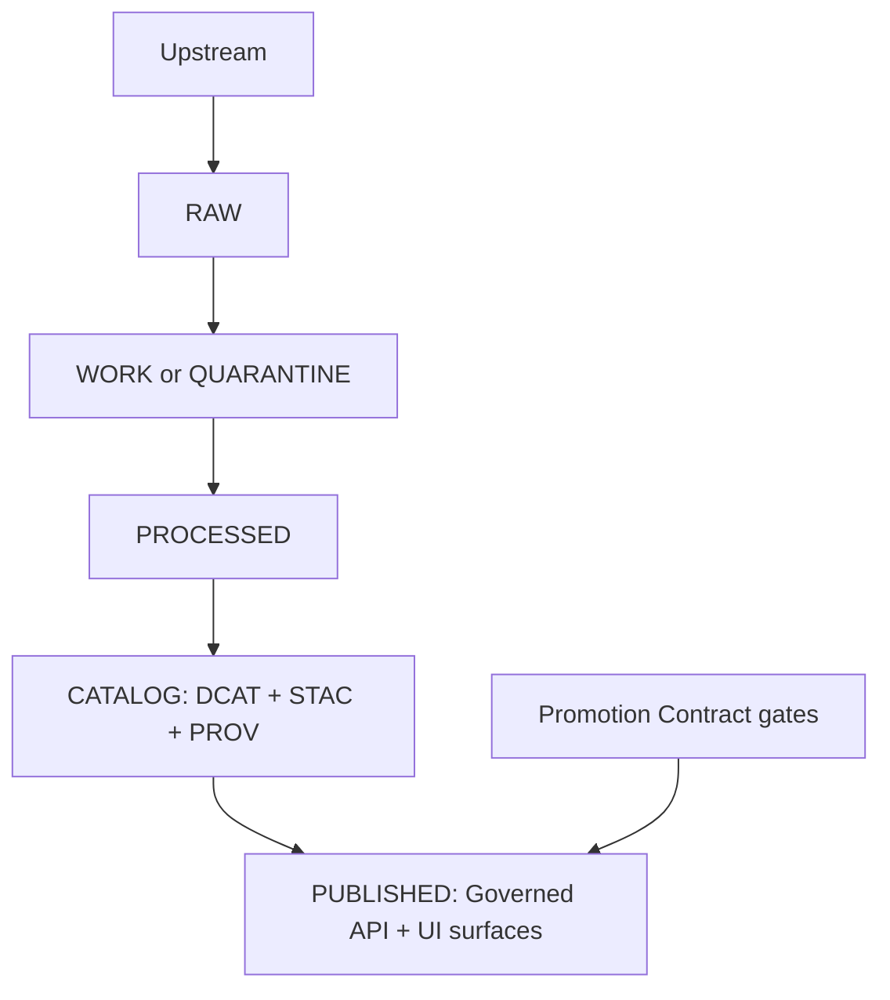

<!-- [KFM_META_BLOCK_V2]
doc_id: kfm://doc/11a45e2c-6265-42e0-891e-6be4637c2562
title: PUBLICATION SIGN-OFF
type: standard
version: v1
status: draft
owners: kfm-governance
created: 2026-03-02
updated: 2026-03-02
policy_label: public
related:
  - kfm://concept/promotion-contract
  - kfm://concept/truth-path
  - kfm://concept/trust-membrane
tags: [kfm, governance, template, release, publication, signoff]
notes:
  - Template for steward sign-off prior to promotion into PUBLISHED runtime surfaces.
  - Treat publishing as a governed event: fail-closed if any required evidence is missing.
[/KFM_META_BLOCK_V2] -->

# PUBLICATION SIGN-OFF
**Template** for approving promotion into **PUBLISHED** (governed runtime).

---

## Quick links
- [1) What this is](#1-what-this-is)
- [2) What you must attach](#2-what-you-must-attach)
- [3) Promotion Contract gates (required)](#3-promotion-contract-gates-required)
- [4) Policy & trust membrane checks](#4-policy--trust-membrane-checks)
- [5) UI surfaces checks (Map, Story, Focus)](#5-ui-surfaces-checks-map-story-focus)
- [6) Approvals and decision](#6-approvals-and-decision)
- [7) Post-publish verification](#7-post-publish-verification)

---

> [!WARNING]
> **Default-deny posture.** If licensing is unclear, sensitivity obligations are missing, or evidence cannot be verified, **do not publish**.  
> Do **not** include secrets, private tokens, or restricted details in this sign-off file.

---

## 1) What this is

This document is the human-readable **sign-off record** that a release (dataset version(s), catalogs, and runtime surfaces) is ready to be promoted to **PUBLISHED**.

Publishing is treated as a **governed event**:
- it is **auditable** (who/what/when/why),
- it is **reproducible** (inputs + tooling + hashes),
- it is **policy-enforced** (no bypass around the Policy Enforcement Point),
- it is **fail-closed** (missing gates block promotion).

### Where this fits in the repo
`docs/governance/templates/PUBLICATION_SIGNOFF.md`

Suggested usage:
1. Copy this template into your release PR as a new file (example name: `PUBLICATION_SIGNOFF__<release_id>.md`).
2. Fill it out with links/IDs to the artifacts created by the release.
3. Obtain approvals (Section 6) before promotion.

### Acceptable inputs
- Dataset identifiers (dataset_id, dataset_version_id), spec_hashes, content digests
- Links to CI runs, validation reports, run receipts, audit ledger entries
- Links to catalog records (DCAT/STAC) and lineage (PROV)
- A rollout and rollback plan

### Exclusions
- No secrets / credentials / tokens
- No restricted or vulnerable-site exact coordinates unless policy explicitly allows public disclosure
- No personal data unless policy and legal approval explicitly allow

---

## Truth path overview

---

## 2) What you must attach

Fill in with links to the concrete artifacts produced by this promotion. If an item doesn’t exist, mark it `MISSING` and stop promotion.

**Release identity**
- Release ID: `<release_id>`
- Date/time window (America/Chicago): `<YYYY-MM-DD HH:MM> to <YYYY-MM-DD HH:MM>`
- Target environment(s): `staging | production | other: ____`
- Change type: `new dataset | new version | policy change | UI change | hotfix | other: ____`
- Risk level: `low | medium | high` (explain): `<...>`

**Primary artifacts**
- CI run(s): `<link(s)>`
- Run receipt(s): `<receipt_id(s) and link(s)>`
- QA report(s): `<link(s)>`
- Catalog validation report(s): `<link(s)>`
- Release manifest: `<link(s)>`
- DatasetVersion diff report(s) (if applicable): `<link(s)>`

---

## 3) Promotion Contract gates (required)

> [!IMPORTANT]
> **Fail-closed rule:** Promotion into **PUBLISHED** is blocked unless **all** required gates below are satisfied.

### Gate A — Identity & versioning
- [ ] dataset_id present: `<dataset_id>`
- [ ] dataset_version_id present: `<dataset_version_id>`
- [ ] deterministic spec_hash present: `<spec_hash>`
- [ ] content digests recorded for all released artifacts (example: `sha256:...`)
  - Artifact list:
    - `<artifact_type>`: `<uri or path>` → `<digest>`
    - `<artifact_type>`: `<uri or path>` → `<digest>`
- [ ] Identifiers are stable and match catalogs + receipts

Evidence:
- Link(s): `<...>`

### Gate B — Licensing & rights metadata
- [ ] License field present and non-unknown: `<license>`
- [ ] Rights holder / publisher present: `<entity>`
- [ ] Snapshot of upstream terms captured (or explicit waiver reference): `<link>`
- [ ] Distribution terms reviewed for each artifact type (tiles, downloads, API exports)

Evidence:
- Link(s): `<...>`

### Gate C — Sensitivity classification & redaction plan
- [ ] policy_label assigned: `public | restricted | internal | other: ____`
- [ ] Policy obligations explicitly listed (example: generalize geometry, remove fields): `<obligations>`
- [ ] Redaction/generalization transforms are recorded as first-class steps in lineage (PROV): `<link>`
- [ ] If any public representation is permitted for a sensitive dataset, a separate **public_generalized** dataset version is produced (or explicitly waived): `<link or waiver>`

Evidence:
- Link(s): `<...>`

### Gate D — Catalog triplet validation (DCAT + STAC + PROV)
- [ ] DCAT record validates and includes dataset_id + dataset_version_id + policy label: `<link>`
- [ ] STAC collection/items validate and include dataset_version_id + policy label: `<link>`
- [ ] PROV bundle exists and links inputs → activities → outputs: `<link>`
- [ ] Cross-links resolve (DCAT ↔ STAC ↔ PROV) and EvidenceRefs resolve **without guessing**
- [ ] Link-checker reports zero broken required links

Evidence:
- Link(s): `<...>`

### Gate E — QA & thresholds
- [ ] Dataset-specific QA checks are documented in the dataset spec
- [ ] QA thresholds met (or explicitly exception-approved): `
`
- [ ] Any failed checks are quarantined and not promoted

Evidence:
- Link(s): `<...>`

### Gate F — Run receipt & audit record
- [ ] Run receipt(s) exist and validate against schema
- [ ] Receipts include: input IDs, tool versions, parameters, artifact digests, and policy decisions
- [ ] Append-only audit record entry created (who/what/when/why): `<audit_entry_id or link>`

Evidence:
- Link(s): `<...>`

### Gate G — Release manifest
- [ ] Release manifest exists for this promotion
- [ ] Manifest references all artifacts + digests
- [ ] Manifest is the source of truth for what was promoted and when

Evidence:
- Link(s): `<...>`

---

## 4) Policy & trust membrane checks

- [ ] **Trust membrane honored**: clients/UI do not access storage directly; all access is mediated by governed APIs (PEP)
- [ ] Policy-as-code tests passed (allow/deny fixtures + obligations)
- [ ] Default-deny behavior confirmed for restricted datasets
- [ ] Error responses do not leak restricted metadata (including in 403/404)
- [ ] Exports/downloads automatically include required attribution + license text (or are blocked)

Evidence:
- Policy test run link(s): `<...>`
- PEP/API smoke test link(s): `<...>`

---

## 5) UI surfaces checks (Map, Story, Focus)

> [!IMPORTANT]
> **Hard citation verification:** Story publishing and Focus Mode responses must verify that every citation/EvidenceRef resolves and is policy-allowed. If verification fails, the system must narrow scope or abstain.

### Map/Layer surfaces
- [ ] Map layer configs reference **promoted dataset versions only**
- [ ] Identify/evidence drawer shows dataset version + license/rights
- [ ] Filters and derived views do not expose hidden restricted fields

Evidence:
- Link(s): `<...>`

### Story surfaces (if included in release)
- [ ] Story Node(s) cite EvidenceRefs that resolve via evidence resolver
- [ ] Story review status captured (review queue state recorded)
- [ ] Embedded map state references promoted dataset versions only

Evidence:
- Link(s): `<...>`

### Focus Mode (if included in release)
- [ ] Golden/evaluation queries executed (or other evaluation harness)
- [ ] Every citation verified as resolvable + policy-allowed
- [ ] Abstain/narrow-scope behavior verified for unsupported or restricted queries
- [ ] A receipt/audit entry exists for evaluation runs

Evidence:
- Link(s): `<...>`

---

## 6) Approvals and decision

### Reviewers (fill in)

| Role | Name | Approval | Date | Notes |
|---|---|---:|---|---|
| Data Steward (required) | `<name>` | ⬜ Approve / ⬜ Reject | `<YYYY-MM-DD>` | `<...>` |
| Policy / Privacy (required) | `<name>` | ⬜ Approve / ⬜ Reject | `<YYYY-MM-DD>` | `<...>` |
| Licensing / Legal (required if non-public-domain or unclear rights) | `<name>` | ⬜ Approve / ⬜ Reject | `<YYYY-MM-DD>` | `<...>` |
| Security (required if auth/policy/runtime changes) | `<name>` | ⬜ Approve / ⬜ Reject | `<YYYY-MM-DD>` | `<...>` |
| Engineering (required) | `<name>` | ⬜ Approve / ⬜ Reject | `<YYYY-MM-DD>` | `<...>` |
| Product/Comms (recommended for public launches) | `<name>` | ⬜ Approve / ⬜ Reject | `<YYYY-MM-DD>` | `<...>` |
| Release Manager (required) | `<name>` | ⬜ Approve / ⬜ Reject | `<YYYY-MM-DD>` | `<...>` |

### Decision
- Decision: ⬜ **APPROVED** ⬜ **APPROVED WITH CONDITIONS** ⬜ **REJECTED**
- Conditions (if any): `<...>`
- Rollback trigger conditions: `<...>`
- Rollback plan link: `<...>`

---

## 7) Post-publish verification

Within `<N>` minutes/hours of promotion (choose and enforce via runbook):

- [ ] Governed API endpoints respond as expected
- [ ] Policy enforcement confirmed for public vs restricted contexts
- [ ] Evidence resolution works for a sample of citations
- [ ] Catalogs (DCAT/STAC/PROV) are accessible and cross-links resolve
- [ ] Tiles/search indexes (if applicable) are updated and consistent with digests
- [ ] Observability checks: logs/metrics/alerts show no regressions
- [ ] Public UI shows license/rights and dataset version clearly

Record results:
- Verification run link(s): `<...>`
- Issues opened (if any): `<...>`

---

Appendix — Optional additions that improve trust

### A1) DatasetVersion diff summary (recommended)
Attach a diff report that summarizes what changed between dataset versions (features added/removed/modified, bbox/time range changes, QA metric deltas, artifact digests).

### A2) Incident / rollback drill (recommended for high-risk releases)
Document a rollback drill or dry-run and record the time-to-recover.

### A3) Community/CARE considerations (when applicable)
If Indigenous/community constraints apply, record how consent/constraints were verified, and what obligations were encoded in policy.

