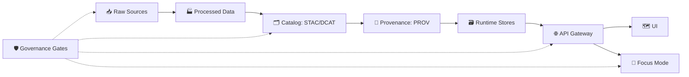

# 🛡️ Governance Templates


> [!NOTE]
> This folder contains **copy/paste templates** used to propose, review, approve, and audit changes across **data**, **AI**, **security**, and **policy** in the Kansas Frontier Matrix (KFM).  
> Templates keep us consistent, traceable, and aligned with sovereignty + privacy expectations. 🧭

---

## 📚 Table of Contents
- [🎯 Why templates exist](#-why-templates-exist)
- [⚡ Quick start](#-quick-start)
- [🧱 KFM governance invariants](#-kfm-governance-invariants)
- [🗺️ Where templates plug into the system](#️-where-templates-plug-into-the-system)
- [📦 Template index](#-template-index)
- [🧩 Inline “quick copy” skeletons](#-inline-quick-copy-skeletons)
- [✅ Review gates & required artifacts](#-review-gates--required-artifacts)
- [👥 Roles & review expectations](#-roles--review-expectations)
- [🧰 Adding a new template](#-adding-a-new-template)

---

## 🎯 Why templates exist

KFM’s governance is built around **gates** (automated + human review) that ensure:

- **Traceability**: everything shipped has a provenance trail 🧾  
- **Least privilege**: access is role-based and policy-checked 🧷  
- **Sovereignty & safety**: sensitive material stays protected (no accidental leaks) 🪶  
- **Evidence-first**: narratives and AI outputs are grounded in the catalog and sources 📚

Templates reduce “tribal knowledge” and make governance repeatable across contributors.

---

## ⚡ Quick start

1. **Pick a template** from the [Template index](#-template-index).
2. **Copy it** into the destination folder (noted per template).
3. **Fill every section** (use `N/A` instead of deleting sections).
4. **Open a PR** and link the filled doc in:
   - PR description ✅
   - or an issue comment 🧵
5. **Pass gates** (policy checks + reviewer sign-off).

> [!TIP]
> If your change touches **classification/sensitivity**, **AI prompts/policies**, or **new datasets**, expect stricter review and additional artifacts.

---

## 🧱 KFM governance invariants

These are the non-negotiables we design templates around:

1. **Truth path only** 🛤️  
   Raw → Processed → Catalog → Databases → API → UI/AI  
   (No bypassing the governed API layer.)

2. **Fail closed by default** 🔒  
   Missing metadata, unclear license, missing provenance, or policy mismatch ⇒ **block** until fixed.

3. **No output less restricted than its input** 🧯  
   Classification tags propagate forward; you can redact/generalize, but never “loosen” downstream.

4. **AI: “No Source, No Answer”** 🤖  
   If it can’t cite trusted KFM sources, it should refuse.

---

## 🗺️ Where templates plug into the system



---

## 📦 Template index

> Legend: ✅ core / recommended • 🧩 optional but useful • 🧨 high-risk area (extra review)

| Template (suggested filename) | What it’s for | Where the filled doc should go | Risk |
|---|---|---|---|
| `TEMPLATE__GOV__DATA_SOURCE_MANIFEST.md` | Declare a source (publisher, license, refresh cadence, classification) | `docs/governance/requests/` | ✅ |
| `TEMPLATE__GOV__DATASET_CARD.md` | Human-readable dataset summary (“map behind the map”) | `docs/governance/datasets/` | ✅ |
| `TEMPLATE__GOV__PROVENANCE_NOTE.md` | Explain non-obvious processing decisions (filters, outliers, joins) | `docs/governance/datasets/` | 🧩 |
| `TEMPLATE__GOV__SENSITIVITY_CHANGE_REQUEST.md` | Reclassify data, request redaction/generalization plan | `docs/governance/requests/` | 🧨 |
| `TEMPLATE__GOV__POLICY_CHANGE_PROPOSAL.md` | Propose changes to policy-as-code (OPA/Rego) + tests | `docs/governance/policies/` | 🧨 |
| `TEMPLATE__GOV__ACCESS_EXCEPTION_REQUEST.md` | Ask for an exception (temporary elevated access, time-boxed) | `docs/governance/requests/` | 🧨 |
| `TEMPLATE__GOV__AI_PROMPT_OR_RAG_CHANGE.md` | Change prompts, retrieval rules, citation behavior, model config | `docs/governance/ai/` | 🧨 |
| `TEMPLATE__GOV__AI_EVAL_REPORT.md` | Document evaluation results (quality, citation coverage, safety) | `docs/governance/ai/evals/` | ✅ |
| `TEMPLATE__GOV__INCIDENT_REPORT.md` | Governance incident (leak, bad license, wrong classification, hallucination w/o citation) | `docs/governance/incidents/` | ✅ |
| `TEMPLATE__GOV__RELEASE_GOV_CHECKLIST.md` | Pre-release governance checklist (gates, artifacts, audit) | `docs/governance/releases/` | 🧩 |

> [!NOTE]
> These filenames are a **recommended set**. If some templates don’t exist yet, treat this README as the spec for what we want to add next.

---

## 🧩 Inline “quick copy” skeletons

### 📄 `TEMPLATE__GOV__DATA_SOURCE_MANIFEST.md`
<details>
<summary><strong>Open template</strong> (copy/paste)</summary>

```markdown
---
template: GOV_DATA_SOURCE_MANIFEST
version: 0.1.0
status: draft
created: YYYY-MM-DD
owner: <github-handle-or-team>
---

# Data Source Manifest — <Source Name> 📦

## 1) Summary
- **Source ID:** <slug_like_this>
- **Publisher / Owner:** <org>
- **Primary URL(s):** <url or internal reference>
- **What this source contains:** <1–3 sentences>
- **Update cadence:** <one-time | daily | weekly | monthly | annual | ad-hoc>
- **Intended KFM domain(s):** <hydrology | land | history | ...>

## 2) License & usage ✅
- **License name:** <e.g., CC-BY-4.0 / Public Domain / custom>
- **License URL or text location:** <link or repo path>
- **Attribution required?** <yes/no + how>
- **Redistribution allowed?** <yes/no/unknown>
- **Commercial use allowed?** <yes/no/unknown>
- **Notes / edge cases:** <important restrictions>

## 3) Sensitivity & sovereignty 🪶
- **Classification:** <public | restricted | confidential>
- **Why this classification applies:** <brief>
- **Known sensitive fields:** <coords, names, personal info, etc.>
- **Required redaction/generalization:** <yes/no + plan>

## 4) Provenance expectations 🧾
- **How raw files will be stored:** `data/raw/<domain>/<source_id>/...`
- **Expected processing outputs:** `data/processed/...`
- **Expected catalog artifacts:** STAC / DCAT
- **Expected lineage artifact:** PROV (who/what/when/how)

## 5) Operational plan 🛠️
- **Ingestion method:** <manual | API | scrape | sync | partner drop>
- **Validation checks:** <schema, geometry validity, checksums, etc.>
- **Rollback plan:** <how to remove/disable source safely>
- **Contact / escalation:** <email/team/issue label>

## 6) Approvals ✅
- [ ] Maintainer review complete
- [ ] License verified
- [ ] Sensitivity verified
- [ ] Ingestion plan approved
```
</details>

---

### 📄 `TEMPLATE__GOV__SENSITIVITY_CHANGE_REQUEST.md`
<details>
<summary><strong>Open template</strong> (copy/paste)</summary>

```markdown
---
template: GOV_SENSITIVITY_CHANGE_REQUEST
version: 0.1.0
status: draft
created: YYYY-MM-DD
owner: <github-handle-or-team>
---

# Sensitivity / Classification Change Request 🧨

## 1) What is changing?
- **Dataset(s) / layer(s) / story node(s):** <list>
- **Current classification:** <public | restricted | confidential>
- **Proposed classification:** <public | restricted | confidential>
- **Reason for change:** <1–2 paragraphs>

## 2) Sovereignty + privacy review 🪶
- **Does this involve Indigenous, sacred, or culturally sensitive info?** <yes/no>
- **Does this involve personal data of living individuals?** <yes/no>
- **Consent / authority basis (if applicable):** <describe>

## 3) Redaction/generalization plan 🧯
- **What fields will be removed or generalized?** <list>
- **Where applied?** (check all)
  - [ ] `data/processed/...`
  - [ ] STAC/DCAT metadata
  - [ ] API responses (server-side)
  - [ ] UI behavior
  - [ ] AI retrieval rules / citations
- **Verification steps:** <how you prove it’s redacted everywhere>

## 4) Impact assessment 📉
- **Who is affected?** <users/partners>
- **What breaks?** <tiles, stories, API consumers>
- **Mitigation:** <plan>

## 5) Approvals ✅
- [ ] Maintainer approval
- [ ] Governance/ethics review (if needed)
- [ ] Security review (if needed)
- [ ] Documented in `docs/governance/REVIEW_GATES.md` (or linked equivalent)
```
</details>

---

### 📄 `TEMPLATE__GOV__POLICY_CHANGE_PROPOSAL.md`
<details>
<summary><strong>Open template</strong> (copy/paste)</summary>

```markdown
---
template: GOV_POLICY_CHANGE_PROPOSAL
version: 0.1.0
status: draft
created: YYYY-MM-DD
owner: <github-handle-or-team>
---

# Policy Change Proposal (OPA / Rego) 🧷

## 1) Summary
- **Policy area:** <data | ai | security | compliance>
- **Files touched:** `policy/<name>.rego` (and tests)
- **Intent:** <what rule changes and why>

## 2) What’s the risk?
- **Risk level:** <low | medium | high>
- **Potential failure modes:** <list>
- **“Fail closed” behavior preserved?** <yes/no + why>

## 3) Before → After (behavior)
- **Previous behavior:** <describe>
- **New behavior:** <describe>
- **Examples:** <1–3 realistic requests and outcomes>

## 4) Tests & verification 🧪
- **Conftest policies run on:** <which files>
- **New tests added:** <list>
- **Manual verification:** <how to validate in dev/stage>

## 5) Rollback plan 🔁
- **How to revert safely:** <steps>
- **Monitoring signals:** <logs/metrics/audit events>

## 6) Approvals ✅
- [ ] Maintainer review
- [ ] Security review (if policy affects access control)
- [ ] Governance review (if classification/scope changes)
```
</details>

---

### 📄 `TEMPLATE__GOV__AI_PROMPT_OR_RAG_CHANGE.md`
<details>
<summary><strong>Open template</strong> (copy/paste)</summary>

```markdown
---
template: GOV_AI_PROMPT_OR_RAG_CHANGE
version: 0.1.0
status: draft
created: YYYY-MM-DD
owner: <github-handle-or-team>
---

# AI Prompt / RAG / Model Change 🧠🤖

## 1) Summary
- **Change type:** <prompt | retrieval | citation formatting | model version | embeddings | policy>
- **Components touched:** <files/services>
- **Goal:** <what improves>

## 2) “No Source, No Answer” compliance ✅
- **How citations are ensured:** <describe>
- **Refusal behavior when sources are weak:** <describe>
- **Any new allowed content?** <yes/no + details>

## 3) Safety & sensitivity 🪶
- **Does retrieval touch restricted/confidential datasets?** <yes/no>
- **How policies enforce access:** <describe>
- **Prompt injection hardening considered?** <yes/no + notes>

## 4) Evaluation plan 🧪
- **Eval set used:** <links/paths>
- **Metrics:** <citation coverage, factuality, refusal correctness, latency>
- **Regression checks:** <what must not degrade>

## 5) Rollout & rollback 🔁
- **Feature flags / staged deploy:** <yes/no + approach>
- **Rollback trigger:** <what signals indicate trouble>
- **Rollback steps:** <how>

## 6) Approvals ✅
- [ ] Maintainer review
- [ ] Security / governance review (if touching sensitive data paths)
- [ ] Eval report filed (link)
```
</details>

---

### 📄 `TEMPLATE__GOV__INCIDENT_REPORT.md`
<details>
<summary><strong>Open template</strong> (copy/paste)</summary>

```markdown
---
template: GOV_INCIDENT_REPORT
version: 0.1.0
status: draft
created: YYYY-MM-DD
owner: <incident-commander>
severity: <sev0 | sev1 | sev2 | sev3>
---

# Governance Incident Report 🚨

## 1) What happened?
- **Summary:** <1 paragraph>
- **Impact:** <who/what was affected>
- **Detection method:** <user report | monitoring | audit | CI failure>

## 2) Timeline 🕰️
- T0: <time> — <event>
- T1: <time> — <event>
- ...

## 3) Root cause 🧠
- **Primary cause:** <describe>
- **Contributing factors:** <list>

## 4) Containment & remediation 🧯
- **Immediate containment:** <steps taken>
- **Remediation:** <patches, reprocessing, reclassification>
- **Backfill / cleanup:** <if needed>

## 5) Governance & policy notes 🧷
- **Which gate failed or was missing?**
- **Which policy should have blocked this?**
- **What audit artifacts exist (PROV, logs, ledger entries)?**

## 6) Follow-ups ✅
- [ ] Add/adjust template(s)
- [ ] Add/adjust policy-as-code tests
- [ ] Documentation updates
- [ ] Postmortem review date
```
</details>

---

## ✅ Review gates & required artifacts

| Gate | What it protects | Minimum required artifacts |
|---|---|---|
| 📥 Ingestion gate | License, classification, source legitimacy | Source Manifest ✅ |
| 🗂️ Catalog gate | Discoverability + metadata completeness | STAC + DCAT + Dataset Card ✅ |
| 🧾 Provenance gate | Auditability & reproducibility | PROV record + (optional) Provenance Note ✅ |
| 🌐 API/Runtime gate | Access control + redaction enforcement | Policy checks (OPA/Rego) + RBAC mapping ✅ |
| 🤖 AI output gate | Citation integrity + restricted info safety | AI change template + Eval report + Incident template (if needed) ✅ |

---

## 👥 Roles & review expectations

KFM’s review flow typically maps to these roles:

- **Public Viewer** 👀: reads public outputs only  
- **Contributor** ✍️: proposes changes, drafts artifacts, cannot “publish” unreviewed governance items  
- **Maintainer** 🧰: reviews/approves, manages releases and policy changes  
- **Admin** 🧑‍💻: can run restricted operations (ingestion triggers, policy bundle deployment, emergency response)

> [!IMPORTANT]
> If you’re unsure which role should approve something, treat it as **high risk** and route it to Maintainers/Admins.

---

## 🧰 Adding a new template

1. Name it `TEMPLATE__GOV__<TOPIC>.md` (all caps, double underscores).
2. Include:
   - YAML front matter (`template`, `version`, `status`, `created`, `owner`)
   - Clear “Approvals” checklist ✅
   - A “Rollback / reversibility” section 🔁 when relevant
3. Add it to the [Template index](#-template-index).
4. If the template supports a gate, update:
   - `docs/governance/REVIEW_GATES.md`
   - policy-as-code tests (if applicable)

---

### 🧭 Related docs (recommended)
- `docs/governance/ROOT_GOVERNANCE.md`
- `docs/governance/REVIEW_GATES.md`
- `docs/governance/ETHICS.md`
- `docs/governance/SOVEREIGNTY.md`
- `docs/standards/` (STAC/DCAT/PROV profiles)
- `docs/templates/` (general doc + story templates)

🗂️ Keep governance boring, repeatable, and auditable — so the maps can be magical. ✨🗺️
