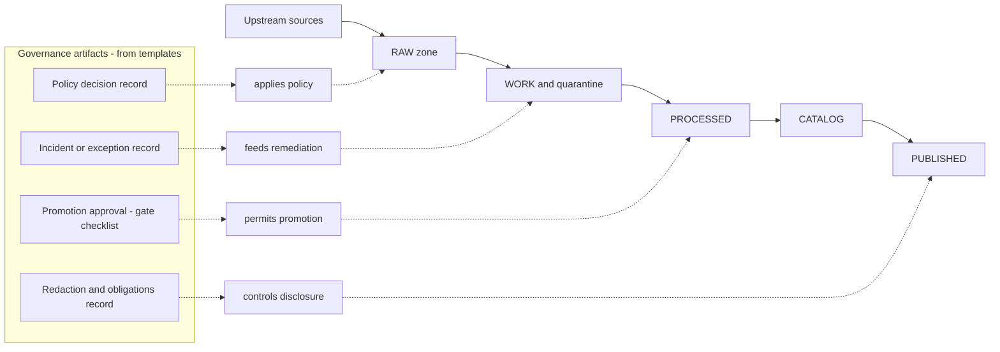

<!-- [KFM_META_BLOCK_V2]
doc_id: kfm://doc/b3caaefe-0d1c-4c6b-a4a2-4b50c4a7c2c5
title: Governance Templates
type: standard
version: v1
status: draft
owners: governance
created: 2026-03-02
updated: 2026-03-02
policy_label: public
related:
  - (not confirmed in repo) docs/governance/README.md
  - (not confirmed in repo) docs/governance/policy/README.md
tags: [kfm, governance, templates]
notes:
  - This directory is a template library. Completed governance artifacts should live outside /templates.
  - Keep templates additive, reversible, and evidence-first.
[/KFM_META_BLOCK_V2] -->

# Governance Templates
Reusable, evidence-first templates for KFM governance artifacts (policy decisions, promotion gates, redaction/obligations, and operational runbooks).


> NOTE: This folder intentionally contains **templates only**. Do not store completed approvals, sensitive case details, or secrets here.

---

## Quick navigation
- [Purpose](#purpose)
- [Where this fits](#where-this-fits)
- [What belongs here](#what-belongs-here)
- [What must not go here](#what-must-not-go-here)
- [Template index](#template-index)
- [How to use a template](#how-to-use-a-template)
- [Template contract](#template-contract)
- [Adding a new template](#adding-a-new-template)
- [Definition of done](#definition-of-done)
- [Appendix: suggested directory tree](#appendix-suggested-directory-tree)

---

## Purpose
KFM is governed end-to-end: **claims must be traceable to evidence**, and **policy decisions must be durable, reviewable, and reversible**. This directory provides copy-ready templates so teams can produce consistent governance artifacts quickly, without reinventing structure every time.

Templates here should make it easy to:
- capture **policy decisions** (what was decided, why, by whom, and what evidence was used),
- record **obligations** (redaction, aggregation, access controls),
- satisfy **promotion gates** and “truth-path” requirements,
- keep governance work auditable in PRs.

---

## Where this fits
These templates are used across the KFM “truth path” lifecycle and trust membrane.


```mermaid
graph LR
  U["Upstream sources"] --> R["RAW zone"]
  R --> W["WORK and quarantine"]
  W --> P["PROCESSED"]
  P --> C["CATALOG"]
  C --> Pub["PUBLISHED"]

  subgraph GOV["Governance artifacts - from templates"]
    PD["Policy decision record"]
    PA["Promotion approval - gate checklist"]
    RO["Redaction and obligations record"]
    IR["Incident or exception record"]
  end

  PD -.-> L1["applies policy"] -.-> R
  PA -.-> L2["permits promotion"] -.-> P
  RO -.-> L3["controls disclosure"] -.-> Pub
  IR -.-> L4["feeds remediation"] -.-> W
```

---

## What belongs here
**Acceptable inputs** (templates only):
- Markdown templates (`.md`) for governance records, checklists, runbooks, and reviews.
- Light-weight structured templates:
  - YAML skeletons (`.yml/.yaml`) for registries/checklists **only if** they do not contain secrets or sensitive incident details.
  - JSON skeletons (`.json`) for consistent “record payload” examples.
- Diagrams (Mermaid in Markdown is preferred) and reusable snippets.

---

## What must not go here
**Exclusions** (fail-closed):
- Completed governance decisions for real incidents, investigations, approvals, or exceptions.
- Any secrets, credentials, tokens, private URLs, or internal-only access paths.
- Precise coordinates or identifying details for sensitive/vulnerable locations (use coarse geography in templates; keep exacts in restricted systems).
- Dataset payloads or derived data products (templates should reference paths, not embed data).

---

## Template index
Update this table as templates are added. If you don’t see a template you need, add one (see [Adding a new template](#adding-a-new-template)).

| Template file | What it’s for | Output location (recommended) | Primary owner | Status |
|---|---|---|---|---|
| *(PROPOSED)* `template__policy-decision-record.md` | Record a governance decision and its evidence trail | `docs/governance/decisions/` | Governance | Not yet confirmed |
| *(PROPOSED)* `template__promotion-gate-checklist.md` | Gate checklist for RAW→WORK→PROCESSED→PUBLISHED promotion | `docs/governance/promotions/` | Data Platform | Not yet confirmed |
| *(PROPOSED)* `template__redaction-obligations-record.md` | Track redaction rules + obligations for a dataset/story | `docs/governance/obligations/` | Governance + Policy | Not yet confirmed |
| *(PROPOSED)* `template__risk-assessment.md` | Lightweight risk assessment for new sources/features | `docs/governance/risk/` | Security + Governance | Not yet confirmed |
| *(PROPOSED)* `template__exception-request.md` | Request an exception (time-bound, scoped, auditable) | `docs/governance/exceptions/` | Governance | Not yet confirmed |
| *(PROPOSED)* `template__incident-report.md` | Capture governance-relevant incidents + corrective actions | `docs/governance/incidents/` | On-call / Ops | Not yet confirmed |

> TIP: Keep templates short and composable. Prefer a few focused templates over one giant “do everything” document.

---

## How to use a template
1. **Copy** the template to its target directory (outside `docs/governance/templates/`).
2. Replace placeholders (look for `TODO:`).
3. Fill in the `KFM_META_BLOCK_V2` header:
   - assign a new `doc_id` (UUID),
   - set `policy_label` correctly,
   - name owners and reviewers.
4. Add or link **evidence** (EvidenceRefs, receipts, validation outputs) instead of pasting large blobs.
5. Submit as a PR with a short summary of the governance intent.

---

## Template contract
All templates in this directory **SHOULD** follow this minimum structure:

### 1) Meta header
Include `KFM_META_BLOCK_V2` at the top of the file (as an HTML comment). Templates should default to:
- `status: draft`
- `policy_label: public` *(unless the template itself must be restricted; that’s rare)*

### 2) Required sections
| Section | Required | Why it matters |
|---|---:|---|
| **Context** | ✅ | What problem/event prompted this artifact |
| **Decision / Outcome** | ✅ | What was decided or approved |
| **Evidence** | ✅ | EvidenceRefs / receipts supporting the decision |
| **Policy & obligations** | ✅ | Redactions, access rules, CARE/FAIR constraints |
| **Risks & tradeoffs** | ✅ | Explicitly document what we accept and why |
| **Verification steps** | ✅ | Minimal checks to confirm the decision is implementable |
| **Rollback / reversibility** | ✅ | Small, safe reversals are always possible |

### 3) Placeholders and redaction safety
- Use `TODO:` placeholders rather than invented values.
- Include an explicit “redaction required?” question where sensitive details could appear.
- Prefer coarse geography in examples.

---

## Adding a new template
When adding a new template:

- [ ] Name it `template__<kebab-case>.md` (or `.yml/.json` if structured).
- [ ] Keep it **generic** (no real dataset names, no credentials, no incident details).
- [ ] Include `KFM_META_BLOCK_V2` with `status: draft`.
- [ ] Add it to the [Template index](#template-index).
- [ ] Include one “happy path” example and one “redaction required” callout.
- [ ] Ensure it is small and composable (prefer linking to other docs over copying them).

---

## Definition of done
A template is “done” when:

- [ ] It is short, copyable, and unambiguous (someone can use it without tribal knowledge).
- [ ] It enforces **evidence-first** and **cite-or-abstain** expectations.
- [ ] It contains a rollback section and minimum verification steps.
- [ ] It does **not** embed sensitive data (passes a simple “would we regret this being public?” test).
- [ ] It is listed in the [Template index](#template-index) and has an owner.

---

## Appendix: suggested directory tree
This is an example layout. Update it to match the repo’s real structure.

```text
docs/governance/templates/                               # Governance templates (copy → fill) for auditable decisions, gates, obligations, and exceptions
├─ README.md                                             # Index + selection guidance (which template when) + naming/evidence/approval conventions
├─ template__policy-decision-record.md                   # Policy Decision Record (PDR): records a governance/policy decision with rationale, risk, enforcement points, and rollback
├─ template__promotion-gate-checklist.md                 # Promotion Gate Checklist: structured gate-by-gate verification/sign-off prior to promoting artifacts across zones
├─ template__redaction-obligations-record.md             # Redaction & Obligations Record: documents redaction/generalization requirements + ongoing usage obligations and monitoring
└─ template__exception-request.md                        # Exception Request: time-bounded waiver with compensating controls, explicit expiry, and reversion plan
```

---

### Back to top
[↑ back to top](#governance-templates)
