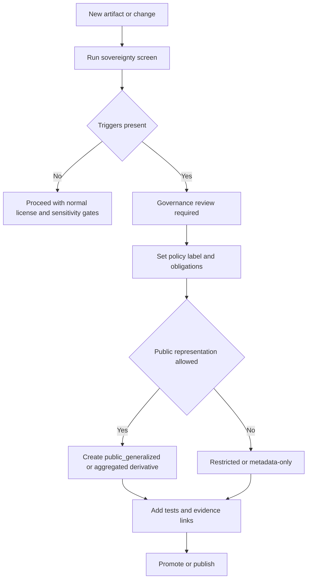

<!-- [KFM_META_BLOCK_V2]
doc_id: kfm://doc/<uuid>
title: Sovereignty Assessment
type: standard
version: v1
status: draft
owners: <team-or-names>
created: YYYY-MM-DD
updated: YYYY-MM-DD
policy_label: public
related:
  - <kfm://dataset/... or kfm://story/... or path>
tags: [kfm, governance, sovereignty, care, sensitivity]
notes:
  - Template for assessing Indigenous data sovereignty, culturally sensitive knowledge, and other sovereignty-adjacent constraints.
[/KFM_META_BLOCK_V2] -->

# Sovereignty Assessment
**Purpose:** A governed checklist + decision record to ensure KFM datasets, layers, Story Nodes, and derived artifacts respect **Authority to Control**, sensitive-location protections, licensing/rights, and review triggers before promotion or publication.

---

## Quick links
- [When to use](#when-to-use)
- [Decision flow](#decision-flow)
- [Assessment record](#assessment-record)
- [Decision and required actions](#decision-and-required-actions)
- [Appendix: Policy labels](#appendix-policy-labels-starter)
- [Appendix: Review triggers](#appendix-review-triggers-starter)

---

## When to use
Complete this assessment **before**:
- onboarding a new source/dataset,
- publishing a new Story Node,
- publishing a new public derivative (e.g., generalized tiles, aggregated tables),
- exposing a dataset via governed APIs to roles beyond stewards/operators.

**Required if** the artifact touches any of the following:
- Indigenous communities, treaty sites, sacred sites, or restricted cultural knowledge
- archaeological site locations or sensitive ecological locations
- sensitive locations that could enable harm (looting, harassment, targeting infrastructure)
- partner-controlled data, unclear permissions, or unclear rights/terms

> **Fail-closed rule:** If permissions or sensitivity are unclear, default to **restricted draft / quarantine** and request governance review.

---

## Decision flow

---

## Assessment record

### 1) Metadata
| Field | Value |
|---|---|
| Assessment ID | `kfm://assessment/<uuid>@v1` |
| Date | `YYYY-MM-DD` |
| Assessor | `<name>` |
| Requested by | `<name/team>` |
| Artifact type | `source` / `dataset` / `dataset_version` / `layer` / `story_node` / `other` |
| Artifact identifier | `<kfm://dataset/...@version>` or `<path>` |
| Intended audience | `public` / `internal` / `restricted roles` |
| Intended use | `<analysis / map layer / story / export / api>` |
| Geography | `<bbox / counties / regions>` |
| Time window | `<start-date> — <end-date>` |

### 2) Sovereignty context
#### 2.1 Communities and authority to control
- **Potentially affected communities / nations / stewards:**  
  - `<name(s)>`  
- **Community consultation pathway available?** `yes/no/unknown`  
  - If yes: `<who / what forum / when>`  
- **Partner agreements / MOUs / permissions recorded?** `yes/no/unknown`  
  - If yes: `<where recorded (doc id / path)>`  
  - If unknown: describe minimum steps to confirm.

#### 2.2 Knowledge type
Check all that apply:
- [ ] Indigenous histories and communities
- [ ] Treaty sites / reservation boundaries / treaty history
- [ ] Sacred or culturally restricted sites
- [ ] Archaeological site locations / restricted heritage inventories
- [ ] Sensitive ecological locations (e.g., endangered species nesting areas)
- [ ] Other sovereignty-relevant constraints: `<describe>`

### 3) Source, rights, and reuse constraints
#### 3.1 Rights snapshot
| Item | Answer |
|---|---|
| Source authority | `<publisher / authority>` |
| Access method | `API` / `bulk` / `scrape` / `manual` |
| License | `<license name or URL>` |
| Rights holder | `<entity>` |
| Allowed redistribution? | `yes/no/unclear` |
| Allowed derivative works? | `yes/no/unclear` |
| Attribution requirements | `<text>` |
| Restrictions noted by publisher | `<text>` |

**Decision:**  
- [ ] Rights are clear  
- [ ] Rights are unclear → **metadata-only reference** or **quarantine** until resolved

> **Reminder:** Online availability does not equal permission to reuse.

### 4) Sensitivity, harm, and re-identification risk
#### 4.1 Sensitive locations
- Does this artifact include **precise locations** for sensitive sites? `yes/no/unknown`  
- Could published geometry be **reverse engineered** to reveal restricted points? `yes/no/unknown`  
- Mitigation plan (if yes/unknown): `<generalize geometry / aggregate / suppress attributes / metadata-only>`

#### 4.2 PII / re-identification
- Contains individual-level records (names, addresses, ownership, health, etc.)? `yes/no/unknown`
- Public release plan:
  - [ ] Do not publish individual-level records
  - [ ] Aggregate to safe geographies with minimum count thresholds
  - [ ] Keep raw restricted even if aggregates are public
- Threshold policy (if applicable): `<min_count, geography level, rationale>`

#### 4.3 Harm analysis
Could this content enable:
- [ ] looting / vandalism
- [ ] harassment / doxxing
- [ ] targeting infrastructure or vulnerable sites
- [ ] appropriation / misuse of culturally restricted knowledge
- [ ] other: `<describe>`

Risk rating:
| Risk | Likelihood | Impact | Mitigation | Verification steps |
|---|---:|---:|---|---|
| `<risk>` | low/med/high | low/med/high | `<plan>` | `<minimum checks>` |

---

## Decision and required actions

### 5) Policy label selection
Choose exactly one:

- **public** — safe for public release as-is  
- **public_generalized** — public release allowed only as generalized/aggregated derivative  
- **internal** — internal-only (not public)  
- **restricted** — restricted roles only  
- **restricted_sensitive_location** — restricted + sensitive location protections  
- **embargoed** — time-limited restriction (requires explicit end condition)  
- **quarantine** — blocked from promotion; remediation required  

Selected policy label: `<policy_label>`

### 6) Obligations (what must the system do)
List the obligations that must be enforced by policy + verified in CI/runtime.

| Obligation | Applies to | How enforced | Evidence / test |
|---|---|---|---|
| `<e.g., show_notice "Geometry generalized due to policy.">` | UI / API | `<policy engine + UI banner>` | `<policy fixture test id>` |
| `<generalize_geometry>` | tiles/exports | `<pipeline transform recorded in PROV>` | `<no restricted bbox leakage test>` |
| `<block_export>` | downloads | `<API policy check>` | `<contract test>` |
| `<require_governance_review>` | publish gate | `<workflow>` | `<checklist gate>` |

> **Note:** Obligations must be encoded as testable outcomes (allow/deny + obligations) so CI and runtime behave the same.

### 7) Required review workflow
- Review state: `needs_review` / `approved` / `rejected`
- Governance review required? `yes/no`
  - If yes, why (trigger): `<Indigenous/treaty/sacred/restricted knowledge/archaeology/sensitive ecological/harm>`
  - Reviewers / stewards: `<names/roles>`
  - Community stewards involved (if applicable): `<names/roles>`

### 8) Publication / promotion decision
Pick one:

- [ ] **Approve** (may promote/publish as specified)
- [ ] **Approve with conditions** (must complete required actions below)
- [ ] **Deny** (do not publish; explain)
- [ ] **Quarantine** (block promotion until rights/sensitivity resolved)

Decision rationale (plain language):
- `<why>`

### 9) Required actions checklist (Definition of Done)
#### 9.1 Data handling and derivatives
- [ ] If sensitive: store precise geometries only in restricted datasets
- [ ] If public representation allowed: create **public_generalized** derivative (or safe aggregate)
- [ ] Ensure derived artifacts cannot be reverse engineered (no hidden precise points)
- [ ] Enforce policy at tile serving (no bypass via static hosting)

#### 9.2 Governance + policy-as-code
- [ ] Set policy_label in catalogs (DCAT/STAC) for the dataset/version
- [ ] Add/modify policy bundle rules (OPA/Rego or equivalent)
- [ ] Add fixture-driven tests for allow/deny and obligations (CI gate)
- [ ] Add “no restricted metadata leakage” behavior checks (403/404 responses)

#### 9.3 Story / narrative constraints (if applicable)
- [ ] Story contains **no restricted coordinates or identifiers**
- [ ] Narrative includes context that respects community perspectives; avoids appropriation
- [ ] All citations resolve through evidence resolver before publish
- [ ] Rights metadata exists for all embedded media
- [ ] Governance review triggers satisfied (or documented exception)

#### 9.4 Provenance + audit
- [ ] Redaction/generalization recorded as a first-class transform in PROV
- [ ] Run receipts produced and stored with policy labels
- [ ] EvidenceRefs updated for all claims/exports affected by this decision

---

## Appendix: Policy labels (starter)
This list is a **starter controlled vocabulary**; keep it versioned.

- `public`
- `public_generalized`
- `restricted`
- `restricted_sensitive_location`
- `internal`
- `embargoed`
- `quarantine`

---

## Appendix: Review triggers (starter)
Trigger governance review when:
- story references Indigenous communities, treaty sites, sacred sites, or restricted cultural knowledge
- story includes archaeological site locations or sensitive ecological locations
- story could enable harm (looting, harassment, targeting infrastructure)

Operational rule:
- if uncertain, default to restricted draft and request review.

---

Appendix: Optional notes for implementers

- If rights are unclear, use **metadata-only reference** mode until cleared.
- For sensitive layers, add explicit tests such as:
  - “no restricted bbox leakage” for public tiles
  - “no coordinate fields” for public exports when restricted
- For analysis environments, prefer controlled compute for restricted or partner-controlled data.

