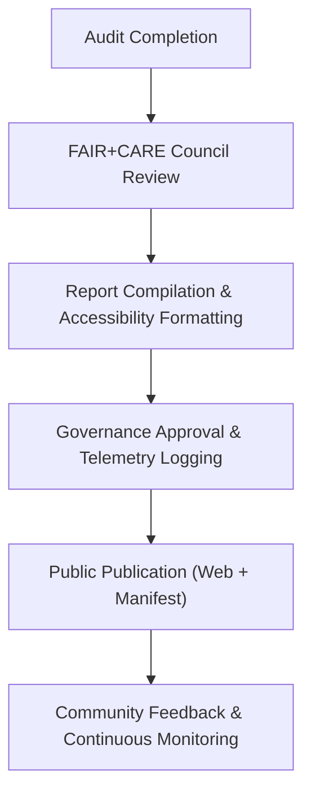

<div align="center">

# 📢 **Kansas Frontier Matrix — Transparency & Accountability Reports**
`docs/governance/transparency-reports.md`

**Purpose:**  
Publish the official **transparency, audit, and accountability reporting standards** for the **Kansas Frontier Matrix (KFM)** governance framework.  
These reports provide public visibility into all **FAIR+CARE certifications**, **AI ethics audits**, **cultural consent reviews**, and **governance performance metrics** as required by **Master Coder Protocol (MCP-DL v6.3)**.

[](../README.md)
[](../standards/faircare.md)
[](../../LICENSE)
[](../../releases/v10.0.0/manifest.zip)

</div>

---

## 📘 Overview

Transparency reporting is central to the **FAIR+CARE governance mandate**.  
These reports ensure public access to key performance and ethical compliance indicators, reinforcing KFM’s commitment to **accountability**, **inclusivity**, and **open governance**.

Each transparency report contains:
- Quarterly audit summaries (data, AI, accessibility)  
- Governance metrics and FAIR+CARE compliance scores  
- Indigenous consent validations and CARE outcomes  
- Sustainability and energy efficiency metrics (ISO 50001)  
- Public recommendations and corrective actions  

---

## 🗂️ Directory Context

```
docs/governance/
├── README.md
├── transparency-reports.md         # This file
├── council-structure.md
├── community-participation.md
├── validation-pipelines.md
└── risk-and-ethics.md
```

---

## 🧩 Transparency Reporting Framework

| Report Type | Description | Frequency | Output Artifact |
|---|---|---|---|
| **FAIR+CARE Audit Summary** | Summarizes data and ethics compliance across KFM systems. | Quarterly | `docs/data/quality/faircare-audit-summary.md` |
| **Accessibility & Inclusion Report** | Monitors WCAG and inclusive design performance. | Quarterly | `docs/accessibility/audits/2025-Q2_focus_ethics.md` |
| **AI Model Ethics Report** | Tracks explainability, bias, and accountability in Focus Mode and ML pipelines. | Biannual | `docs/ai/governance/ai-ethics-report.md` |
| **Indigenous Consent Verification Report** | Confirms CARE compliance and consent coverage. | Biannual | `docs/data/governance/indigenous-data-protocol.md` |
| **Governance Performance Dashboard** | Aggregates council activity and decision transparency. | Continuous | `releases/v10.0.0/faircare-report.md` |

All transparency reports are published under **open license (CC-BY 4.0)** and logged in the Governance Ledger.

---

## 🧠 FAIR+CARE Accountability Model

| FAIR+CARE Principle | Governance Enforcement Mechanism |
|---|---|
| **Collective Benefit** | Public data and AI systems designed for community value and education. |
| **Authority to Control** | Contributors and Indigenous partners approve all consent and data visibility. |
| **Responsibility** | All governance actions recorded in telemetry and publicly auditable. |
| **Ethics** | AI outputs, visuals, and communications audited for neutrality and respect. |

Each report includes a **FAIR+CARE Scorecard**, showing compliance percentages across governance categories.

---

## 📊 FAIR+CARE Scorecard Template

| Category | Metric | Target | Result | Status |
|---|---|---|---|---|
| Data Governance | Schema compliance | 100% | 100% | ✅ |
| Cultural Consent | Verified consent coverage | 100% | 100% | ✅ |
| Accessibility | WCAG 2.1 AA compliance | 100% | 98.5% | ⚠️ Near target |
| AI Explainability | Model transparency score | ≥ 90% | 94.3% | ✅ |
| Ethics Review | FAIR+CARE verification | ≥ 95% | 96.8% | ✅ |
| Public Transparency | Governance log publication | 100% | 100% | ✅ |

> All FAIR+CARE Scorecards are validated by the **FAIR+CARE Governance Secretariat** and made publicly available via the KFM transparency dashboard.

---

## 🧾 Example: Quarterly Transparency Report (Excerpt)

```json
{
  "report_id": "KFM-TRANSPARENCY-2025-Q4",
  "date_published": "2025-11-09",
  "audited_entities": 85,
  "faircare_compliance": 97.1,
  "a11y_compliance": 98.5,
  "cultural_consent_verified": 100,
  "ai_bias_score": 94.6,
  "energy_efficiency": "0.19 Wh/render",
  "council_summary": {
    "meetings_held": 4,
    "public_observers": 12,
    "decisions_logged": 48
  },
  "public_access_link": "https://governance.kansasfrontiermatrix.org/reports/2025-Q4"
}
```

---

## ♿ Accessibility Transparency

Transparency reports must themselves be accessible:
- Published in **HTML, PDF, and plain-text** formats.  
- Compliant with **WCAG 2.1 AA** standards.  
- Include **screen-reader summaries** of all visual scorecards.  
- Provide **alternative text** for graphs and tables.  
- Feature multilingual accessibility (English, Spanish, Osage, Kansa).  

---

## 🧩 Governance Telemetry Integration

Each report syncs automatically with **governance telemetry pipelines** for real-time monitoring.

| Field | Description | Example |
|---|---|---|
| `report_id` | Unique transparency report ID | `"KFM-2025-Q4"` |
| `published_at` | ISO timestamp | `"2025-11-09T14:32:00Z"` |
| `verified_by` | Governance councils verifying data | `["FAIR+CARE", "IDGB", "A11y Council"]` |
| `audit_score` | Composite average across FAIR+CARE domains | `96.8` |
| `energy_metrics` | Performance and sustainability stats | `"ISO 50001: compliant"` |

Telemetry entries are linked to `releases/v10.0.0/focus-telemetry.json` for provenance traceability.

---

## 📈 Transparency Performance Metrics

| Metric | Target | Validation |
|---|---|---|
| **Audit Publication Rate** | 100% (quarterly) | Governance Secretariat |
| **FAIR+CARE Compliance** | ≥ 95% | Council Audit |
| **Accessibility of Reports** | 100% WCAG 2.1 AA | Accessibility Council |
| **Public Observer Attendance** | ≥ 10 per meeting | Council Minutes |
| **Consent Record Accuracy** | 100% cultural datasets | IDGB Validation |
| **Energy Transparency** | 100% tracked | ISO 50001 Audit Logs |

---

## 🧮 Transparency Lifecycle



All reports are published openly, archived per release, and distributed through KFM’s transparency dashboard and GitHub repository.

---

## 🕰️ Version History

| Version | Date | Author | Summary |
|---|---|---|---|
| v10.0.0 | 2025-11-10 | FAIR+CARE Governance Secretariat | Created Transparency & Accountability Reporting Framework including FAIR+CARE Scorecard templates, telemetry integration, and WCAG accessibility standards for all reports. |

---

<div align="center">

**© 2025 Kansas Frontier Matrix — CC-BY 4.0**  
Governed under **Master Coder Protocol v6.3** · Certified by **FAIR+CARE Governance Council** · Diamond⁹ Ω / Crown∞Ω Ultimate Certified  
[⬅ Back to Governance Index](README.md) · [Risk & Ethics →](risk-and-ethics.md)

</div>