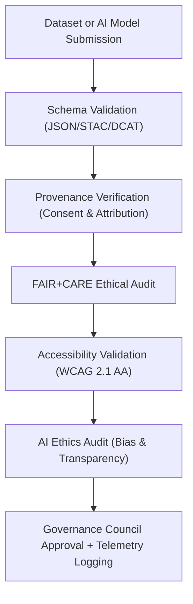
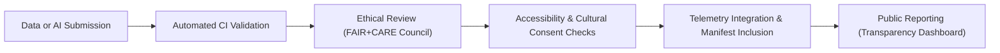

<div align="center">

# ⚙️ **Kansas Frontier Matrix — Governance Validation Pipelines**
`docs/governance/validation-pipelines.md`

**Purpose:**  
Document the **automated and manual validation pipelines** that ensure compliance, reproducibility, and ethics alignment across all **Kansas Frontier Matrix (KFM)** datasets, AI systems, and web interfaces.  
These pipelines operationalize the **FAIR+CARE**, **ISO**, and **MCP-DL v6.3** standards through continuous integration and governance telemetry.

[](../README.md)
[](../standards/faircare.md)
[](../../LICENSE)
[](../../releases/v10.0.0/manifest.zip)

</div>

---

## 📘 Overview

The **Governance Validation Pipelines** integrate ethical, technical, and accessibility reviews into KFM’s continuous integration and deployment (CI/CD) workflows.  
These pipelines form the operational backbone of **FAIR+CARE certification**, validating every dataset, AI model, and visualization artifact for compliance with:

- **FAIR Data Principles** (Findable, Accessible, Interoperable, Reusable)  
- **CARE Indigenous Data Governance Principles**  
- **WCAG 2.1 AA** accessibility standards  
- **ISO 9001 / ISO 31000 / ISO 50001** quality, risk, and sustainability benchmarks  
- **Master Coder Protocol v6.3** reproducibility and telemetry standards  

---

## 🗂️ Directory Context

```
docs/governance/
├── README.md
├── validation-pipelines.md          # This file
├── council-structure.md
├── transparency-reports.md
├── risk-and-ethics.md
└── community-participation.md
```

---

## 🧩 Core Pipeline Stages

| Stage | Description | Responsible Council | Artifact |
|---|---|---|---|
| **1. Schema Validation** | Validates data structures against JSON, GeoJSON, and STAC schemas. | Data Standards Committee | `reports/data/schema-validation.json` |
| **2. Provenance Verification** | Confirms licensing, attribution, and consent metadata. | FAIR+CARE Council / IDGB | `reports/data/provenance-summary.json` |
| **3. FAIR+CARE Audit** | Evaluates ethical compliance and cultural representation. | FAIR+CARE Governance Council | `reports/data/faircare-validation.json` |
| **4. Accessibility Audit** | Tests web and visualization components for WCAG 2.1 AA compliance. | Accessibility & Design Council | `reports/self-validation/web/a11y_summary.json` |
| **5. AI Ethics Audit** | Audits AI models for bias, explainability, and consent usage. | AI Oversight Board | `reports/ai/focus-ethics-validation.json` |
| **6. Energy & Performance Audit** | Monitors system efficiency under ISO 50001. | Sustainability Council | `reports/ui/performance-metrics.json` |

---

## ⚙️ Validation Workflow Overview



Each workflow step must be successfully validated and approved by the corresponding council before release inclusion.

---

## 🧠 FAIR+CARE Ethical Validation Process

| Step | Action | Responsible Entity | Output |
|---|---|---|---|
| 1️⃣ | Ethical data classification and sensitivity review. | FAIR+CARE Council | `faircare-classification.json` |
| 2️⃣ | Indigenous consent validation (if cultural data present). | IDGB | `indigenous-consent-log.json` |
| 3️⃣ | CARE alignment scoring (Collective Benefit, Authority, Responsibility, Ethics). | Ethics Officer | `faircare-scorecard.json` |
| 4️⃣ | Approval and manifest update. | Governance Secretariat | `manifest.zip` |

---

## 🧾 Example: FAIR+CARE Validation Log

```json
{
  "dataset_id": "noaa_ks_climate_1880_2025",
  "validation_cycle": "2025-Q4",
  "schema_compliance": 100,
  "provenance_verified": true,
  "faircare_score": 97.5,
  "accessibility_a11y_score": 98.2,
  "ai_ethics_review": "passed",
  "energy_efficiency": "ISO 50001-compliant",
  "certified_by": ["FAIR+CARE Council", "Accessibility Design Council"]
}
```

---

## ♿ Accessibility Validation Pipeline

| Test | Description | Compliance Target |
|---|---|---|
| **Keyboard Navigation** | Ensures full operability by keyboard. | 100% |
| **Focus Visibility** | Checks focus outlines and contrasts. | ≥ 3:1 ratio |
| **ARIA Labeling** | Verifies role and aria attributes across UI. | 100% |
| **Motion Control** | Honors `prefers-reduced-motion` settings. | 100% |
| **Text Contrast** | Validates color contrast ratios. | ≥ 4.5:1 |

Accessibility checks are executed in Storybook and Lighthouse workflows.

---

## 🧮 AI Ethics Validation Pipeline

| Component | Description | Validation Metric |
|---|---|---|
| **Explainability Score** | How well the model justifies outputs. | ≥ 90% |
| **Bias Detection** | Tests narrative or data bias. | ≤ 5% deviation |
| **Consent Coverage** | All training data consent-verified. | 100% |
| **Provenance Traceability** | Data lineage and model source linked. | 100% |
| **Audit Transparency** | Reports published to governance dashboard. | 100% |

AI ethics validation integrates model telemetry into `focus-telemetry.json`.

---

## 🪶 Indigenous Consent Validation (CARE Protocol)

| Step | Task | Responsible Entity | Artifact |
|---|---|---|---|
| 1️⃣ | Identify cultural datasets and sources. | FAIR+CARE Secretariat | `faircare-classification.json` |
| 2️⃣ | Route dataset to Indigenous Data Governance Board. | IDGB | `consent-review-log.json` |
| 3️⃣ | Confirm consent metadata (`careConsent.status`). | IDGB | `indigenous-data-protocol.md` |
| 4️⃣ | Update Governance Manifest. | Secretariat | `releases/v10.0.0/manifest.zip` |

---

## 🔁 Continuous Validation Integration (CI/CD)

| Workflow | Tool | Trigger | Output |
|---|---|---|---|
| `data-contract-validate.yml` | JSON Schema Validator | On PR or dataset addition | `reports/data/schema-validation.json` |
| `faircare-audit.yml` | FAIR+CARE Ethics Validator | On merge or quarterly audit | `reports/data/faircare-validation.json` |
| `accessibility_scan.yml` | Lighthouse / Axe-core | On web build | `reports/self-validation/web/a11y_summary.json` |
| `ai-ethics-scan.yml` | Model Governance Pipeline | On model update | `reports/ai/focus-ethics-validation.json` |
| `telemetry-export.yml` | Telemetry Consolidator | Nightly | `releases/v10.0.0/focus-telemetry.json` |

---

## 📊 Governance Validation Metrics

| Metric | Target | Verified By |
|---|---|---|
| **FAIR+CARE Compliance Score** | ≥ 95% | `faircare-audit.yml` |
| **Consent Metadata Coverage** | 100% (cultural datasets) | IDGB |
| **Accessibility Compliance (WCAG 2.1 AA)** | 100% | Accessibility Council |
| **AI Explainability Index** | ≥ 90% | AI Oversight Board |
| **Schema Validation Success** | 100% | Data Standards Committee |
| **Telemetry Integrity** | 100% cross-check | Governance Secretariat |

---

## 🧠 Validation Traceability & Telemetry

All validation outcomes are recorded in the **governance telemetry layer**, ensuring full traceability and reproducibility.

**Telemetry Fields:**

| Field | Description |
|---|---|
| `validation_id` | Unique UUID for each validation cycle |
| `council` | Responsible oversight body |
| `status` | `"passed"`, `"failed"`, `"pending review"` |
| `artifact_path` | Path to validation report |
| `timestamp` | ISO datetime |
| `governance_version` | e.g., `"v10.0.0"` |

**Example Telemetry Record:**

```json
{
  "validation_id": "VAL-2025-0012",
  "council": "FAIR+CARE Governance Council",
  "status": "passed",
  "artifact_path": "reports/data/faircare-validation.json",
  "timestamp": "2025-11-09T22:45:00Z",
  "governance_version": "v10.0.0"
}
```

---

## 🧮 Validation Lifecycle



---

## 🕰️ Version History

| Version | Date | Author | Summary |
|---|---|---|---|
| v10.0.0 | 2025-11-10 | FAIR+CARE Governance Secretariat | Created comprehensive validation pipeline documentation integrating FAIR+CARE, accessibility, AI ethics, and telemetry traceability for all governance workflows. |

---

<div align="center">

**© 2025 Kansas Frontier Matrix — CC-BY 4.0**  
Governed under **Master Coder Protocol v6.3** · Certified by **FAIR+CARE Council** · Diamond⁹ Ω / Crown∞Ω Ultimate Certified  
[⬅ Back to Governance Index](README.md) · [Transparency Reports →](transparency-reports.md)

</div>