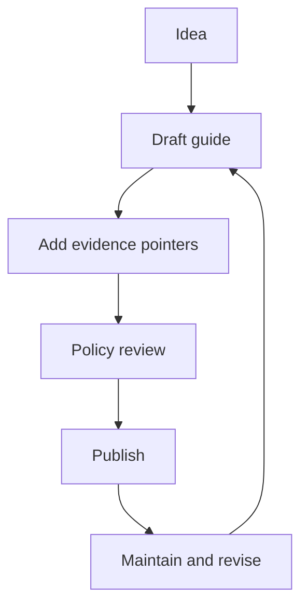

<!-- [KFM_META_BLOCK_V2]
doc_id: kfm://doc/745d01e0-4c7f-4635-b76b-dead8940c43e
title: Guides (docs/guides)
type: guide
version: v1
status: draft
owners: KFM Maintainers
created: 2026-02-24
updated: 2026-02-24
policy_label: public
related:
  - docs/README.md
  - docs/glossary.md
  - docs/templates/
tags: [kfm, guides, documentation]
notes:
  - Directory README for governed how-to guides and runbooks.
  - Update the "Guide registry" table when adding/removing guides.
[/KFM_META_BLOCK_V2] -->

# Guides

**Purpose:** Practical, step-by-step docs for operating and extending KFM without breaking the trust membrane.

**Status:** draft • **Owners:** KFM Maintainers • **Policy:** public


<!-- TODO: Replace/extend badges with real repo CI + release badges -->

## Quick navigation

- [Where this fits in the repo](#where-this-fits-in-the-repo)
- [How to use this folder](#how-to-use-this-folder)
- [What belongs here](#what-belongs-here)
- [What must not go here](#what-must-not-go-here)
- [Directory layout](#directory-layout)
- [Guide types](#guide-types)
- [Guide lifecycle](#guide-lifecycle)
- [Create a new guide](#create-a-new-guide)
- [Guide registry](#guide-registry)
- [Reference shelf](#reference-shelf)
- [Appendix: templates](#appendix-templates)

---

## How to use this folder

Use **guides** when you want to answer: *“How do I do X safely and repeatably in KFM?”*

Examples:
- onboarding a dataset (raw → work → processed → published)
- adding or changing a pipeline step
- adding a new governed API endpoint (contract + policy)
- publishing a story node / narrative artifact with traceable evidence

> **NOTE**
> Keep guides *actionable* and *evidence-aware*. If a guide makes a claim, it should tell the reader where the evidence lives (dataset version, run receipt, spec, or doc reference).

[Back to top](#guides)

---

## Where this fits in the repo

This directory is the **how-to layer** of the documentation system:
- `docs/` holds the human-facing documentation set
- `docs/guides/` holds *procedural* docs (how to do things safely)
- canonical contracts/specs should live with their owning subsystem (e.g., `schemas/`, `contracts/`, or domain modules)

> **TIP**
> If you’re deciding between a guide and a spec: write a **spec** when the system must validate it; write a **guide** when a human must follow it.

[Back to top](#guides)

---

## What belongs here

**Acceptable inputs (✅):**
- **How-to guides** (task-oriented, “do this, then this”)
- **Runbooks** (operational procedures, incident/rollback steps)
- **Playbooks** (repeatable patterns, decision trees, checklists)
- **Migration notes** for *small, reversible* changes (with rollback)
- **Validation/QA procedures** (how to run checks; how to interpret results)
- **Policy-aware usage docs** (what to do when data is restricted)

Every guide MUST include:
1. **A KFM MetaBlock v2 header** (policy label + ownership)
2. **Scope + non-goals**
3. **Inputs/outputs** (what artifacts change; where they land)
4. **Safety notes** (default-deny when uncertain; redaction rules)
5. **Verification steps** (how to confirm it worked)

[Back to top](#guides)

---

## What must not go here

**Exclusions (❌):**
- **Canonical specs/contracts** (put these under `schemas/`, `contracts/`, or the subsystem that owns the contract)
- **Architecture decisions (ADRs)** (put under `docs/architecture/`)
- **Dataset domain documentation** that belongs to a domain module (put under `docs/data/<domain>/` or `data/<domain>/README.md`)
- **Secrets / credentials / keys** (never in repo docs)
- **Sensitive coordinates or targeting details** for vulnerable sites (use generalized geography and route through governance review)

> **WARNING**
> If you are unsure whether content is sensitive, treat it as **restricted** and escalate for governance review before publishing.

[Back to top](#guides)

---

## Directory layout

> This is the *recommended* structure for this folder. Keep it shallow, predictable, and easy to scan.

```text
docs/guides/
├── README.md
│   # Index: what lives here, how guides are structured, how to contribute

├── _shared/                             # Cross-cutting reference used by all guides
│   ├── README.md
│   ├── conventions.md                   # Filenames, numbering, linking, “Confirmed/Proposed/Unknown”
│   ├── glossary.md                      # Canonical definitions + synonyms (domain + platform)
│   ├── decision-log.md                  # Lightweight ADR index (links only)
│   ├── evidence-model.md                # EvidenceRef/EvidenceBundle patterns (how to cite in UI)
│   ├── policy-labels.md                 # Policy label taxonomy + redaction expectations
│   ├── promotion-contract.md            # Minimum gates per zone + required receipts
│   └── diagrams/
│       ├── truth-path.mmd               # Mermaid source
│       └── system-boundaries.mmd

├── _templates/                          # Copy/paste starters (kept tiny, referenced everywhere)
│   ├── README.md
│   ├── meta-block-v2.md                 # HTML comment template + examples
│   ├── guide-template.md                # Standard guide skeleton (purpose, scope, exclusions)
│   ├── checklist-template.md            # Yes/No + evidence link fields
│   ├── runbook-template.md              # Preconditions, steps, rollback, verification
│   ├── adr-template.md                  # Short ADR template (problem, decision, tradeoffs)
│   └── receipts/
│       ├── run-receipt.schema.json      # Doc copy of receipt shape (source of truth may live elsewhere)
│       ├── receipt.example.json
│       └── receipt.fields.md

├── onboarding/                          # Dataset onboarding + domain bootstrap
│   ├── README.md
│   ├── 00-overview.md                   # What “onboarding” means in KFM, who does what
│   ├── 10-intake-triage.md              # Fast screen: license, sensitivity, viability, owner
│   ├── 20-dataset-identity.md           # IDs, versioning, hashing, naming rules
│   ├── 30-schema-and-samples.md         # Schema capture, sample rows, spatial/temporal extents
│   ├── 40-sensitivity-and-redaction.md  # Default-deny, what to redact/generalize
│   ├── 50-qa-rules.md                   # QA checks + thresholds + acceptance criteria
│   ├── 60-promotion-readiness.md        # “Ready to promote” checklist + required artifacts
│   ├── checklists/
│   │   ├── dataset-intake-checklist.md
│   │   ├── license-attribution-checklist.md
│   │   ├── sensitivity-review-checklist.md
│   │   └── publish-readiness-checklist.md
│   ├── templates/
│   │   ├── dataset-entry.yaml.example
│   │   ├── dataset-spec.md.example
│   │   ├── qa-spec.yaml.example
│   │   └── provenance-notes.md.example
│   └── examples/
│       ├── example-public-dataset/
│       │   ├── dataset-entry.yaml
│       │   ├── dataset-spec.md
│       │   ├── qa-spec.yaml
│       │   └── receipt.example.json
│       └── example-restricted-dataset/
│           ├── dataset-entry.yaml
│           ├── redaction-notes.md
│           └── receipt.example.json

├── pipelines/                           # ETL/build pipelines and run receipts
│   ├── README.md
│   ├── 00-overview.md                   # Pipeline concepts + where configs live
│   ├── 10-pipeline-design-patterns.md   # Ingest/transform/index/catalog patterns
│   ├── 20-run-receipts.md               # What is a receipt, required fields, storage
│   ├── 30-validation-and-gates.md       # QA gates, fail-closed behavior, thresholds
│   ├── 40-reproducibility.md            # Determinism, pinning versions, checksums
│   ├── 50-observability.md              # Logs/metrics/traces, what’s required
│   ├── 60-troubleshooting.md            # Common failures + “what to look at”
│   ├── patterns/
│   │   ├── ingestion/
│   │   │   ├── pull-based.md
│   │   │   ├── push-based.md
│   │   │   └── incremental-refresh.md
│   │   ├── transforms/
│   │   │   ├── raster-pipeline.md
│   │   │   ├── vector-pipeline.md
│   │   │   └── time-series-pipeline.md
│   │   └── publishing/
│   │       ├── stac-build.md
│   │       ├── dcat-build.md
│   │       └── prov-build.md
│   ├── receipts/
│   │   ├── receipt-spec.md              # Human-readable receipt spec
│   │   ├── examples/
│   │   │   ├── success.json
│   │   │   ├── failed-validation.json
│   │   │   └── partial-run.json
│   │   └── queries.md                   # “How to find the receipt for X”
│   └── ci/
│       ├── required-checks.md           # What CI must run for pipeline PRs
│       └── local-dev.md                 # How to run pipelines locally (dev-only)

├── catalogs/                            # STAC/DCAT/PROV publishing + link checks
│   ├── README.md
│   ├── 00-overview.md                   # Why catalogs exist + consumer expectations
│   ├── 10-stac.md                       # Collections/items/assets conventions
│   ├── 20-dcat.md                       # Dataset-level metadata + distribution links
│   ├── 30-prov.md                       # Provenance chains + run-to-asset linkage
│   ├── 40-link-checks.md                # Link integrity + CI gates
│   ├── 50-versioning.md                 # How catalog versions map to dataset versions
│   ├── schemas/
│   │   ├── stac-profile.md              # House rules/profile
│   │   ├── dcat-profile.md
│   │   └── prov-profile.md
│   ├── checklists/
│   │   ├── stac-validation-checklist.md
│   │   ├── dcat-validation-checklist.md
│   │   └── prov-validation-checklist.md
│   └── examples/
│       ├── minimal-stac/
│       ├── full-stac/
│       └── dcat-plus-stac-plus-prov/

├── apis/                                # Contract-first API patterns + policy boundary
│   ├── README.md
│   ├── 00-overview.md                   # What “governed API” means; PEP boundary rules
│   ├── 10-contract-first.md             # OpenAPI-first workflow, review gates
│   ├── 20-authn-authz.md                # Identity, roles, RBAC/ABAC mapping
│   ├── 30-obligations.md                # Redaction/transform obligations (policy outputs)
│   ├── 40-error-model.md                # Stable error codes + client behavior
│   ├── 50-pagination-filtering.md       # Time-aware queries, bbox, search params
│   ├── 60-audit-and-logging.md          # What gets logged, correlation IDs, receipts
│   ├── patterns/
│   │   ├── dataset-apis.md              # /datasets, /versions, /assets patterns
│   │   ├── stac-apis.md                 # /stac collections/items/search patterns
│   │   ├── evidence-apis.md             # /evidence resolve patterns
│   │   └── focus-mode-apis.md           # /focus/ask contract + cite-or-abstain behavior
│   ├── checklists/
│   │   ├── api-review-checklist.md
│   │   ├── policy-boundary-checklist.md
│   │   └── breaking-change-checklist.md
│   └── examples/
│       ├── openapi-snippets/
│       └── policy-test-fixtures/

├── ui/                                  # Map/Story/Focus UI usage + evidence surfaces
│   ├── README.md
│   ├── 00-overview.md                   # UI surfaces + how they map to governed APIs
│   ├── 10-evidence-first-ux.md           # Evidence panels, “why am I seeing this?”
│   ├── 20-map-patterns.md               # Layers, legends, filters, time slider patterns
│   ├── 30-story-nodes.md                # Story Node v3 usage, linking evidence
│   ├── 40-focus-mode.md                 # Cite-or-abstain UI contract; citations UX
│   ├── 50-accessibility.md              # A11y requirements for maps and stories
│   ├── 60-performance.md                # Tile strategy, caching, progressive loading
│   ├── design/
│   │   ├── component-inventory.md       # Reusable components + props expectations
│   │   ├── interaction-model.md         # Map interactions, keyboard, mobile
│   │   └── visual-style.md              # Cartographic + UI style rules
│   ├── checklists/
│   │   ├── evidence-surface-checklist.md
│   │   ├── story-publish-checklist.md
│   │   └── a11y-checklist.md
│   └── examples/
│       ├── map-recipes/
│       ├── story-recipes/
│       └── focus-mode-recipes/

├── governance/                          # Review workflows, policy labels, obligations
│   ├── README.md
│   ├── 00-overview.md                   # Governance model, roles, escalation
│   ├── 10-policy-labels.md              # Label taxonomy + required handling
│   ├── 20-review-workflows.md           # Intake review → promotion review → publish review
│   ├── 30-obligations-catalog.md        # Obligation types and examples
│   ├── 40-exceptions.md                 # When/how exceptions happen; time-boxing
│   ├── 50-audit-ledger.md               # Required audit fields and retention guidance
│   ├── checklists/
│   │   ├── promotion-gate-checklist.md
│   │   ├── redaction-approval-checklist.md
│   │   └── release-approval-checklist.md
│   ├── templates/
│   │   ├── review-request.md
│   │   ├── policy-decision-record.md
│   │   └── incident-postmortem.md
│   └── examples/
│       ├── sample-policy-decision/
│       └── sample-redaction-review/

└── runbooks/                            # Operational procedures (deploy, rollback, incidents)
    ├── README.md
    ├── 00-index.md                      # “If X happens, go here”
    ├── deploy/
    │   ├── README.md
    │   ├── api-deploy.md
    │   ├── ui-deploy.md
    │   ├── catalog-deploy.md
    │   └── pipeline-scheduled-run.md
    ├── rollback/
    │   ├── README.md
    │   ├── api-rollback.md
    │   ├── ui-rollback.md
    │   └── data-rollback.md             # If applicable; otherwise “no rollback, supersede”
    ├── incidents/
    │   ├── README.md
    │   ├── severity-levels.md
    │   ├── incident-response.md
    │   ├── data-leak-response.md
    │   ├── corrupted-index-response.md
    │   └── degraded-performance.md
    ├── operations/
    │   ├── backups-and-restore.md
    │   ├── key-rotation.md
    │   ├── secret-management.md
    │   ├── cost-controls.md
    │   └── routine-health-checks.md
    └── troubleshooting/
        ├── README.md
        ├── pipeline-failures.md
        ├── stac-validation-failures.md
        ├── api-authz-failures.md
        └── ui-data-mismatch.md
```

<!-- TODO: Update the tree to match the actual repo once the folder structure is finalized. -->

[Back to top](#guides)

---

## Guide types

| Type | Best for | Must include |
|------|----------|--------------|
| **How-to** | A single task (e.g., “publish a dataset version”) | Preconditions, steps, verification, rollback |
| **Runbook** | Operational response (deploy, outages, incidents) | Triggers, commands, safety, escalation |
| **Playbook** | Repeatable pattern (decision flow) | Decision points, tradeoffs, examples |
| **Reference** | Stable definitions and conventions | Glossary links, contracts, version history |

[Back to top](#guides)

---

## Guide lifecycle



**Lifecycle rules**
- Drafts can be incomplete, but must **fail closed** on safety: if unsure, mark **Unknown** and list the minimum verification steps.
- Published guides must be **reproducible** and **auditable**: the reader can follow steps and confirm outcomes.

[Back to top](#guides)

---

## Create a new guide

1. **Copy the template** from the Appendix (or from `docs/templates/` if present).
2. Choose a path:
   - `docs/guides/<area>/<topic>.md`
3. Fill in the **MetaBlock v2** (doc_id must be stable; do not regenerate on edits).
4. Write **preconditions**, then steps.
5. Add **verification** (what to check, where to look).
6. Add a **rollback** plan if the guide changes code/data/policy.

### Definition of done (DoD)

- [ ] MetaBlock v2 header present (policy label set)
- [ ] Steps are runnable (commands, config snippets, file paths)
- [ ] Verification steps included (and pass/fail criteria)
- [ ] Rollback described (or explicitly “no changes made”)
- [ ] No secrets, no sensitive coordinates, no policy bypass instructions
- [ ] Guide added to the [Guide registry](#guide-registry)

[Back to top](#guides)

---

## Guide registry

> Keep this table updated. It’s the “table of contents” for this folder.

| Guide | Area | Status | Policy | Owners | Last updated | Notes |
|------|------|--------|--------|--------|--------------|-------|
| *(add new guides here)* |  |  |  |  |  |  |

[Back to top](#guides)

---

## Reference shelf

Use these bundled references when you need deeper background (API design, Git, CI/CD, GIS, etc.).  
Prefer the **project library index** to find the right PDF quickly.

- `KFM_Source_Snapshots_Bundle_from_vNext1_tables_fixed.pdf` (design/governance patterns)
- `KFM_Project_Library_Index.pdf` (navigation index for the bundled PDFs)
- `Beej_s Guide to Git.pdf` (Git usage + collaboration)
- `CICD-Podman-Kubernetes-Docker.pdf` (CI/CD + Kubernetes fundamentals)

<!-- TODO: Replace filenames with repo-relative links once the library location is standardized. -->

[Back to top](#guides)

---

## Appendix: templates

<details>
<summary><strong>Guide template (copy/paste)</strong></summary>

```md
<!-- [KFM_META_BLOCK_V2]
doc_id: kfm://doc/<uuid>
title: <Guide title>
type: guide
version: v1
status: draft
owners: <team or names>
created: YYYY-MM-DD
updated: YYYY-MM-DD
policy_label: public|restricted|...
related:
  - <paths or kfm:// ids>
tags: [kfm, guides]
notes:
  - <short notes>
[/KFM_META_BLOCK_V2] -->

# <Guide title>

## Purpose

## Scope

## Preconditions

## Steps

## Verification

## Rollback

## References
```

</details>

<details>
<summary><strong>Runbook template (copy/paste)</strong></summary>

```md
<!-- [KFM_META_BLOCK_V2]
doc_id: kfm://doc/<uuid>
title: <Runbook title>
type: guide
version: v1
status: draft
owners: <team or names>
created: YYYY-MM-DD
updated: YYYY-MM-DD
policy_label: restricted
tags: [kfm, guides, runbook]
[/KFM_META_BLOCK_V2] -->

# <Runbook title>

## Trigger conditions

## Safety and policy notes

## Diagnostics

## Mitigation steps

## Rollback / Recovery

## Post-incident checklist
- [ ] Write a run receipt / incident record
- [ ] Update related guides
- [ ] Add regression test(s) if applicable
```

</details>

[Back to top](#guides)
