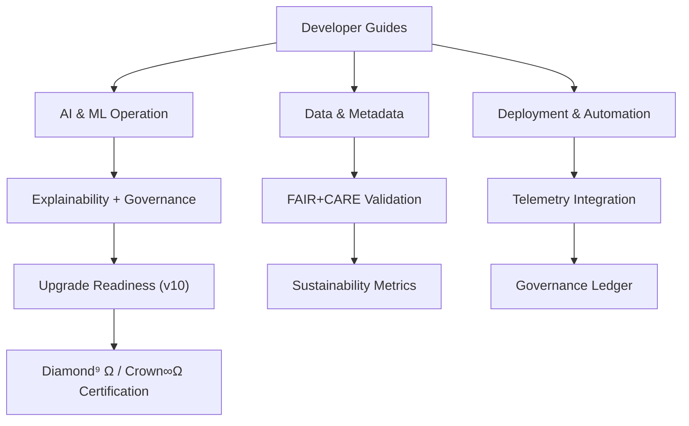

<div align="center">

# 📘 **Kansas Frontier Matrix — Developer & Operator Guides**
`docs/guides/README.md`

**Purpose:**  
Unified hub for all **developer**, **operator**, and **governance** documentation supporting the Kansas Frontier Matrix (KFM) system.  
This directory centralizes practical, scenario-based guides that span architecture operation, AI/ML pipelines, data onboarding, FAIR+CARE governance, upgrade readiness, sustainability, and observability — fully aligned with **MCP-DL v6.3+** and **Platinum README Template v7.1**.

[](../README.md)
[](../../LICENSE)
[](../standards/README.md)
[](../../releases/)

</div>

---

## 📘 Overview

The `docs/guides/` directory serves as KFM’s **comprehensive documentation hub** for technical and governance operations.  
Each subdirectory provides modular playbooks and reference materials for specific audiences:

| Audience | Focus | Typical Artifacts |
|-----------|--------|-------------------|
| Developers | Source code, pipelines, and integration logic | `src/**`, `.github/workflows/**` |
| Operators | Deployment, CI/CD, telemetry, monitoring | `releases/`, `telemetry/`, `infrastructure/` |
| FAIR+CARE Council | Provenance, ethics, sustainability oversight | `docs/standards/`, `governance/`, `reports/` |

All guides adhere to **FAIR + CARE** principles and **MCP-DL v6.3** documentation governance.

---

## 🗂️ Directory Layout

```plaintext
docs/guides/
├── README.md                # Unified index and navigation hub (this file)
├── ai/                      # AI & ML operation, explainability, Focus Mode v2
├── data/                    # Data ingestion, validation, STAC/DCAT mapping
├── deployment/              # Deployment, CI/CD, and infrastructure automation
├── governance/              # Ethical AI, FAIR+CARE, and ledger operations
├── integration/             # STAC↔DCAT, ETL, and API interoperability
├── sustainability/          # ISO 50001/14064 energy & carbon management
├── telemetry/               # Telemetry, metrics, and observability guidance
├── upgrade/                 # Upgrade readiness, version transitions, migrations
│   ├── README.md
│   ├── v10-readiness.md     # Detailed roadmap & compatibility checklist
│   └── v10-inventory.md     # Legacy document consolidation matrix
├── workflows/               # CI/CD pipelines, validation, governance ledger
└── visualization/           # UX, UI, accessibility, and MapLibre configuration
```

---

## 🧾 Major Guide Families

### 🧩 AI & ML Operation
Covers **Focus Transformer v2**, embeddings, explainability, and AI governance integration.  
Example: `ai/focus-mode-v2.md`, `ai/explainability.md`

### 🗺️ Data & Metadata
Defines FAIR+CARE-aligned onboarding, normalization, and **STAC ↔ DCAT 3.0** translation.  
Example: `data/ingestion_workflow.md`, `integration/stac-dcat-bridge.md`

### ⚙️ Deployment & Automation
Instructions for **FastAPI + Neo4j + MapLibre** setup, CI/CD workflows, and site builds.  
Example: `deployment/automation_overview.md`

### ⚖️ Governance & Ethics
Includes **FAIR+CARE Council** processes, certification paths, and governance ledger usage.  
Example: `governance/faircare_audit.md`

### ♻️ Sustainability
Implements **ISO 50001/14064** energy and carbon telemetry.  
Example: `sustainability/energy_metrics_pipeline.md`

### 🧩 Upgrade & Readiness
Structured roadmaps for major version transitions such as `v9.7 → v10`.  
Example: `upgrade/v10-readiness.md`, `upgrade/v10-inventory.md`

### 📊 Telemetry & Observability
Covers telemetry schema, dashboards, and governance logging pipelines.  
Example: `telemetry/system_metrics.md`

### 🧰 Workflows & Automation
CI/CD, GitHub Actions, and validation flows ensuring reproducibility.  
Example: `workflows/ci-cd-pipelines.md`, `workflows/governance-ledger.md`

### 🖥 Visualization & UI
Guides for UX, accessibility, and MapLibre component design.  
Example: `visualization/maplibre-guide.md`, `visualization/accessibility.md`

---

## 🔁 Guide Linkage Diagram


---

## ⚙️ Governance & Compliance Alignment

| Framework | Application | Validation |
|------------|--------------|-------------|
| **FAIR + CARE** | Ethical data stewardship & accessibility | `faircare-validate.yml` |
| **MCP-DL v6.3** | Documentation reproducibility & conformance | `docs-lint.yml` |
| **ISO 50001 / 14064** | Energy & carbon tracking | `telemetry/energy.json` |
| **Diamond⁹ Ω / Crown∞Ω** | Ultimate governance tiers | `governance/ROOT-GOVERNANCE.md` |

---

## 📑 Version History

| Version | Date | Author | Summary |
|----------|------|---------|----------|
| v10.0.0 | 2025-11-09 | A. Barta | Unified guide index (Developer + Operator) for v10 architecture and FAIR+CARE compliance |
| v9.7.0  | 2025-11-05 | A. Barta | Added sustainability, telemetry, and AI Focus Mode guides |
| v9.6.0  | 2025-11-03 | A. Barta | Established standardized guide structure and ontology alignment |

---

<div align="center">

© 2025 Kansas Frontier Matrix Project  
Master Coder Protocol v6.3 · FAIR+CARE Certified · Diamond⁹ Ω / Crown∞Ω Ultimate Certified  

[Back to Docs Index](../README.md) · [Governance Charter](../standards/governance/ROOT-GOVERNANCE.md)

</div>
