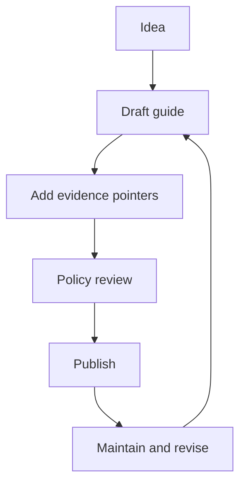

<!-- [KFM_META_BLOCK_V2]
doc_id: kfm://doc/745d01e0-4c7f-4635-b76b-dead8940c43e
title: Guides (docs/guides)
type: guide
version: v1
status: draft
owners: KFM Maintainers
created: 2026-02-24
updated: 2026-02-24
policy_label: public
related:
  - docs/README.md
  - docs/glossary.md
  - docs/templates/
tags: [kfm, guides, documentation]
notes:
  - Directory README for governed how-to guides and runbooks.
  - Update the "Guide registry" table when adding/removing guides.
[/KFM_META_BLOCK_V2] -->

# Guides

**Purpose:** Practical, step-by-step docs for operating and extending KFM without breaking the trust membrane.

**Status:** draft • **Owners:** KFM Maintainers • **Policy:** public


<!-- TODO: Replace/extend badges with real repo CI + release badges -->

## Quick navigation

- [Where this fits in the repo](#where-this-fits-in-the-repo)
- [How to use this folder](#how-to-use-this-folder)
- [What belongs here](#what-belongs-here)
- [What must not go here](#what-must-not-go-here)
- [Directory layout](#directory-layout)
- [Guide types](#guide-types)
- [Guide lifecycle](#guide-lifecycle)
- [Create a new guide](#create-a-new-guide)
- [Guide registry](#guide-registry)
- [Reference shelf](#reference-shelf)
- [Appendix: templates](#appendix-templates)

---

## How to use this folder

Use **guides** when you want to answer: *“How do I do X safely and repeatably in KFM?”*

Examples:
- onboarding a dataset (raw → work → processed → published)
- adding or changing a pipeline step
- adding a new governed API endpoint (contract + policy)
- publishing a story node / narrative artifact with traceable evidence

> **NOTE**
> Keep guides *actionable* and *evidence-aware*. If a guide makes a claim, it should tell the reader where the evidence lives (dataset version, run receipt, spec, or doc reference).

[Back to top](#guides)

---

## Where this fits in the repo

This directory is the **how-to layer** of the documentation system:
- `docs/` holds the human-facing documentation set
- `docs/guides/` holds *procedural* docs (how to do things safely)
- canonical contracts/specs should live with their owning subsystem (e.g., `schemas/`, `contracts/`, or domain modules)

> **TIP**
> If you’re deciding between a guide and a spec: write a **spec** when the system must validate it; write a **guide** when a human must follow it.

[Back to top](#guides)

---

## What belongs here

**Acceptable inputs (✅):**
- **How-to guides** (task-oriented, “do this, then this”)
- **Runbooks** (operational procedures, incident/rollback steps)
- **Playbooks** (repeatable patterns, decision trees, checklists)
- **Migration notes** for *small, reversible* changes (with rollback)
- **Validation/QA procedures** (how to run checks; how to interpret results)
- **Policy-aware usage docs** (what to do when data is restricted)

Every guide MUST include:
1. **A KFM MetaBlock v2 header** (policy label + ownership)
2. **Scope + non-goals**
3. **Inputs/outputs** (what artifacts change; where they land)
4. **Safety notes** (default-deny when uncertain; redaction rules)
5. **Verification steps** (how to confirm it worked)

[Back to top](#guides)

---

## What must not go here

**Exclusions (❌):**
- **Canonical specs/contracts** (put these under `schemas/`, `contracts/`, or the subsystem that owns the contract)
- **Architecture decisions (ADRs)** (put under `docs/architecture/`)
- **Dataset domain documentation** that belongs to a domain module (put under `docs/data/<domain>/` or `data/<domain>/README.md`)
- **Secrets / credentials / keys** (never in repo docs)
- **Sensitive coordinates or targeting details** for vulnerable sites (use generalized geography and route through governance review)

> **WARNING**
> If you are unsure whether content is sensitive, treat it as **restricted** and escalate for governance review before publishing.

[Back to top](#guides)

---

## Directory layout

> This is the *recommended* structure for this folder. Keep it shallow, predictable, and easy to scan.

```text
docs/guides/
├── README.md                     # You are here
├── onboarding/                   # Dataset onboarding + domain bootstrap
├── pipelines/                    # ETL/build pipelines and run receipts
├── catalogs/                     # STAC/DCAT/PROV publishing + link checks
├── apis/                         # Contract-first API patterns + policy boundary
├── ui/                           # Map/Story/Focus UI usage + evidence surfaces
├── governance/                   # Review workflows, policy labels, obligations
└── runbooks/                     # Operational procedures (deploy, rollback, incidents)
```

<!-- TODO: Update the tree to match the actual repo once the folder structure is finalized. -->

[Back to top](#guides)

---

## Guide types

| Type | Best for | Must include |
|------|----------|--------------|
| **How-to** | A single task (e.g., “publish a dataset version”) | Preconditions, steps, verification, rollback |
| **Runbook** | Operational response (deploy, outages, incidents) | Triggers, commands, safety, escalation |
| **Playbook** | Repeatable pattern (decision flow) | Decision points, tradeoffs, examples |
| **Reference** | Stable definitions and conventions | Glossary links, contracts, version history |

[Back to top](#guides)

---

## Guide lifecycle



**Lifecycle rules**
- Drafts can be incomplete, but must **fail closed** on safety: if unsure, mark **Unknown** and list the minimum verification steps.
- Published guides must be **reproducible** and **auditable**: the reader can follow steps and confirm outcomes.

[Back to top](#guides)

---

## Create a new guide

1. **Copy the template** from the Appendix (or from `docs/templates/` if present).
2. Choose a path:
   - `docs/guides/<area>/<topic>.md`
3. Fill in the **MetaBlock v2** (doc_id must be stable; do not regenerate on edits).
4. Write **preconditions**, then steps.
5. Add **verification** (what to check, where to look).
6. Add a **rollback** plan if the guide changes code/data/policy.

### Definition of done (DoD)

- [ ] MetaBlock v2 header present (policy label set)
- [ ] Steps are runnable (commands, config snippets, file paths)
- [ ] Verification steps included (and pass/fail criteria)
- [ ] Rollback described (or explicitly “no changes made”)
- [ ] No secrets, no sensitive coordinates, no policy bypass instructions
- [ ] Guide added to the [Guide registry](#guide-registry)

[Back to top](#guides)

---

## Guide registry

> Keep this table updated. It’s the “table of contents” for this folder.

| Guide | Area | Status | Policy | Owners | Last updated | Notes |
|------|------|--------|--------|--------|--------------|-------|
| *(add new guides here)* |  |  |  |  |  |  |

[Back to top](#guides)

---

## Reference shelf

Use these bundled references when you need deeper background (API design, Git, CI/CD, GIS, etc.).  
Prefer the **project library index** to find the right PDF quickly.

- `KFM_Source_Snapshots_Bundle_from_vNext1_tables_fixed.pdf` (design/governance patterns)
- `KFM_Project_Library_Index.pdf` (navigation index for the bundled PDFs)
- `Beej_s Guide to Git.pdf` (Git usage + collaboration)
- `CICD-Podman-Kubernetes-Docker.pdf` (CI/CD + Kubernetes fundamentals)

<!-- TODO: Replace filenames with repo-relative links once the library location is standardized. -->

[Back to top](#guides)

---

## Appendix: templates

<details>
<summary><strong>Guide template (copy/paste)</strong></summary>

```md
<!-- [KFM_META_BLOCK_V2]
doc_id: kfm://doc/<uuid>
title: <Guide title>
type: guide
version: v1
status: draft
owners: <team or names>
created: YYYY-MM-DD
updated: YYYY-MM-DD
policy_label: public|restricted|...
related:
  - <paths or kfm:// ids>
tags: [kfm, guides]
notes:
  - <short notes>
[/KFM_META_BLOCK_V2] -->

# <Guide title>

## Purpose

## Scope

## Preconditions

## Steps

## Verification

## Rollback

## References
```

</details>

<details>
<summary><strong>Runbook template (copy/paste)</strong></summary>

```md
<!-- [KFM_META_BLOCK_V2]
doc_id: kfm://doc/<uuid>
title: <Runbook title>
type: guide
version: v1
status: draft
owners: <team or names>
created: YYYY-MM-DD
updated: YYYY-MM-DD
policy_label: restricted
tags: [kfm, guides, runbook]
[/KFM_META_BLOCK_V2] -->

# <Runbook title>

## Trigger conditions

## Safety and policy notes

## Diagnostics

## Mitigation steps

## Rollback / Recovery

## Post-incident checklist
- [ ] Write a run receipt / incident record
- [ ] Update related guides
- [ ] Add regression test(s) if applicable
```

</details>

[Back to top](#guides)
