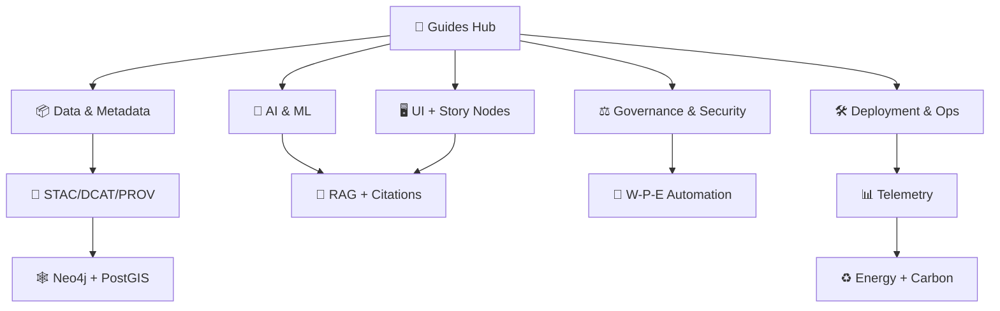

<div align="center">

# 📘 **Kansas Frontier Matrix — Developer & Operator Guides**
`docs/guides/README.md`

**Purpose:**  
A unified hub for **builders 🧑‍💻**, **operators 🛠️**, and **governance stewards ⚖️** of the Kansas Frontier Matrix (KFM).  
This directory centralizes scenario-based playbooks across **data intake**, **catalogs (STAC/DCAT/PROV)**, **knowledge graph (Neo4j)**, **spatial DB (PostGIS)**, **API (FastAPI + GraphQL)**, **UI (React + MapLibre + Cesium)**, **Focus Mode AI (RAG + citations)**, **security + supply chain**, **telemetry + sustainability**, and **upgrade readiness**—aligned with **MCP-DL v6.3+** and **Platinum README Template v7.1**.

[](../README.md)
[](../standards/README.md)
[](./data/)
[](./governance/)
[](../../releases/)
[](../architecture/)
[](./data/)
[](./visualization/)
[](../../releases/)

</div>

---

## 🧭 Quick Navigation

- **Start Here**
  - 🧑‍💻 Developers → [Golden Paths](#-golden-paths) · [Pipelines](#-major-guide-families) · [AI](#-ai--ml-operation)
  - 🛠️ Operators → [Deployment](#-deployment--automation) · [Telemetry](#-telemetry--observability) · [Runbooks](#-golden-paths)
  - ⚖️ Governance → [FAIR+CARE + Policy](#-governance--security--supply-chain) · [Sustainability](#-sustainability--energy--carbon)
- **Core Maps**
  - 🧱 [Canonical Pipeline](#-canonical-pipeline-non-negotiable-ordering) · 🗂️ [Directory Layout](#-directory-layout-v10) · 🔗 [Guide Index](#-guide-index-by-task)
- **Reference Shelf**
  - 📚 [Research & Reading Packs](#-research--reading-packs) · 🧩 [Design Docs](#-source-of-truth-documents)

---

## 📘 Overview

The `docs/guides/` directory is KFM’s **hands-on documentation hub**: operational playbooks, “how we do it” recipes, and decision-ready checklists.  
It complements (not replaces) deeper **architecture/spec** documents under `docs/architecture/` and `docs/specs/`.

### 🔩 KFM operating philosophy (the non-negotiables)

> ✅ **Provenance-first**: nothing ships without lineage.  
> ✅ **Catalog-driven**: STAC/DCAT/PROV are first-class “source-of-truth” artifacts.  
> ✅ **API boundary**: the UI never bypasses the governed API gateway.  
> ✅ **Evidence-first AI**: Focus Mode answers must remain traceable and cite sources.  
> ✅ **Human-in-the-loop**: automation proposes; humans approve (W-P-E).  
> ✅ **Sustainability counts**: energy + carbon are governance concerns, not “nice-to-have”.

---

## 🎯 Who this is for

| Audience | Focus | What you’ll do most |
|---|---|---|
| 🧑‍💻 Developers | code, pipelines, integrations | implement ETL, add schemas, extend APIs, ship UI features |
| 🛠️ Operators | deployment, security, reliability | run CI/CD, manage releases, monitor telemetry, respond to incidents |
| ⚖️ FAIR+CARE Council | governance, ethics, stewardship | policy checks, provenance audits, sensitivity reviews, certification |

---

## 🧱 Canonical Pipeline (non-negotiable ordering)

KFM is intentionally **catalog-driven** and **evidence-first**. The pipeline order is a governance feature, not an implementation detail. 🧾🔒

```mermaid
flowchart LR
  A[📥 Raw Inputs\n(data/raw)] --> B[🧪 Working Staging\n(data/work)]
  B --> C[🧼 Processed Outputs\n(data/processed)]
  C --> D[🧾 Catalogs\n(STAC + DCAT)]
  D --> E[🔗 Provenance\n(PROV)]
  E --> F[🕸️ Knowledge Graph\n(Neo4j CSV/Import)]
  C --> G[🗺️ Spatial DB\n(PostGIS)]
  F --> H[⚡ Governed API\n(FastAPI + GraphQL)]
  G --> H
  H --> I[🖥️ UI\n(React + MapLibre + Cesium)]
  H --> J[🤖 Focus Mode AI\n(RAG + citations)]
  J --> I
```

### 🧠 Why the order matters
- **Catalog + PROV** are what make KFM *auditable* (and replayable).  
- **Neo4j + PostGIS** are runtime stores, but they are fed from governed artifacts.  
- **API is the gateway** where policy, redaction, auth, and observability converge.

---

## 🗂️ Directory Layout (v10)

```plaintext
docs/guides/
├── README.md                    # ✅ This index + navigation hub
├── start-here/                  # 🚦 persona-based quickstarts (dev / ops / council)
├── ai/                          # 🤖 Focus Mode, RAG, model cards, explainability
├── data/                        # 📦 intake workflows, validation, STAC/DCAT/PROV mapping
├── pipelines/                   # 🧪 pipeline cookiecutters + canonical pipeline rules
├── api/                         # ⚡ REST/GraphQL usage + contracts + rate limiting
├── deployment/                  # 🛠️ infra + CI/CD + release automation
├── operations/                  # 🧯 runbooks, incident response, backups, DR
├── governance/                  # ⚖️ FAIR+CARE oversight, OPA policy packs, W-P-E automation
├── security/                    # 🔐 threat models, secrets, supply-chain & attestations
├── telemetry/                   # 📊 observability, metrics, dashboards, audit logs
├── sustainability/              # ♻️ ISO 50001/14064 energy & carbon governance
├── upgrade/                     # 🔁 migration checklists + version transitions
├── workflows/                   # 🧰 GitHub Actions & validation flows
└── visualization/               # 🗺️ MapLibre/Cesium UX, Story Nodes, accessibility
```

> 🧩 **Note:** If your repo still uses the earlier folder names (e.g., no `start-here/` yet), treat this as the **target guide topology** and create stubs as needed.

---

## 🧾 Major Guide Families

### 🤖 AI & ML Operation
Covers **Focus Mode** as an evidence-based assistant:
- Hybrid retrieval (**RAG**) across **graph + GIS + documents**
- Guardrails, citations, prompt hygiene, model cards
- Human-in-the-loop AI augmentation (AI suggests, humans approve)

**Examples:**  
- `ai/focus-mode-v2.md`  
- `ai/rag-retrieval.md`  
- `ai/model-cards.md`  
- `ai/explainability.md`

### 🗺️ Data & Metadata
Defines FAIR+CARE-aligned onboarding and “metadata as code”:
- STAC collections/items for spatial/temporal assets
- DCAT for discovery + distributions
- PROV for lineage, replay, accountability
- Knowledge graph ingestion strategy (Neo4j) and spatial storage (PostGIS)

**Examples:**  
- `data/ingestion_workflow.md`  
- `data/stac-dcat-prov-alignment.md`  
- `data/streaming-intake.md`  
- `data/simulation-intake.md`

### 🧪 Pipelines & Quality Gates
Pipelines are governed systems:
- Cookiecutters for consistent ingestion + AI pipelines
- CI gates for schemas, provenance, reproducibility
- Rollback patterns and kill-switches for automation

**Examples:**  
- `pipelines/kfm-ai-pipeline-cookiecutter.md`  
- `pipelines/detect-validate-promote.md`  
- `pipelines/policy-pack-rules.md`

### ⚡ API & Integration
How clients access KFM safely:
- FastAPI REST endpoints + GraphQL for complex querying
- Policy enforcement at the API boundary
- Interoperability patterns (STAC↔DCAT bridges, external services)

**Examples:**  
- `api/rest-contracts.md`  
- `api/graphql-schema.md`  
- `integration/stac-dcat-bridge.md`

### 🛠️ Deployment & Automation
Operators’ playbooks:
- CI/CD workflows (tests, lint, policy checks, builds)
- GitOps-ready release practices
- Rollbacks and staging environments

**Examples:**  
- `deployment/automation_overview.md`  
- `deployment/release-playbook.md`  
- `workflows/ci-cd-pipelines.md`

### ⚖️ Governance & Security & Supply Chain
Governance is embedded into delivery:
- FAIR+CARE review triggers
- Policy-as-code (OPA / Rego)
- W-P-E automation: Watcher → Planner → Executor
- Supply chain attestations (SBOM, SLSA, signatures)

**Examples:**  
- `governance/faircare-oversight.md`  
- `governance/opa-policy-pack.md`  
- `security/slsa-sbom-attestations.md`  
- `workflows/governance-ledger.md`

### 📊 Telemetry & Observability
Build “trust you can measure”:
- pipeline telemetry + run IDs + config hashes
- Focus telemetry (AI latency, usage, energy estimates)
- audit logs and incident triage

**Examples:**  
- `telemetry/system_metrics.md`  
- `telemetry/focus-telemetry.md`

### ♻️ Sustainability — Energy & Carbon
KFM treats sustainability as governance:
- energy tracking for heavy tasks
- carbon estimation and policies around expensive compute
- ISO 50001/14064 alignment

**Examples:**  
- `sustainability/energy_metrics_pipeline.md`  
- `sustainability/carbon-accountability.md`

### 🖥 Visualization & UI
KFM’s UI is a governed storytelling system:
- 2D maps (MapLibre), 3D globes (Cesium)
- timeline navigation
- Story Nodes (narrative + data + citations)
- accessibility, mobile, offline packs, AR-ready design

**Examples:**  
- `visualization/maplibre-guide.md`  
- `visualization/cesium-3d-guide.md`  
- `visualization/story-nodes.md`  
- `visualization/accessibility.md`

---

## 🚀 Golden Paths

### 1) 📥 Ingest a new dataset (vector / raster / documents)
1. Create dataset folder + intake manifest (`data/`)  
2. Generate **STAC + DCAT + PROV** (must be valid + linked)  
3. Run schema validation + policy pack checks (CI)  
4. Import graph nodes/edges (Neo4j) and/or spatial features (PostGIS)  
5. Verify UI layer discovery + citations

➡️ Start: `data/ingestion_workflow.md` · `data/stac-dcat-prov-alignment.md` · `governance/opa-policy-pack.md`

### 2) 🧠 Extend Focus Mode (new tool, new retrieval connector)
1. Add/extend retrieval adapter (graph/GIS/docs)  
2. Ensure citations + provenance logging are preserved  
3. Add telemetry (latency, failures, cost/energy)  
4. Add tests and “safe prompt” guardrails  
5. Run bias/quality checks + model card updates

➡️ Start: `ai/focus-mode-v2.md` · `ai/rag-retrieval.md` · `telemetry/focus-telemetry.md`

### 3) 🧩 Publish a Story Node (data-backed narrative)
1. Create Story Node content (Markdown/JSON schema)  
2. Reference datasets + locations by canonical IDs  
3. Ensure citations appear in UI panels and exports  
4. Validate Story Node schema + links  
5. Run preview build

➡️ Start: `visualization/story-nodes.md` · `visualization/story-authoring.md`

### 4) 🛠️ Operate a release (CI/CD + deploy + validate)
1. Run full CI gates (tests, lint, policy, schema validation)  
2. Generate release artifacts (SBOM, manifest, signatures)  
3. Deploy to staging, smoke-test API/UI, validate telemetry  
4. Promote to production, monitor health & rollback readiness

➡️ Start: `deployment/release-playbook.md` · `security/slsa-sbom-attestations.md` · `telemetry/system_metrics.md`

### 5) 🧯 Handle an incident (data leak risk / bad publish / policy breach)
1. Classify incident + revoke public access if needed  
2. Roll back via GitOps + invalidate downstream stores  
3. Record event to governance ledger  
4. Post-mortem + add/strengthen policy rules

➡️ Start: `operations/incident-response.md` · `governance/faircare-oversight.md`

---

## 🔁 Guide Linkage Diagram



---

## ✅ Governance & Compliance Alignment

| Framework / Control | What it enforces | Where to look |
|---|---|---|
| **FAIR + CARE** | ethical stewardship & accessibility | `governance/` · `docs/standards/` |
| **Policy-as-Code (OPA)** | hard gates: pipeline ordering, provenance, API boundary | `governance/opa-policy-pack.md` |
| **W-P-E Agents** | safe automation (observe → propose → execute with review) | `workflows/governance-ledger.md` |
| **SLSA + SBOM** | supply chain integrity, artifact provenance | `security/slsa-sbom-attestations.md` |
| **ISO 50001 / 14064** | energy + carbon tracking and governance | `sustainability/` |
| **Diamond⁹ Ω / Crown∞Ω** | top-tier governance + operational certification | `../../docs/standards/governance/ROOT-GOVERNANCE.md` |

---

## 📚 Research & Reading Packs

KFM includes “reference shelf” PDFs that inform implementation decisions (AI, geospatial UX, data engineering, security).  
These are especially useful for new contributors who want deeper background. 🧠📚

> 💡 Tip: Some of these are **PDF portfolios** (collections). If they don’t open well in a browser, use a desktop PDF viewer.

**Recommended shelf:**
- 🤖 `docs/library/AI Concepts & more.pdf` — AI/ML foundations & practitioner references  
- 🗺️ `docs/library/Maps-GoogleMaps-VirtualWorlds-Archaeological-Computer Graphics-Geospatial-webgl.pdf` — mapping, WebGL, cartography, GIS UX  
- 🧰 `docs/library/Various programming langurages & resources 1.pdf` — language notes, DevOps, CI/CD, security, data tools  
- 🧠 `docs/library/Data Managment-Theories-Architures-Data Science-Baysian Methods-Some Programming Ideas.pdf` — data platforms, Bayesian methods, scalable systems

---

## 🧾 Source-of-Truth Documents

If you need “why is it this way?” context, start here:
- `docs/architecture/` — system architecture + ADRs  
- `docs/specs/` — detailed feature specifications  
- `docs/security/` — threat models + incident response  
- `docs/standards/` — FAIR+CARE + schema standards  
- `docs/governance/` — governance model + roles  
- `docs/library/` — external references and research shelf

---

## 📑 Version History

| Version | Date | Author | Summary |
|---|---:|---|---|
| v10.0.0 | 2026-01-19 | A. Barta | Guides hub refresh: canonical pipeline + governance/security + reference shelf wiring |
| v10.0.0 | 2025-11-09 | A. Barta | Unified guide index (Developer + Operator) for v10 architecture and FAIR+CARE compliance |
| v9.7.0  | 2025-11-05 | A. Barta | Added sustainability, telemetry, and AI Focus Mode guides |
| v9.6.0  | 2025-11-03 | A. Barta | Established standardized guide structure and ontology alignment |

---

<div align="center">

© 2025–2026 Kansas Frontier Matrix Project 🌾🧭  
Master Coder Protocol v6.3 · FAIR+CARE Certified · Diamond⁹ Ω / Crown∞Ω Ultimate Certified  

[Back to Docs Index](../README.md) · [Governance Charter](../standards/governance/ROOT-GOVERNANCE.md)

</div>