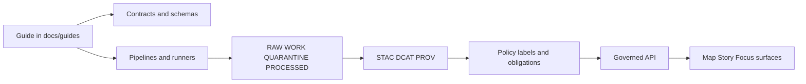

<!--
[KFM_META_BLOCK_V2]
doc_id: kfm://doc/eef5ab6c-b1fe-5569-838d-d230f51853f0
title: docs/guides README
type: guide
version: v1
status: draft
owners: docs
created: 2026-02-22
updated: 2026-02-22
policy_label: public
tags:
  - kfm
  - docs
  - guides
notes:
  - Entry point and contribution rules for KFM guide content.
[/KFM_META_BLOCK_V2]
-->

<a id="top"></a>

# docs/guides

Practical, governed how-to guides (runbooks + playbooks) for building and operating **Kansas Frontier Matrix (KFM)**.

**Status:** Draft · **Owners:** `docs` (update if different) · **Last updated:** 2026-02-22


## Quick navigation

- [What lives in docs/guides](#what-lives-in-docsguides)
- [Guide registry](#guide-registry)
- [Where guides fit in KFM](#where-guides-fit-in-kfm)
- [How to add a guide](#how-to-add-a-guide)
- [Guide quality bar](#guide-quality-bar)
- [Guide template](#guide-template)

## Start here

- **Docs overview:** [MASTER_GUIDE_v13](../MASTER_GUIDE_v13.md)
- **Markdown + doc protocol:** [KFM_MARKDOWN_WORK_PROTOCOL](../standards/KFM_MARKDOWN_WORK_PROTOCOL.md)
- **Templates:** [`docs/templates/`](../templates/)

---

## What lives in docs/guides

This directory is for **operational, step-by-step documents** that people follow to do work safely and repeatably.

Examples:

- Onboarding / setup walkthroughs (developer env, local stack, “first dataset”)
- Pipeline operation playbooks (ingest runs, validation, promotion, rollbacks)
- Release / deployment runbooks (API/UI rollout, policy pack updates)
- Troubleshooting / incident playbooks (index rebuild, catalog validation failures)

### What does *not* live here

Use the canonical homes (per repo conventions) when the document is not a “how-to”:

- **Architecture & design decisions (ADRs):** [`docs/architecture/`](../architecture/)
- **Standards / profiles / norms:** [`docs/standards/`](../standards/)
- **Domain-specific dataset documentation:** `docs/data/<domain>/README.md`
- **Narrative content (Story Nodes):** [`docs/reports/story_nodes/`](../reports/story_nodes/)

> NOTE: If a guide changes behavior (e.g., it tells operators to promote a dataset), treat it as a governed artifact: it needs clear validation and rollback steps.

---

## Guide registry

Keep this table current. Each guide should live in its own folder for local assets.

| Guide | Purpose | Audience | Status | Last updated |
|---|---|---|---|---|
| _Add your guide here_ | _One-line description_ | _Maintainers / contributors / operators_ | `draft` \| `review` \| `published` | YYYY-MM-DD |

### Recommended folder layout

```text
docs/
  guides/
    README.md
    <guide-slug>/
      README.md
      assets/
        images/
        diagrams/
```

**Naming:** use kebab-case slugs (`dataset-onboarding`, `promotion-runbook`, `local-dev`).

---

## Where guides fit in KFM

Guides are “human interfaces” to the governed system: they should point to the **contract surfaces** (schemas, catalogs, policies, APIs) and describe **how to validate and roll back** safely.



### Trust membrane reminders

- Frontends and external clients **do not** query databases or raw storage directly.
- Everything user-facing routes through the **governed API** layer, so policy and evidence rules can be enforced consistently.

### Data lifecycle reminders

When a guide touches data movement, it must respect KFM’s staged lifecycle:

1. **RAW**: immutable acquisition (append-only; never edit in place)
2. **WORK / QUARANTINE**: intermediate transforms + QA; quarantine blocks promotion
3. **PROCESSED**: publishable artifacts (versioned + checksummed)
4. **CATALOG / TRIPLET**: DCAT + STAC + PROV as the interoperability + evidence surface
5. **PUBLISHED**: governed runtime surfaces (API + UI) only serve promoted versions

If you’re writing a guide about promotion, include a checklist for **Promotion Contract gates** (minimum credible set):

- Gate A — identity and versioning
- Gate B — licensing and rights metadata
- Gate C — sensitivity classification and redaction plan
- Gate D — catalog triplet validation (DCAT/STAC/PROV)
- Gate E — run receipt + checksums
- Gate F — policy tests + contract tests

---

## How to add a guide

1. **Create a folder**: `docs/guides/<guide-slug>/`
2. **Create the guide file**: `docs/guides/<guide-slug>/README.md`
3. **Start from a template** (recommended):
   - [Universal doc template](../templates/TEMPLATE__KFM_UNIVERSAL_DOC.md)
   - [API contract extension template](../templates/TEMPLATE__API_CONTRACT_EXTENSION.md)
   - [Story Node v3 template](../templates/TEMPLATE__STORY_NODE_V3.md)
4. **Add it to the registry** table above.
5. **Keep it reproducible**:
   - include commands exactly as run
   - include expected outputs
   - include validation checks and a rollback plan

> TIP: If the guide relies on external sources (docs/websites), snapshot what you need (terms/license, date retrieved) and link to the snapshot so the guide remains auditable.

---

## Guide quality bar

A guide is “good enough to run” when it meets all of the following:

- [ ] **MetaBlock present** (KFM MetaBlock v2; no YAML frontmatter)
- [ ] **Clear scope** (what this guide does / does not do)
- [ ] **Audience & prerequisites** (roles, access, tools)
- [ ] **Step-by-step procedure** (ordered, copy-pastable commands)
- [ ] **Validation** (how to know it worked; where to look for evidence)
- [ ] **Rollback** (how to undo safely; what cannot be undone)
- [ ] **Governance & safety**:
  - [ ] policy label intent is stated (public / restricted / etc.)
  - [ ] sensitive locations are generalized (no precise coordinates unless authorized)
  - [ ] PII / culturally restricted content is handled (default-deny when unclear)
- [ ] **References point to contracts** (schemas, profiles, catalogs, code paths)

---

## Guide template

Use this skeleton for new guides.

<details>
<summary>Copy-paste guide skeleton</summary>

```markdown
<!--
[KFM_META_BLOCK_V2]
doc_id: kfm://doc/<uuid>
title: <Guide title>
type: guide
version: v1
status: draft
owners: <team or names>
created: YYYY-MM-DD
updated: YYYY-MM-DD
policy_label: public|restricted|...
tags:
  - kfm
  - guides
notes:
  - <short notes>
[/KFM_META_BLOCK_V2]
-->

# <Guide title>

## Summary
One paragraph: what this guide accomplishes.

## Scope
- In scope:
- Out of scope:

## Audience
Who should run this.

## Prerequisites
- Access:
- Tools:
- Repo state:

## Procedure
1.
2.
3.

## Validation
- What “success” looks like
- Where to find logs / run receipts / catalog validation output

## Rollback
- How to undo
- What is irreversible
- When to escalate

## Governance and safety
- policy_label intent:
- sensitive location handling:
- PII / restricted content handling:

## References
- Link to the relevant contracts, standards, datasets, and PRs.
```

</details>

---

[↑ Back to top](#top)
