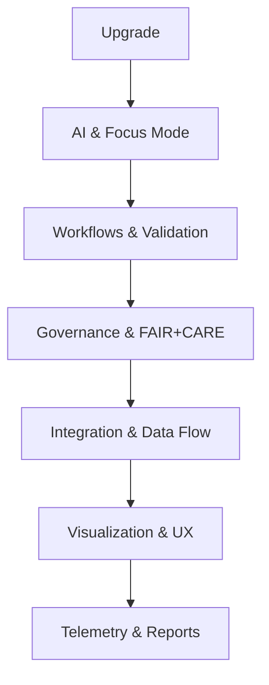

<div align="center">

# 📚 **Kansas Frontier Matrix — Guides Directory Overview**
`docs/guides/README.md`

**Purpose:**  
Provide an organized, navigable index for the `docs/guides/` directory and all documentation beneath it.  
This directory houses user manuals, developer guides, FAIR+CARE governance materials, AI explainability references, and workflow documentation for **Kansas Frontier Matrix (KFM)**.  
All entries conform to **MCP-DL v6.3**, **Platinum README Template v7.1**, and **Diamond⁹ Ω / Crown∞Ω Ultimate Certification** repository documentation standards.

[](../..)
[](../../LICENSE)
[](../standards/faircare.md)
[](#)

</div>

---

## 📘 Overview

The `docs/guides/` directory serves as the **documentation hub** for both technical and governance-related topics.  
Each subdirectory beneath `guides/` provides reference materials, upgrade playbooks, integration overviews, and design documentation that support all active modules within the KFM monorepo.  
This structure ensures maintainability, ethical reproducibility, and strong cross-reference linkage between code, data, and governance systems.

---

## 🗂️ Directory Layout (for `docs/guides/` and below)

```plaintext
docs/
  guides/                    # User, developer, and governance documentation hub
  │
  ├── README.md              # This directory overview and navigation index
  │
  ├── upgrade/               # Version upgrades, inventories, readiness plans
  │   ├── README.md          # v10 upgrade overview and migration guide
  │   ├── v10-readiness.md   # Upgrade readiness & validation checklist
  │   └── v10-inventory.md   # Legacy document consolidation matrix
  │
  ├── ai/                    # Focus Mode v2, explainability, AI governance
  │   ├── README.md          # Directory index for AI-focused guides
  │   ├── explainability.md  # XAI metrics, SHAP/LIME documentation
  │   └── focus-mode-v2.md   # AI-assisted Focus Mode configuration guide
  │
  ├── workflows/             # CI/CD, automation, and validation pipelines
  │   ├── README.md          # Overview of workflows and validation logic
  │   ├── ci-cd-pipelines.md # GitHub Actions, build, and telemetry integration
  │   └── governance-ledger.md # Ledger integration and SBOM traceability
  │
  ├── governance/            # FAIR+CARE, MCP-DL, and ISO governance guides
  │   ├── README.md          # Ethical standards and compliance guide
  │   ├── faircare.md        # FAIR+CARE policy and review process
  │   └── mcp-compliance.md  # Master Coder Protocol enforcement guidelines
  │
  ├── integration/           # STAC↔DCAT, ETL, and API interoperability
  │   ├── README.md          # Integration index and overview
  │   ├── stac-dcat-bridge.md # Metadata translation guide
  │   └── api-data-flow.md   # API + data sync documentation
  │
  └── visualization/         # UX, UI, and accessibility documentation
      ├── README.md          # Visualization and interface design index
      ├── maplibre-guide.md  # MapLibre + React component integration
      └── accessibility.md   # Accessibility and color-contrast standards
````

---

## 🧩 Guide Categories

| Category          | Description                                                          | Key Documents                                                       |
| ----------------- | -------------------------------------------------------------------- | ------------------------------------------------------------------- |
| **Upgrade**       | Major version migration, readiness validation, legacy consolidation. | `upgrade/README.md`, `v10-readiness.md`, `v10-inventory.md`         |
| **AI**            | Explainability, Focus Mode v2, and AI ethics documentation.          | `ai/focus-mode-v2.md`, `ai/explainability.md`                       |
| **Workflows**     | CI/CD pipeline operations and governance validation.                 | `workflows/ci-cd-pipelines.md`, `workflows/governance-ledger.md`    |
| **Governance**    | FAIR+CARE standards, MCP compliance, ethical oversight.              | `governance/faircare.md`, `governance/mcp-compliance.md`            |
| **Integration**   | STAC/DCAT, API, and ETL interoperability.                            | `integration/stac-dcat-bridge.md`, `integration/api-data-flow.md`   |
| **Visualization** | UI design, accessibility, MapLibre configuration.                    | `visualization/maplibre-guide.md`, `visualization/accessibility.md` |

---

## 🔁 Relationships Between Guides



---

## ⚙️ Governance Integration

All guides beneath this directory inherit FAIR+CARE, MCP, and telemetry compliance metadata.

| Layer      | Validation Workflow     | Output                      |
| ---------- | ----------------------- | --------------------------- |
| FAIR+CARE  | `faircare-validate.yml` | FAIR+CARE compliance report |
| MCP-DL     | `docs-lint.yml`         | Lint + compliance JSON      |
| Provenance | `governance-ledger.yml` | SBOM + manifest trace       |
| Telemetry  | `telemetry-export.yml`  | `telemetry.json`            |

---

## 🕰️ Version History

| Version | Date       | Author    | Summary                                                                                        |
| ------- | ---------- | --------- | ---------------------------------------------------------------------------------------------- |
| v10.0.0 | 2025-11-08 | Core Team | Established structured `docs/guides/` directory overview and standardized subdirectory schema. |
| v9.7.0  | 2025-11-05 | Core Team | Pre-upgrade guide templates and layout design.                                                 |

---

<p align="center">

© Kansas Frontier Matrix • Master Coder Protocol v6.3 · FAIR+CARE Certified · Diamond⁹ Ω / Crown∞Ω
[Back to Docs Index](../README.md) · [Governance Charter](../standards/faircare.md)

</p>
```
