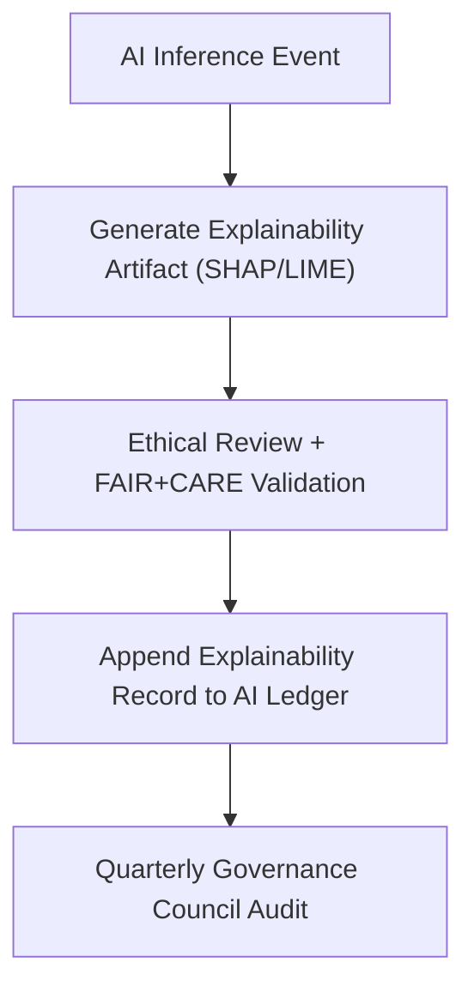

<div align="center">

# 🔍 **Kansas Frontier Matrix — AI Explainability Ledger (SHAP, LIME, Counterfactuals)**
`docs/guides/ai/LEDGER/explainability/README.md`

**Purpose:**  
Maintain and document the **explainability artifacts** (SHAP, LIME, and counterfactual analyses) for all AI models used in the Kansas Frontier Matrix (KFM).  
These ledger entries provide **traceable, interpretable, and ethically validated** explanations for Focus Mode AI and Graph-Augmented Intelligence outputs.

[](../../../README.md)
[](../../../../../../LICENSE)
[](../../../../../../docs/standards/README.md)
[](../../../../../../releases/)
</div>

---

## 📘 Overview

This directory contains **FAIR+CARE-certified explainability records** generated by AI inference pipelines in KFM.  
Each file represents a **signed explainability session** with feature attributions, counterfactual tests, and compliance metadata.

These artifacts ensure that:
- All AI outputs are interpretable and reproducible  
- Ethical and bias controls are traceable through governance ledgers  
- Explainability transparency aligns with FAIR+CARE and ISO/IEC 24029-1 standards  

---

## 🗂️ Directory Layout

```plaintext
docs/guides/ai/LEDGER/explainability/
├── README.md                                # This documentation
├── shap-summary-0001.json                   # Global feature importance via SHAP
├── shap-summary-0002.json                   # Second session summary
├── lime-local-0001.json                     # Local explanation for single inference
├── lime-local-0002.json                     # Additional local context
├── counterfactual-0001.json                 # Sensitivity “what-if” analysis
└── counterfactual-0002.json                 # Expanded scenario test
```

---

## ⚙️ Explainability Record Schema

| Field | Description | Example |
|--------|--------------|----------|
| `explain_id` | Unique ID for the explainability record | `"shap-summary-0001"` |
| `method` | Type of interpretability algorithm used | `"SHAP"`, `"LIME"`, `"Counterfactual"` |
| `model` | AI model used | `"focus-transformer-v2"` |
| `task` | AI task context | `"Lost Homestead Detection"` |
| `top_features` | Ranked feature importance | `["soil_moisture", "plat_1870", "flood_risk"]` |
| `feature_contributions` | Feature → contribution mapping | `{"soil_moisture":0.31,"plat_1870":0.27}` |
| `counterfactual_sensitivity` | Scenario deltas for sensitivity | `{ "Δsoil_moisture +0.1": "+8%" }` |
| `faircare_status` | Ethical review outcome | `"Pass"` |
| `energy_metrics` | Inference energy consumption | `{ "joules":1.3,"gCO2e":0.004 }` |
| `timestamp` | ISO 8601 creation date | `"2025-11-09T12:00:00Z"` |
| `signatures` | Cryptographic verification fields | `{ "system":"SHA256:...", "verifier":"FAIR+CARE Council" }` |

---

## 🧩 Example SHAP Ledger Entry

```json
{
  "explain_id": "shap-summary-0001",
  "method": "SHAP",
  "model": "focus-transformer-v2",
  "task": "Lost Homestead Detection",
  "top_features": ["soil_moisture", "plat_1870", "elevation"],
  "feature_contributions": {
    "soil_moisture": 0.32,
    "plat_1870": 0.27,
    "elevation": 0.15
  },
  "energy_metrics": {
    "joules": 1.18,
    "carbon_gCO2e": 0.0040
  },
  "faircare_status": "Pass",
  "timestamp": "2025-11-09T12:00:00Z",
  "signatures": {
    "system": "SHA256:47aa3c...2e5f",
    "verifier": "FAIR+CARE Council"
  }
}
```

---

## 🧾 FAIR+CARE Governance Integration

| Principle | Implementation | Validation Source |
|------------|----------------|-------------------|
| **Findable** | Each explainability record is indexed in `ai-ledger.json` | Governance ledger |
| **Accessible** | Stored in open repository under CC-BY | `docs/guides/ai/LEDGER/explainability/` |
| **Interoperable** | JSON-LD structure compatible with DCAT 3.0 | `telemetry_schema` |
| **Reusable** | Linked to model hashes + STAC/DCAT datasets | `sbom_ref`, `manifest_ref` |
| **Collective Benefit** | Enhances public interpretability of AI outputs | FAIR+CARE audit |
| **Authority to Control** | Council approval required before publishing | `signatures.verifier` |
| **Responsibility** | Telemetry logging of explainability energy use | `telemetry_ref` |
| **Ethics** | Sensitive variable masking enforced | `data-generalization/README.md` |

---

## 🧮 Validation & CI Workflows

| Workflow | Function | Output |
|-----------|-----------|--------|
| `ai-explainability.yml` | Generate SHAP/LIME/counterfactual reports | `reports/ai/explainability/*.json` |
| `ledger-validate.yml` | Verify explainability record schema | `reports/ledger/explainability-validate.json` |
| `faircare-validate.yml` | Perform ethics compliance checks | `reports/faircare/explainability-audit.json` |
| `ledger-sync.yml` | Append validated records to `ai-ledger.json` | `docs/guides/ai/LEDGER/ai-ledger.json` |

---

## ⚖️ Explainability-to-Governance Flow



---

## 🧾 Counterfactual Analysis Record Example

```json
{
  "explain_id": "counterfactual-0002",
  "method": "Counterfactual",
  "model": "focus-transformer-v2",
  "task": "Agricultural Viability Prediction",
  "counterfactual_sensitivity": {
    "Δsoil_type=clay": "-6%",
    "Δrainfall+10mm": "+4%"
  },
  "energy_metrics": {
    "joules": 1.45,
    "carbon_gCO2e": 0.0045
  },
  "faircare_status": "Pass",
  "timestamp": "2025-11-09T12:30:00Z",
  "signatures": {
    "system": "SHA256:bfa4a...6f98",
    "verifier": "FAIR+CARE Council"
  }
}
```

---

## 🔐 Integrity & Audit Requirements

- All records must be **digitally signed** using SHA-256 checksum + verifier signature.  
- **FAIR+CARE validation** required prior to ledger inclusion.  
- No record modification allowed post-verification (append-only governance).  
- Quarterly audit summaries stored in:  
  `docs/standards/governance/LEDGER/ai-ledger-audit-summary.json`.

---

## 🕰️ Version History

| Version | Date | Author | Summary |
|----------|------|--------|----------|
| v10.0.0 | 2025-11-09 | Core Team | Established explainability ledger with FAIR+CARE schema and governance automation |
| v9.7.0 | 2025-11-03 | A. Barta | Added initial SHAP/LIME ledger integration for Focus Transformer v2 |

---

<div align="center">

© 2025 Kansas Frontier Matrix Project  
Master Coder Protocol v6.3 · FAIR+CARE Certified · Diamond⁹ Ω / Crown∞Ω Ultimate Certified  

[Back to AI Ledger Index](../README.md) · [Governance Charter](../../../../../../docs/standards/governance/ROOT-GOVERNANCE.md)

</div>

