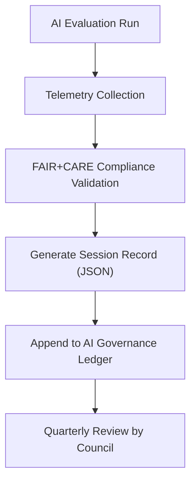

<div align="center">

# 🎯 **Kansas Frontier Matrix — Focus Mode AI Evaluation Session Ledger**
`docs/guides/ai/LEDGER/focus-eval-sessions/README.md`

**Purpose:**  
Maintain a detailed, **FAIR+CARE-certified audit trail** of every Focus Mode AI evaluation run executed within KFM.  
Each session record contains heuristic weightings, telemetry data, provenance hashes, and explainability artifacts, ensuring reproducibility and governance traceability under the **Master Coder Protocol (MCP-DL v6.3)**.

[](../../../README.md)
[](../../../../../../LICENSE)
[](../../../../../../docs/standards/README.md)
[](../../../../../../releases/)
</div>

---

## 📘 Overview

This directory stores **per-session governance records** for Focus Mode AI heuristic and explainability evaluations.  
Each `.json` file logs the model configuration, metrics, FAIR+CARE compliance status, and signed provenance for auditability.

Records are automatically generated by:
- `ai-focus-eval.yml` (heuristic evaluation pipeline)
- `faircare-validate.yml` (ethics verification)
- `ledger-sync.yml` (governance ledger append)

All files are immutable and represent the official evaluation history for KFM’s Focus Transformer v1–v2 systems.

---

## 🗂️ Directory Layout

```plaintext
docs/guides/ai/LEDGER/focus-eval-sessions/
├── README.md                                   # This documentation
├── focus-eval-2025-11-09-0001.json             # Initial v10 heuristic run
├── focus-eval-2025-11-09-0002.json             # Context vs. environment evaluation
├── focus-eval-2025-11-09-0003.json             # FAIR+CARE audit of environmental reasoning
└── ...
```

---

## ⚙️ Governance Schema (Simplified)

| Field | Description | Example |
|--------|--------------|----------|
| `session_id` | Unique identifier per Focus Mode run | `"focus-eval-2025-11-09-0002"` |
| `model` | Focus Transformer version used | `"focus-transformer-v2"` |
| `task` | Evaluation task description | `"Context vs. Environment Weight Sweep"` |
| `heuristics` | Parameter weights (H1–H5) | `{ "H1":1.0, "H2":0.8, "H3":25, "H4":0.5, "H5":0.6 }` |
| `metrics` | nDCG, Faithfulness, Energy, etc. | `{ "nDCG@10":0.81, "Faithfulness":0.87 }` |
| `faircare_status` | Outcome of ethical review | `"Pass"` |
| `telemetry` | Sustainability and runtime metrics | `{ "energy_joules":1.3, "carbon_gCO2e":0.004 }` |
| `timestamp` | ISO 8601 record creation time | `"2025-11-09T12:00:00Z"` |
| `signatures` | Digital signatures for ledger integrity | `{ "system":"SHA256:...", "verifier":"FAIR+CARE Council" }` |

---

## 🧩 Example Session Record

```json
{
  "session_id": "focus-eval-2025-11-09-0002",
  "model": "focus-transformer-v2",
  "task": "Context vs. Environment Weight Sweep",
  "weights": {"w_c":0.6,"w_e":0.4},
  "heuristics": {"H1":1.0,"H2":0.8,"H3":25,"H4":0.5,"H5":0.6},
  "metrics": {
    "nDCG@10": 0.81,
    "Faithfulness": 0.87,
    "Energy_J": 1.28,
    "Carbon_gCO2e": 0.0038
  },
  "faircare_status": "Pass",
  "telemetry_ref": "../../../releases/v10.0.0/focus-telemetry.json",
  "timestamp": "2025-11-09T12:00:00Z",
  "signatures": {
    "system": "SHA256:4f72ac...1c9b",
    "verifier": "FAIR+CARE Council"
  }
}
```

---

## 🧾 FAIR+CARE Mapping

| Principle | Implementation | Audit Evidence |
|------------|----------------|----------------|
| **Findable** | Session IDs indexed in `ai-ledger.json` | Ledger cross-links |
| **Accessible** | Publicly readable under CC-BY 4.0 | Repository transparency |
| **Interoperable** | Schema validated via JSON-LD | `schemas/telemetry/focus-eval-sessions-v1.json` |
| **Reusable** | Provenance & parameter metadata preserved | Governance ledger |
| **Collective Benefit** | Facilitates public trust in AI outcomes | FAIR+CARE audit |
| **Authority to Control** | FAIR+CARE Council review & sign-off | Ledger signatures |
| **Responsibility** | Continuous monitoring of energy & bias | `focus-telemetry.json` |
| **Ethics** | Sensitive results masked in public reports | Ethics validation logs |

---

## 🧮 CI/CD Validation Flow



---

## ⚖️ Validation Workflows

| Workflow | Purpose | Output Artifact |
|-----------|----------|----------------|
| `ai-focus-eval.yml` | Generate Focus Mode evaluation data | `focus-eval-*.json` |
| `faircare-validate.yml` | Ethical audit & compliance check | `reports/faircare/ai-eval.json` |
| `ledger-sync.yml` | Append validated sessions to master ledger | `docs/guides/ai/LEDGER/ai-ledger.json` |

---

## 🔐 Integrity Rules

- Each session record must include model version, SHA256, and FAIR+CARE validation outcome.  
- Session telemetry must include energy usage and environmental impact metrics.  
- FAIR+CARE Council must sign digital `verifier` field before ledger commit.  
- No record may be altered post-audit; updates require new versioned entry.  

---

## 🕰️ Version History

| Version | Date | Author | Summary |
|----------|------|--------|----------|
| v10.0.0 | 2025-11-09 | Core Team | Established formal Focus Mode evaluation ledger with FAIR+CARE audit integration |
| v9.7.0 | 2025-11-03 | A. Barta | Prototype ledger for context/environment experiments |

---

<div align="center">

© 2025 Kansas Frontier Matrix Project  
Master Coder Protocol v6.3 · FAIR+CARE Certified · Diamond⁹ Ω / Crown∞Ω Ultimate Certified  

[Back to AI Ledger Index](../README.md) · [Governance Charter](../../../../../../docs/standards/governance/ROOT-GOVERNANCE.md)

</div>

