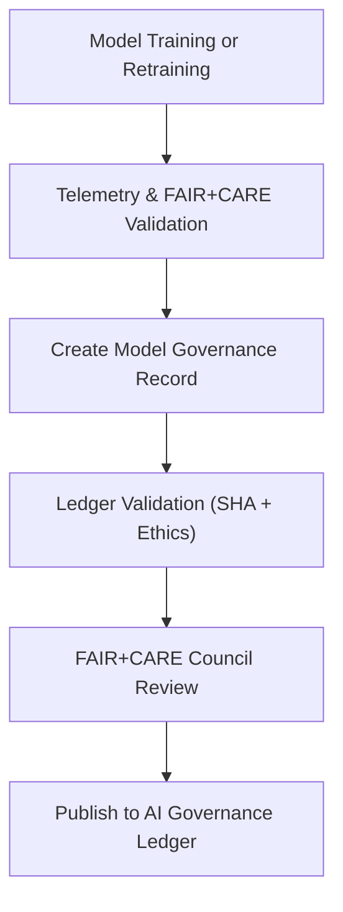

<div align="center">

# 🤖 **Kansas Frontier Matrix — AI Model Governance Ledger**
`docs/guides/ai/LEDGER/model-governance/README.md`

**Purpose:**  
Define the **model-level governance, retraining, and ethical certification ledger** for all deployed AI systems in the Kansas Frontier Matrix (KFM), including **Focus Transformer v1–v2** and **Graph-Augmented Intelligence (GAI)** models.  
Ensures that all model artifacts, training datasets, and configuration files are **traceable, auditable, and FAIR+CARE-compliant**.

[](../../../README.md)
[](../../../../../../LICENSE)
[](../../../../../../docs/standards/README.md)
[](../../../../../../releases/)
</div>

---

## 📘 Overview

This directory records **governance metadata** for all production and experimental AI models within KFM.  
Each JSON ledger entry documents model provenance, retraining lineage, validation metrics, FAIR+CARE audits, and energy use records.  

The ledger ensures:
- **Transparency** of model versions, datasets, and licensing  
- **Accountability** via Council-reviewed FAIR+CARE validation  
- **Reproducibility** through SBOM linkage and environment lockfiles  
- **Ethical governance** for retraining, deployment, and retirement  

---

## 🗂️ Directory Layout

```plaintext
docs/guides/ai/LEDGER/model-governance/
├── README.md                                # This documentation
├── focus-transformer-v1.json                # Focus Transformer v1 governance record
├── focus-transformer-v2.json                # Focus Transformer v2 governance record
└── graph-ai-v10.json                        # Graph-Augmented Intelligence v10 record
```

---

## ⚙️ Model Governance Schema

| Field | Description | Example |
|--------|--------------|----------|
| `model_name` | Registered model identifier | `"focus-transformer-v2"` |
| `model_uuid` | Unique model instance ID | `"a92fef29-384b-4c32-b71f-19a1fa92d91e"` |
| `version` | Semantic version tag | `"v2.0.0"` |
| `sha256_weights` | Checksum of model weights | `"9ab4b8f34bca..."` |
| `training_dataset_refs` | Source datasets used for training | `["data/stac/hydrology.json","data/vectors/parcels.parquet"]` |
| `training_environment` | Environment hash or container digest | `"sha256:dfe9c21..."` |
| `validation_metrics` | Performance scores on benchmark tasks | `{ "faithfulness":0.87,"robustness":0.91 }` |
| `energy_metrics` | Energy consumption (Joules / gCO₂e) | `{ "joules":82.3,"carbon_gCO2e":0.31 }` |
| `faircare_compliance` | Outcome of ethical & fairness review | `"Pass"` |
| `retrain_schedule` | Next review or retraining date | `"2026-05-01"` |
| `auditors` | Reviewing FAIR+CARE Council members | `["A. Barta","Council Ethics Team"]` |
| `timestamp` | Record creation date | `"2025-11-09T12:00:00Z"` |

---

## 🧩 Example — Focus Transformer v2 Governance Record

```json
{
  "model_name": "focus-transformer-v2",
  "model_uuid": "5fca1a9b-02a9-48c8-9230-b5a4e7eac90b",
  "version": "v2.0.0",
  "sha256_weights": "2a6b3f8e63e7d234baf2cced...",
  "training_dataset_refs": [
    "data/stac/hydrology.json",
    "data/processed/vectors/parcels.parquet"
  ],
  "training_environment": "sha256:73baf18c1b9d943f...",
  "validation_metrics": {
    "faithfulness": 0.87,
    "robustness": 0.91,
    "fairness_index": 0.96
  },
  "energy_metrics": {
    "joules": 82.3,
    "carbon_gCO2e": 0.31
  },
  "faircare_compliance": "Pass",
  "retrain_schedule": "2026-05-01",
  "auditors": ["FAIR+CARE Council","Core AI Team"],
  "timestamp": "2025-11-09T12:00:00Z"
}
```

---

## 🧾 FAIR+CARE Alignment

| Principle | Implementation | Validation Artifact |
|------------|----------------|--------------------|
| **Findable** | Model entries indexed with UUIDs in governance ledger | `ai-ledger.json` |
| **Accessible** | Public release of model metadata | Repository + SBOM |
| **Interoperable** | JSON-LD + SPDX compliant schema | `telemetry_schema` |
| **Reusable** | Linked to reproducible training environments | `manifest_ref` |
| **Collective Benefit** | Transparent, auditable AI for public research | FAIR+CARE audit |
| **Authority to Control** | FAIR+CARE Council approval before retraining | `retrain_schedule` |
| **Responsibility** | Energy + fairness metrics tracked and verified | `telemetry_ref` |
| **Ethics** | Model reviewed for bias and provenance | `faircare-validate.yml` |

---

## 🧮 CI/CD Integration

| Workflow | Function | Output |
|-----------|-----------|--------|
| `ai-model-validate.yml` | Verify model metadata integrity & checksum | `reports/ai/model-validate.json` |
| `faircare-validate.yml` | Validate ethical & fairness compliance | `reports/faircare/model-audit.json` |
| `ledger-sync.yml` | Append validated model records to ledger | `docs/guides/ai/LEDGER/ai-ledger.json` |
| `energy-monitor.yml` | Log sustainability metrics | `reports/energy/ai-models.json` |

---

## ⚖️ Governance & Audit Lifecycle



---

## 🧠 Model Retirement & Archival Policy

- Models superseded by new versions are **retained indefinitely** for reproducibility.  
- Deprecated models are **archived** under `archives/v*/` and marked `"Retired"`.  
- FAIR+CARE review ensures all retraining follows approved consent and provenance policies.  
- Each model lifecycle event (train → validate → release → retire) is logged to the ledger.

---

## 🧩 Example Governance Audit Report

```json
{
  "model_name": "graph-ai-v10",
  "review_date": "2025-11-09",
  "auditors": ["FAIR+CARE Council"],
  "metrics": {
    "robustness": 0.93,
    "bias_index": 0.04
  },
  "findings": "No significant regional bias detected; model approved for continued deployment.",
  "faircare_status": "Pass"
}
```

---

## 🕰️ Version History

| Version | Date | Author | Summary |
|----------|------|--------|----------|
| v10.0.0 | 2025-11-09 | Core Team | Added AI model governance ledger for v10 with FAIR+CARE schema and energy telemetry |
| v9.7.0 | 2025-11-03 | A. Barta | Introduced model validation and ethical audit tracking system |

---

<div align="center">

© 2025 Kansas Frontier Matrix Project  
Master Coder Protocol v6.3 · FAIR+CARE Certified · Diamond⁹ Ω / Crown∞Ω Ultimate Certified  

[Back to AI Ledger Index](../README.md) · [Governance Charter](../../../../../../docs/standards/governance/ROOT-GOVERNANCE.md)

</div>

