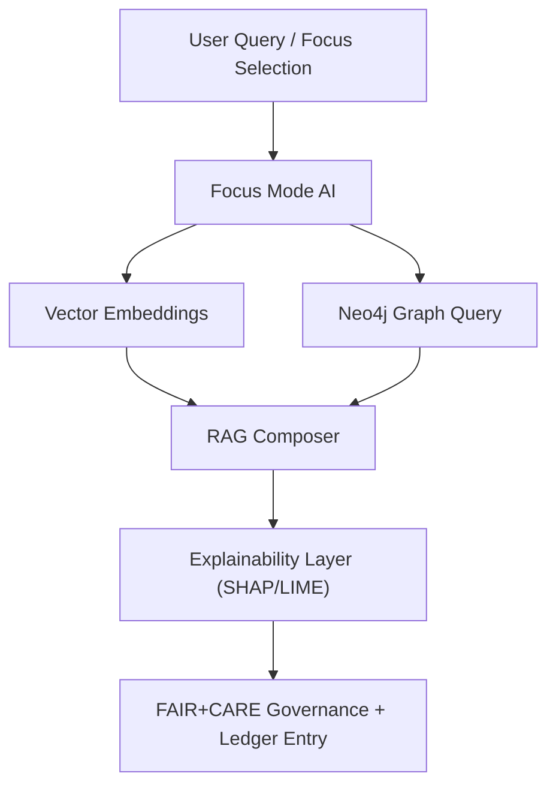
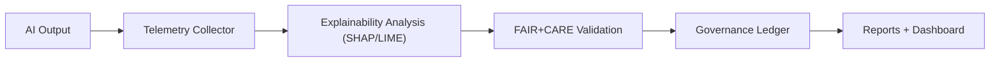

<div align="center">

# 🧠 **Kansas Frontier Matrix — AI & Machine Learning Guides Overview**
`docs/guides/ai/README.md`

**Purpose:**  
Central documentation hub for the **AI, ML, and Focus Mode systems** within the Kansas Frontier Matrix (KFM).  
These guides explain how KFM integrates **Neo4j knowledge graphs**, **graph-augmented transformers**, and **FAIR+CARE governance** across all intelligent components.

[](../../README.md)
[](../../../LICENSE)
[](../../../docs/standards/README.md)
[](../../../releases/)
</div>

---

## 📘 Overview

The **AI Guides** provide comprehensive technical documentation for KFM’s **Focus Mode AI**, **Graph-Augmented Intelligence (GAI)**, and **Heuristic Evaluation Pipelines**.  
They outline architecture, explainability workflows, and governance compliance for every AI-assisted feature, from historical reasoning to environmental inference.

**Key Goals**
- Enable **auditable**, **context-aware** reasoning via Focus Mode AI  
- Integrate **graph-based embeddings** and **Neo4j reasoning**  
- Implement **FAIR+CARE** ethical frameworks for AI governance  
- Maintain transparency through telemetry, SBOMs, and reproducible inference  

---

## 🗂️ Directory Layout

```plaintext
docs/guides/ai/
├── README.md                                  # This overview
├── graph-augmented-intelligence.md            # Graph-based AI reasoning & RAG integration
├── context-vs-environment-evaluation.md       # Context weighting heuristic evaluation (optional alias)
├── ../../src/ai/focus/evaluation/README.md    # Heuristic evaluations in Focus Mode
├── focus-transformer-governance.md            # Focus Transformer model architecture & explainability
├── explainability-guidelines.md               # SHAP, LIME, and counterfactual reporting
├── ai-governance-ledger.md                    # FAIR+CARE AI governance ledger standards
└── validation/                                # AI fairness & ethics audit reports
```

---

## 🧩 Major Components

| Module | Function | Example Document |
|---------|-----------|------------------|
| **Focus Mode AI** | Central reasoning engine aligning context & environment | `src/ai/focus/README.md` |
| **Graph-Augmented Intelligence (GAI)** | Hybrid vector + graph reasoning via Neo4j | `graph-augmented-intelligence.md` |
| **Explainability** | Model transparency via SHAP/LIME pipelines | `explainability-guidelines.md` |
| **Heuristic Evaluation** | Balance context vs. environmental features | `context-vs-environment-evaluation.md` |
| **AI Governance** | Auditing, ethical checks, and compliance reporting | `ai-governance-ledger.md` |

---

## 🧠 Focus Mode AI — System Summary



---

## ⚙️ Core Configurations

| Parameter | Description | Default |
|------------|--------------|----------|
| `model_name` | Active Focus Transformer version | `focus-transformer-v2` |
| `embedding_dim` | Vector embedding size | 1024 |
| `context_window` | Maximum token span per reasoning cycle | 4096 |
| `governance_mode` | FAIR+CARE ledger logging toggle | `true` |
| `telemetry_sink` | Output path for AI audit data | `focus-telemetry.json` |

---

## 🧾 FAIR+CARE Integration

| Principle | Implementation | Evidence |
|------------|----------------|-----------|
| **Findable** | AI models indexed via SBOM + Neo4j graph schema | `sbom.spdx.json` |
| **Accessible** | Public documentation & transparent evaluation | `docs/guides/ai/` |
| **Interoperable** | CIDOC CRM + DCAT 3.0 linked metadata | `graph-augmented-intelligence.md` |
| **Reusable** | Reproducible AI experiments and telemetry reports | `focus-telemetry.json` |
| **Collective Benefit** | Promotes sustainable, ethical AI analysis | FAIR+CARE audits |
| **Authority to Control** | HITL governance for model retraining & use | `ai-governance-ledger.md` |
| **Responsibility** | Automatic logging of decisions & provenance | `telemetry_schema` |
| **Ethics** | Culturally sensitive data filtered before inference | `data-generalization/README.md` |

---

## 🧪 CI/CD & Telemetry Integration

| Workflow | Purpose | Output Artifact |
|-----------|----------|----------------|
| `ai-validate.yml` | Validate model schema & fairness metrics | `reports/ai/validation.json` |
| `focus-telemetry-export.yml` | Stream AI outputs to telemetry | `releases/v*/focus-telemetry.json` |
| `governance-ledger.yml` | Log ethical compliance & model hashes | `docs/standards/governance/LEDGER/ai-ledger.json` |
| `faircare-validate.yml` | Verify alignment with FAIR+CARE standards | `reports/faircare/ai-audit.json` |

---

## 🧮 Example AI Governance Ledger Record

```json
{
  "session_id": "focus-ai-2025-11-09-0012",
  "model": "focus-transformer-v2",
  "task": "Context vs. Environment Reasoning",
  "sha256": "e3c4b9b1a5e0c76d...",
  "metrics": {
    "faithfulness": 0.87,
    "energy_joules": 1.32,
    "care_audit": "Pass"
  },
  "timestamp": "2025-11-09T12:00:00Z"
}
```

---

## ⚖️ AI Governance & Explainability Flow



---

## 🕰️ Version History

| Version | Date | Author | Summary |
|----------|------|--------|----------|
| v10.0.0 | 2025-11-09 | Core Team | Upgraded AI guides with governance-led telemetry and Focus Transformer v2 integration |
| v9.7.0 | 2025-11-03 | A. Barta | Added Graph-Augmented Intelligence & heuristic evaluation modules |

---

<div align="center">

© 2025 Kansas Frontier Matrix Project  
Master Coder Protocol v6.3 · FAIR+CARE Certified · Diamond⁹ Ω / Crown∞Ω Ultimate Certified  

[Back to Guides Index](../README.md) · [Governance Charter](../../../docs/standards/governance/ROOT-GOVERNANCE.md)

</div>

