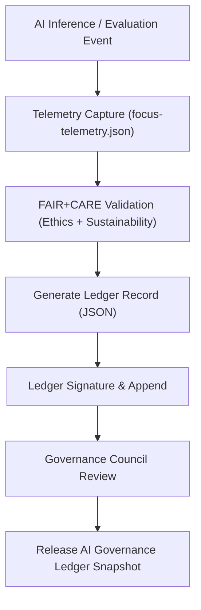

<div align="center">

# ⚖️ **Kansas Frontier Matrix — AI Governance Ledger & Ethical Oversight Framework**
`docs/guides/ai/ai-governance-ledger.md`

**Purpose:**  
Define the **AI Governance Ledger architecture** that ensures transparency, accountability, and ethical oversight for all machine learning operations in the Kansas Frontier Matrix (KFM).  
This system aligns AI auditability with **FAIR+CARE principles**, **ISO 50001 sustainability**, and the **Master Coder Protocol (MCP-DL v6.3)**.

[](../../README.md)
[](../../../LICENSE)
[](../../../docs/standards/README.md)
[](../../../releases/)
</div>

---

## 📘 Overview

The **AI Governance Ledger** is the central accountability system for all AI actions, model inferences, evaluations, and retraining events across the Kansas Frontier Matrix.  
It functions as a **blockchain-style append-only ledger** within the repository, ensuring that each AI process produces a verifiable, ethical, and reproducible trace.

**Core Objectives**
- Record every AI inference and retraining operation with cryptographic integrity  
- Capture FAIR+CARE compliance outcomes and human reviews  
- Enforce transparent ethical decision-making for sensitive data handling  
- Enable reproducibility through SBOM and manifest linkages  

---

## 🗂️ Directory Layout

```plaintext
docs/standards/governance/LEDGER/
├── ai-ledger.json                   # Aggregated AI governance ledger
├── ai-eval-sessions/                # Individual Focus Mode AI sessions
│   ├── focus-eval-2025-11-09-0001.json
│   ├── focus-eval-2025-11-09-0002.json
│   └── ...
├── ai-explainability/               # Explainability and ethics audit reports
│   ├── shap-summary-0001.json
│   ├── lime-local-0001.json
│   └── counterfactual-0001.json
└── ai-model-governance/             # Model retraining, version, and energy records
    ├── focus-transformer-v1.json
    └── focus-transformer-v2.json
```

---

## 🧩 Ledger Data Model

| Field | Type | Description |
|--------|------|-------------|
| `ledger_id` | string | Unique ledger entry identifier |
| `session_id` | string | AI session or evaluation identifier |
| `model` | string | Model name (e.g., Focus Transformer v2) |
| `model_sha256` | string | Cryptographic checksum of model weights |
| `input_sources` | array | Data sources used (e.g., STAC items, datasets) |
| `outputs` | object | Inference summary or evaluation metrics |
| `explainability_refs` | array | Paths to SHAP/LIME/counterfactual reports |
| `faircare_status` | string | FAIR+CARE compliance result |
| `energy_metrics` | object | Energy consumption and sustainability data |
| `reviewed_by` | array | Reviewers or FAIR+CARE Council members |
| `timestamp` | string | ISO 8601 creation date |
| `signatures` | object | Cryptographic or digital signatures |

---

## 🧮 Example Ledger Entry

```json
{
  "ledger_id": "ai-ledger-v10-0003",
  "session_id": "focus-2025-11-09-0012",
  "model": "focus-transformer-v2",
  "model_sha256": "cbf3b9e6c5a4a7e5f4a1b72d...",
  "input_sources": [
    "data/stac/hydrology.json",
    "data/processed/vectors/parcels.parquet"
  ],
  "outputs": {
    "summary": "Hydrology and soil moisture patterns suggest 1870s settlement proximity.",
    "confidence": 0.94
  },
  "explainability_refs": [
    "docs/standards/governance/LEDGER/ai-explainability/shap-summary-0001.json"
  ],
  "faircare_status": "Pass",
  "energy_metrics": {
    "joules": 1.23,
    "carbon_gCO2e": 0.0041
  },
  "reviewed_by": ["FAIR+CARE Council", "Governance Ops Team"],
  "timestamp": "2025-11-09T12:00:00Z",
  "signatures": {
    "system": "SHA256:9a02d...b1f9",
    "verifier": "FAIR+CARE Council"
  }
}
```

---

## ⚙️ Governance Workflow



---

## 🧾 FAIR+CARE Integration Points

| Principle | Implementation | Audit Evidence |
|------------|----------------|----------------|
| **Findable** | Each ledger entry indexed with UUID and timestamp | `ai-ledger.json` |
| **Accessible** | Publicly readable ledger under CC-BY 4.0 | Repository transparency |
| **Interoperable** | JSON-LD + FAIR metadata for automation | `telemetry_schema` |
| **Reusable** | Ledger schema open for research reuse | `schemas/telemetry/ai-governance-ledger-v1.json` |
| **Collective Benefit** | Promotes public accountability and open review | FAIR+CARE council reports |
| **Authority to Control** | Council signatures required for model deployment | `reviewed_by` |
| **Responsibility** | Continuous audit logging and carbon tracking | `energy_metrics` |
| **Ethics** | Prevents unreviewed or opaque model behavior | Ledger policies & validation workflows |

---

## 🔐 Validation & Security Controls

| Control | Description | Enforcement Mechanism |
|----------|--------------|----------------------|
| **Cryptographic Signatures** | Each ledger entry SHA256-signed | `signatures.system` |
| **Immutable Ledger Chain** | Append-only JSON records with hash chaining | CI validator |
| **Access Control** | Council-only write permissions | Repository governance |
| **Automated Validation** | Ledger entries verified in CI/CD | `ledger-validate.yml` |
| **Audit Export** | Signed summaries archived quarterly | `releases/v*/ledger/` |

---

## 🧰 CI/CD Integration

| Workflow | Function | Output |
|-----------|-----------|--------|
| `ledger-validate.yml` | Validate JSON schema and SHA integrity | `reports/ledger/ai-ledger-validate.json` |
| `faircare-validate.yml` | Ethical audit and review integration | `reports/faircare/ai-ledger-audit.json` |
| `telemetry-export.yml` | Stream AI inference metrics to ledger | `releases/v*/focus-telemetry.json` |
| `ledger-sync.yml` | Append new entries to master ledger | `docs/standards/governance/LEDGER/ai-ledger.json` |

---

## ⚖️ Example Governance Validation Record

```json
{
  "ledger_id": "ai-ledger-v10-validate-0001",
  "validation_status": "Pass",
  "checked_fields": [
    "model_sha256",
    "timestamp",
    "signatures",
    "faircare_status"
  ],
  "timestamp": "2025-11-09T14:00:00Z",
  "auditor": "FAIR+CARE Council"
}
```

---

## 🕰️ Version History

| Version | Date | Author | Summary |
|----------|------|--------|----------|
| v10.0.0 | 2025-11-09 | Core Team | Established unified AI governance ledger for Focus Transformer v2 and GAI systems |
| v9.7.0 | 2025-11-03 | A. Barta | Introduced FAIR+CARE-linked AI governance audit structure |

---

<div align="center">

© 2025 Kansas Frontier Matrix Project  
Master Coder Protocol v6.3 · FAIR+CARE Certified · Diamond⁹ Ω / Crown∞Ω Ultimate Certified  

[Back to AI Guides](./README.md) · [Governance Charter](../../../docs/standards/governance/ROOT-GOVERNANCE.md)

</div>

