<div align="center">

# 🎯 **Kansas Frontier Matrix — Context vs. Environment Evaluation Guide (Focus Mode AI)**
`docs/guides/ai/context-vs-environment-evaluation.md`

**Purpose:**  
Provide a summarized, operator-friendly version of the **Focus Mode AI Context vs. Environment Heuristic Evaluation** used to calibrate how historical and environmental data are balanced during Focus Mode reasoning.  
This guide links directly to the experimental pipeline at:  
`src/ai/focus/evaluation/context-vs-environment/`.

[](../../README.md)
[](../../../LICENSE)
[](../../../docs/standards/README.md)
[](../../../releases/)
</div>

---

## 📘 Overview

The **Context vs. Environment Evaluation (CvE)** experiment quantifies how effectively Focus Mode AI combines **historical context weighting** (time-aware facts, documents, events) with **environmental signals** (terrain, hydrology, landcover, ownership, fauna).  
The goal is to derive optimal weighting heuristics for each reasoning task type — discovery, explanation, ranking, and interpretive generation.

This evaluation directly informs model retraining and AI governance decisions within the **Focus Transformer v2** ecosystem.

---

## 🗂️ Directory Reference

```plaintext
src/ai/focus/evaluation/context-vs-environment/
├── configs/                               # Weight grids and ablation YAMLs
├── datasets/                              # Task data, gold labels, and splits
├── metrics/                               # Faithfulness, provenance, and energy metrics
├── runs/                                  # Experiment outputs and reports
├── scripts/                               # Automation & explainability scripts
└── README.md                              # Detailed research documentation
```

---

## 🧩 Conceptual Framework

```mermaid
flowchart TD
A["Input Tasks (T1–T4)"] --> B["Context Features (Time-aware data)"]
A --> C["Environment Features (Hydrology, Landcover, Climate)"]
B --> D["Feature Fusion: w_c * f_context + w_e * f_environment"]
C --> D
D --> E["Heuristic Evaluation (H1–H5)"]
E --> F["Metric Calculation (nDCG, Faithfulness, Energy)"]
F --> G["Governance Telemetry + FAIR+CARE Audit"]
```



---

## ⚙️ Task Definitions

| Task ID | Description | Primary Signal | Example Use |
|----------|-------------|----------------|--------------|
| **T1** | Rank “lost homestead” sites | Historical | Identify high-likelihood areas for archaeological recovery |
| **T2** | Explain cause of human activity in given era | Context → Env | Generate causal narratives linking history and terrain |
| **T3** | Prioritize field validation zones | Environmental | Suggest survey areas using hydrology + terrain |
| **T4** | Generate interpretive public text | Context | Produce ethically grounded interpretive summaries |

---

## 🧮 Weighting Model

The heuristic fusion layer combines context (**w_c**) and environment (**w_e**) via:

```
score = w_c * f_context + w_e * f_environment
```

Weight sweeps typically explore:
```
w_c ∈ {1.0, 0.8, 0.6, 0.4, 0.2, 0.0}
w_e = 1 - w_c
```

Each combination generates a model run recorded in `runs/reports/`, with SHAP/LIME explainability artifacts.

---

## 🧾 Evaluation Metrics

| Category | Metric | Purpose |
|-----------|---------|----------|
| **Discovery** | nDCG@k, MAP | Measures ranking quality on T1, T3 |
| **Faithfulness** | Attributed Fact Precision | Validates time/place citation accuracy |
| **Explanation** | Rationale Helpfulness, Evidence Overlap | Measures alignment between model and human rationales |
| **Governance** | Provenance Completeness %, License Validation | Ensures FAIR+CARE compliance |
| **Energy** | Joules/Inference, gCO₂e/Run | Tracks sustainable inference under ISO 50001 |

All metrics are logged to the telemetry file defined in `telemetry_schema`.

---

## 🧩 Heuristics Under Test

| Heuristic | Description | Range | Default |
|------------|--------------|--------|----------|
| **H1: Time-Proximity Boost** | Prefers data closer to target year-range | 0.0–2.0 | 1.0 |
| **H2: Provenance Depth Bonus** | Rewards multi-hop corroboration | 0.0–1.5 | 0.8 |
| **H3: Spatial Concordance** | Penalizes mismatched footprints | 0–100 m | 25 m |
| **H4: Env Variability Gate** | Downweights volatile layers | 0.0–1.0 | 0.5 |
| **H5: Narrative Coherence** | Encourages internally consistent explanations | 0.0–1.0 | 0.6 |

---

## 🧰 Running the Evaluation

```bash
# Grid Search (Context vs. Environment Weights)
python src/ai/focus/evaluation/context-vs-environment/scripts/run_grid_search.py \
  --config src/ai/focus/evaluation/context-vs-environment/configs/blended_grid.yaml \
  --tasks T1 T2 T3 T4

# Feature Ablation
python src/ai/focus/evaluation/context-vs-environment/scripts/run_ablation.py \
  --config src/ai/focus/evaluation/context-vs-environment/configs/ablation.yaml
```

Outputs:
- `runs/reports/*.json` → metric summaries  
- `runs/logs/*.txt` → runtime telemetry  
- `runs/reports/explainability/*.json` → SHAP/LIME explainability sets  

---

## ⚖️ FAIR+CARE & Governance Integration

| Principle | Implementation | Evidence Artifact |
|------------|----------------|-------------------|
| **Findable** | Linked via Neo4j entity IDs and manifest | `manifest_ref` |
| **Accessible** | Public reports and schema definitions | `reports/focus-eval/` |
| **Interoperable** | JSON schema (`focus-eval-v1.json`) | `telemetry_schema` |
| **Reusable** | Full reproducibility via config and data splits | `datasets/splits/` |
| **Collective Benefit** | Results support community-driven model auditing | FAIR+CARE ledger |
| **Authority to Control** | FAIR+CARE Council approval for sensitive topics | `governance_ref` |
| **Responsibility** | Carbon + energy tracking via telemetry | `telemetry_ref` |
| **Ethics** | Bias detection and mitigation via ablation | Evaluation logs |

---

## 🧩 Output Example (Simplified)

```json
{
  "run_id": "cve-2025-11-09-001",
  "tasks": ["T1","T2","T3","T4"],
  "weights": {"w_c":0.6,"w_e":0.4},
  "metrics": {
    "nDCG@10": 0.81,
    "Faithfulness": 0.87,
    "Energy_gCO2e": 0.0031
  },
  "heuristics": {"H1":1.0,"H2":0.8,"H3":25,"H4":0.5,"H5":0.6},
  "faircare_compliance": "Pass",
  "timestamp": "2025-11-09T12:00:00Z"
}
```

---

## 🧾 Governance Workflow

| Workflow | Function | Output Artifact |
|-----------|-----------|----------------|
| `ai-focus-eval.yml` | Run CvE experiment & upload logs | `reports/ai/focus-eval.json` |
| `faircare-validate.yml` | Ethical compliance validation | `reports/faircare/ai-audit.json` |
| `governance-ledger.yml` | Ledger record with checksums | `docs/standards/governance/LEDGER/focus-eval.json` |

---

## 🕰️ Version History

| Version | Date | Author | Summary |
|----------|------|--------|----------|
| v10.0.0 | 2025-11-09 | Core Team | Updated for v10 with telemetry schema and FAIR+CARE audit linkage |
| v9.7.0 | 2025-11-03 | A. Barta | Initial context vs. environment evaluation design for Focus Mode AI |

---

<div align="center">

© 2025 Kansas Frontier Matrix Project  
Master Coder Protocol v6.3 · FAIR+CARE Certified · Diamond⁹ Ω / Crown∞Ω Ultimate Certified  

[Back to AI Guides](./README.md) · [Governance Charter](../../../docs/standards/governance/ROOT-GOVERNANCE.md)

</div>

